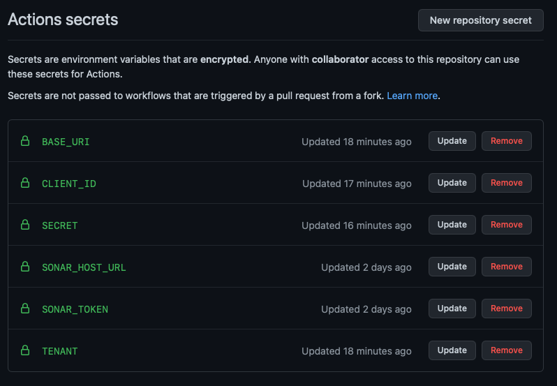

# Sonar Results for Checkmarx One (Example for GitHub Action)

## Introduction

You can export scan results directly to Sonar, enabling you to view the Checkmarx One results in your SonarQube or SonarCloud console.

This is done by adding the report flag `--report-format sonar` in the additional params of the CLI scan command. This generates a JSON that is formatted according to the Sonar specifications.

This capability is available for all CI/CD plugins and CLI integrations. The examples below show the integration for GitHub Action, but they can be generalized for other platforms.

### Prerequisites

- You have a Checkmarx One account and you have set up the appropriate Checkmarx One plugin or CLI integration in your CI/CD platform.
- You have a SonarQube installation or access to a SonarCloud account.

## Exporting Results to Sonar

1. Use the Checkmarx One plugin or CLI tool to create a Checkmarx One scan in your pipeline.
2. Add the report flag `--report-format sonar` to the scan create command. For plugins, this argument is added in the **Additional params** section.
3. Use the Sonar plugin to create a Sonar step in your pipeline.

   
   There is an alternative method that uses a Maven command to send the results to Sonar, see the example [below](#alternative-method---using-maven-command).
   
4. In the sonar arguments, add the following argument to point to the report file generated by Checkmarx One:

   `-Dsonar.externalIssuesReportPaths=./cx_result_sonar.json`

### Usage Example - GitHub Action

The following example shows how you can create a GitHub Action to run a Checkmarx One scan and export the results to Sonar.

#### Prerequisites

The following example assumes that you have:

- Created the required secrets for use with the Checkmarx One GitHub Action, see [Checkmarx One GitHub Actions Initial Setup](checkmarx-one-github-actions/checkmarx-one-github-actions-initial-setup.md), and have installed and configured the **Checkmarx One Github Action** [Configuring a GitHub Action with a Checkmarx One Workflow](checkmarx-one-github-actions/configuring-a-github-action-with-a-checkmarx-one-workflow/README.md).
- Created a Sonar project and configured the **Sonar GitHub Action**, including creating the required secrets and adding the project to the root file.

  
  The prerequisites differ slightly if you are using the alternative method, see example [below](#alternative-method---using-maven-command).
  

<figure><figcaption></figcaption></figure>

#### GitHub Action Example

The following is an example of the GitHub Action for running a Checkmarx One scan and exporting the results to Sonar.


For customers using SonarQube 10.3 and above, it's recommended to use checkmarx/ast-github-action@main. However, users of older versions should use this version of the GitHubAction action@ef93013c95adc60160bc22060875e90800d3ecfc #v.2.3.19.


```
name: Build
on:
  push:
    branches:
      - main
jobs:
  cx-scan:
    name: Run Checkmarx One cli
    runs-on: ubuntu-latest
    steps:
      - name: Checkout
        uses: actions/checkout@v2
      - name: Checkmarx One CLI Action
        uses: checkmarx/ast-github-action@main
        with:
          base_uri: ${{ secrets.BASE_URI }}
          cx_tenant: ${{ secrets.TENANT }}
          cx_client_id: ${{ secrets.CLIENT_ID }}
          cx_client_secret: ${{ secrets.SECRET }}
          additional_params: --report-format sonar
      - name: Sonar CLI Action
        uses: sonarsource/sonarqube-scan-action@master
        env:
          SONAR_TOKEN: ${{ secrets.SONAR_TOKEN }}
          SONAR_HOST_URL: ${{ secrets.SONAR_HOST_URL }}
          GITHUB_TOKEN: ${{ secrets.GITHUB_TOKEN }}
        with:
          args: >
            -Dsonar.externalIssuesReportPaths=./cx_result_sonar.json
```

#### Alternative Method - Using Maven command

The following example shows an alternative method that uses a Maven command instead of using the Sonar GitHub Action.

```
name: Security Scan
on:
  push:
    branches:
      - main

jobs:
  scan:

    runs-on: ubuntu-latest
    if: ${{ true }}

    steps:
      - uses: actions/checkout@v2
      - run: |
          git fetch --no-tags --prune --depth=1 origin +refs/heads/*:refs/remotes/origin/*

      - name: Set up JDK 11
        uses: actions/setup-java@v1
        with:
          java-version: 11.0.7

      - name: Cache local Maven repository
        uses: actions/cache@v2
        with:
          path: ~/.m2/repository
          key: ${{ runner.os }}-maven-${{ hashFiles('**/pom.xml') }}
          restore-keys: |
            ${{ runner.os }}-maven-

      - name: Cache SonarCloud packages
        uses: actions/cache@v2
        with:
          path: ~/.sonar/cache
          key: ${{ runner.os }}-sonar
          restore-keys: ${{ runner.os }}-sonar

      - name: Checkmarx One CLI Action
        uses: checkmarx/ast-github-action@main
        with:
            base_uri: <AST Base URI>
            cx_tenant: ${{ secrets.CX_TENANT }}
            cx_client_id: ${{ secrets.CX_CLIENT_ID }}
            cx_client_secret: ${{ secrets.CX_CLIENT_SECRET }}
            additional_params: --report-format sonar

      - name: Sonar analyze
        run: mvn -B verify org.sonarsource.scanner.maven:sonar-maven-plugin:sonar -Dsonar.projectKey=<sonar_project_key> -Dsonar.organization=<sonar_organization> -Dsonar.externalIssuesReportPaths=./cx_result_sonar.json
        env:
          SONAR_TOKEN: ${{ secrets.SONAR_TOKEN }}
          GITHUB_TOKEN: ${{ github.token }}
```


Check for updates to the code sample in [GitHub](https://github.com/CheckmarxDev/ast-cicd-templates/blob/main/Sonar/ci.yml).

