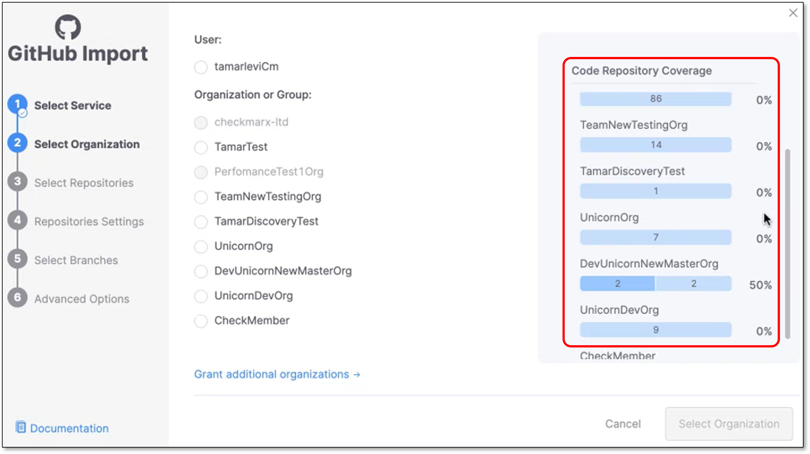
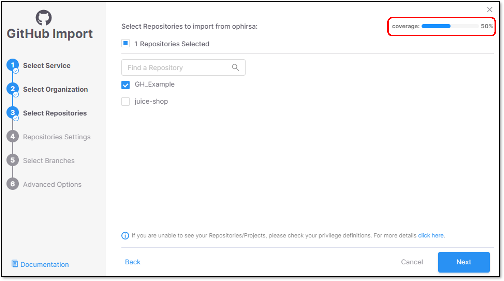
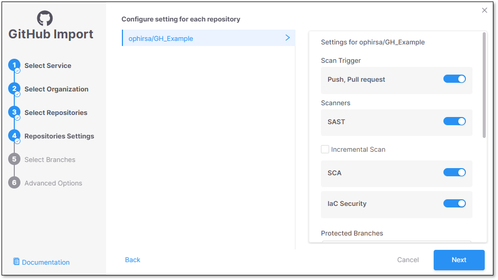
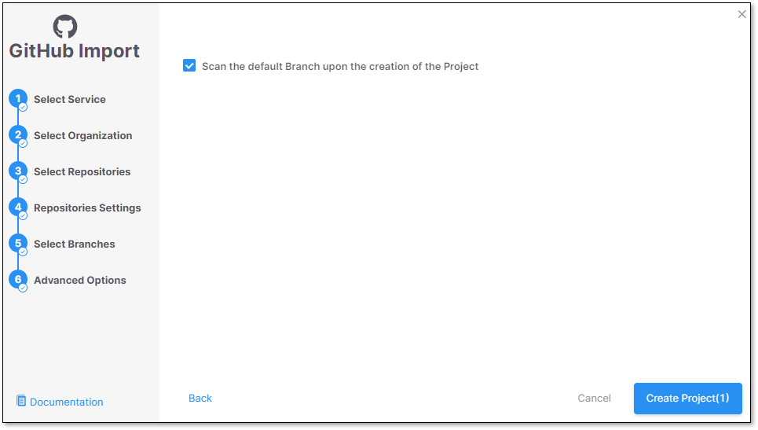
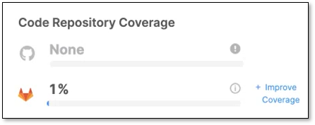
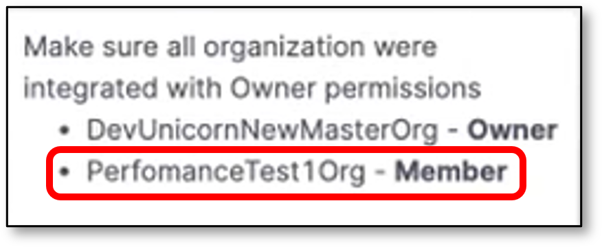

# Code Repository Coverage

The **Code Repository Coverage** widget enhances Checkmarx One monitoring and coverage for the supported code repositories.

The widget is designed to provide the following capabilities:

- A quick view of the code repositories being monitored in the system.
- Repository coverage percentage - Only code repository organizations and repositories are counted excluding CI/CD ones.
- A list of organizations that are monitored for each supported code repository.
- How many repositories of the monitored organizations are being scanned in Checkmarx One.
- An option to add additional organizations/repositories to improve the code repository coverage.

## Widget Elements

The widget contains several elements which provide different functionalities.

- **Repository coverage percentage** - Calculation of how many repositories out of the total monitored organizations are scanned & covered by Checkmarx One.
-  icon - A tooltip that provides information about the following:

  - A list of the code repository organizations that are monitored in Checkmarx One.
  - The number of monitored repositories out of the total monitored repositories.
  - A scroll bar - to see the entire organizations list (if it's a long list).

    For example:

    <figure><figcaption></figcaption></figure>
- **+ Improve Coverage** link - Opens the code repository configuration wizard and provides the option to add repositories to increase coverage.

## Adding Repositories

It is possible to add repositories in order to improve the code repository coverage.

To add repositories, perform the following:

1. Click on **+ Improve Coverage** link.

   Code repository configuration wizard opens.
2. Select the relevant organization(s) and click **Select Organization**.

   
   The right side panel presents the following details:

   - A list of the monitored organizations.
   - How many repositories exist for each organization.
   - How many repositories are covered for each organization (percentage calculation).

     For example:

     <figure><figcaption></figcaption></figure>
   
3. Select the relevant repositories and click **Next**

   
   The coverage percentage is updated accordingly
   

   <figure><figcaption></figcaption></figure>
4. Configure the following (if needed) and click **Next**

   - Enable/disable the relevant scanners
   - Protected branches to scan
   - SSH key
   - Assign groups
   - Assign scan tags
   - Set criticality level

     <figure><figcaption></figcaption></figure>
5. Add/remove protected branches

   <figure><figcaption></figcaption></figure>
6. In the Advanced Options screen click **Create Project**

   <figure><figcaption></figcaption></figure>

## Widget Presents Partial Results

There is a specific use case when the widget presents partial results.

It happens when a user imports a Project from the code repository, but he doesn't have **Owner** permissions for the organization which the repository belongs to.

In addition, the organization owner never imported a repository via Checkmarx One.

In such case the widget will present **None** for the coverage percentage.

For example:

<figure><figcaption></figcaption></figure>

In order to understand which organization doesn't have Owner permissions, click on the  tooltip.

Scroll down the list to find the relevant organization.

For example:

<figure><figcaption></figcaption></figure>

## Limitations

- The widget supports **GitHub, GitLab** & **Azure DevOps** repositories coverage. In case that there is at least 1 repository imported to Checkmarx One the widget will be always presented.
