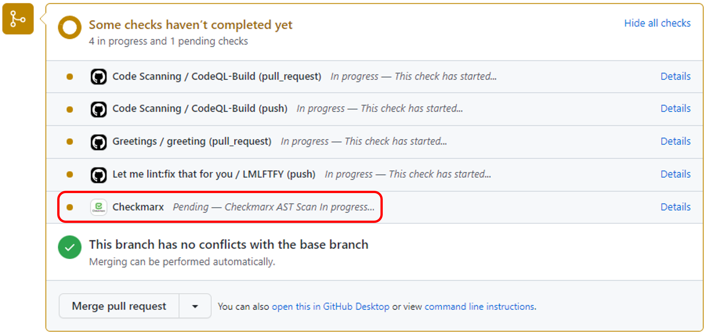
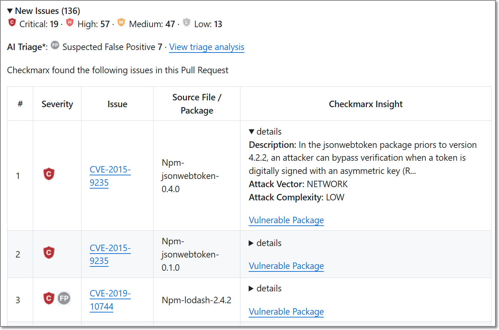
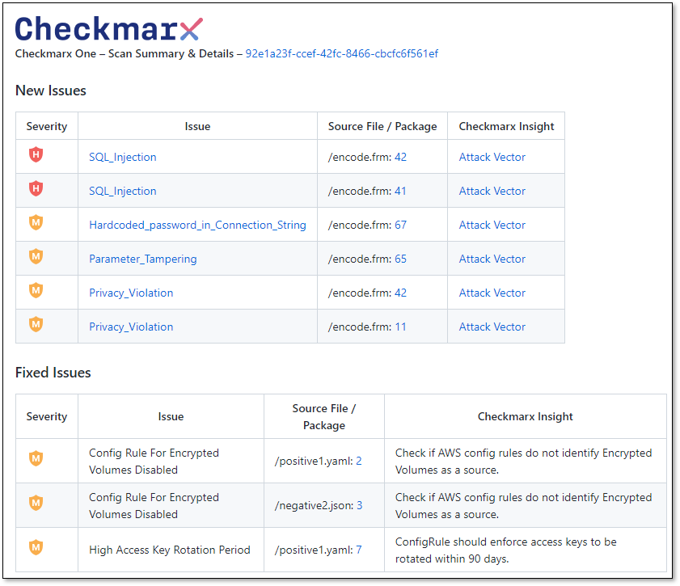
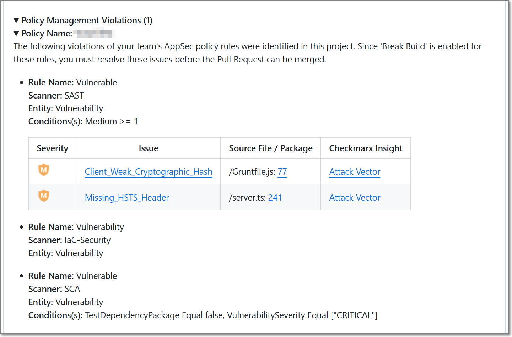
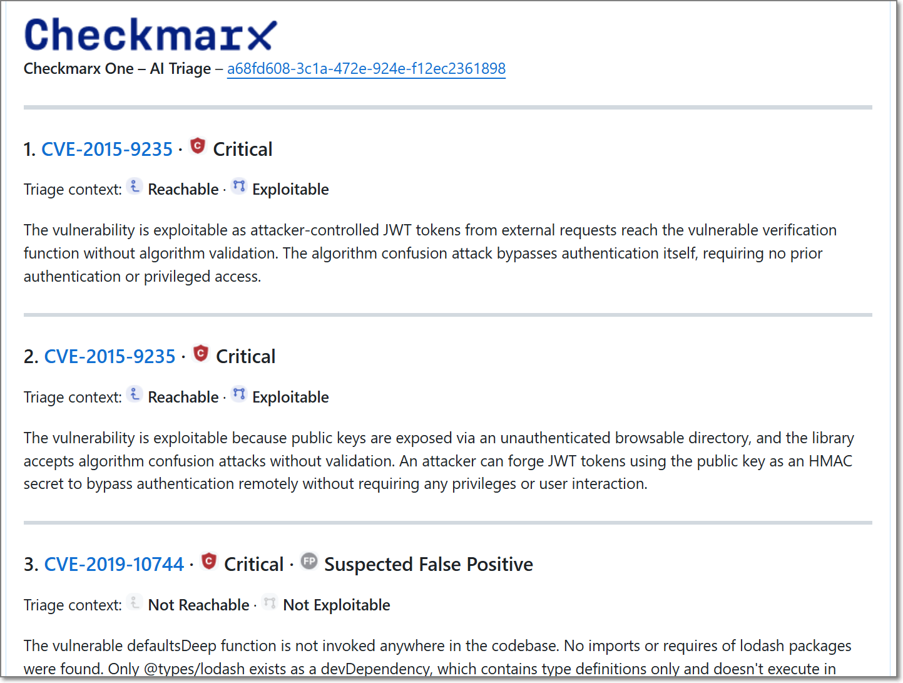

# Code Repository Integration Usage & Results

## Overview

This document describes how Checkmarx One integrates with source code management (SCM) platforms to automatically scan code and provide security feedback throughout the development lifecycle.

Checkmarx One currently supports integration with **GitHub, GitLab, Azure DevOps**, and **Bitbucket**.

Security scans can be triggered by:

- **Push events**
- **Pull requests**

Push-triggered scans and pull request-triggered scans provide different types of feedback and results. The following sections describe the behavior and expected outcomes of each workflow.

## Push Event Scanning

When code is pushed to a branch in a connected repository, Checkmarx One automatically initiates a scan of the updated codebase.

Push-triggered scans execute in Checkmarx One. Once the scan is complete, the results become available in the Checkmarx One UI.

Unlike pull request scans, push-triggered scans do not enrich the source code management platform with scan summaries, comments, or vulnerability reports. All scan findings must be reviewed directly in Checkmarx One.

### Expected Behavior

When a push event occurs:

1. A push event is detected by the repository integration.
2. Checkmarx One creates a new scan for the associated project.
3. When the scan completes, the results become available in Checkmarx One.

### Viewing Results

To review the results of a push-triggered scan:

1. Open the project in Checkmarx One.
2. Locate the newly created scan.
3. Open the scan results.
4. Review findings from the enabled scanners.

## Pull Request Scanning and PR Decoration

When a pull request is created in a connected repository, Checkmarx One automatically initiates a scan and enriches the pull request through Pull Request (PR) Decoration.

PR decoration provides security feedback directly within the pull request workflow, enabling developers and reviewers to identify and address security issues before code is merged into the target branch.

### Expected Behavior

When a pull request is created or updated:

1. The repository integration detects the pull request event.
2. Checkmarx One initiates a scan for the pull request.
3. A scan-in-progress notification is displayed in the comments section of the pull request.

   <figure><figcaption></figcaption></figure>
4. When the scan completes, the pull request decoration is updated with the scan results.

   <figure><figcaption></figcaption></figure>

### Information Displayed in the PR Decoration

Depending on the SCM platform and integration configuration, the pull request may display:

- Scan status notifications
- Scan completion notifications
- A summary of newly introduced vulnerabilities
- A summary of vulnerabilities fixed by the pull request
- A summary of policy violations triggered by the scan
- Links to detailed findings in Checkmarx One

### Full Results in Checkmarx One

While PR decorations provide a summary of the scan results, the complete findings remain available in Checkmarx One, including:

- Vulnerability details
- Severity information
- Remediation guidance
- Scanner-specific findings
- Historical scan information

## Understanding PR Decorations

During a pull request scan, Checkmarx One compares the scan results of the source branch with the most recent scan results of the target branch.

**The comparison is performed against the most recent available scan of the target branch, rather than directly against the current contents of the target branch.**

Based on this comparison, the PR decoration highlights the security impact of the proposed changes rather than the complete set of vulnerabilities present in the repository.

This comparison enables Checkmarx One to identify:

- **New Issues** introduced by the pull request
- **Fixed Issues** resolved by the pull request
- AppSec **Policy Management Violations** identified in the pull request

The following sections describe how these issue categories are calculated and displayed.

<figure><figcaption></figcaption></figure>

<figure><figcaption></figcaption></figure>

### New Issues

New Issues represent vulnerabilities that are present in the source branch but do not exist in the target branch. These findings were introduced by changes included in the pull request and require review before the code is merged.

By focusing on newly introduced vulnerabilities, developers can quickly identify security issues that were added as part of the current development effort.

### Fixed Issues

Fixed Issues represent vulnerabilities that exist in the target branch but are no longer present in the source branch. These findings indicate that the pull request contains changes that remediate previously identified security issues.

Fixed Issues provide visibility into the security improvements included in the pull request and help reviewers understand the positive impact of the proposed changes.

### Policy Management Violations

Policy Management Violations represent findings that violate one or more AppSec policies applied to the project.

When a policy violation is identified during a pull request scan, the PR decoration may include a **Policy Management Violations** section containing details about the violated policy and rule. Depending on the policy configuration, additional information such as the scanner that identified the finding and the conditions that triggered the violation may also be displayed.

Policy Management Violations help developers and reviewers identify security governance requirements that may need to be addressed before the pull request can be merged.

### AI Triage Report (GitHub Only)

<figure><figcaption></figcaption></figure>

For projects with **AI Triage & Remediation** enabled, the PR decoration includes an AI Triage section.

The AI Triage agent performs an additional analysis of eligible vulnerabilities identified during the pull request scan and provides risk-based context to help teams prioritize remediation efforts. This analysis may include information related to **exploitability**, **reachability**, and the effectiveness of existing mitigations.

To keep the report concise, AI Triage analysis is performed on a limited number of vulnerabilities from the pull request. A summary of the analyzed vulnerabilities is displayed directly in the PR decoration, with additional details available through Checkmarx One.

AI Triage analysis helps development and AppSec teams distinguish between findings that represent a practical security risk and findings that are less likely to be exploitable in the running application.

For more information, see [AI Triage & Remediation](../../../upcoming-features/ai-triage-remediation.md).

## PR Decoration New Issues Report

The PR decoration **New Issues** report summarizes findings identified during the pull request scan. The report contains four columns, although the content of some columns varies by scanner type.

To keep the pull request concise and focused on code review, the report displays only a subset of the identified findings. When additional findings are available, a link is provided to view the complete results in Checkmarx One.

The following sections describe the information displayed for each scanner type.

**SAST Scanner Vulnerabilities**

| Column | Description |
|---|---|
| Severity | All the vulnerabilities are sorted according to their severity - Critical, High, Medium, Low, Info |
| Issue | Link to the Vulnerability type, including the following information: • **Vulnerability risk** - What might happen. • **Vulnerability cause** - How does it happen. • **General recommendations** - How to avoid it. • **Code examples**  There are cases that a specific vulnerability type is not included in Checkmarx database.  In such cases an external link to **www.cwe.mitre.org** site will be provided containing additional information about the vulnerability.  |
| Source File / Package | Direct link to the vulnerable source code line in the code repository. |
| Checkmarx Insight | **Details** - A brief description of the vulnerability. **Attack Vector** - Direct link to the vulnerable source code line in Checkmarx SAST scanner scan results. |

**SCA Scanner Vulnerabilities**

| Column | Description |
|---|---|
| Severity | All the vulnerabilities are sorted according to their severity - Critical, High, Medium, Low, Info |
| Issue | Link to **devhub.checkmarx.com** site containing information about the vulnerable package. |
| Source File / Package | Vulnerable package name |
| Checkmarx Insight | Direct link to the vulnerable package in the Checkmarx One **SCA Scanner Results** viewer. |

**IaC Scanner Vulnerabilities**

| Column | Description |
|---|---|
| Severity | All the vulnerabilities are sorted according to their severity - Critical, High, Medium, Low, Info |
| Issue | Vulnerability title. |
| Source File / Package | Direct link to the vulnerable source code line in the code repository. |
| Checkmarx Insight | Vulnerability description - Limited to 150 characters. |

## Azure DevOps-Specific Behavior

### Comment Status

Azure DevOps pull request comments include an additional Status field.

Checkmarx One uses this field to indicate whether the PR decoration requires developer attention.

When new vulnerabilities are identified in the pull request, the Checkmarx One PR decoration comment is created with a status of Active.

Some development teams require all active pull request comments to be resolved before a pull request can be merged.

If no new vulnerabilities are identified during the scan, the PR decoration comment is created with a status of Closed.

## PR Decorations: Best practices and troubleshooting

The sub-sections below describe the best ways to use and troubleshoot PR decorations in scan results. These tips will help you understand your scan results better, fix any problems, and create high-quality code right from the start of your project.

Best practices

The following recommendations will help ensure accurate PR decoration results and reduce false or confusing comparisons between branches.

- As a general rule, it is recommended to perform a rebase operation against the target branch as frequently as possible, particularly before initiating a pull request (PR) on the feature branch. This practice ensures that the codebase remains aligned with the target branch and minimizes potential conflicts.
- Label the target branch as a Protected Branch. This will ensure that the scan results of the target branch are always up to date.
- Checkmarx scans triggered by code repository PRs are named based on the credentials of the user who created the integration. Therefore, we recommend using a designated service user to set up the integration in order to ensure that scans are given a properly descriptive name.

Troubleshooting

Unexplained vulnerabilities in feature branch

**What is happening**:

You are working in a feature branch that originated from the main target branch. Following the merge of the feature branch into the target branch, a scan of the target branch was initiated. Let’s refer to it as Scan 1.

This scan identified one or more vulnerabilities, all of which were then successfully resolved. A few days later you invoke another scan of the feature branch, that we’ll refer to as Scan 2. Scan 2 reveals a new vulnerability in a file you haven't even directly edited.

**Why it is happening**:

While you were working in the feature branch between the two scans, updates were made to the target branch. If your organization adheres to recommended practices, the target branch is marked as a Protected Branch, implying that it undergoes a scan each time changes are pushed to it.

If you did not rebase the feature branch against the target branch before Scan 2, the latest updates in the target branch did not become a part of the feature branch. The file where the newfound vulnerability surfaced might not even exist in the target branch. But because each scan of the feature branch is compared to the most recent scan of the target branch, this vulnerability emerges in the target branch as new.

**What to do**:

Always perform a rebase operation on the target branch before initiating a pull request (PR) on the feature branch. This will ensure that you always obtain accurate results without any confusing surprises.

Duplicate vulnerability reporting in PR decoration

**What is happening**:

A vulnerability appears in the scan summary under both **New Issues** and **Fixed Issues**.

**Why it is happening**:

This is due to the nature of the scanning process. When a vulnerability is identified within the code, it is associated with a unique Similarity ID by the scanner. However, any modification, even a minor one, in a string that includes a vulnerability triggers an update to the Similarity ID.

**What to do**:

You can safely disregard this situation. It occurs as a result of the scanning system's mechanics and does not require specific action.

Odd scan results after a PR

**What is happening**:

When you initiate a PR, an automated scan is performed, but the obtained scan results are puzzling and make no sense.

**Why it is happening**:

The repository's pipeline is automated through tools like GitHub Actions. The configuration dictates that only the feature branch is scanned when a PR is generated. However, the target branch is not scanned, and its latest scan results are outdated. Given that the latest scan data of the feature branch is consistently compared to the latest available scan data of the target branch, the resulting comparison is odd and irrelevant.

Another potential reason for odd scan results is related to the scenario where you're scanning a feature branch while another person has initiated a PR, prompting a scan of the target branch. If the scan of the feature branch is completed before the scan of the target branch, the results of the feature branch scan will be compared against the results from the preceding target branch scan. Consequently, the comparison summary will likely appear odd and unexpected.

**What to do**:

To ensure that the scan results of the target branch are always up to date, it's advisable to label the target branch as a Protected Branch. This will trigger an automated scan whenever changes are pushed to the target branch. If tools similar to GitHub actions are used, every push to the target branch should trigger a scan. Implementing this practice guarantees meaningful and accurate scan results.

New SCA vulnerability detected in previously scanned code

**What is happening**:

A new vulnerability has been identified within code that was previously scanned and found to be free of vulnerabilities. This code remained untouched since its last scan; hence it is puzzling that a new vulnerability was uncovered in it.

**Why it is happening**:

This newfound vulnerability is indeed new. It was discovered and added to SCA after the most recent scan of that code.

**What to do**:

Handle this new vulnerability just like any other: take the necessary steps to resolve it.

## In this section

- [Interacting with Checkmarx via PR Decorations](interacting-with-checkmarx-via-pr-decorations.md)
