# GitHub Apps Code Repository Integrations


It is possible to add the Checkmarx One external IP addresses to the customer Firewall allowlist - For more information see [Managing Checkmarx One Traffic and AWS S3 Access](../managing-checkmarx-one-traffic-and-aws-s3-access.md)

Additionally, if the code repository is not internet accessible, it is possible to configure the code repository IP address instead of its hostname during the initial integration with the code repository - as it is not resolved via DNS.


## Overview

Checkmarx supports code repository integrations using GitHub Apps. We offer Managed Setup, which provides a pre-configured Checkmarx GitHub App. Alternatively, you can use our Custom Setup, which enables you to create and configure your own GitHub App (or use an existing one) that conforms to the required settings for Checkmarx integration.


As for all code repository integrations, single tenant accounts do not have the option to use the Managed Setup flow.


This guide walks through the setup flow, including creating the integration configuration, setting up and configuring a GitHub App when required, installing it in your GitHub organization, and importing specific repositories.


This integration supports both public and private git based repos.


Once the integration is configured, a separate Checkmarx One Project is created for each connected GitHub repo.


You can select several repos to create multiple integrations in a bulk action.


### Why Connect Using a GitHub App?

Using a GitHub App is the recommended way to connect Checkmarx to your repositories because it provides:

- **Precise, Repo-Level Access Control** - Admins can choose exactly which repositories Checkmarx can access. The OAuth method depends on a user’s permissions, which may include far more repositories than intended.
- **Stronger Security Through Least Privilege** - GitHub Apps request only the specific permissions needed (e.g., read-only code access). OAuth uses broad scopes that often grant full repo access.
- **Organization-Owned and Not Tied to a User** - The GitHub App belongs to the organization—not an individual. This means the integration stays active even when team members change roles or leave.
- **Short-Lived Tokens Instead of Long-Lived User Credentials** - GitHub Apps use automatically rotated, short-lived tokens, reducing risk exposure. OAuth relies on long-lived user tokens that require manual management.

### Prerequisites

- The source code for your project is hosted on a GitHub repo.
- You need to be authenticated in GitHub.

  
  Installing the GitHub App requires admin approval. If you aren't authenticated as an org admin, you will need to wait for an admin to approve your request. After the initial installation, non-admins can configure and edit code repository integrations.
  
- You have a Checkmarx One account and have credentials to log in to your account.

  
  Creating new import configurations or editing existing configurations requires `update-tenant-params` permission. Importing new Projects using an existing configuration requires `create-project` permission.

  Our best practice recommendation is to create a dedicated service user for the purpose of creating the integration. This will ensure that scans created via the integration will have a representative name.
  

### Required Permissions in GitHub Apps

Checkmarx requires certain permissions to be assigned to the GitHub App in order to enable Checkmarx to properly interact with your GitHub organization.

The following is a list of the permissions required and why Checkmarx needs these permissions.

- **Commit statuses (read and write)** - Update commit status indicators (e.g., pending, success, failure) on commits and pull requests.
- **Pull requests (read and write)** - Read and interact with pull requests.
- **Contents (read and write)** - Read repository files for code analysis. Write to submit PR with remediated code - used for [SCA Auto PRs](../../scanners/sca-scanner/README.md) and [AI Triage & Remediation](../../upcoming-features/ai-triage-remediation.md).
- **Issues (read and write)** - Create/update FeedbackApp issues, handle GitHub comments, and decorate pull requests.
- **Metadata (read only)** - Retrieve basic repository information.
- **Member Organization (read only)** (Only for Managed Setup flow) - Handle user authentication and organization display.
- **Webhooks (read and write)** - Enable or disable auto-sync. Applicable to all projects, including those configured with auto-sync.
- **Actions (read only)** - Retrieve info needed for Scorecard (repository health) analysis.

### Project Migration

You can migrate existing manual projects in Checkmarx One to become Code Repository Integration projects using GitHub Apps, using the following procedure:


This procedure can also be done via REST API, using the [Code Repository Conversion](https://checkmarx.stoplight.io/docs/checkmarx-one-api-reference-guide/8tylyjxp4i41x-convert-a-project) API. However, for integrations using our Managed Setup flow, the initial step of creating a code repository instance (by submitting an Instance Name, URL, and authentication credentials) must be done via the UI. And, for integrations using our Managed Setup flow, the complete process of importing the organization must be done via the UI.


1. Go to **Integrations** > **Project Migration**.
2. Select the checkbox for the relevant projects.
3. Click on **Connect to Code Repository**.

   The configuration wizard opens in a side-panel.

   <figure>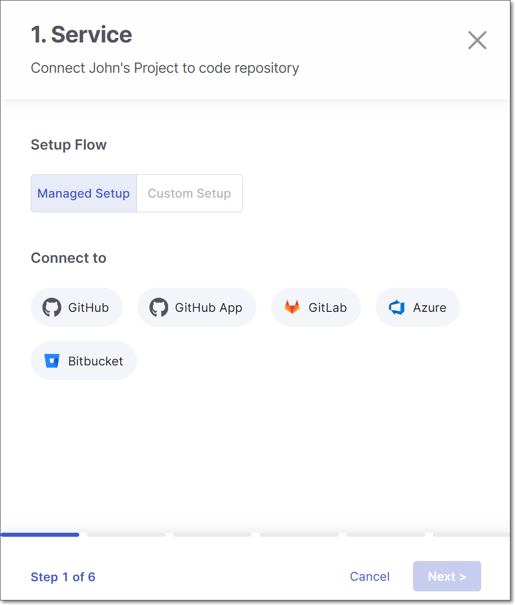<figcaption></figcaption></figure>
4. Select **Managed Setup** or **Custom Setup** according to your deployment then select **GitHub App** and click **Next**.
5. Continue with the configuration flow as explained below for [Managed Setup](#github-apps-managed-setup-flow) or [Custom Setup](#github-apps-custom-setup) according to your selection.

## GitHub Apps Managed Setup Flow

This flow provides a simple implementation based on a pre-configured GitHub App provided by Checkmarx. This flow is available for Multi Tenant Checkmarx accounts using **GitHub Cloud** or **GitHub Enterprise Cloud** accounts.

We offer an alternative [Custom Setup procedure](#github-apps-custom-setup) flow that involves configuring your own GitHub App. The Custom Setup flow must be used for:

- Checkmarx One single tenant accounts
- Repos hosted on **GitHub Server** or **GitHub Enterprise Server** accounts
- Organizations that prefer to configure their own Apps or use existing Apps

### Setting up the Integration and Initiating a Scan

To integrate your **GitHub** repos with Checkmarx One by means of installing our ready-to-use **Checkmarx GitHub App** in your organization, perform the following:


Checkmarx GitHub App does not support integration with GitHub **user** organizations.



If a GitHub organization is renamed or moved, the existing connection becomes invalid. In such cases, the organization must be reimported to restore the integration.


1. On the > **Projects** page, click on **New > New Project - Code Repository Integration**.

   <figure><figcaption></figcaption></figure>

   The **Import From** window opens.
2. Select **Managed Setup** and **GitHub App**, then click **Next**.

   <figure>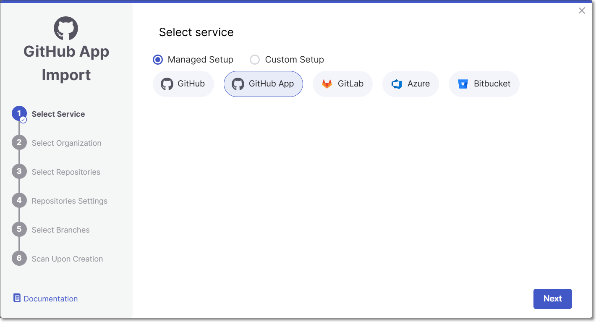<figcaption></figcaption></figure>
3. For first-time use, you will be redirected to the GitHub permissions page. Click **Authorize**.

   <figure>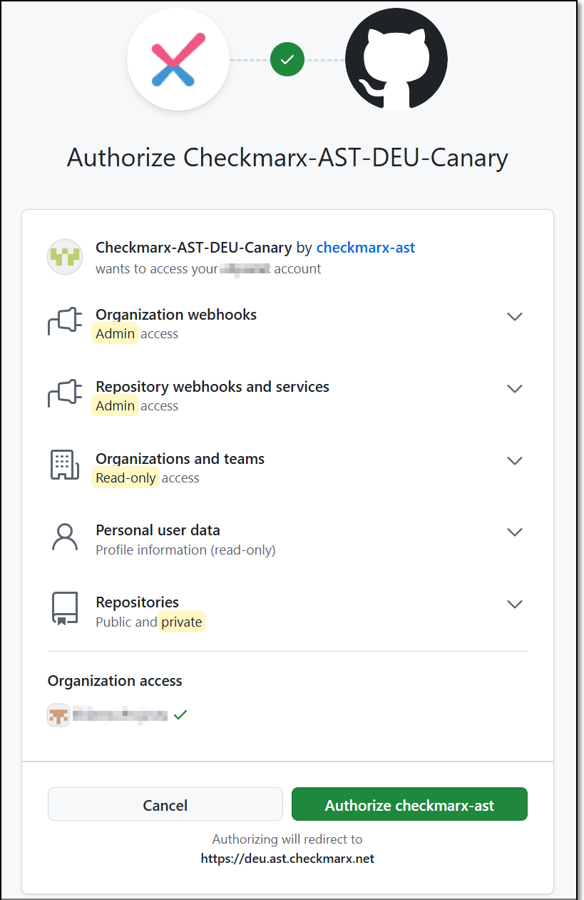<figcaption></figcaption></figure>

   Enter your authentication code to confirm access, and then click **Verify**.

   <figure>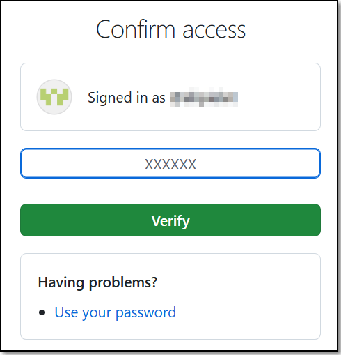<figcaption></figcaption></figure>

   You are redirected to the Checkmarx UI and a pop-up install message appears.
4. In the pop-up message, click **Install**

   <figure>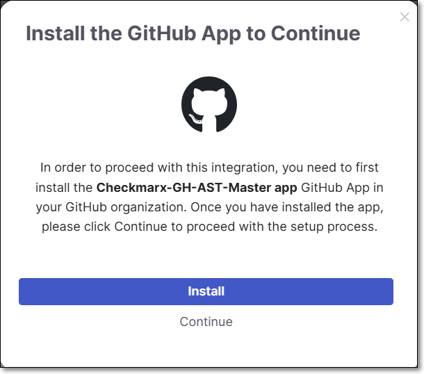<figcaption></figcaption></figure>

   You are redirected to the Github App installation page.
5. Select the organization for which you are creating the integration.
6. Select the type of access, **All repositories** or **Only select repositories** and then click **Install**.

   
   If you would like to enable this integration to monitor and automatically sync with projects that are added or transferred to your organization, then **you must** select **All repositories**. We only recommend selecting **Only select repositories** if you plan to use this integration for a limited set of repos.
   
7. In the pop-up message, click **Continue**.
8. Select the **GitHub Organization** and click **Select Organization**.

   
   Only the organizations in which you installed the GitHub App will appear on the list. You can install the Github App in another organization from this screen by clicking on **grant additional organizations** in the top right of the screen and repeating the previous steps.
   

   <figure>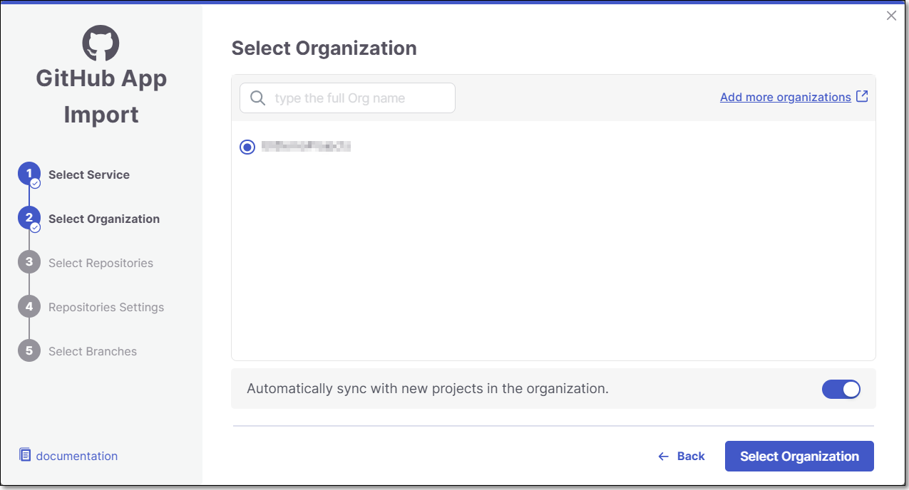<figcaption></figcaption></figure>
9. **Select Repositories** inside the GitHub organization and click **Select Repositories**.

   If the organization contains active repositories, suggested repos will be presented and selected automatically. For additional information see [Suggested Repositories](suggested-repositories.md).

   
   - A separate Checkmarx One Project will be created for each repo that you import.
   - There can’t be more than one Checkmarx One Project per repo. Therefore, once a Project has been created for a repo, that repo is greyed out in the Import dialog.
   

   <figure><figcaption></figcaption></figure>
10. In the **Repositories Settings** step, you can optionally adjust the settings as follows:

    - If the project has multiple repositories, click **All Repositories Settings** to adjust the settings for all repositories, or select a specific repository, to adjust the settings for that repository.

      <figure>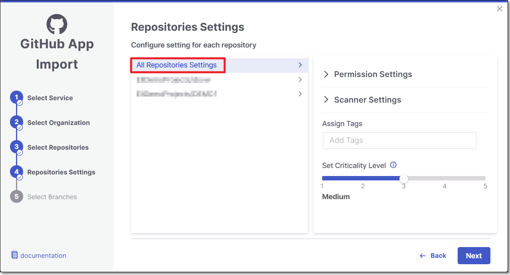<figcaption></figcaption></figure>
    - In the **Permissions** section, adjust the following settings:

      - **Scan Trigger: Push, Pull request** - Automatically trigger a scan when a push event or pull request is done in your SCM. (Default: On)
      - **Pull Request Decoration** - Automatically send the scan results summary to the SCM. (Default: On)
    - In the **Scan Type** section, enable the toggle for each scanner you want to use (**SAST, SCA, IaC Security, Container Security, API Security, OSSF Scorecard, Secret Detection, AI Supply Chain Security**) for your repositories. At least 1 scanner must be selected for each repository.

      - For the **SAST** scanner, you can enable **Incremental Scan**.
      - For the **SCA** scanner, you can enable **SCA Auto Pull Request**. This feature automatically sends PRs to your SCM with recommended changes in the manifest file, in order to replace the vulnerable package versions. (Default: Off)
    - **Add SSH key** (when a specific repository is selected).
    - **Assign Groups:** Associate groups to the project.
    - **Assign Tags:** Add **Tags** to the Project. Tags can be added as a simple strings or as key:value pairs.
    - **Set Criticality Level:** Manually set the project's criticality level.
11. Click **Next**.
12. In the **Select Branches** step, specify the branches to be designated as protected branches.

    
    Specifying a branch as a **Protected Branch** affects three main areas: scan triggering (for PR and push), policy violation detection, and Feedback App notifications.
    

    You can also use a wildcard symbol "\*" to designate which branches are protected. The wildcard can be used before the string, after the string, or both. All branches that match the wildcard pattern will be treated as protected branches.

    
    **Examples**:

    - `*` → all branches
    - `release*` → branches that begin with "release"
    - `*release` → branches that end with "release"
    - `* release *` → branches that contain "release" anywhere in the name
    

    - **Tags** - For each protected branch, you can optionally assign **Tags**. When a scan is triggered for this branch (e.g., push or pull request), these tags will automatically be applied to the scan.

      Tags can be key:value pairs or simple values. For example, `env:prod` or `security`.
13. In the **Scan Upon Creation** step, you can decide whether to enable **Scan a branch upon creation of the project** feature.

    For each repository, select the protected branches you want to scan during project creation, and then click **Create Project**.

    
    If you specified a wildcard pattern in the previous step, it will not appear as an option on this list.
    

    <figure>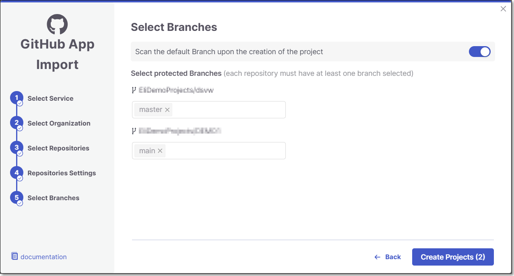<figcaption></figcaption></figure>
14. A **Project** is created for each repository and a **scan is initiated** for each project. All projects created in this flow are associated with the same **organization** entity in Checkmarx One. The new projects are displayed on the Projects page,

    <figure>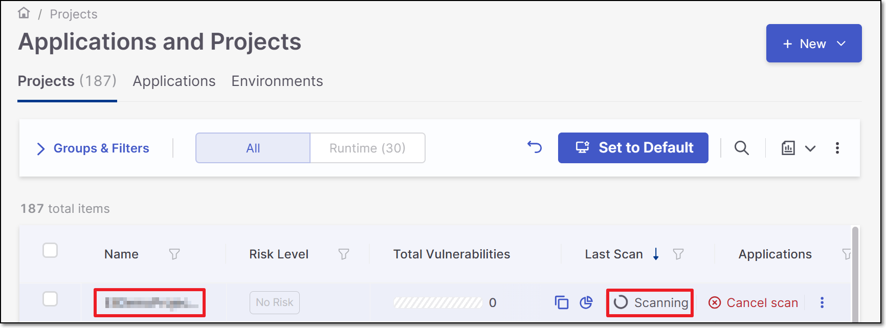<figcaption></figcaption></figure>

### Editing Project Settings

In order to update settings for an individual code repository project, see Code Repository Project Settings. To update scanner and permission settings for all projects in an organization at once, see Code Repository Settings.

## GitHub Apps Custom Setup


This flow involves configuring your own GitHub App according to the required specifications. There is a simpler [Managed setup](#github-apps-managed-setup-flow) that makes use of a pre-configured Checkmarx One GitHub App. The Managed setup is available only for multi tenant accounts that are connecting to a **GitHub Cloud** or **GitHub Enterprise Cloud** organization.


### Setting up the Integration and Initiating a Scan

This process involves first connecting to your repo by specifying the repo url and creating a GitHub App to install on a GitHub organization. You then select the repos to import and configure Project settings.

It is possible to configure multiple configurations for connecting to Custom Setup code repositories, each using a different URL and a different GitHub App. Once the initial configuration is set up, for each subsequent import action you can choose either to use the existing configuration or to create a new one.


Checkmarx does not support GitHub App integrations with GitHub **user** organizations.



If a GitHub organization is renamed or moved, the existing connection becomes invalid. In such cases, the organization must be reimported to restore the integration.


#### Step 1: Create the Code Repository Integration

1. In the **Workspace** , click on **New > New Project - Code Repository Integration**.

   <figure><figcaption></figcaption></figure>

   The **Import From** window opens.

   <figure>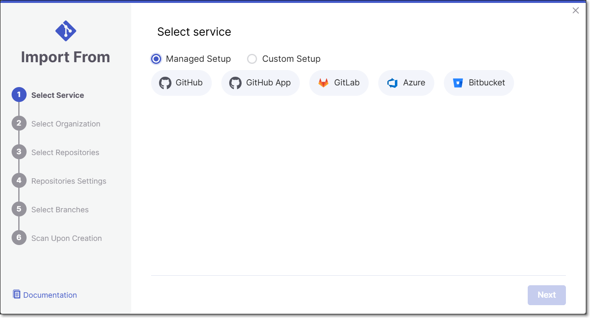<figcaption></figcaption></figure>
2. Select **Custom Setup** and **GitHub Apps**.

   <figure>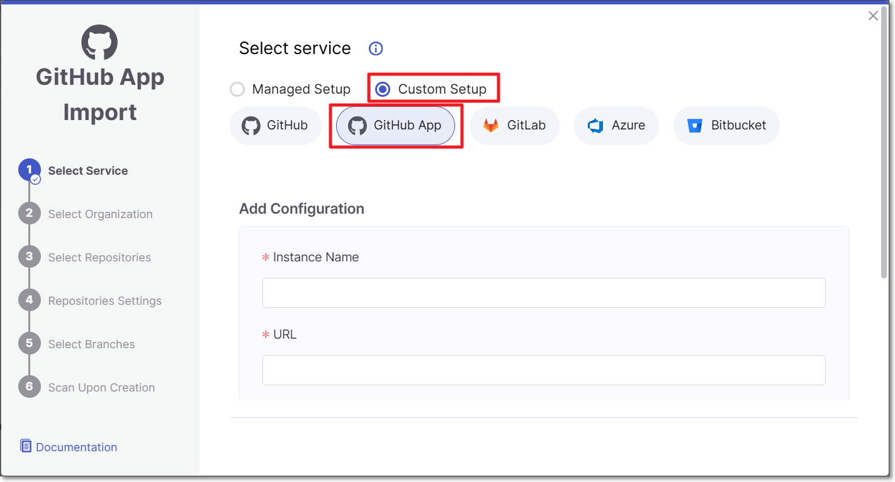<figcaption></figcaption></figure>
3. Fill in the following fields:

   - **Instance Name** - Designate a name for this import configuration.
   - **URL** - Your GitHub self-managed domain.

     For example: https://github.example.com

   The **Set up a new app** button is enabled. Continue with the next procedure.

#### Step 2: Configure the GitHub App

This section walks you through the process of creating a new Checkmarx GitHub App.


If you already have a GitHub App and prefer to use it for your integration, use the alternate procedure described here: [Alternate Step 2: Using your own GitHub App](#alternate-step-2-using-your-own-github-app).


1. Click **Set up a new app**.

   You are redirected to the **Register new GitHub App** page in GitHub.

   <figure><figcaption></figcaption></figure>

   Most of the fields are auto-populated by Checkmarx.
2. In the **webhook secret** field, enter a password that meets the following criteria:

   - Minimum 16 characters
   - Allowed characters: Letters (a-z, A-Z), numbers (0-9), and symbols (!@#$%^&amp;\*-_=+)
   - Not allowed: Spaces, emoji, or special characters (Hebrew, Chinese, etc.)

   
   Checkmarx requires the GitHub webhook secret to follow specific formatting rules. GitHub itself does not enforce these requirements, so it’s possible to create a secret in GitHub that looks valid but will be rejected by Checkmarx. Because of this, you must make sure the secret you generate meets Checkmarx’s criteria before using it.
   
3. At the bottom of the page, set the App as allowed for all organizations.
4. Click **Create GitHub App**.

   You are brought to your GitHub App details page.
5. Scroll to the bottom of the page and click **Generate a private key**.

   The private key is downloaded to your computer.
6. Leaving this page open, return to the Checkmarx UI and enter the following information:

   - The App id (shown on the top of your GitHub App details page).
   - Click **upload private key** and select the file that was downloaded in step **5**.
   - Fill in the **webhook secret** field with the secret you created in step **2**.
7. Click **Save and continue**.

   Your GitHub App is now configured and ready for use in Checkmarx. Continue with the next step.

Alternate Step 2: Using your own GitHub App

If you already have a GitHub App and prefer using it for your integration, carefully follow this procedure:


A unique Webhook URL is generated for each Custom Setup Code Repository integration. Therefore, each GitHub App can only be used for one integration.


1. Click **I already have an app**.
2. Copy the **webhook url** from the information box at the top of the screen and paste it into the webhook url field on your GitHub App's page in GitHub.
3. Ensure that your GitHub App has the required configurations for use with Checkmarx. This includes:

   - The **webhook secret**:

     - Must be 16 characters
     - Can use these characters: Letters (a-z, A-Z), numbers (0-9), and symbols (!@#$%^&amp;amp;amp;\*-_=+)
     - Cannot have spaces, emoji, or special characters (Hebrew, Chinese, etc.).
   - Set the App as allowed for all organizations.
   - You must enable the following required permissions -

     - **Commit statuses (read and write)**
     - **Pull requests (read and write)**
     - **Contents (read and write)**
     - **Issues (read and write)**
     - **Metadata (read only)**
     - **Actions (read only)**
4. Click **Save Changes**.
5. In the Checkmarx UI, ensure data is properly inserted for the following fields:

   - **Instance Name** - Designate a name for this import configuration.
   - **URL** - Your GitHub self-managed domain.

     For example: https://github.example.com
   - **App ID** - the ID of your GitHub App.
   - **Private Key** - the private key generated in your GitHub App.
   - **Webhook Secret** - the webhook secret set in your GitHub App.
6. Click **Save and continue**.

   Your GitHub App is now configured and ready for use in Checkmarx.

#### Step 3: Configure the Code Repository Integration.

Now that your GitHub App is configured you can proceed with configuring your code repository integration.

1. In the pop-up install message that appears, click **Install**.

   <figure><figcaption></figcaption></figure>

   You are redirected to the Github App installation page.
2. Select the **GitHub Organization** for integration, scroll down, and click **Install**.

   You are redirected to the Checkmarx UI.

   
   To install the GitHub App on another organization, repeat steps 1 and 2.
   
3. In the pop-up message, click **Continue**.
4. Select the **GitHub Organization** and click **Select Organization**.

   
   Only the organizations in which you installed the GitHub App will appear on the list. You can install the Github App in another organization from this screen by clicking on **Grant additional organizations** in the top right of the screen and repeating step 2.
   

   <figure>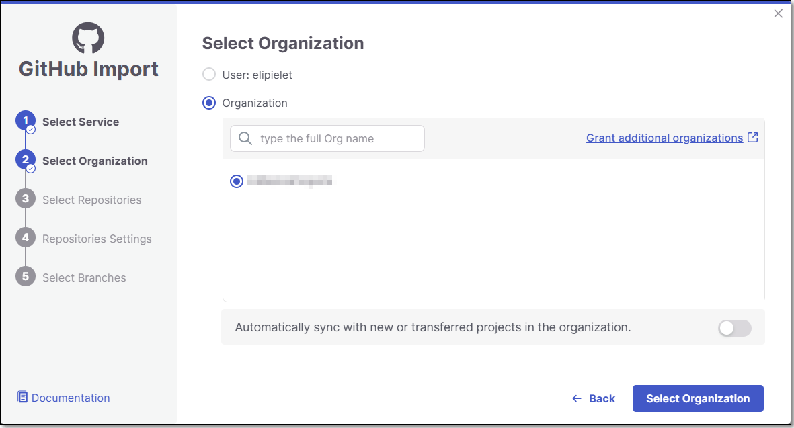<figcaption></figcaption></figure>
5. **Select Repositories** inside the GitHub organization and click **Select Repositories**.

   If the organization contains active repositories, suggested repos will be presented and selected automatically. For additional information see [Suggested Repositories](suggested-repositories.md).

   
   - A separate Checkmarx One Project will be created for each repo that you import.
   - There can’t be more than one Checkmarx One Project per repo. Therefore, once a Project has been created for a repo, that repo is greyed out in the Import dialog.
   

   <figure><figcaption></figcaption></figure>
6. In the **Repositories Settings** step, you can optionally adjust the settings as follows:

   - If the project has multiple repositories, click **All Repositories Settings** to adjust the settings for all repositories, or select a specific repository, to adjust the settings for that repository.

     <figure>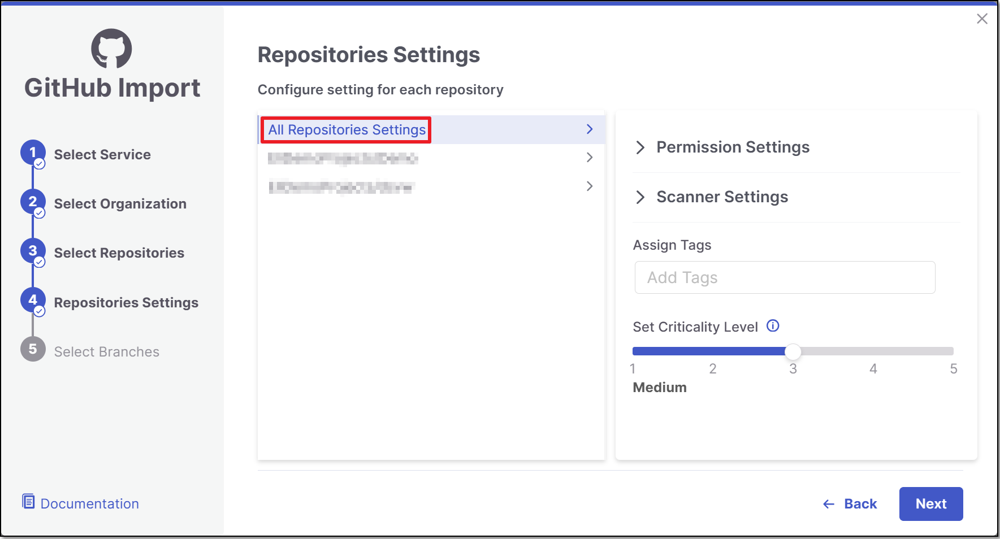<figcaption></figcaption></figure>
   - Expand the **Permissions Settings** and adjust the following settings:

     - **Scan Trigger: Push, Pull request** - Automatically trigger a scan when a push event or pull request is done in your SCM. (Default: On)
     - **Pull Request Decoration** - Automatically send the scan results summary to the SCM. (Default: On)
     - **SCA Auto Pull Request** - Automatically send PRs to your SCM with recommended changes in the manifest file, in order to replace the vulnerable package versions. (Default: Off)
   - Expand the **Scanner Settings** and enable the toggle for each scanner you want to use (**SAST, SCA, IaC Security, Container Security, API Security, OSSF Scorecard, Secret Detection, AI Supply Chain Security**) for your repositories. At least 1 scanner must be selected for each repository.

     
     The scan and permission settings shown here depend on whether this is the first project connected from this organization:

     - **First connection to this organization** — all licensed scanners are enabled by default. The settings you choose here establish the organization-level defaults, with Allow Override enabled for each setting.
     - **Organization already connected** — The settings shown reflect the existing organization-level configuration. For each setting, Allow Override is enabled or disabled at the organization level:

       - **Enabled** - You can modify the setting for this project. Changes affect only this project and do not change the organization-level configuration.
       - **Disabled** - The setting is inherited from the organization-level configuration and cannot be modified for this project.

     See [Organization-Level Configuration for Code Repository Integrations](organization-level-configuration-for-code-repository-integrations.md) for details.
     
   - **Protected Branches** (when a specific repository is selected): Specify the branches to be designated as "Protected Branches".

     
     Specifying a branch as a **Protected Branch** affects three main areas: scan triggering (for PR and push), policy violation detection, and Feedback App notifications.
     

     You can also use a wildcard symbol "\*" to designate which branches are protected. The wildcard can be used before the string, after the string, or both. All branches that match the wildcard pattern will be treated as protected branches.

     
     **Examples**:

     - `*` → all branches
     - `release*` → branches that begin with "release"
     - `*release` → branches that end with "release"
     - `* release *` → branches that contain "release" anywhere in the name
     

     - **Tags** - For each protected branch, you can optionally assign **Tags**. When a scan is triggered for this branch (e.g., push or pull request), these tags will automatically be applied to the scan.

       Tags can be key:value pairs or simple values. For example, `env:prod` or `security`.
   - **Add SSH key** (when a specific repository is selected).
   - **Assign Tags:** Add **Tags** to the Project. Tags can be added as a simple strings or as key:value pairs.
   - **Set Criticality Level:** Manually set the project's criticality level.
7. Click **Next.**
8. In the **Select Branches** screen you can decide whether to enable the "Scan the default Branch upon the creation of the project" feature.

   For each repository, select the protected branches you want to scan during project creation, and then click **Create Project**.

   
   If you specified a wildcard pattern in the previous step, it will not appear as an option on this list.
   

   <figure>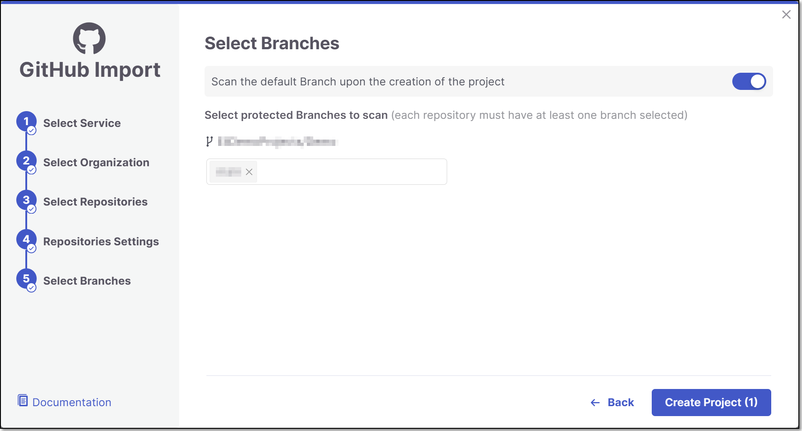<figcaption></figcaption></figure>
9. A **Project** is created for each repository and a **scan is initiated** for each project. All projects created in this flow are associated with the same **organization** entity in Checkmarx One. The new projects are displayed on the Projects page,

   <figure><figcaption></figcaption></figure>

### Technical Info About GitHub Webhooks

The webhook listening endpoints and APIs for GitHub Custom Setup are similar to those used for GitHub Managed Setup. Detailed info about webhooks for GitHub Managed Setup is available here.

### Editing Project Settings

In order to update settings for an individual code repository project, see Code Repository Project Settings. To update scanner and permission settings for all projects in an organization at once, see Code Repository Settings.
