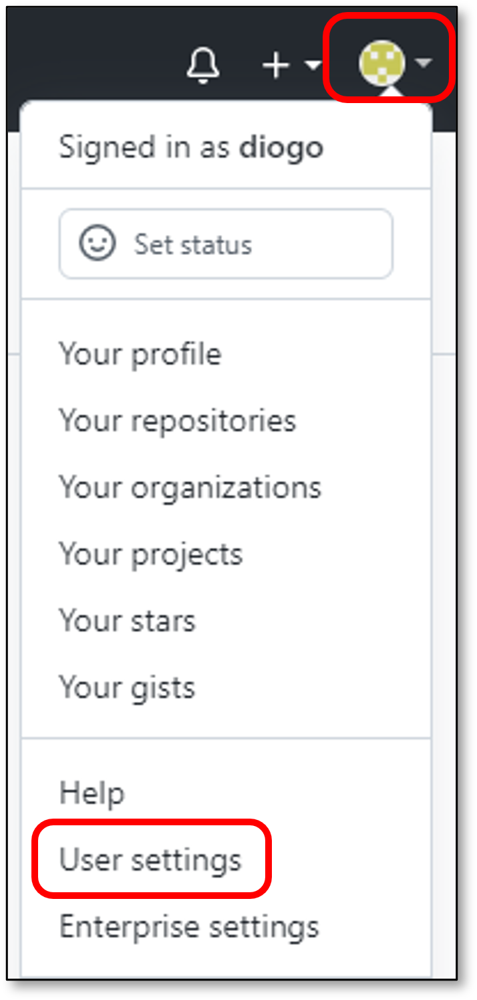
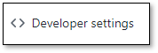
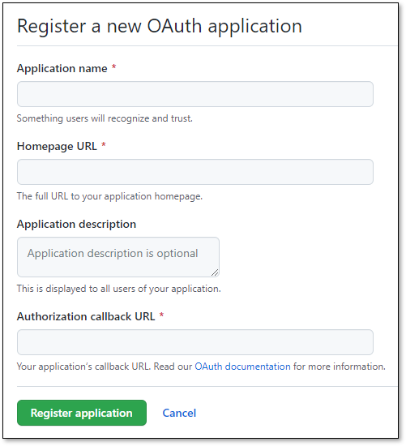
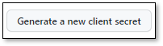
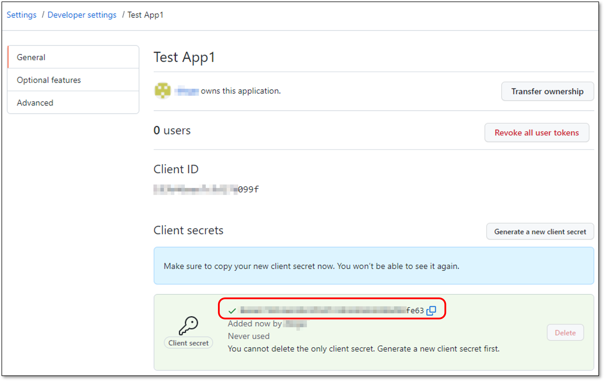
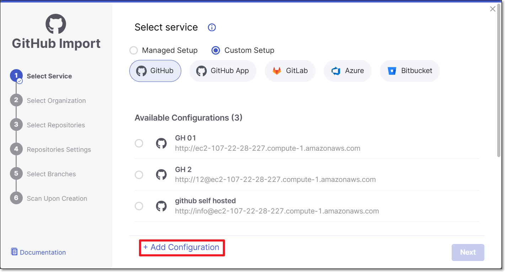
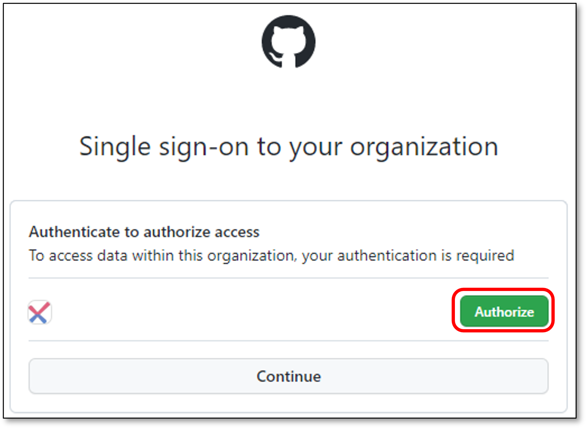
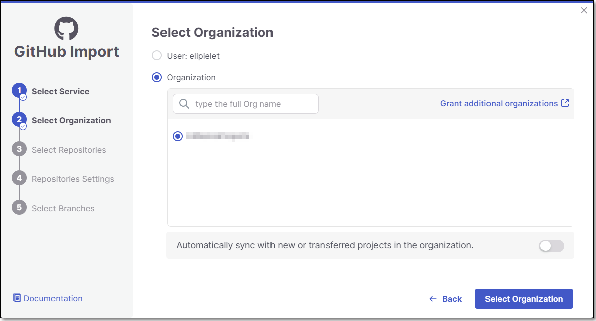
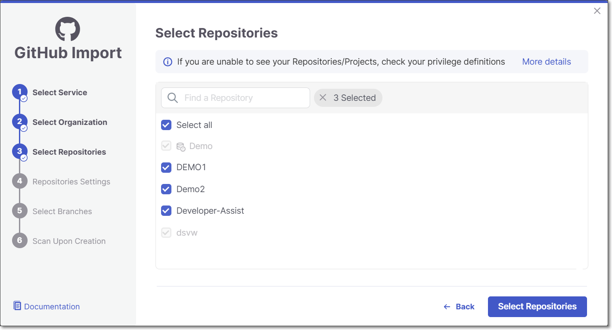

# GitHub Custom Setup


It is possible to add the Checkmarx One external IP addresses to the customer Firewall allowlist - For more information see [Managing Checkmarx One Traffic and AWS S3 Access](../managing-checkmarx-one-traffic-and-aws-s3-access.md)

Additionally, if the code repository is not internet accessible, it is possible to configure the code repository IP address instead of its hostname during the initial integration with the code repository - as it is not resolved via DNS.


## Overview

Checkmarx One supports GitHub integration, enabling automated scanning of your GitHub projects whenever the code is updated. Checkmarx One's GitHub integration listens for GitHub commit events and uses a webhook to trigger Checkmarx scans when a push, or a pull request occurs. Once a scan is completed, the results can be viewed in the Checkmarx One Platform.

In addition, for pull requests, a comment is created in GitHub, which includes a scan summary, list of vulnerabilities and a link to view the scan results in Checkmarx One.


This integration supports both public and private git based repos.


The integration is done on a per project basis, with a specific Checkmarx One Project corresponding to a specific GitHub repo.


You can select several repos to create multiple integrations in a bulk action.


Use **Custom Setup** when your GitHub instance is self-hosted (e.g., GitHub Enterprise Server) rather than github.com. If your repositories are hosted on github.com, use the **Managed Setup** integration instead.

## Prerequisites

- The source code for your project is hosted on a GitHub repo.
- You have a Checkmarx One account and have credentials to log in to your account.

  
  Creating new import configurations or editing existing configurations requires `update-tenant-params` permission. Importing new Projects using an existing configuration requires `create-project` permission.

  Our best practice recommendation is to create a dedicated service user for the purpose of creating the integration. This will ensure that scans created via the integration will have a representative name.
  
- The GitHub user has **admin** privileges for this repository, see [Code Repository Integrations](README.md).
- You have your GitHub **Client ID** & **Client Secret** - See [Retrieving GitHub Client ID & Client Secret](#retrieving-github-client-id-client-secret).

### Retrieving GitHub Client ID & Client Secret

Retrieving GitHub Client ID & Client Secret

To retrieve GitHub Client ID & Client Secret, perform the following steps:

1. In your GitHub account, click on **your user → User Settings** (top right).

   <figure><figcaption></figcaption></figure>
2. On the left navigation, click on **Developer settings**.

   <figure><figcaption></figcaption></figure>
3. Click on **OAuth Apps**.

   <figure><figcaption></figcaption></figure>
4. Click on **New OAuth App**.

   <figure><figcaption></figcaption></figure>
5. Register a new OAuth App by configuring the following fields:

   - **Application name**.
   - **Homepage URL** - Checkmarx One environment URL.
   - **Application description** (Optional).
   - **Authorization callback URL** - Checkmarx One environment URL.
   - Click on **Register application**.

     <figure><figcaption></figcaption></figure>
6. Copy the **Client ID**.

   <figure><figcaption></figcaption></figure>
7. Click on **Generate a new client secret**.

   <figure><figcaption></figcaption></figure>
8. Copy the **Client Secret**.

   <figure><figcaption></figcaption></figure>

## Setting up the Integration and Initiating a Scan

This process involves first connecting to your repo by specifying the repo URL and your authentication credentials, and then selecting the repos to import and configuring the Project settings.

It is possible to configure multiple configurations for connecting to GitHub Custom Setup code repositories, each using a different URL and/or different authentication credentials. Once the initial configuration is set up, for each subsequent import action you can choose either to use the existing configuration or to create a new one.


If a GitHub organization is renamed or moved, the existing connection becomes invalid. In such cases, the organization must be reimported to restore the integration.


**To create GitHub Custom Setup code repository Projects:**

1. In the **Workspace** , click on **New > New Project - Code Repository Integration**.

   <figure><figcaption></figcaption></figure>

   The **Import From** window opens.

   <figure><figcaption></figcaption></figure>
2. Select **Custom Setup** **>** **GitHub**.

   <figure><figcaption></figcaption></figure>
3. Configure the connection to your code repository, as follows:

   - If you are setting up an import configuration for the first time, enter data for the following fields and then click **Save & Continue**:

     - **Instance Name** - Designate a name for this import configuration.
     - **URL** - Your GitHub self-managed domain.

       For example: https://github.example.com
     - **Client ID** - See [Retrieving GitHub Client ID & Client Secret](#retrieving-github-client-id-client-secret) for retrieving your Client ID.
     - **Client Secret** - See [Retrieving GitHub Client ID & Client Secret](#retrieving-github-client-id-client-secret) for retrieving your Client Secret.

       <figure><figcaption></figcaption></figure>
   - If you are importing Projects using an existing configuration, select the radio button next to the configuration that you would like to use, and then click **Save & Continue**.

     <figure><figcaption></figcaption></figure>
   - If you are adding a new configuration in addition to an existing configuration, click **+ Add Configuration**, then fill in the data for this configuration as described above, and then click **Next**.

     <figure><figcaption></figcaption></figure>

     
     If you would like to edit an existing configuration (e.g., change the URL or credentials), go to **Global Settings** > **Code Repository**.
     
4. Click **Authorize**.

   <figure><figcaption></figcaption></figure>
5. Select the **GitHub User/Organization or Group** (for the requested repository) and click **Select Organization**.

   The screen contains the following functionalities:

   - **Search** bar - Users need to type the *full* organization name (GitHub limitation). The search is not case sensitive.
   - **Infinite scroll** - For enterprises with a large amount of organizations.

   You can also decide whether to enable the **Monitor New Repositories** feature by using the toggle next to "Automatically sync with new or transferred projects in the organization."

   For more information about this feature see [Monitor New Repositories](monitor-new-repositories.md).

   
   In case you selected **GitHub User** skip step 6.
   

   <figure><figcaption></figcaption></figure>
6. **Select Repositories** inside the GitHub organization and click **Select Repositories**.

   If the organization contains active repositories, suggested repos will be presented and selected automatically. For additional information see [Suggested Repositories](suggested-repositories.md).

   
   - A separate Checkmarx One Project will be created for each repo that you import.
   - There can’t be more than one Checkmarx One Project per repo. Therefore, once a Project has been created for a repo, that repo is greyed out in the Import dialog.
   

   <figure><figcaption></figcaption></figure>
7. In the **Repositories Settings** step, you can optionally adjust the settings as follows:

   - If the project has multiple repositories, click **All Repositories Settings** to adjust the settings for all repositories, or select a specific repository, to adjust the settings for that repository.

     <figure><figcaption></figcaption></figure>
   - Expand the **Permissions Settings** and adjust the following settings:

     - **Scan Trigger: Push, Pull request** - Automatically trigger a scan when a push event or pull request is done in your SCM. (Default: On)
     - **Pull Request Decoration** - Automatically send the scan results summary to the SCM. (Default: On)
     - **SCA Auto Pull Request** - Automatically send PRs to your SCM with recommended changes in the manifest file, in order to replace the vulnerable package versions. (Default: Off)
   - Expand the **Scanner Settings** and enable the toggle for each scanner you want to use (**SAST, SCA, IaC Security, Container Security, API Security, OSSF Scorecard, Secret Detection, AI Supply Chain Security**) for your repositories. At least 1 scanner must be selected for each repository.

     
     The scan and permission settings shown here depend on whether this is the first project connected from this organization:

     - **First connection to this organization** — all licensed scanners are enabled by default. The settings you choose here establish the organization-level defaults, with Allow Override enabled for each setting.
     - **Organization already connected** — The settings shown reflect the existing organization-level configuration. For each setting, Allow Override is enabled or disabled at the organization level:

       - **Enabled** - You can modify the setting for this project. Changes affect only this project and do not change the organization-level configuration.
       - **Disabled** - The setting is inherited from the organization-level configuration and cannot be modified for this project.

     See [Organization-Level Configuration for Code Repository Integrations](organization-level-configuration-for-code-repository-integrations.md) for details.
     
   - **Protected Branches** (when a specific repository is selected): Specify the branches to be designated as "Protected Branches".

     
     Specifying a branch as a **Protected Branch** affects three main areas: scan triggering (for PR and push), policy violation detection, and Feedback App notifications.
     

     You can also use a wildcard symbol "\*" to designate which branches are protected. The wildcard can be used before the string, after the string, or both. All branches that match the wildcard pattern will be treated as protected branches.

     
     **Examples**:

     - `*` → all branches
     - `release*` → branches that begin with "release"
     - `*release` → branches that end with "release"
     - `* release *` → branches that contain "release" anywhere in the name
     

     - **Tags** - For each protected branch, you can optionally assign **Tags**. When a scan is triggered for this branch (e.g., push or pull request), these tags will automatically be applied to the scan.

       Tags can be key:value pairs or simple values. For example, `env:prod` or `security`.
   - **Add SSH key** (when a specific repository is selected).
   - **Assign Tags:** Add **Tags** to the Project. Tags can be added as a simple strings or as key:value pairs.
   - **Set Criticality Level:** Manually set the project's criticality level.
8. Click **Next.**
9. In the **Select Branches** screen you can decide whether to enable the "Scan the default Branch upon the creation of the project" feature.

   For each repository, select the protected branches you want to scan during project creation, and then click **Create Project**.

   
   If you specified a wildcard pattern in the previous step, it will not appear as an option on this list.
   

   <figure><figcaption></figcaption></figure>
10. A **Project** is created for each repository and a **scan is initiated** for each project. All projects created in this flow are associated with the same **organization** entity in Checkmarx One. The new projects are displayed on the Projects page,

    <figure><figcaption></figcaption></figure>

## Technical Info About GitHub Webhooks

The webhook listening endpoints and APIs for GitHub Custom Setup are similar to those used for GitHub Managed Setup. Detailed info about webhooks for GitHub Managed Setup is available here.

## Editing Project Settings

In order to update settings for an individual code repository project, see Code Repository Project Settings. To update scanner and permission settings for all projects in an organization at once, see [Code Repository Settings](../../user-guide/configuring-account-settings/global-account-settings/code-repository-settings.md).
