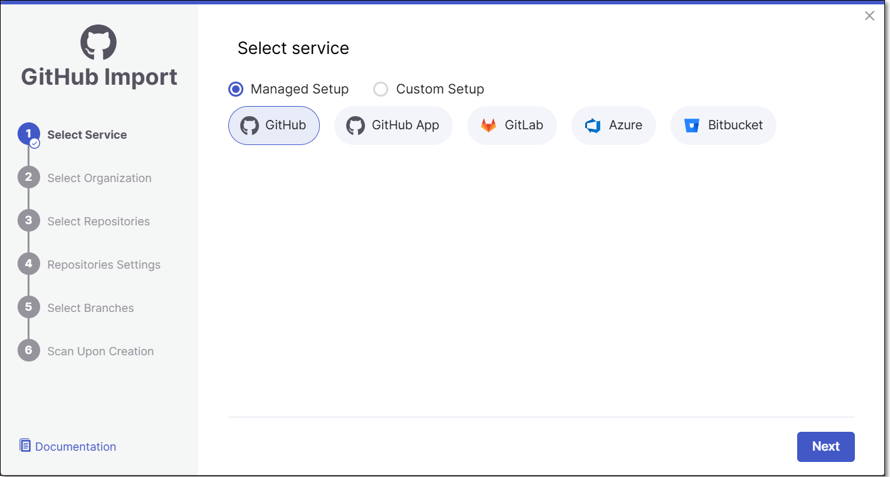

# GitHub Managed Setup

This article explains how to configure a GitHub integration using OAuth authentication (Managed Setup). GitHub also supports an alternative GitHub App-based integration method, see [documentation](github-apps-code-repository-integrations.md).

This flow uses pre-configured settings that enable you to authenticate with GitHub Managed Setup using your login credentials. This flow is available for multi tenant Checkmarx accounts using **GitHub Managed Setup** or **GitHub Enterprise Cloud**. We offer an alternative [Custom Setup flow](github-custom-setup.md) that involves submitting an OAuth Client ID and Secret. The Custom Setup flow must be used for:

- Checkmarx One single tenant accounts
- Repos hosted on **GitHub Server** or **GitHub Enterprise Server**
- Organizations that prefer to use a Client ID and Secret


Before you begin, make sure you have:

- Owner or admin permissions on the GitHub organization you want to connect
- Access to authorize OAuth applications for that organization (some GitHub orgs restrict this to owners)


## Setting up the Integration and Initiating a Scan

To integrate your **GitHub** organization with Checkmarx One, perform the following:

1. In the home page, click on **New > New Project - Code Repository Integration**.

   <figure><figcaption></figcaption></figure>

   The **Import From** window opens.
2. Select **Managed Setup >****GitHub >****Next**.

   <figure><figcaption></figcaption></figure>
3. For first-time use, click **Authorize checkmarx-ast**

   <figure><figcaption></figcaption></figure>

   Enter your authentication code to confirm access, and then click **Verify**.

   <figure><figcaption></figcaption></figure>
4. Select the **GitHub User/Organization or Group** (for the requested repository) and click **Select Organization**.

   The screen contains the following functionalities:

   - **Search** bar - Users need to type the *full* organization name (GitHub limitation). The search is not case sensitive.
   - **Infinite scroll** - For enterprises with a large amount of organizations.

   You can also decide whether to enable the "Monitor new repositories creation" feature.

   For more information about the feature see [Monitor New Repositories](monitor-new-repositories.md).

   
   In case you selected **GitHub User** skip step 5.
   

   <figure><figcaption></figcaption></figure>
5. **Select Repositories** inside the GitHub organization and click **Select Repositories**.

   If the organization contains active repositories, suggested repos will be presented and selected automatically. For additional information see [Suggested Repositories](suggested-repositories.md).

   
   - A separate Checkmarx One Project will be created for each repo that you import.
   - There can’t be more than one Checkmarx One Project per repo. Therefore, once a Project has been created for a repo, that repo is greyed out in the Import dialog.
   

   <figure><figcaption></figcaption></figure>
6. In the **Repositories Settings** step, you can optionally adjust the settings as follows:

   - If the project has multiple repositories, click **All Repositories Settings** to adjust the settings for all repositories, or select a specific repository, to adjust the settings for that repository.

     <figure><figcaption></figcaption></figure>
   - In the **Permissions** section, adjust the following settings:

     - **Scan Trigger: Push, Pull request** - Automatically trigger a scan when a push event or pull request is done in your SCM. (Default: On)
     - **Pull Request Decoration** - Automatically send the scan results summary to the SCM. (Default: On)
   - In the **Scan Type** section, enable the toggle for each scanner you want to use (**SAST, SCA, IaC Security, Container Security, API Security, OSSF Scorecard, Secret Detection, AI Supply Chain Security**) for your repositories. At least 1 scanner must be selected for each repository.

     - For the **SAST** scanner, you can enable **Incremental Scan**.
     - For the **SCA** scanner, you can enable **SCA Auto Pull Request**. This feature automatically sends PRs to your SCM with recommended changes in the manifest file, in order to replace the vulnerable package versions. (Default: Off)

     
     The scan and permission settings shown here depend on whether this is the first project connected from this organization:

     - **First connection to this organization** — all licensed scanners are enabled by default. The settings you choose here establish the organization-level defaults, with Allow Override enabled for each setting.
     - **Organization already connected** — The settings shown reflect the existing organization-level configuration. For each setting, Allow Override is enabled or disabled at the organization level:

       - **Enabled** - You can modify the setting for this project. Changes affect only this project and do not change the organization-level configuration.
       - **Disabled** - The setting is inherited from the organization-level configuration and cannot be modified for this project.

     See [Organization-Level Configuration for Code Repository Integrations](organization-level-configuration-for-code-repository-integrations.md) for details.
     
   - **Add SSH key** (when a specific repository is selected).
   - **Assign Groups:** Associate groups to the project.
   - **Assign Tags:** Add **Tags** to the Project. Tags can be added as a simple strings or as key:value pairs.
   - **Set Criticality Level:** Manually set the project's criticality level.
7. Click **Next**.
8. In the **Select Branches** step, specify the branches to be designated as protected branches.

   
   Specifying a branch as a **Protected Branch** affects three main areas: scan triggering (for PR and push), policy violation detection, and Feedback App notifications.
   

   You can also use a wildcard symbol "\*" to designate which branches are protected. The wildcard can be used before the string, after the string, or both. All branches that match the wildcard pattern will be treated as protected branches.

   
   **Examples**:

   - `*` → all branches
   - `release*` → branches that begin with "release"
   - `*release` → branches that end with "release"
   - `* release *` → branches that contain "release" anywhere in the name
   

   - **Tags** - For each protected branch, you can optionally assign **Tags**. When a scan is triggered for this branch (e.g., push or pull request), these tags will automatically be applied to the scan.

     Tags can be key:value pairs or simple values. For example, `env:prod` or `security`.
9. In the **Scan Upon Creation** step, you can decide whether to enable **Scan a branch upon creation of the project** feature.

   For each repository, select the protected branches you want to scan during project creation, and then click **Create Project**.

   
   If you specified a wildcard pattern in the previous step, it will not appear as an option on this list.
   

   <figure><figcaption></figcaption></figure>
10. A **Project** is created for each repository and a **scan is initiated** for each project. All projects created in this flow are associated with the same **organization** entity in Checkmarx One. The new projects are displayed on the Projects page,

    <figure><figcaption></figcaption></figure>


If a GitHub organization is renamed or moved, the existing connection becomes invalid. In such cases, the organization must be reimported to restore the integration.


## Editing Project Settings

In order to update settings for an individual code repository project, see Code Repository Project Settings. To update scanner and permission settings for all projects in an organization at once, see [Code Repository Settings](../../user-guide/configuring-account-settings/global-account-settings/code-repository-settings.md).
