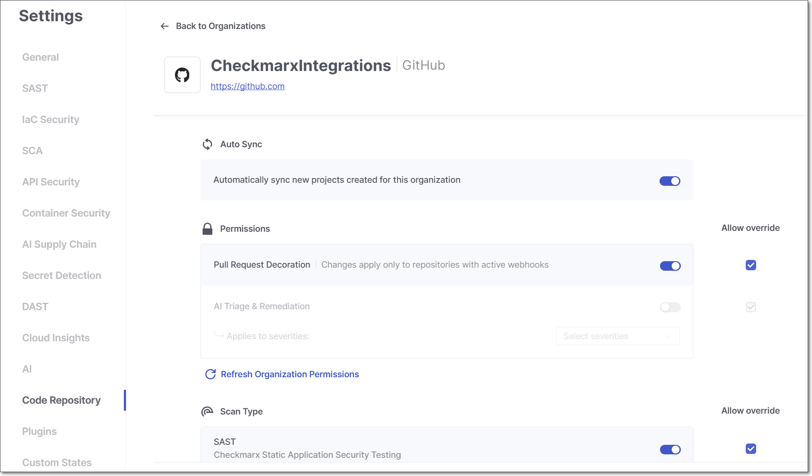

# Organization-Level Configuration for Code Repository Integrations

Organization-level configuration is a new capability for Code Repository Integration projects that allows account administrators to define scanner and integration settings at the SCM organization level. These settings are inherited by all projects within the organization, with administrators controlling whether individual projects can override them. This eliminates the need to configure each project independently and ensures consistent scanning policy across large repository environments.

## Workflow

1. Create a Code Repository Integration Project in the usual manner, specifying the scanners used and scan settings.
2. Instead of just applying the settings to each individual project (old functionality), a new entity is created in Checkmarx representing the Organization. The Organization settings are set based on the configuration applied upon creation. By default all settings are configured to allow override on the project level.
3. The organization settings are automatically applied to all new projects created for repos in that organization. This includes new projects created using the **New Project** flow, **Migration** from manual projects and automatically created projects via the **Monitor** feature.

   
   For New Project and Migration, the organization settings are shown as the default settings but can be overridden, unless they are specifically set to not allow override.
   
4. An administrator can adjust the organization settings at any time, including specifying whether or not specific settings can be overridden on the project level.

## Viewing and Editing Organization Settings

To view and adjust scan setting for an organization, navigate to **Global Settings** > **Settings** > **Code Repository** and go to the **Organizations** tab (which opens by default).

The **Organizations** tab shows all connected SCM organizations, filterable by SCM type (GitHub, GitHub App, GitLab, Azure, Bitbucket). Each organization entry displays a configuration summary showing its current sync, permissions, and scan type status. Clicking an organization opens its settings panel. This tab includes both organizations connected using the manual and custom setup flows


There is a separate **Custom Integrations** tab, which is used for adjusting the connection configuration but **not the scan settings** for custom integrations.


Click on a row to open the settings panel for that organization.

<figure><figcaption></figcaption></figure>

## Editing Organization Settings

The organization settings panel displays the name and SCM type of the selected organization and is divided into three sections: **Auto Sync**, **Permissions**, and **Scan Type**. You can adjust each of these settings for the organization.


Changes made to organization settings take effect only after clicking **Save**. Adjusting a toggle **does not** apply the change immediately.


### Allow or Block Override

When a new organization is created, the settings configured during the creation are applied to the organization entity in Checkmarx. By default, all settings are set to allow override on the project level. In the Organization settings, for each setting in the Permissions and Scan Type sections there is a checkbox to **Allow Override**. You can prevent override of a setting by deselecting the corresponding checkbox.

#### How Editing Organization Settings Effects Child Projects

- When a setting is edited (turned on or off) with **override allowed**

  - Existing projects - maintain their original configuration
  - New projects generated by Monitor feature - inherit edited organization settings
  - New projects generated by New Project flow or Migration - by default, organization settings are shown, but they can be adjusted by the user
- When a setting is edited (turned on or off) with **override blocked**

  - Existing projects - inherit edited organization settings

    
    If a setting is edited and block override is applied, and then later that setting is changed to allow override, the project will revert back to its original setting.
    
  - New projects generated by Monitor feature - inherit edited organization settings
  - New projects generated by New Project flow or Migration - inherit organization settings and the controls are greyed out indicating that they can't be adjusted.


Preventing overrides applies only to automatically triggered scans, e.g., pull request. However, if you manually trigger a scan of a project (via UI, CLI or API), you have complete autonomy to manually override these settings for that particular scan.


### Auto Sync

The **Auto Sync** section is available for supported SCM types (GitHub, GitHub Apps, and Azure DevOps). It contains a single toggle: **Automatically sync new projects created for this organization**. When enabled, Checkmarx "monitors" your SCM for new repositories, and when a new repo is added it is automatically onboarded as a Code Repository Integration project within this organization in Checkmarx One, with its settings copied from the organization-level configuration.

## Code Repository Configuration in Project Settings

The **Code Repository Configuration** section in **Project Settings** reflects the organization-level configuration defined for the project's connected organization. Settings behave as follows:

- Settings for which **Allow Override** is enabled at the organization level appear as editable toggles and can be changed at the project level.
- Settings for which **Allow Override** is not enabled appear as disabled toggles. Hovering over a disabled setting displays the tooltip: *"This setting is managed at the account level and cannot be modified at the project level."*
