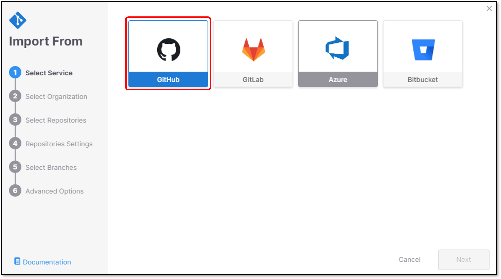
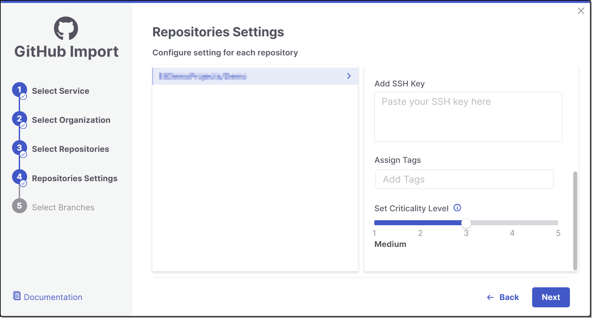
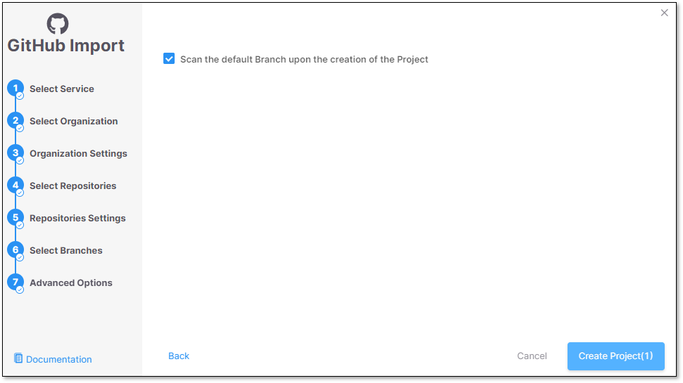
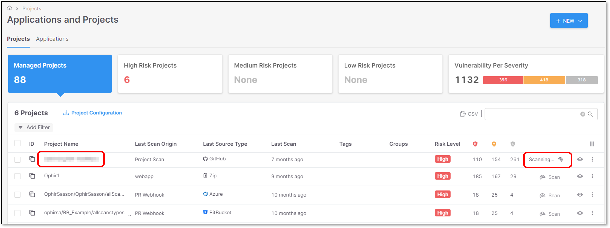

# Single Tenant Flow

Checkmarx One supports integration with GitHub, GitLab, Bitbucket & Azure DevOps in a **single tenant** environment, enabling automated scanning of your projects whenever the code is updated. Checkmarx One’s integration listens for the code repository commit events and uses a webhook to trigger Checkmarx scans when a push, or a pull request occurs. Once a scan is completed, the results can be viewed in Checkmarx One.

In addition, for pull requests, a comment is created in the code repository, which includes a scan summary, list of vulnerabilities and a link to view the scan results in Checkmarx One.

Single tenant environment integration supports **cloud based** code repositories as well as **self-hosted** ones. The integration flow is the same for both.


This integration supports both public and private git based repos.



You can select several repos to create multiple integrations in a bulk action.


## Prerequisites

- The source code for your project is hosted on of the supported code repositories.
- You have an Checkmarx One account and have credentials to log in to your account.

  
  Creating new import configurations or editing existing configurations requires `update-tenant-params` permission. Importing new Projects using an existing configuration requires `create-project` permission.
  
- The code repository user has **admin** privileges for this repository.
- You have your code repository Client ID & Client Secret.

  - **GitHub** - See [Retrieving GitHub Client ID & Client Secret](github-custom-setup.md#retrieving-github-client-id-client-secret).
  - **GitLab** - See .
  - **Bitbucket** - See [Retrieving Bitbucket Username & Token](bitbucket-custom-setup.md#retrieving-bitbucket-username-token).
  - **Azure DevOps** - See [Generate a PAT in Azure DevOps](azure-devops-custom-setup.md#generate-a-pat-in-azure-devops).

## Setting up the Integration and Initiating a Scan


The procedure below reflects **GitHub** integration.

To see all the code repositories Domain Names & API Domain Names see [Code Repository URLs](#code-repository-urls).


To integrate your code repository organization with Checkmarx One, perform the following:

1. In the Applications and Projects home page, click on **New > New Project - Code Repository Integration**.

   <figure><figcaption></figcaption></figure>

   The Import From window opens.
2. Select the code repository (For example: GitHub).

   <figure><figcaption></figcaption></figure>
3. Configure the following fields and click **Next**:

   - **Domain Name or IP Address** - Code repository domain.

     For example: https://github.com

     - **Domain Name:** Cloud based code repositories.
     - **IP Address:** Self-hosted code repositories.
   - **API Domain Name or IP Address** - Code repository API domain.

     For example: https://api.github.com

     - **API Domain:** Cloud based code repositories.
     - **IP Address:** Self-hosted code repositories.
   - **Client ID** - See Prerequisites for retrieving the relevant code repository Client ID.
   - **Client Secret** - See Prerequisites for retrieving the relevant code repository Client secret.

     <figure><figcaption></figcaption></figure>
4. Select the code repository **User/Organization or Group** (for the requested repository) and click **Select Organization**.

   <figure><figcaption></figcaption></figure>
5. In the **Organization Settings** screen you can decide whether to enable the "Monitor new repositories creation" feature.

   For more information about the feature see [Monitor New Repositories](monitor-new-repositories.md).

   <figure><figcaption></figcaption></figure>
6. Select the **Repository** inside the code repository organization and click **Next**.

   
   - A separate Checkmarx One Project will be created for each repo that you import.
   - There can’t be more than one Checkmarx One Project per repo. Therefore, once a Project has been created for a repo, that repo is greyed out in the Import dialog.
   

   <figure><figcaption></figcaption></figure>
7. In the **Repositories Settings** screen, perform the following and then click **Next**.

   <figure><figcaption></figcaption></figure>

   - **Permissions:**

     - **Scan Trigger: Push, Pull request** - Automatically trigger a scan when a push event or pull request is done in your SCM. (Default: On)
     - **Pull Request Decoration** - Automatically send the scan results summary to the SCM. (Default: On)
     - **SCA Auto Pull Request** - Automatically send PRs to your SCM with recommended changes in the manifest file, in order to replace the vulnerable package versions. (Default: Off)
   - **Scanners:** Select the scanners for **All/Specific** repositories. At lease 1 scanner must be selected for each repository.

     
     The scan and permission settings shown here depend on whether this is the first project connected from this organization:

     - **First connection to this organization** — all licensed scanners are enabled by default. The settings you choose here establish the organization-level defaults, with Allow Override enabled for each setting.
     - **Organization already connected** — The settings shown reflect the existing organization-level configuration. For each setting, Allow Override is enabled or disabled at the organization level:

       - **Enabled** - You can modify the setting for this project. Changes affect only this project and do not change the organization-level configuration.
       - **Disabled** - The setting is inherited from the organization-level configuration and cannot be modified for this project.

     See [Organization-Level Configuration for Code Repository Integrations](organization-level-configuration-for-code-repository-integrations.md) for details.
     
   - **Protected Branches:** Select which **Protected Branches** to scan for each repository.

     
     For additional information about **Protected Branches** see [About Protected Branches](https://docs.github.com/en/repositories/configuring-branches-and-merges-in-your-repository/defining-the-mergeability-of-pull-requests/about-protected-branches)
     
   - **Add SSH key**.
   - **Assign Groups:** Specify the **Groups** to which you would like to assign the project.
   - **Assign Tags:** Add **Tags** to the Project. Tags can be added as a simple strings or as key:value pairs.
   - **Set Criticality Level:** Manually set the project criticality level.

     <figure><figcaption></figcaption></figure>
8. Select which **Protected Branches** to scan for each Repository and click **Next**.

   
   For additional information about **Protected Branches** see [About Protected Branches](https://docs.github.com/en/repositories/configuring-branches-and-merges-in-your-repository/defining-the-mergeability-of-pull-requests/about-protected-branches)
   

   <figure><figcaption></figcaption></figure>
9. In the **Advanced Options** screen it is possible to select **Scanning the default branch upon the creation of the Project**.

   Click **Create Project**.

   <figure><figcaption></figcaption></figure>
10. A **Project** is created for each repository and a **scan is initiated** for each project. All projects created in this flow are associated with the same **organization** entity in Checkmarx One. The new projects are displayed on the Projects page,

    <figure><figcaption></figcaption></figure>

## Editing Project Settings

In order to update settings for an individual code repository project, see Code Repository Project Settings. To update scanner and permission settings for all projects in an organization at once, see Code Repository Settings.

## Code Repository URLs

The table below presents all the options for **URL** of the supported code repositories.

| Code Repository | URL |
|---|---|
| **GitHub Cloud** | https://github.com |
| **GitHub Self-hosted** | For example: https://github.example.com |
| **GitLab Cloud** | https://gitlab.com |
| **GitLab Self-hosted** | For example: https://gitlab.example.com |
| **Azure DevOps Cloud** | https://dev.azure.com |
| **Azure DevOps Self-hosted** | For example: https://azure.example.com |
| **Bitbucket Cloud** | Not supported |
| **Bitbucket Self-hosted** | For example: https://bitbucket.example.com |
