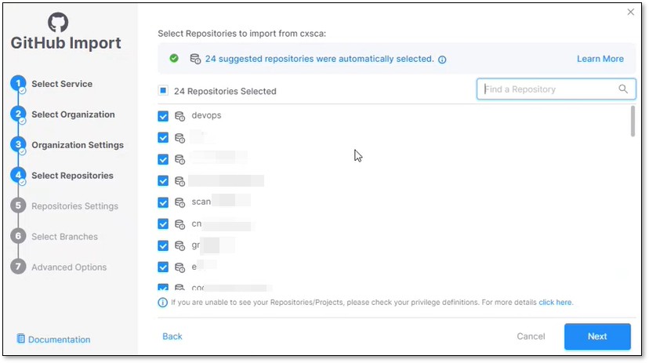

# Suggested Repositories

During the integration process with one of the supported code repositories, Checkmarx One provides a list of active repositories that are recommended for scanning. The list appears in the **Select Repositories** configuration screen.

The amount of the suggested repositories appear as an informational note at the top of the screen.

The suggested repositories are automatically selected by Checkmarx One, and they are marked with the icon.

The selected repositories can be de-selected by the user in this integration phase.

The repositories are calculated according to the repo's activity, taking in account parameters such as:

- The number of commits in the repo.
- The repo's accessibility (public/private repos).
- The number of contributors (developers that are contributing to the repo).
- The amount of lines of code in the repo.
- The number of languages used in the repo.


The suggested repositories calculation may take a few seconds.


For example:

<figure><figcaption></figcaption></figure>

## Limitations

- The feature is supported only for **GitHub** - Cloud based / Self-hosted.
- In some cases suggested repositories won't be presented (for example, if the organization contains repositories that are not active).
