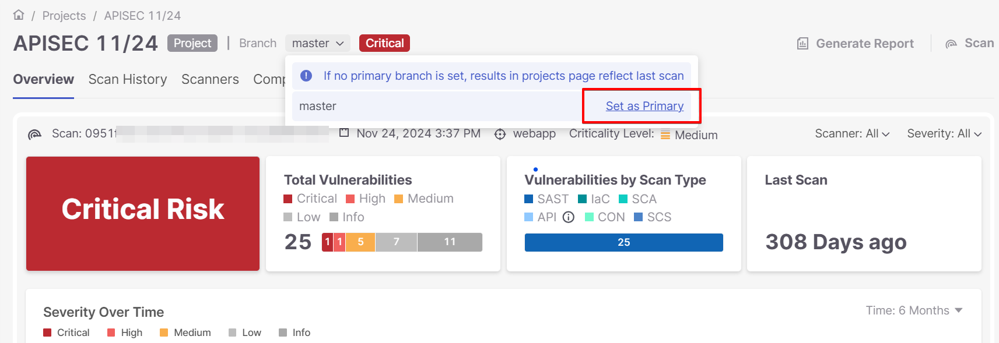

# Assigning a Feedback Profile to a Checkmarx Project - Repository path scans


In order to attach a Feedback App to a project you MUST set the default primary branch.

Until the primary branch will be set up Feedback Apps won't work.


Assigning a Feedback Profile to a Checkmarx Project in order to perform Repository path scans includes several steps.

## Setting the Default Primary Branch

To set the default Primary branch, perform the following steps:

1. Hover over the row of the relevant project and click the Overview icon ().

   The Project Overview is displayed.
2. In the **Overview** tab, open the **Branch** dropdown and click **Set as Primary**.

   

## Creating a New Feedback App

See [Creating a New Feedback App](slack.md#creating-a-new-feedback-app)

## Slack General Settings (Feedback App Example)

See Slack General Settings

## Slack Vulnerabilities Filters (Feedback App Example)

See Slack Vulnerabilities Filters

## Slack App Configuration (Feedback App Example)

See Slack App Configuration

## Creating a New Feedback Profile and Assigning Apps

See [Creating a New Feedback Profile](creating-a-new-feedback-profile.md)
