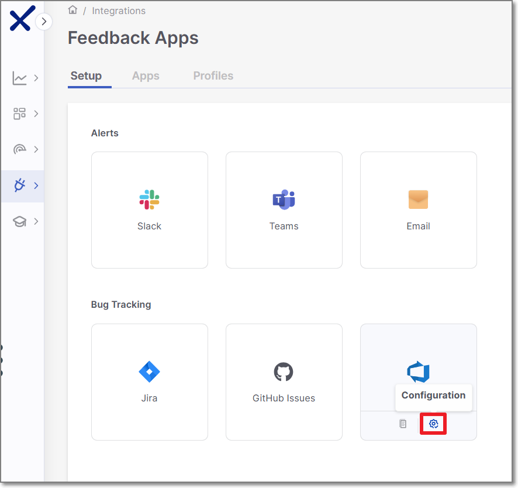
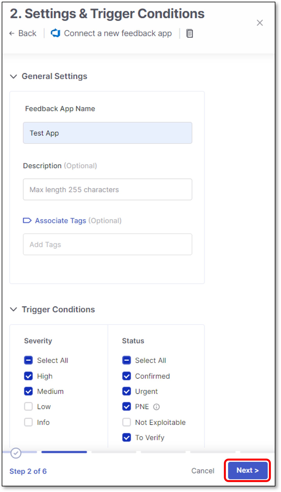
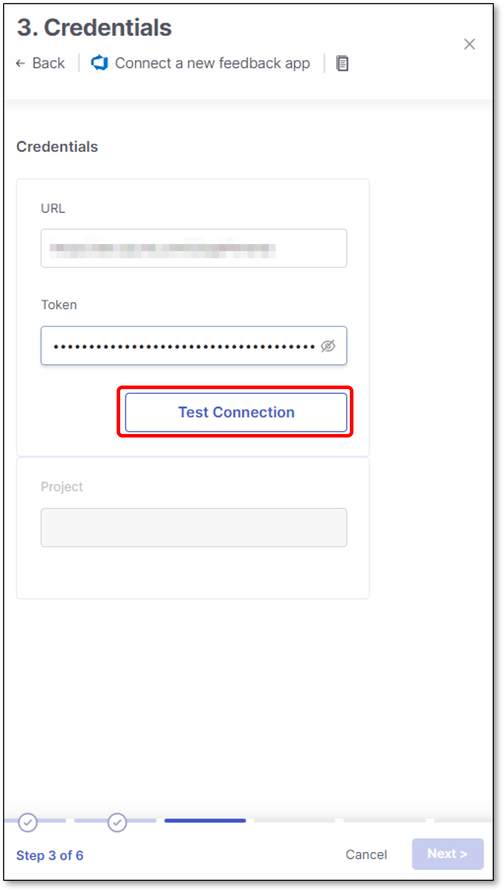
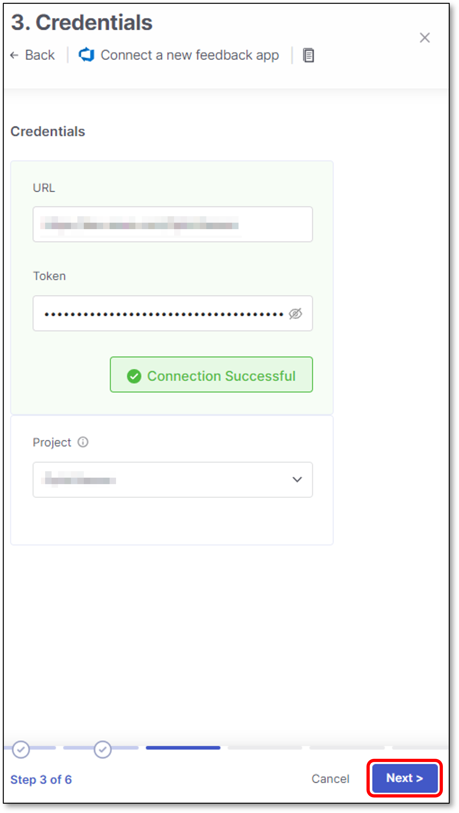
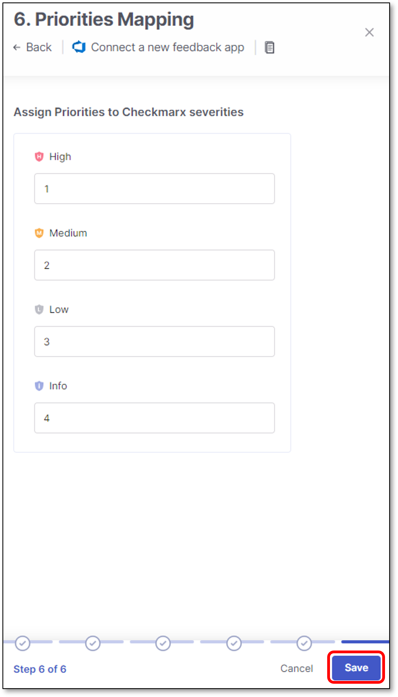
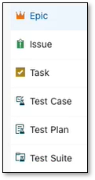
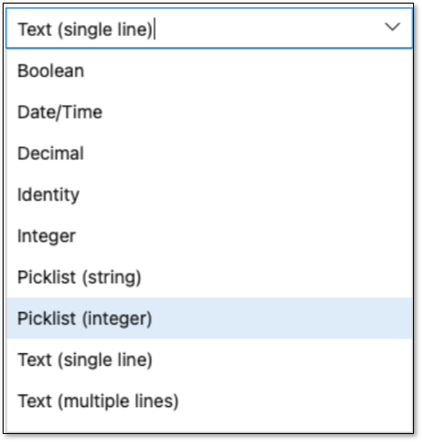
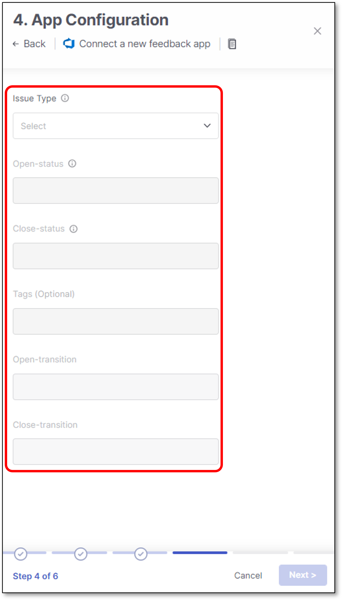
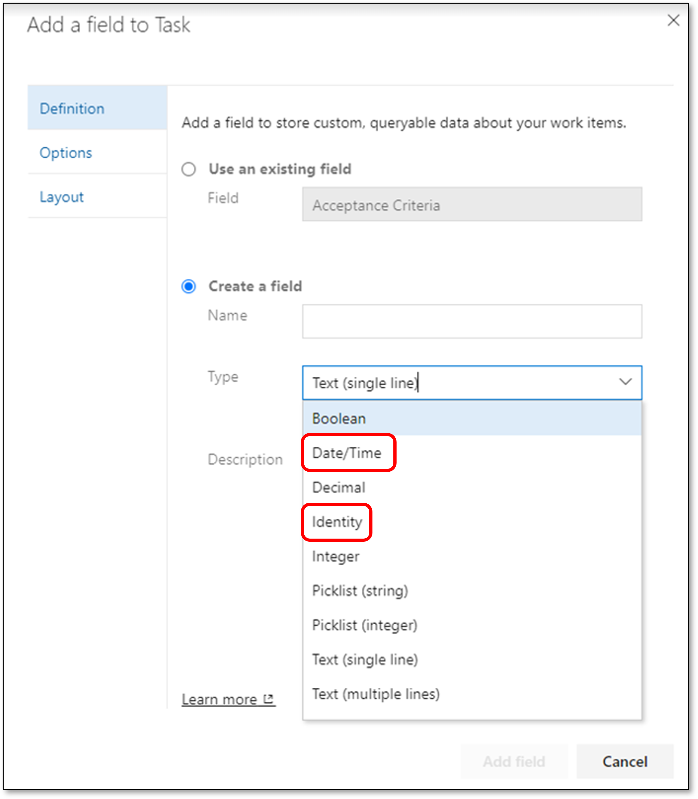
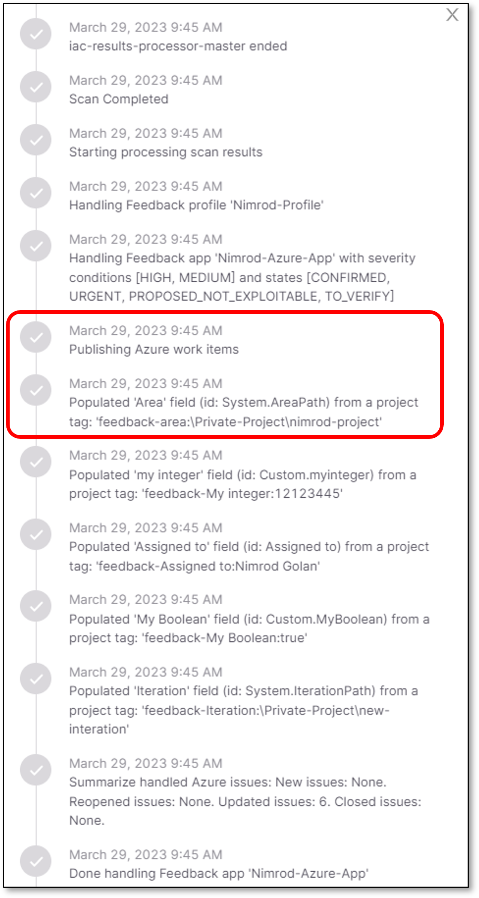

# Azure Boards

Azure Boards Service integration allows Checkmarx One users to automate the creation, modification, and closure of Azure work items for specific vulnerabilities detected in a scan.

Checkmarx One aggregates matching vulnerabilities during the work items creation process. As a result, the number of work items opened in the Azure service may not align with the number of detected vulnerabilities in Checkmarx One.

## Limitations

| **Limitation** | **Notes** |
|---|---|
| Maximum bug tracking tickets created per scanner is 2,000. If a scanner identifies more than 2,000 results (that fit the trigger conditions) in a scan, then the excess results won't have tickets created for them. | |

## Creating a New Feedback App

To create a new Azure Feedback App:

1. In the main navigation, select **Integrations** **> Feedback Apps**.
2. In the Feedback Apps window, hover over the **Azure** tile and click on the **Configuration** icon 

   <figure><figcaption></figcaption></figure>

   **Settings & Trigger Conditions** panel is opened in the right screen side.

Alternatively you can create a new Azure Feedback App by performing the following steps:

1. In the Feedback Apps window, select the **Apps** tab, and click on the **Create App** button.

   <figure><figcaption></figcaption></figure>
2. In the right side panel, select **Azure** and click **Next**.

## Settings & Trigger Conditions

Azure **Settings & Trigger Conditions** panel contains basic details for the new Feedback App in addition to its trigger conditions.

Configure the following:

1. **General Settings:**

   - **Feedback App Name**
   - **Description**
   - **Associate Tags** - Assign tags to a Feedback App. Tags are very useful for filtering purposes.
2. **Filters:**

   
   If you edit an existing Feedback App and remove a previously selected trigger condition, tickets that were created based on that trigger will be closed automatically.
   

   - **Severity** - The severity level of a vulnerability that triggers the Feedback App.
   - **State** - To decrease the number of issues created in Azure, specify also the state/s that will trigger Feedback App notifications. Possible states are: Confirmed, Urgent, Proposed Not Exploitable (PNE) or To Verify.

     
     The states mentioned above are pre-configured for all Checkmarx One accounts. In addition, you can create custom states in your account. Once they are created, you can assign those custom states to results. Custom states are currently supported for SAST, SCA, IaC Security and Container Security. This feature is only available for accounts that have the New Access Management (Phase 1) activated. For more info see Custom States.
     

     In conjunction with the severity, this makes the setting more precise.
   - **Scan Engines** - Select which scan engine results will be reflected through the Feedback App (By default, all the licensed scanners are enabled).

     If the SCA scanner is selected, there is an option to select the **Exploitable Path** checkbox so that only SCA vulnerabilities for which an Exploitable Path was identified will trigger a notification.

     
     For Container Security, notifications are sent on the image level rather than for individual vulnerabilities. As a result, the **Status** filter is ignored, and images that are **Muted** or **Snoozed** are automatically excluded. The **Severity** level is determined by the highest-severity vulnerability found in the image
     
3. Click **Next**

   <figure><figcaption></figcaption></figure>

## Credentials

**Credentials** panel contains all the Azure board connection details.

Configure the following:

1. **URL** - Azure URL must contain the organization.

   For example:

   https://dev.azure.com/\<organization>/

   https://\<organization>/visualstudio.com/
2. **Token** - Provide a Personal Access Token (PAT) for authenticating into Azure DevOps.

   For Microsoft instructions on creating a PAT, refer to this [link.](https://docs.microsoft.com/en-us/azure/devops/organizations/accounts/use-personal-access-tokens-to-authenticate?view=azure-devops&tabs=Windows)

   
   Minimum required permissions: Graph (Read), User Profile (Read), Project and Team (Read), Work Items (Read & Write)
   
3. Click **Test Connection**

   <figure><figcaption></figcaption></figure>
4. Once the connection to the Azure instance is successful, the **Project Key** field will be enabled.

   **Select the project key** - All the project keys are automatically fetched and presented in the drop-down list
5. Click **Next**

   <figure><figcaption></figcaption></figure>

## App Configuration

**Azure Configuration** panel contains all the Azure board details. In this screen users configure the filters for the the Bug Tracking service - in this case Azure.

Configure in the following fields:

1. **Issue Type** - The type of an issue that will be created in Azure Board when a Checkmarx scan detects a vulnerability with the severity and, optionally, status that are specified in the **Settings Trigger Conditions** panel > **Trigger Conditions** section.

   The issue type list is dynamic. All the Jira issue types are automatically fetched from the Jira instance and presented in the drop-down list.
2. **Open-status** - The Azure statuses that are treated as "Open." These can be "To Do," "In Progress," etc.
3. **Close-status** - The Azure statuses that are treated as "Closed." These can be "Done," "Resolved," etc.
4. **Tags** (Optional) - The tags are automatically assigned to an issue that the Feedback App creates in Azure Boards.
5. **Open-transition** - If a vulnerability that was already attended to reoccurs in a next scan, the corresponding ticket will be automatically reopened with this status.

   
   - Only 1 status can be configured.
   - Free text field - Must be exactly as it exists in Azure.
   - Any mistake in the Open-transition status characters will cause an error.
   
6. **Close-transition** - If a vulnerability that was already attended to reoccurs in a next scan, the corresponding ticket will be automatically reopened.

   When the issue is resolved, the reopened ticket will be closed with this status.

   
   - Only 1 status can be configured.
   - Free text field - Must be exactly as it exists in Azure.
   - Any mistake in the Close-transition status characters will cause an error.
   
7. Click **Next**

   <figure><figcaption></figcaption></figure>

## Additional Settings

Azure **Additional Settings** panel contains supported process type (The official name for custom fields in Azure), of which some/all may be required for opening Azure tickets.

For more information about Azure custom fields see [Free Form](#free-form)

Configure the following:

1. **Assigned to** (Optional) - Azure user.

   To find a user, start typing the user name and click on the magnifying glass.
2. **Area** (Optional) - Azure area path.
3. **Iteration** (Optional) - Azure Iteration path (also referred to as sprint).
4. Click **Next**

   <figure><figcaption></figcaption></figure>

### Resolution

Some Azure workflows require a resolution-related value when a work item is closed.

If a resolution is required and not provided, Azure may prevent the work item from closing.

This setting allows you to select a resolution value that will be **automatically applied when the Feedback App closes an Azure issue.**

- Available resolution values are fetched directly from Azure
- The selected value is applied during the **close transition only**

Use this option if your Azure project enforces a resolution field to ensure issues are closed successfully.

## Priorities Mapping

**Azure Priorities Mapping** is used for mapping Checkmarx One vulnerability severity to the corresponding Azure priority.

**Configure** a suitable **Azure priority** for each Checkmarx One vulnerability type and click **Save**


- To appear in this screen, the Checkmarx One severities need to be selected in the **Settings & Trigger Conditions** panel **> Trigger Conditions** section.
- Azure priorities are free text fields, and configured using 1-4 numbers.

For more information about Azure priorities see [Azure Priorities](https://learn.microsoft.com/en-us/azure/devops/boards/queries/planning-ranking-priorities?view=azure-devops#fields-used-to-plan-and-prioritize-work)


<figure><figcaption></figcaption></figure>

The new Feedback App will appear in the **Apps** tab of the **Feedback Apps** page.

<figure><figcaption></figcaption></figure>

Hovering over an existing Feedback App provides the options to **Edit** or **Delete** the Feedback App.

For example:

<figure><figcaption></figcaption></figure>

## Free Form

Azure free form feature enhances the support for opening Azure tickets.

This is being performed by allowing the user the option to set the relevant values for Azure processes field types, of which some/all may be required for opening Azure tickets.

The feature supports all the default Azure processes in addition to the custom created ones.

The supported processes types are: **Epic, Issue, Task, Test Case, Test Plan, Test Suite, Custom processes**.

<figure><figcaption></figcaption></figure>

The feature also improves the user experience by allowing additional field types to be configured, mandatory or not.

These field types appear in Azure processes settings, and they are defined per process (Epic, Issue, Task, etc.)

<figure><figcaption></figcaption></figure>

Checkmarx One support the following out of the box Azure custom fields:

- **Boolean**
- **Date/Time**
- **Decimal**
- **Identity**
- **Integer**
- **Picklist (string)**
- **Picklist (Integer)**
- **Text (single line)**
- **Text (multiple lines)**

## Fields Override

In large enterprises, different users often have different configurations for the same Azure board where they publish their Azure tickets.

Azure fields override feature adds flexibility to Azure feedback apps configuration.

Users can override any system / custom Azure field value by using tags with a specific naming convention.

Checkmarx One supports mandatory / optional fields.

The classic use-case for using this feature is when 2 users need to publish Azure tickets to the same Azure board, but each user has a different Azure board configuration, containing different fields values.

For example:

User1 and User2 publish Azure tickets to the same Azure board, but each user publish the tickets using his own **Assigned to** field value.

Prior to the feature, users needed to create 2 Azure apps - one for each user. Now they can use the same Azure feedback app, but to replace the **Assigned to** field value accordingly.

### Tags Naming Convention

Users can override Azure system / custom field value by using the following tags naming convention:

**feedback-\<key:value>**


- **feedback**: Represent feedback app tags.
- **key**: Represent the relevant Azure field.
- **value**: Represent the relevant Azure field value.


### Tags Hierarchy

Azure fields override feature is supported using the user interface and the CLI.

It is also is supported in 2 configuration levels:

- **Project** level - For additional information on how to configure project tags see:

  General Settings (User interface)

  project tags (CLI)
- **Scan** level - For additional information on how to configure scan level tags see:

  Running a Scan (User interface)

  scan tags (CLI)

  
  **Scan level takes priority over project level**
  

### Limitations

There are several limitations for the feature:

- The following **system fields** are not supported for override:

  - Title
  - Description
  - Priority
  - Issue-type
  - Open-status
  - Close-status
  - Tags
  - Open-transition
  - Close-transition

    <figure><figcaption></figcaption></figure>
- The following **custom fields** are not supported for override:

  - Data/Time
  - Identity

    <figure><figcaption></figcaption></figure>
- In order to set a custom tag to override, you must use the prefix "**feedback-**" which is case sensitive (lower case).
- Tags without the "**feedback-**" prefix won't be taken into account.
- Tags need to be in the format of "feedback-\<key:value>". key & value are not case sensitive.
- The ":" sign should be used as a separator only when configuring \<key:value>. No key or value should contain the ":" sign.
- Tags with spelling mistakes, tags that don't exist and tags that aren't supported will be ignored.
- In order to override the **Assigned to** field:

  - **Azure cloud** - Configure the **display name** (the value is not case sensitive).

    For example: feedback-Assigned to:john doe
- Multiple select fields are not supported.
- For overriding **Area** and **Iteration** fields you need to use the ‘\\’ sign

  Examples:

  feedback-Iteration Path:\\Private-Project\\Sprint 1

  feedback-Iteration Path:\\Private-Project\\new-iteration

  feedback-Area Path:\\Private-Project\\nimrod-project

### Tags Override Verification

All the actions and override attempts can be found in the scan log.

To open the scan log, perform the following:

1. When the scan is finished, click on the scan line in the Applications and Projects home page.

   A panel will be opened on the right screen side.
2. Click on the relevant scanner **ellipses  > More Details**

   <figure><figcaption></figcaption></figure>
3. Scroll down to see the feedback app tag override

   <figure><figcaption></figcaption></figure>
