# Jira

Jira Service integration allows Checkmarx One users to automate the creation, modification, and closure of Jira issues for specific vulnerabilities detected in a scan.

Checkmarx One aggregates matching vulnerabilities during the issues creation process. As a result, the number of issues opened in the Jira service may not align with the number of detected vulnerabilities in Checkmarx One.

The lowest Jira permission level required to create Jira issues (Bug, Task, Story, etc.) includes **Browse projects** and **Create issues** project permissions. For additional information refer to [Create Issues](https://developer.atlassian.com/cloud/jira/platform/rest/v2/api-group-issues/#api-rest-api-2-issue-post) and [Manage project permissions](https://support.atlassian.com/jira-cloud-administration/docs/manage-project-permissions/).

## Jira Authentication

Checkmarx One supports both Jira cloud and Jira on-prem integrations.


For Jira **on-prem** integration It is possible to add the Checkmarx One external IP addresses to the customer Firewall allowlist - For more information see [Managing Checkmarx One Traffic and AWS S3 Access](../managing-checkmarx-one-traffic-and-aws-s3-access.md)


Jira authentication is performed according to the following table:

| **Jira Version** | **Authentication Method** |
|---|---|
| Jira cloud | Username + API Token |
| Jira Core 8.14 and later (on-prem) | Username + Token |
| Jira Software 8.14 and later (on-prem) | Personal Access Token |
| Jira Service Management 4.15 and later (on-prem) | Username + Token |
| Jira on-prem lower than the above versions | Username + Password |

## Jira Limitations

The below table presents Jira limitations

| **Limitation** | **Notes** |
|---|---|
| Need to add project id and not name | **Update planned** |
| Can’t add a label-prefix | **Update planned** |
| Can’t change JIRA title in JIRA | |
| Can’t customize summary format | **Not planned** |
| Checkmarx One doesn't support all the Jira field types | For the list of supported field see [Free Form](#free-form) |
| Labels system field is mandatory for Checkmarx One to publish Jira tickets | For more information see [App Configuration](#app-configuration) |
| Maximum bug tracking tickets created per scanner is 2,000. If a scanner identifies more than 2,000 results (that fit the trigger conditions) in a scan, then the excess results won't have tickets created for them. | |

## Creating a New Feedback App

To create a new Jira Feedback App:

1. In the main navigation, select **Integrations** **> Feedback Apps**.
2. In the Feedback Apps window, hover over the **Jira** tile and click on the **Configuration** icon 

   <figure>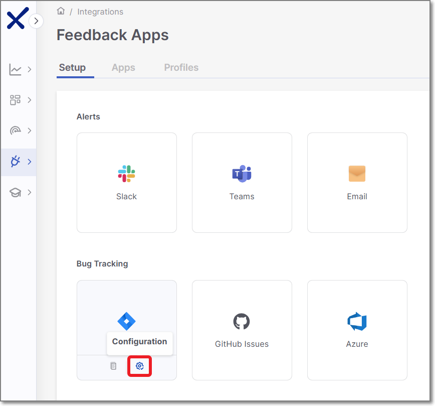<figcaption></figcaption></figure>

   **Settings and Trigger Conditions** panel is opened in the right screen side.

Alternatively you can create a new Jira Feedback App by performing the following steps:

1. In the Feedback Apps window, select the **Apps** tab, and click on the **Create App** button.

   <figure><figcaption></figcaption></figure>
2. In the right side panel, select **Jira** and click **Next**.

## Settings & Trigger Conditions

Jira **Settings & Trigger Conditions** panel contains basic details for the new Feedback App in addition to its trigger conditions.

Configure the following:

1. **General Settings**:

   - **Feedback App Name**
   - **Description**
   - **Associate Tags** - Assign tags to a Feedback App. Tags are very useful for filtering purposes.
2. **Filters**:

   
   If you edit an existing Feedback App and remove a previously selected trigger condition, tickets that were created based on that trigger will be closed automatically.
   

   - **Severity** - The severity level of a vulnerability that triggers the Feedback App.
   - **State** - To decrease the number of issues created in Jira, specify also the state/s that will trigger Feedback App notifications. Possible states are: Confirmed, Urgent, Proposed Not Exploitable (PNE) or To Verify.

     
     The states mentioned above are pre-configured for all Checkmarx One accounts. In addition, you can create custom states in your account. Once they are created, you can assign those custom states to results. Custom states are currently supported for SAST, SCA, IaC Security and Container Security. This feature is only available for accounts that have the New Access Management (Phase 1) activated. For more info see Custom States.
     

     In conjunction with the severity, this makes the setting more precise.
   - **Scan Engines** - Select which scan engine results will be reflected through the Feedback App (By default, all the licensed scanners are enabled).

     If the SCA scanner is selected, there is an option to select the **Exploitable Path** checkbox so that only SCA vulnerabilities for which an Exploitable Path was identified will trigger a notification.

     
     For Container Security, notifications are sent on the image level rather than for individual vulnerabilities. As a result, the **Status** filter is ignored, and images that are **Muted** or **Snoozed** are automatically excluded. The **Severity**level is determined by the highest-severity vulnerability found in the image
     
3. **Direct Path** (Optional) - Set up the folder path and/or specify the file name/extension for a specific project. This setup will explicitly define the folder path and/or file name/extension for opening Jira tickets. If you populate this field, Jira tickets will only be created for matching files or files in matching folders.

   - Type the required value and press **Enter** to store it.
   - "**\*\***" characters are supported for folder paths and files.
   - Folders/files examples: test/\*\*/, \*\*.java, test.java
4. Click **Next**

   <figure><figcaption></figcaption></figure>

## Credentials

Jira **Credentials** panel contains all the Jira board connection details.

The details include the following:

- **Authorization Type** - Select how to authenticate to the Jira board.
- **Credentials** - Configure the URL, Username and Token.
- **Project Key** - The Jira project key used to associate feedback with the correct project. This value is automatically fetched and shown in the drop-down list. Once set, it cannot be changed for the Feedback App.

API Token Flow

API Token flow is mainly used for cloud-hosted Jira instances, although it could be used for several self-hosted Jira versions.


This integration only supports use of **Unscoped Tokens** (not Scoped Tokens). Since service users can only use scoped tokens, this causes a limitatation that you must use a regular user account to generate this API Token.


For additional information see See [Jira Authentication](#jira-authentication)

1. **Authorization Type**:

   - Select **API Token** (By default, this option is selected).

   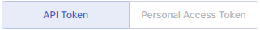
2. **Credentials**:

   - **URL** - Configure Jira main URL.

     
     Alternatively, if you have configured a CxLink to access your self-hosted Jira instance, enter the CxLink (using the following format: https://\<subdomain>.\<domain>/link/\<UUID>). Learn more about CxLink here.
     
   - **Username** - Configure Jira username.
   - **Token** - Configure Jira token.
   - Click **Test Connection**

   <figure>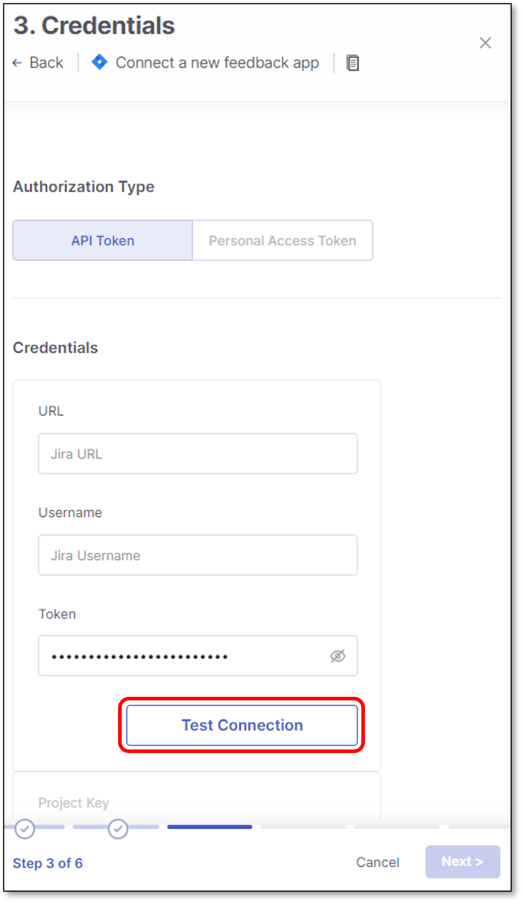<figcaption></figcaption></figure>
3. Once the connection to the Jira instance is successful, the **Project Key** field will be enabled.

   **Select the project key** - All the project keys are automatically fetched and presented in the drop-down list.
4. Click **Next**

   <figure><figcaption></figcaption></figure>

Personal Access Token Flow

Personal Access Token flow is used for self-hosted Jira instances.

For additional information see See [Jira Authentication](#jira-authentication)

1. **Authorization Type**:

   - Select **Personal Access Token**

   
2. **Credentials**:

   - **URL** - Configure Jira self-hosted main URL.

     
     Alternatively, if you have configured a CxLink to access your self-hosted Jira instance, enter the CxLink (using the following format: https://\<subdomain>.\<domain>/link/\<UUID>). Learn more about CxLink here.
     
   - **Token / Password** - Configure Jira token / password (Depending on the Jira self-hosted version).
   - Click **Test Connection**

     
     If the connection is unsuccessful, see [Troubleshooting Jira Connection Issues](#troubleshooting-jira-connection-issues) below.
     

   <figure>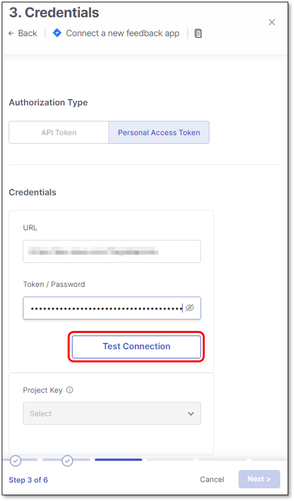<figcaption></figcaption></figure>
3. Once the connection to the Jira instance is successful, the **Project Key** field will be enabled.

   **Select the project key** - All the project keys are automatically fetched and presented in the drop-down list.
4. Click **Next**

   <figure><figcaption></figcaption></figure>

### Troubleshooting Jira Connection Issues

"Unsuccessful Connection" with a self-hosted Jira using Personal Access Token

If you're connecting to a self-hosted (on-prem) Jira instance using a Personal Access Token, and Checkmarx One reports **Unsuccesful Connection** even though your token is valid, this may be caused by your organization's single sign-on (SSO) setup blocking the connection — not by a problem with the token itself.

Groundcover log shows - `'Caused by: io.grpc.StatusRuntimeException: INTERNAL: Jira Authentication failure'`

***Why this happens***

Many organizations protect self-hosted Jira with an identity provider (such as Microsoft Entra ID or Okta) using Conditional Access or similar network-based policies. These policies are designed to secure interactive user logins, but they can also intercept automated, server-to-server requests like the one Checkmarx One makes when testing the connection — redirecting it to a sign-on page instead of letting it reach Jira directly. Since Checkmarx One can't complete an interactive sign-on, the connection test fails.

***How to resolve it***

Try one of the following, in coordination with your IT or security team:

1. **Allow Checkmarx One's traffic through your SSO/network policy.**

   Ask your identity or network administrator to create an exception in your Conditional Access (or equivalent SSO enforcement) policy for Checkmarx One's traffic, so it isn't redirected to an interactive sign-on page. This can be scoped narrowly to Checkmarx One's traffic so SSO enforcement stays in place for all other users.
2. **Connect using a CxLink tunnel instead of a direct URL.**

   If you have a CxLink tunnel set up for your self-hosted Jira instance, use the CxLink URL `` `https://{subdomain}.{domain}/link/{UUID}` `` in the URL field instead of your Jira instance's direct address. Connecting through the tunnel can avoid the SSO redirect, since the request arrives through a path your organization already trusts.

## App Configuration

**App Configuration** panel contains all the Jira board details. In this panel users configure the filters for the Bug Tracking service - in this case Jira.


- There are cases where a specific issue type (Bug, Task, Story, etc.) contains mandatory fields that are not supported by Checkmarx One. The fields can be either **system** or **custom** fields. In such cases a dedicated message will be presented. Hovering over the link will present the relevant field.

  For example:

  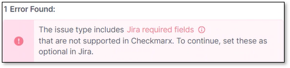
- It is also possible that **Labels** system field is missing from the Jira configuration. In such cases, a dedicated message will be presented as well.

  For example:

  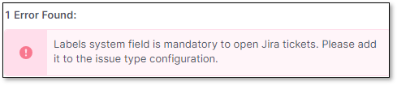


Configure in the following fields:

1. **Issue Type** - The type of an issue that will be created in Jira Board when a Checkmarx scan detects a vulnerability with the severity and, optionally, status that are specified in the **Settings Trigger Conditions** panel > **Trigger Conditions** section.

   The issue type list is dynamic. All the Jira issue types are automatically fetched from the Jira instance and presented in the drop-down list.
2. **Labels** (Optional) - Configure which Jira **system labels** will be assigned to the published Jira tickets.

   
   Jira system labels are mandatory for Checkmarx One to publish Jira tickets.

   In case that labels field will be removed from any Jira issue type configuration, Checkmarx One won't be able to publish Jira tickets of this issue type.
   

   
   Any label that will be added to Checkmarx One Labels field will be included in the published Jira tickets.
   
3. **Open-transition** - If a vulnerability that was already attended to reoccurs in a next scan, the corresponding ticket will be automatically reopened with this status.

   
   - For Jira Cloud and Jira on-prem, if the user has the correct permissions, all the Jira open statuses are automatically fetched and presented in the drop-down list. If the user doesn't have the correct permissions, the field changes to free-form text. Any mistake in the status name will lead to an error when opening Jira tickets.

     For Jira cloud, see required permissions [here](https://developer.atlassian.com/cloud/jira/platform/rest/v2/api-group-workflows/#api-rest-api-2-workflows-post)

     For Jira on-prem, see the required "permission to administer Jira" [here](https://docs.atlassian.com/software/jira/docs/api/REST/9.2.0/#api/2/project/%7BprojectKeyOrId%7D/workflowscheme-getWorkflowSchemeForProject)
   - Only 1 status can be configured.
   
4. **Close-transition** - If a vulnerability that was already attended to reoccurs in a next scan, the corresponding ticket will be automatically reopened.

   When the issue is resolved, the reopened ticket will be closed with this status.

   
   - For Jira Cloud and Jira on-prem, if the user has the correct permissions, all the Jira close statuses are automatically fetched and presented in the drop-down list. If the user doesn't have the correct permissions, the field changes to free-form text. Any mistake in the status name will lead to an error when opening Jira tickets.

     For Jira cloud, see required permissions [here](https://developer.atlassian.com/cloud/jira/platform/rest/v2/api-group-workflows/#api-rest-api-2-workflows-post)

     For Jira on-prem, see the required "permission to administer Jira" [here](https://docs.atlassian.com/software/jira/docs/api/REST/9.2.0/#api/2/project/%7BprojectKeyOrId%7D/workflowscheme-getWorkflowSchemeForProject)
   - Only 1 status can be configured.
   
5. **Due-date** (Optional) - What is the due date for the Jira tickets that will be opened.
6. Click **Next**

   <figure><figcaption></figcaption></figure>

## Additional Settings

The **Additional Settings** section allows you to configure Jira issue fields that may be required by your Jira workflows.

These fields are automatically fetched from Jira and presented as selectable options during app configuration. Some Jira projects enforce mandatory fields for creating or closing issues. Configuring these fields ensures that the Feedback App can successfully create and transition Jira issues without errors.

Select the required field values and click **Next** to continue.


For information about Jira **custom** fields, see [Free Form](#free-form)


### Resolution

Some Jira workflows require a **Resolution** value when an issue is closed.

If a Resolution is required and not provided, Jira may prevent the issue from closing.

This setting allows you to select a Resolution value that will be **automatically applied when the Feedback App closes a Jira issue.**

- Available resolution values are fetched directly from Jira
- The selected value is applied during the **close transition only**

Use this option if your Jira project enforces a Resolution field to ensure issues are closed successfully.

## Priorities Mapping

**Jira Priorities Mapping** is used for mapping Checkmarx One vulnerabilities severities to the corresponding Jira priorities.

**Configure** a suitable **Jira priority** for each Checkmarx One vulnerability type and click **Save**.


- To appear in this screen, the Checkmarx One severities need to be selected in the **Settings & Trigger Conditions** panel **> Trigger Conditions** section.


<figure>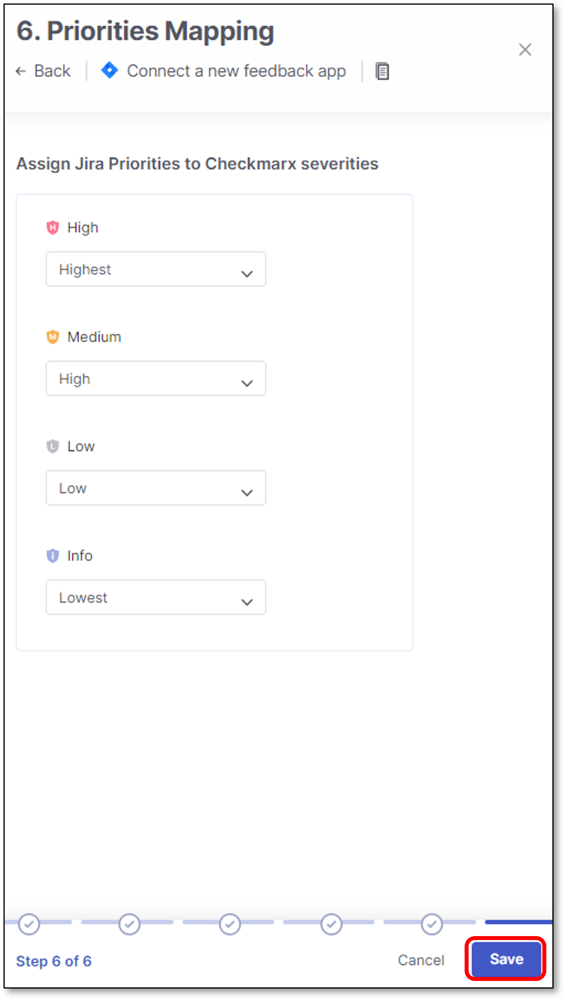<figcaption></figcaption></figure>

The new Feedback App will appear in the **Apps** tab of the **Feedback Apps** page.

<figure>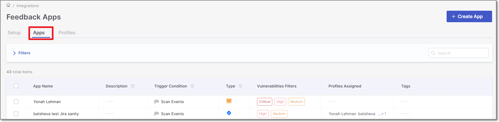<figcaption></figcaption></figure>

Hovering over an existing Feedback App provides the options to **Edit** or **Delete** the Feedback App.

For example:

<figure><figcaption></figcaption></figure>

## Free Form

Jira free form feature enhances the support for opening Jira tickets.

This is being performed by allowing the user the option to set the relevant values for Jira custom fields, of which some/all may be required for opening Jira tickets.

The feature also improves the user experience by allowing additional field types to be configured, mandatory or not.

These field types appear in Jira project settings on the right side, and they are defined per issue type (Bug, Task, Story, etc.)

<figure><figcaption></figcaption></figure>

Checkmarx One support the following out of the box Jira *custom* fields:

- **Short text**
- **Paragraph**
- **Date**
- **Number**
- **Time stamp**
- **Labels**
- **Dropdown**
- **Checkbox**
- **Cascading select**

Checkmarx One also supports the following Jira *advanced custom* fields:

- **Version Picker** (single version)

### Limitations

- Only a Jira user with **Create issues** project permission user role will be able to see the custom fields.

  For additional information about Jira permissions see [Create issues in Jira](https://developer.atlassian.com/cloud/jira/platform/rest/v2/api-group-issues/#api-rest-api-2-issue-createmeta-get) and [Jira operation permissions](https://developer.atlassian.com/cloud/jira/platform/rest/v2/intro/#permissions)
- **Predefined fields** that are created using **Jira plugins** are not supported. This means that it might be that some required Jira fields won't appear in the additional issue fields options.

## Fields Override

In large enterprises, different users often have different configurations for the same Jira board where they publish their Jira tickets.

Jira fields override feature adds flexibility to Jira feedback apps configuration.

Users can override any system / custom Jira field value by using tags with a specific naming convention.

Checkmarx One supports mandatory / optional fields.

The classic use-case for using this feature is when 2 users need to publish Jira tickets to the same Jira board, but each user has a different Jira board configuration, containing different fields values.

For example:

User1 and User2 publish Jira tickets to the same Jira board, but each user publish the tickets using his own **Assignee** field value.

Prior to the feature, users needed to create 2 Jira apps - one for each user. Now they can use the same Jira feedback app, but to replace the **Assignee** field value accordingly.

### Tags Naming Convention

Users can override Jira system / custom field value by using the following tags naming convention:

**feedback-\<key:value>**


- **feedback**: Represent feedback app tags.
- **key**: Represent the relevant Jira field.
- **value**: Represent the relevant Jira field value.


### Tags Hierarchy

Jira fields override feature is supported using the user interface and the CLI.

It is also is supported in 2 configuration levels:

- **Project** level - For additional information on how to configure project tags see:

  General Settings (User interface)

  project tags (CLI)
- **Scan** level - For additional information on how to configure scan level tags see:

  Running a Scan (User interface)

  scan tags (CLI)

  
  **Scan level takes priority over project level**
  

### Limitations

There are several limitations for the feature:

- The following system fields are not supported for override:

  - Issue-type
  - Labels
  - Open-transition
  - Close-transition

    <figure>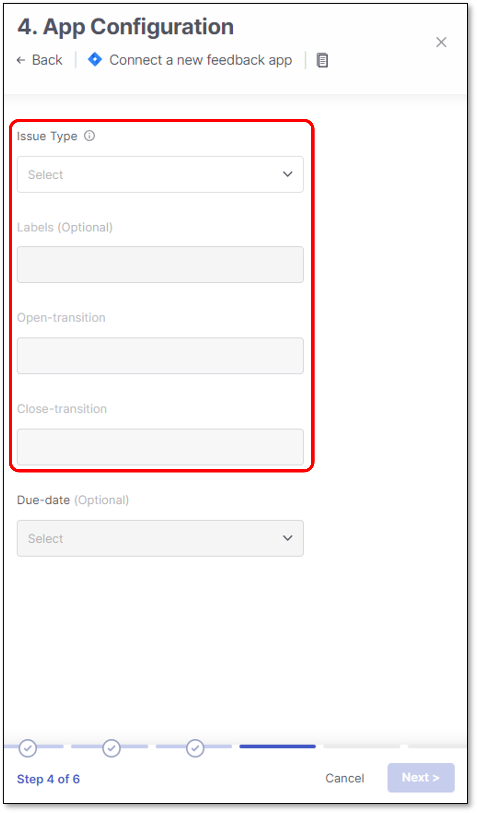<figcaption></figcaption></figure>
- In order to set a custom tag to override, you must use the prefix "**feedback-**" which is case sensitive (lower case).
- Tags without the "**feedback-**" prefix won't be taken into account.
- Tags need to be in the format of "feedback-\<key:value>". key & value are not case sensitive.
- The **":"** sign should be used as a separator only when configuring \<key:value>. No key or value should contain the ":" sign.
- Tags with **spelling mistakes/Don't exists/not supported** will be ignored.
- In order to override the **Assignee** field:

  - **Jira cloud** - Configure the **display name** (the value is not case sensitive).

    For example: feedback-Assignee:john doe
  - **Jira On-Prem** - Configure the **username** (not email)

    For example: feedback-Assignee:john.doe
- Multiple select fields are not supported.
- **date picker** (without timeline) is supported in the format of **'yyyy-MM-dd'**

  For example: '2023-02-20'
- It is not possible to override a field if a Jira **issue-type** has another field with the same name (Jira allows it).
- In case that the **same field** is configured in several places, the below should be the override hierarchy:

  - scan_tags - First priority.
  - project_tags - Second priority.
  - feedback-app tags - Third priority.
- It is possible to override fields even if they are not set & saved in the Jira application in Checkmarx One, as long as they are Jira valid fields.

### Tags Override Verification

All the actions and override attempts can be found in the scan log.

To open the scan log, perform the following:

1. When the scan is finished, click on the scan line in the Applications and Projects home page.

   A panel will be opened on the right screen side.
2. Click on the relevant scanner **ellipses**  **> More Details**

   <figure>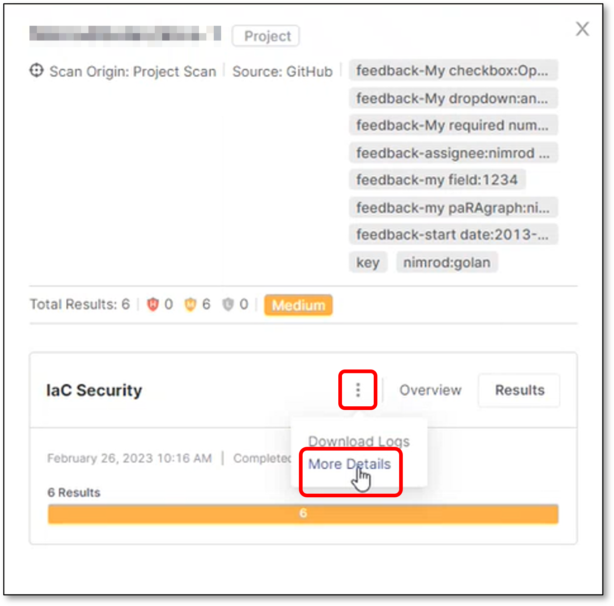<figcaption></figcaption></figure>
3. Scroll down to see the feedback app tag override

   <figure>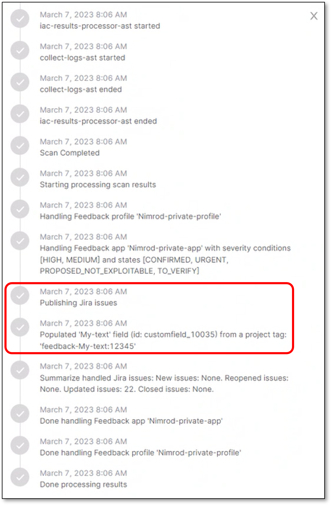<figcaption></figcaption></figure>
