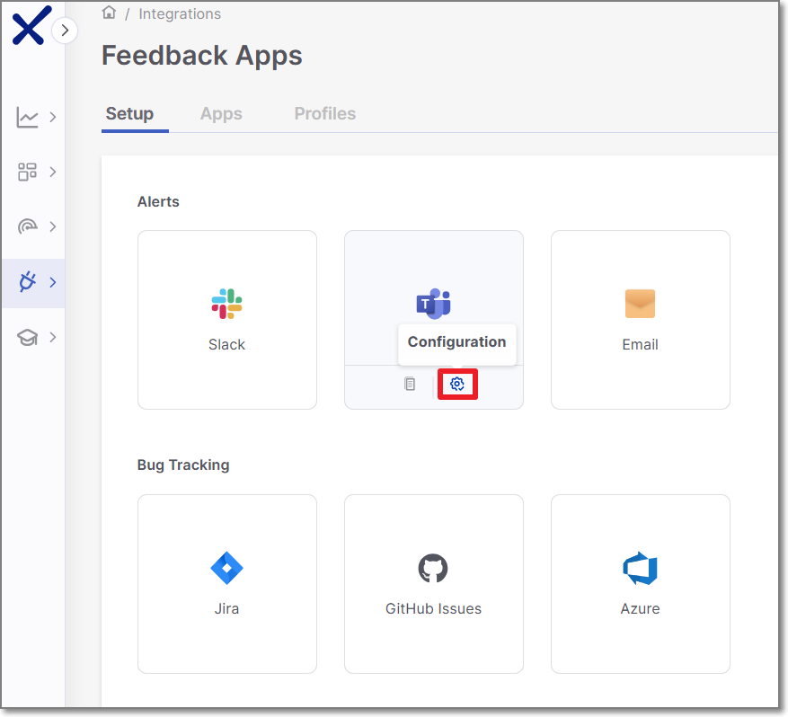
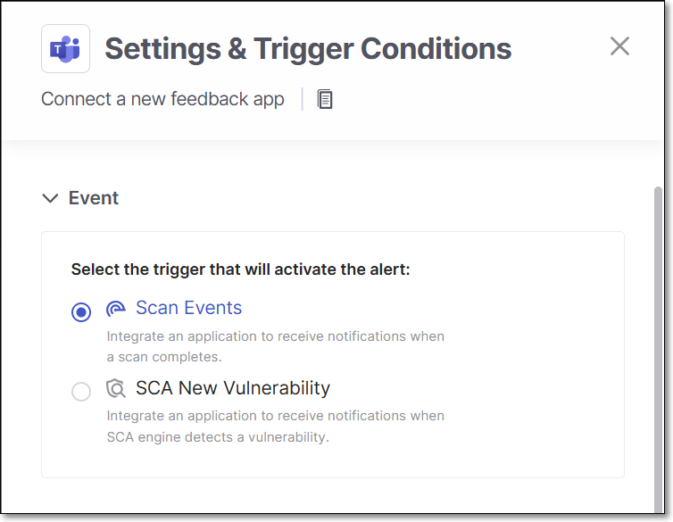
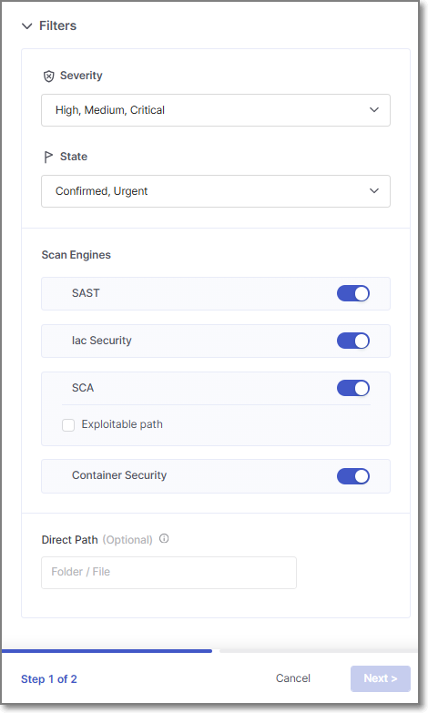
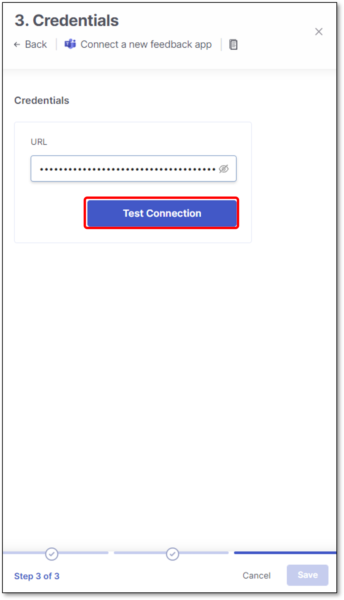
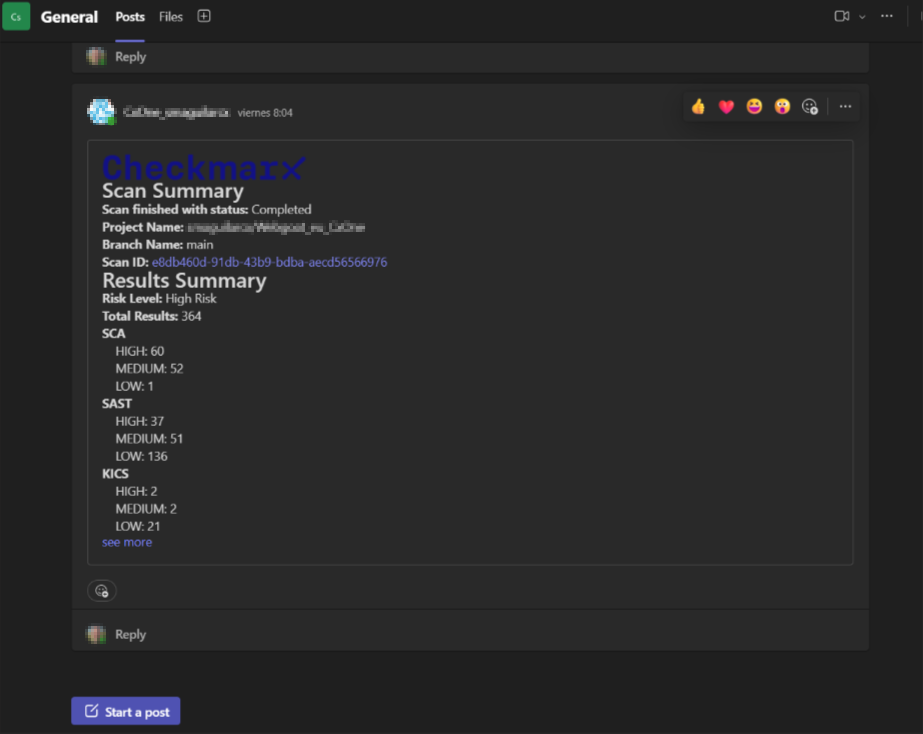

# Microsoft Teams

Microsoft Teams Service integration enables Checkmarx One users to notify other team members about completed scans by sending a scan summary report to the corresponding Teams channel.

**Scan Events** reports include a results summary which presents the number of detected vulnerabilities in the scanned code.


Reports are only sent for scans in which the specified trigger conditions are met.


In addition, users can receive an **SCA New Vulnerability** alert when a new vulnerability is identified in a package that is used in their projects.

## For Which Branches are Notifications Sent?

**Scan Event** notification conditions:

- When a scan of a Code Repository Integration is triggered by a Push or PR or manually triggered via the UI, notifications are sent for **any Protected branch**.
- When a Code Reposoitory Integration project is triggered by CLI or plugin, and for all scans of Manual projects, notifications are sent for scans of the **primary branch** as well as for scans in which no branch is specified.

**SCA New Vulnerability** notification conditions:

- For projects with a "primary" branch, notifications are sent for packages used in the last scan of the **primary branch**.
- For projects with no primary branch, notifications are based on the last scan of **any branch** of the project.

## Limitations

| **Limitation** | **Notes** |
|---|---|
| Container vulnerabilities are not currently supported for Feedback Apps. This may cause a discrepancy between the summary counters shown in Checkmarx One and the ones sent via Feedback App. | **Update planned** as part of development of the new Container Security scanner |

## Creating a New Feedback App

To create a new Teams Feedback App:

1. In the main navigation, select **Integrations** **> Feedback Apps**.
2. In the Feedback Apps window, hover over the **Teams** tile and click on the **Configuration** icon 

   <figure><figcaption></figcaption></figure>

   **Settings and Trigger Conditions** panel is opened in the right screen side.

Alternatively you can create a new Teams Feedback App by performing the following steps:

1. In the Feedback Apps window, select the **Apps** tab and click on the **Create App** button.

   <figure><figcaption></figcaption></figure>
2. In the right side panel, select **Teams** and click **Next**.

## Settings & Trigger Conditions

Teams **Settings & Trigger Conditions** panel contains basic details for the new Feedback App in addition to its trigger conditions

Configure the following:

1. **Event**:

   Select the trigger for the alert:

   - **Scan Events** - Receive notifications when a scan completes with vulnerabilities, as specified in the conditions.
   - **SCA New Vulnerability** - Receive notifications when a newly discovered SCA vulnerability is detected in a package used in your project. These alerts occur independent of whether or not a new scan was run.

   <figure><figcaption></figcaption></figure>
2. **General Settings**:

   - **Feedback App Name**
   - **Description**
   - **Associate Tags** - Assign tags to a Feedback App. Tags are very useful for filtering purposes.

   <figure><figcaption></figcaption></figure>
3. **Filters**:

   
   If you edit an existing Feedback App and remove a previously selected trigger condition, tickets that were created based on that trigger will be closed automatically.
   

   - **Severity** - Specify the severity level of a vulnerability that triggers the Feedback App.
   - **State** - Specify also the state/s that will trigger Feedback App notifications. Possible states are: Confirmed, Urgent, Proposed Not Exploitable (PNE) or To Verify.

     
     The states mentioned above are pre-configured for all Checkmarx One accounts. In addition, you can create custom states in your account. Once they are created, you can assign those custom states to results. Custom states are currently supported for SAST, SCA, IaC Security and Container Security. This feature is only available for accounts that have the New Access Management (Phase 1) activated. For more info see [Custom States](../../upcoming-features/custom-states.md).
     

     In conjunction with the severity, this makes the setting more precise.
   - **Scan Engines** - Select which scan engine results will be reflected through the Feedback App (By default, all the licensed scanners are enabled).

     If the SCA scanner is selected, there is an option to select the **Exploitable Path** checkbox so that only SCA vulnerabilities for which an Exploitable Path was identified will trigger a notification.

     
     For Container Security, notifications are sent on the image level rather than for individual vulnerabilities. As a result, the **Status** filter is ignored, and images that are **Muted** or **Snoozed** are automatically excluded. The **Severity** level is determined by the highest-severity vulnerability found in the image
     
4. Click **Next**.

   <figure><figcaption></figcaption></figure>

## Credentials


Team feedback that relies on incoming webhooks is going to be deprecated. Please update your integrations accordingly.


The Teams **Credentials** panel contains the incoming incoming webhook URL for Teams.

If an incoming webhook hasn’t been created for the Teams integration, create one as described in [Creating Incoming Webhooks - Teams](https://docs.microsoft.com/en-us/microsoftteams/platform/webhooks-and-connectors/how-to/add-incoming-webhook).

Configure the following:

1. **URL** - Teams incoming webhook URL.
2. Click **Test Connection**

   <figure><figcaption></figcaption></figure>
3. Click **Save**

   <figure><figcaption></figcaption></figure>

The new Feedback App will appear in the **Apps** tab of the **Feedback Apps** page.

<figure><figcaption></figcaption></figure>

Hovering over an existing Feedback App provides the options to **Edit** or **Delete** the Feedback App.

For example:

<figure><figcaption></figcaption></figure>

## Viewing Notifications

The following is an example of a notification received from this Feedback App.

