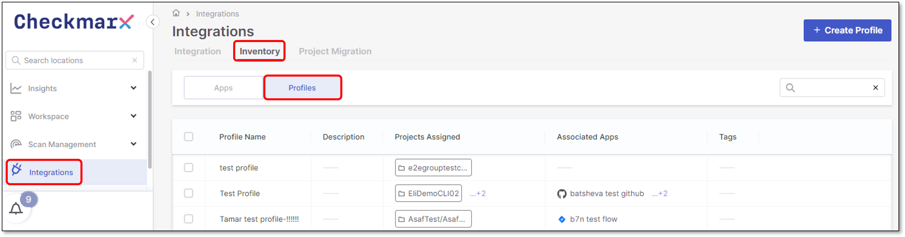
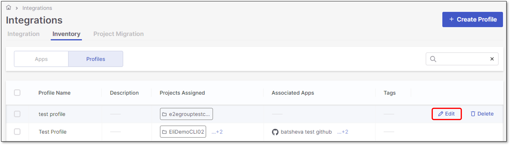
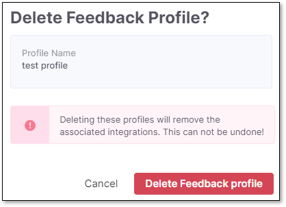
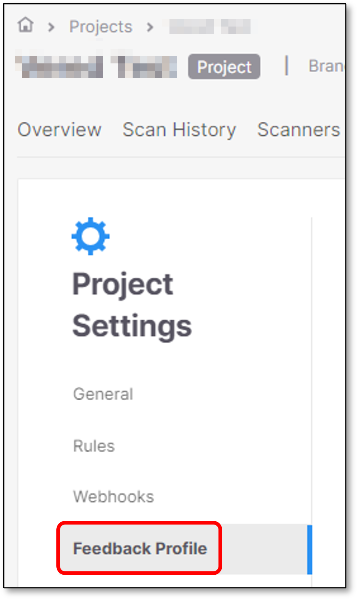

# Updating and Deleting Profiles

## Updating Existing Profiles

To update an existing Profile, perform the following steps:

1. Click on **Integrations > Inventory > Profiles**.

   <figure><figcaption></figcaption></figure>
2. Hover over the relevant Profile and click **Edit**.

   <figure><figcaption></figcaption></figure>

   A panel with the Profile's configuration will be opened on the right screen side.

## Deleting Profiles

To delete a Profile, perform the following:

1. Click on **Integrations > Inventory > Profiles**.

   <figure><figcaption></figcaption></figure>
2. Hover over the relevant Profile and click **Delete**.

   <figure><figcaption></figcaption></figure>
3. Approve the deletion or Cancel.

   <figure><figcaption></figcaption></figure>

## Updating an Assigned Profile for a Single Project

To update an assigned Profile for a single Project, perform the following:

1. Click on **Workspace** to open the Projects page.

   <figure><figcaption></figcaption></figure>
2. Hover over the relevant Project and click on the **3-dots** icon **> Project Settings**.

   <figure><figcaption></figcaption></figure>
3. Click on **Feedback Profile**.

   <figure><figcaption></figcaption></figure>
4. You can remove an assigned profile by clicking on **Remove**, or replace the assigned Profile by hovering over a different Profile and clicking on **Use Profile**.

   <figure><figcaption></figcaption></figure>
