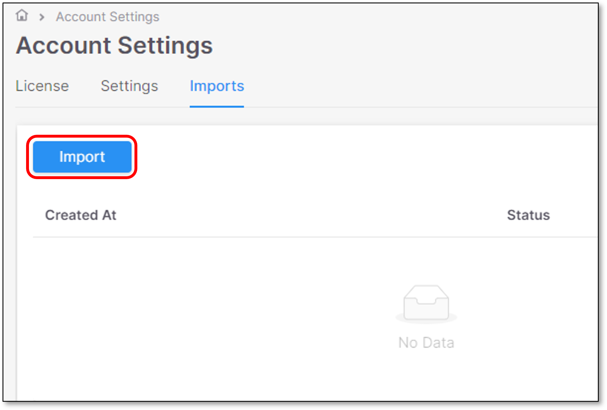
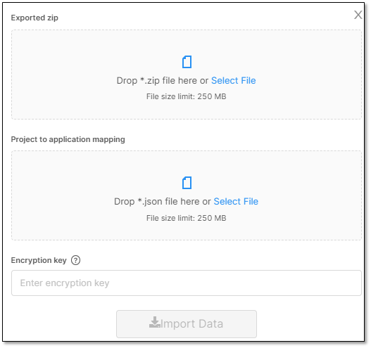
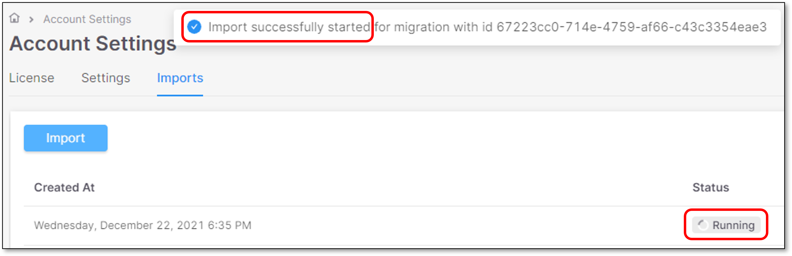
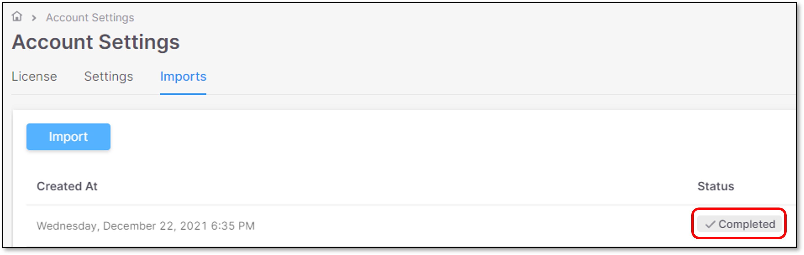
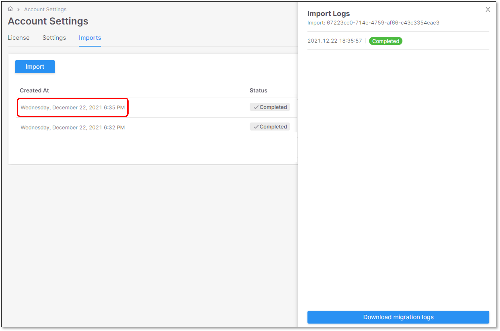
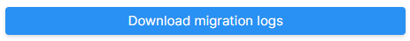
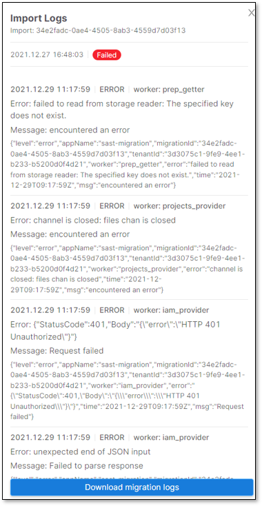

# Importing SAST to Checkmarx One

## Prerequisites

Before you can import an existing SAST environment into Checkmarx One, ensure you have the following:

- **Exported SAST environment archive**: A .zip file containing the exported SAST environment.
- **Checkmarx One Tenant name**
- **Checkmarx One Admin username and password**
- **Symmetric key**: A .txt file containing the symmetric key. This file is automatically generated with the exported SAST archive.

To retrieve the symmetric key:

1. Open the .txt file in any text editor.
2. Copy the key string to use during the import process.

## Import Procedure

To import the SAST exported environment to Checkmarx One, proceed as follows:

1. Log in to Checkmarx One using the Tenant name and Admin credentials.
2. Click on the **Settings** icon in the left Navigation pane. The **Account Settings** page is displayed.
3. Open the **Imports** tab and click **Import**.

   <figure><figcaption></figcaption></figure>

   The screen for importing a a SAST Environment into Checkmarx One is displayed:

   
4. Upload the exported SAST archive by doing one of the following:

   - Drag and drop the file into the **Exported zip** area.
   - Click **Select File** and browse to the .zip file on your system.

   Enter the **Symmetric key** (Encryption key)

   
   A notification that the file is successfully uploaded will appear at the top
   
5. Upload the project-to-application mapping file in JSON format by doing one of the following:

   - Drag and drop the file into the **Project to application mapping** area.
   - Click **Select File** to browse and upload the file manually.
6. Click **Import Data**. The import process starts and its status is displayed.
7. <figure><figcaption></figcaption></figure>
8. When the import process is completed, the status will be updated accordingly.

   <figure><figcaption></figcaption></figure>

## Import Statuses & History

There are 4 import statuses: **Running, Pending, Completed, Failed**.

The Import screen contains the history of all the Imports timestamps.

For example:

<figure><figcaption></figcaption></figure>

## Import Panel

Click on the relevant Import line in the main Import screen.

<figure><figcaption></figcaption></figure>

The import panel is opened on the right screen side, containing the following Import details:

- Import ID
- Import timestamp
- Status
- Download logs button

### Import Logs

Click on **Download migration logs** button .

The migration logs will be downloaded to the browser’s default download folder.


**Error logs** will be printed to the screen for a quick analysis (they will be also included in the downloaded logs)


For example:

<figure><figcaption></figcaption></figure>
