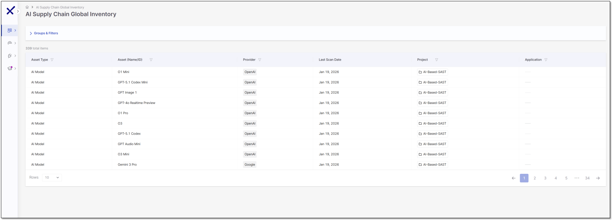

# Navigating AI Supply Chain Security

## Prerequisites


To use AI Supply Chain Security, ensure that your organization has the AI Supply Chain license enabled in Checkmarx One.


## AI Supply Chain Global Inventory

Access the AI Supply Chain Global Inventory page from the side panel:  **Resources** > **AI Supply Chain Global Inventory**.


The AI Supply Chain Global Inventory table displays results from the Main or Master branches only, across all projects.


Each column supports filtering and sorting to help you refine the table. The table is paginated, showing 10 rows per page by default. The columns are:

- **Asset Type** – The category of the AI component, such as an AI model, AI library, AI SDK, AI agent, MCP client, or MCP server.
- **Asset Name/ID** – Displays the specific asset name or identifier, for example, GPT‑4.1 or Gemini 3 Pro.
- **Provider** – Shows the source of the asset, such as Meta, Hugging Face, Google, or OpenAI.
- **Last Scanned Date** – Records the most recent timestamp when the asset was scanned.
- **Project** – The project associated with the asset.
- **Application** - The application associated with the asset.

### Export AI-BOM (JSON)

You can export the AI Supply Chain inventory as an **AI Bill of Materials (AI-BOM)** in JSON format for auditing, compliance, and reporting purposes.

To export the AI-BOM, use the Export option at the top right of the table. The export includes all relevant asset metadata, such as asset type, name, provider, project, and application.

You can choose between:

- Full export (**Export filtered data** unchecked): Exports all detected AI assets across your environment
- Filtered export ((**Export filtered data** checked): Exports only the assets currently displayed in the table, based on the applied filters.
