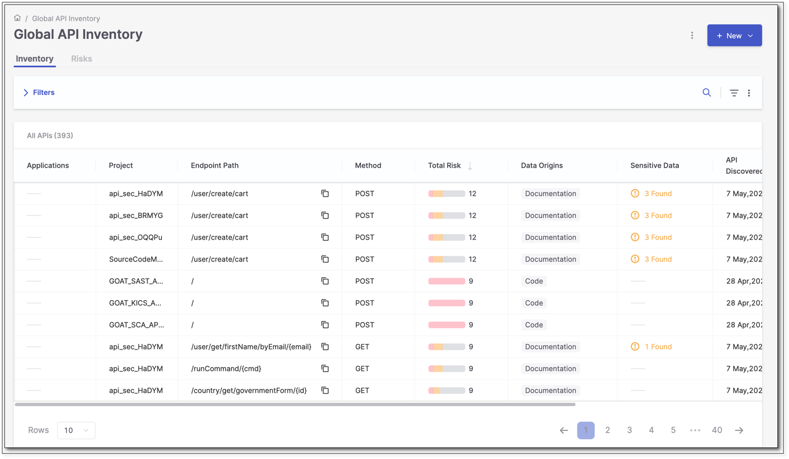
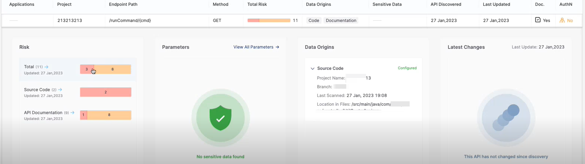
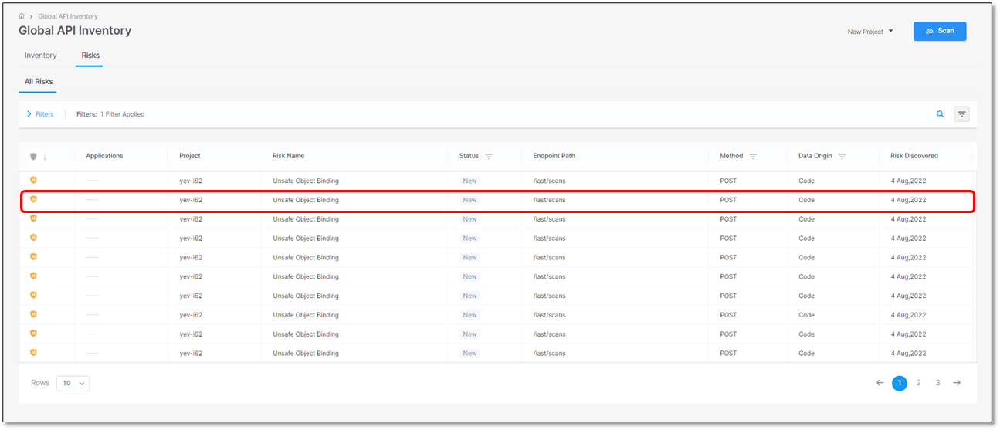
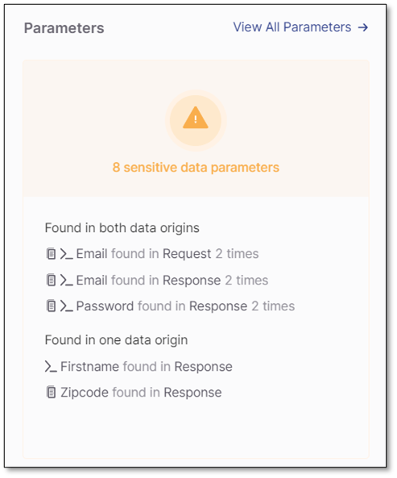
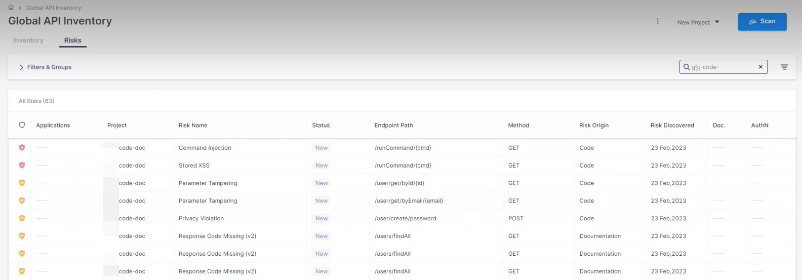
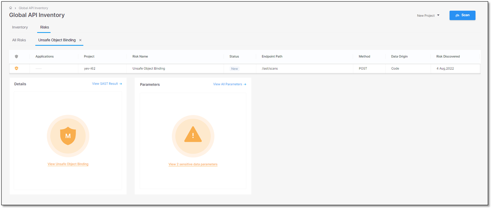
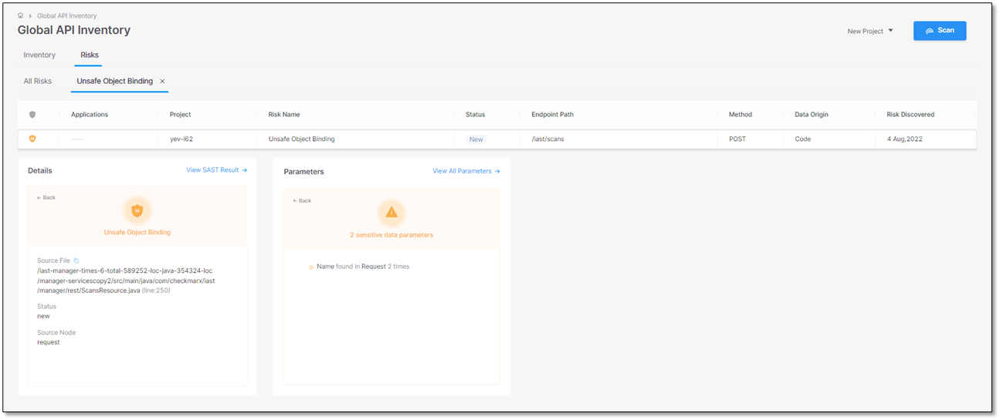
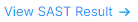
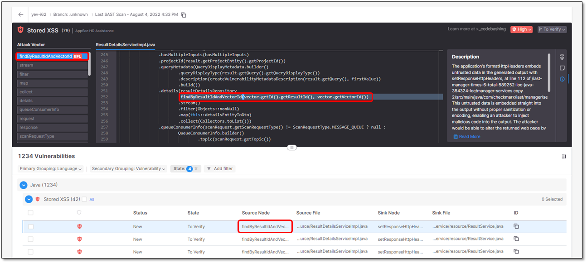

# API Inventory

To access the API Inventory from the main menu, select **Resources > API Inventory**.

The **Global API Inventory** is divided into two tabs: **Inventory**, which lists all APIs detected across all projects on the platform, and **Risks**, which lists all API risks detected across all projects on the platform. In both tabs, you can filter the table by column and export the displayed results as a CSV file.


In the exported CSV file, the **Total Risk** column is broken down into four separate columns: **Critical**, **High**, **Medium**, and **Low**.


## Inventory Tab

By default, the **Inventory** tab opens the **All APIs** subtab, which displays the **Global API Inventor**y table. Hovering over an API and clicking **view** at the end of the row opens its details in a new subtab next to All APIs. Multiple API detail subtabs can remain open simultaneously, allowing you to switch between the inventory table and previously opened APIs.

The following table describes the information displayed for each API:

| Parameter | Description |
|---|---|
| **Application** | The application that contains the project to which this API belongs. If the project does not belong to any application, this field is marked **----**. |
| **Project** | The project in which the API was discovered. |
| **Endpoint Path** | The path portion of the API endpoint URL that identifies the resource (for example, `/users/{id}`). |
| **Method** | The HTTP method used by the endpoint, such as `GET`, `POST`, `PUT`, or `DELETE`, which indicates the type of operation requested. |
| **Total Risk** | The number of risks found in the API. |
| **Data Origins** | Indicates where the API was detected. Currently, three data origins are available: **Code**, **Documentation**, and **Testing**. |
| **Sensitive Data** | The number of sensitive data attributes for all scans in the listed project. |
| **API Discovered** | The date when the API was discovered. |
| **Last Updated** | The date when the API was updated last. |
| **Doc** | Undocumented APIs present a risk because attackers may use them as an undetectable surveillance and reconnaissance channel. This column shows whether the endpoint is documented or not: • "**-**" appears when no documentation file was scanned. • **Yes**: The endpoint appears in the application and appears in the scanned API documentation. • **No**: The endpoint appears in the application, but does not appear in the scanned API documentation |
| **AuthN** | Unauthenticated APIs present a risk because they may allow easy access to confidential information. This column shows whether the endpoint is authenticated or not. • "**-**" appears when no authentication data was detected. • **Yes**: The endpoint appears in the application and it is authenticated. • **No**: The endpoint appears in the application, but it is not authenticated. |

### API Detail Subtabs

Selecting an API in the **All APIs** subtab opens a new subtab displaying details for the selected API.

The API detail subtab contains the following widgets:

| Widget | Description |
|---|---|
| **Risk** | Displays the number and severity of risks detected in the selected API. This pane may include any or all of the following sections: • **Total**: The total number of risks found for the current endpoint by the API Security scanner (on the left) and by the SAST scanner (on the right). • **Source Code**: The number of source code risks found by the API Security scanner (on the left) and the SAST scanner (on the right). • **API Documentation**: The number of API documentation risks found by the API Security scanner (on the left) and by the SAST scanner (on the right). If the scan did not include SAST queries, this section will show only the number of API documentation risks. Select a severity bar to open the **Risks** tab. The **All Risks** subtab is automatically filtered to display the risks for the selected API.  |
| **Parameters** | Shows the number of occurrences of sensitive data in the code and documentation. To see a list of the sensitive data in the code, click inside the widget. Sensitive data is a set of data that Checkmarx defines as sensitive. It is not related to the detected vulnerabilities. It simply provides you with an overview of what is potentially vulnerable to threats. Sensitive parameters are divided into five categories like **Name**, **Personal Data**, etc. Each category has a set of parameters defined. • **Name**: firstname, surname, familyname, fullname, name • **Personal Data**: birthday, dob, dateofbirth, phone, mobile, email, socialsecurity, ssn, driverslicense • **Address**: address, zipcode • **Bank**: credit, cardnumber, account • **Secrets**: dcredentials, secret, auth, apikey, pass, pwd, password If the API was detected both in the API source code and the API documentation, this widget shows which warnings appear only in the code, only in the documentation, or in both. Code data origin is indicated by the  icon, and documentation data origin is indicated by the  icon.  |
| **Data Origins** | Displays the details of the API data origins. It can be either the API source code, the Swagger file (documentation), both, or DAST tests. |
| **Latest Changes** | Lists the changes on this API since it was discovered. It can be one or several of the following: **Structure**: Added or removed Response and Request parameters, for example: • **Structure \| {Parameter} was removed** • **Structure \| {Parameter} was added** **Risk**: Detected one or more new risks. Risks are characterized by their risk level ( Critical, High, Medium, or Low) and grouped in categories, for example: • **Risk \| {Number} new {Level} found** **Sensitive Data**: Flagged parameters as sensitive, for example: • **Sensitive Data \| {Parameter} was found in {Request or Response}** If the API has not changed since its discovery, the corresponding message will appear. |

## Risks Tab

The **Risks** tab displays the **Global Risks Table**. By default, the **All Risks** subtab displays all API risks detected across all projects on the platform. Selecting a risk opens its details in a new subtab next to All Risks. Multiple risk detail subtabs can remain open simultaneously, allowing you to switch between the risks table and previously opened risks.

The following table describes the information displayed for each risk:

| Parameter | Description |
|---|---|
| **Severity** | Indicates the risk severity. Possible severity levels are:Critical, High, Medium, or Low. |
| **Applications** | The application to which this project belongs. If the project does not belong to any application, this field is marked **----**. |
| **Project** | The project for which the risk was detected. |
| **Risk Name** | The name of the risk. |
| **Status** | Indicates the status of the risk as follows: - A newly detected vulnerability. - The vulnerability has been detected at least once before. |
| **Endpoint Path** | The end path of the resource URL. |
| **Method** | The operation that the endpoint performs on resources. |
| **Risk Origin** | Indicates where the risk was detected. Currently, three risk origins are available: **Code**, **Documentation**, and **Testing**. To filter the risks by their origin, click on the column header to display a drop-down list, check the required option, and click OK: |
| **Risk Discovered** | The date when the risk was detected. |
| **Doc** | Undocumented APIs present a risk because attackers may use them as an undetectable surveillance and reconnaissance channel. This column shows whether the endpoint is documented or not: • "**-**" appears when no documentation file was scanned. • **Yes**: The endpoint appears in the application and appears in the scanned API documentation. • **No**: The endpoint appears in the application, but does not appear in the scanned API documentation |
| **AuthN** | Unauthenticated APIs present a risk because they may allow easy access to confidential information. This column shows whether the endpoint is authenticated or not. • "**-**" appears when no authentication data was detected. • **Yes**: The endpoint appears in the application and it is authenticated. • **No**: The endpoint appears in the application, but it is not authenticated. |

### Risk Detail Subtabs

Select a risk in the **All Risks** subtab to open its details in a new subtab.

In the subtab, two widgets are displayed: **Details** and **Parameters**. Click on a widget to show more information.

#### Details Widget

The **Details** widget shows the following information:

| Parameter | Description | Values |
|---|---|---|
| **Vulnerability Name** | The name of the vulnerability | Example: Unsafe Object Binding |
| **Source File** | The path and file name of the file with the vulnerability | Example: **/iast-manager-times-6-total-589252-locjava-354324-loc/manager-servicescopy5/src/main/java/com/checkmarx/iast/manager/rest/ScansResource.java**(line:250) |
| **Status** | The status of the vulnerability | **New** **Recurrent**. The vulnerability has been detected at least once before |
| **Source Node** | The beginning of the attack vector | The first node (input) of the vulnerable sequence. |

In addition, the **Details** widget provides a link  to view the highlighted vulnerability in the **SAST Results Viewer**. Clicking on a specific instance of the vulnerability opens a subtab with the vulnerability details


For a detailed explanation of the **SAST Results Viewer**, see [SAST Results Viewer](../sast-scanner/sast-results-viewer.md).



For a detailed explanation of triaging SAST results, see [Triaging SAST Results](../sast-scanner/triaging-sast-results.md)


#### Parameters Widget

In the **Parameters**, clicking on  opens a side-panel that displays all sensitive data parameters in the code.

The following table describes the available information:

| Interface | Description |
|---|---|
|  | List of all sensitive parameters in the API with warnings. This section is identical to the list of sensitive data parameters. |
|  | List of all parameters in the request to the API. The sensitive parameters are labeled . |
|  | List of all parameters in the response by the API. The sensitive parameters are labeled . |

Filtering the Table View

To filter the lists or to display them in ascending or descending order, do the following:

- To view list entries in ascending or descending order, point to the relevant header and select **Click to sort ascending** or **Click to sort descending** respectively.
- To only show specific parameters, for example, a specific status, point to the relevant header, click and then select the desired parameter(s) from the filter options.

