# Running a Scan


Initiating a scan is possible only within an existing project.


There are a few options for scanning a source file:

- Scan a source file from a repository URL.
- Scan a source file from a zipped file.
- Scan an existing project (repository URL/zipped file).


To manually scan API Security, navigate to the **Application and Projects** page, click the **+ New** dropdown tab, and select **New Project- Manual Scan**. To scan with code repository integration, select **New Project - Code Repository Integration**. To streamline this scanning process after integrating your code repository, we recommend using Rules as detailed below.

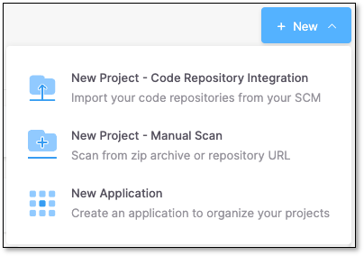


1. On the **Application and Projects** page, select the **Projects** tab (default).
2. In the row of the project that you would like to scan, click **Scan**.

   <figure><figcaption></figcaption></figure>

   The **New Scan** window opens. By default, under **Project Name**, the project of the row in which you clicked **Scan** is selected.

   <figure><figcaption></figcaption></figure>

   
   If you would like to scan a different project, it is possible to select a different project from the drop-down menu.
   
3. In the **Source to Scan** section, there are two scan options:

   1. Scan from a **zipped file**:

      - With the File option selected (default), click the **Select File** link.
      - Select the requested zip archive file.

      <figure>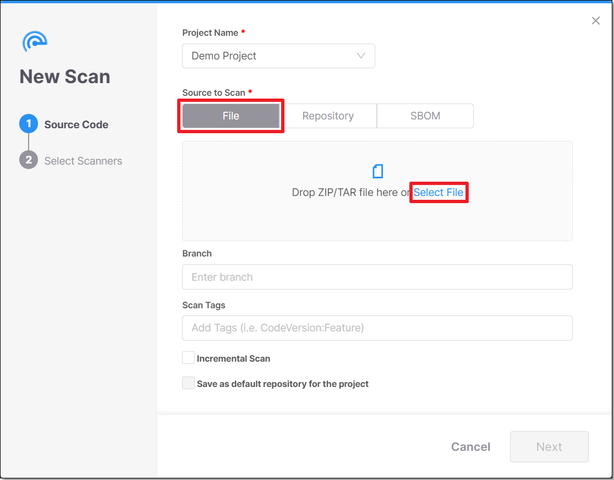<figcaption></figcaption></figure>

      <figure>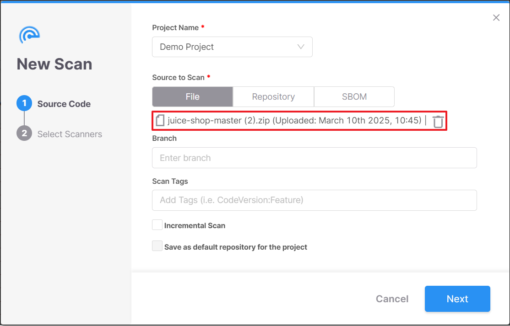<figcaption></figcaption></figure>
   2. Scan a **Repository URL**:

      - Click the **Repository** button.
      - Enter the **Repository URL**.
      - Click the **Fetch Branches** button.

      <figure>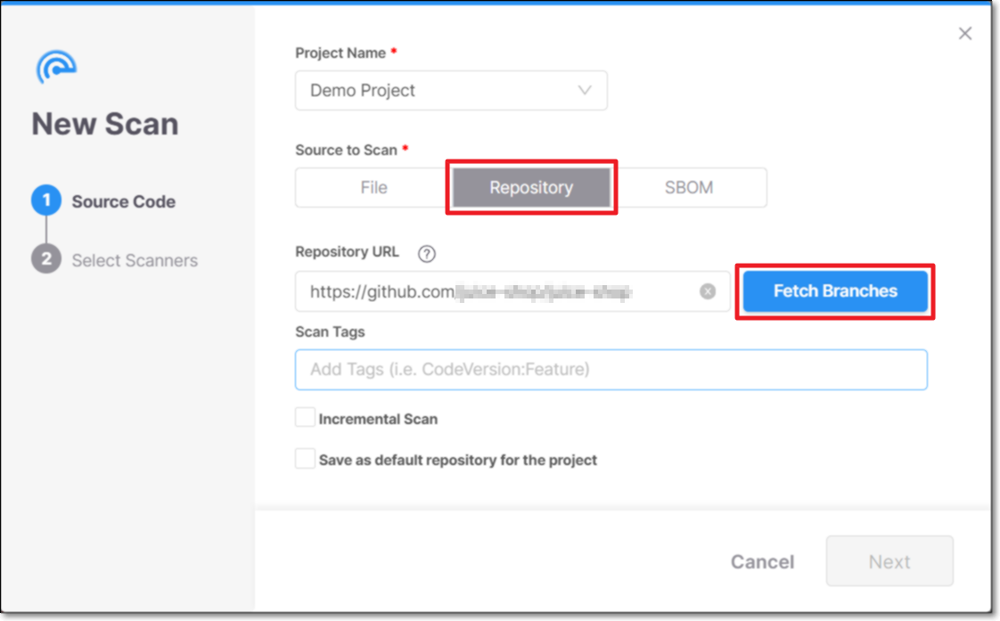<figcaption></figcaption></figure>
   3. Type your **Personal Access Token** and click **Login**

      For example:

      <figure>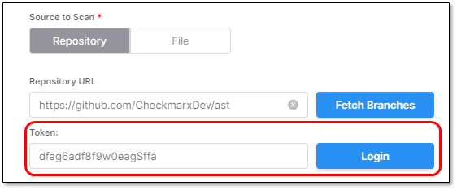<figcaption></figcaption></figure>
   4. If the *Token is incorrect*, an error will be presented while trying to connect.

      For example:

      <figure>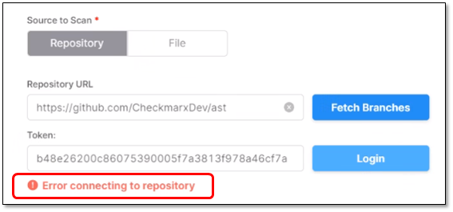<figcaption></figcaption></figure>
4. Under **Scan Tags**, add a tag to the new scan (optional).

   Tags can be added in two different formats:

   **Label:** \<string>

   **key:value:** \<key string:value string>

   <figure>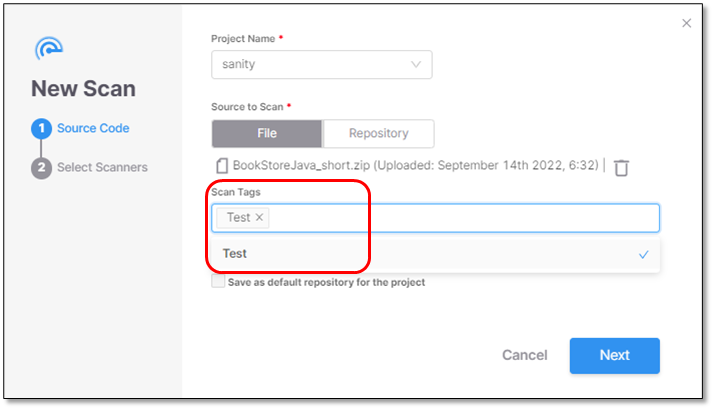<figcaption></figcaption></figure>
5. Select **Incremental Scan**, if you only want to scan the latest changes and not the entire project. For more information, refer to [Incremental Scans (SAST Scanner)](../sast-scanner/README.md#incremental-scans).
6. Click **Next**. The New Scan dialog appears, and you are asked to select the scanners.
7. Select one or more scanners.

   If you select **API Security**, **SAST** is also selected because API Security uses the SAST code to detect APIs.

   
   To scan your API Documentation files, create a rule before proceeding to the next step. See Rules for more details on how to set this up and to streamline your API Security scans.
   

   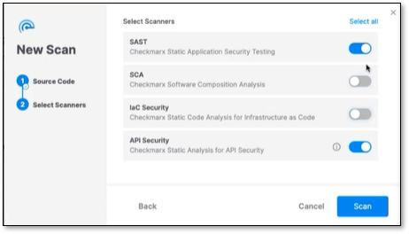
8. Click **Scan**. The New Scan dialog box closes, and the scan starts.
9. You can monitor the scan's status in the Projects tab.

   <figure><figcaption></figcaption></figure>
10. After the scan, you can view the project's results on a side pane by clicking within the project row.

    <figure>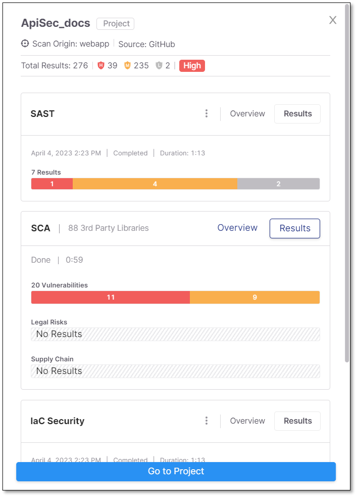<figcaption></figcaption></figure>
11. Scroll down to view your API Security results.

    <figure>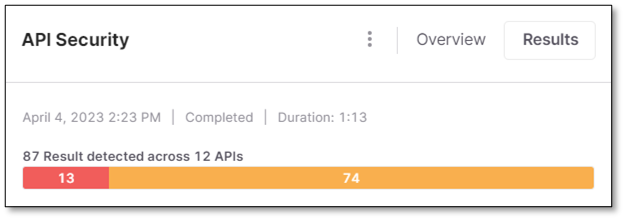<figcaption></figcaption></figure>

    Selecting **Overview** redirects you to the scan Overview page.

    <figure>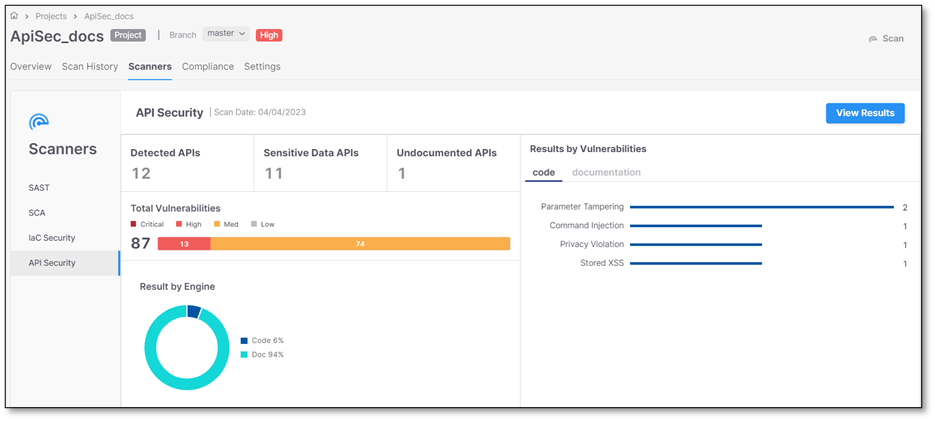<figcaption></figcaption></figure>

    Selecting **Results** redirects you to the Risks results page.

    <figure>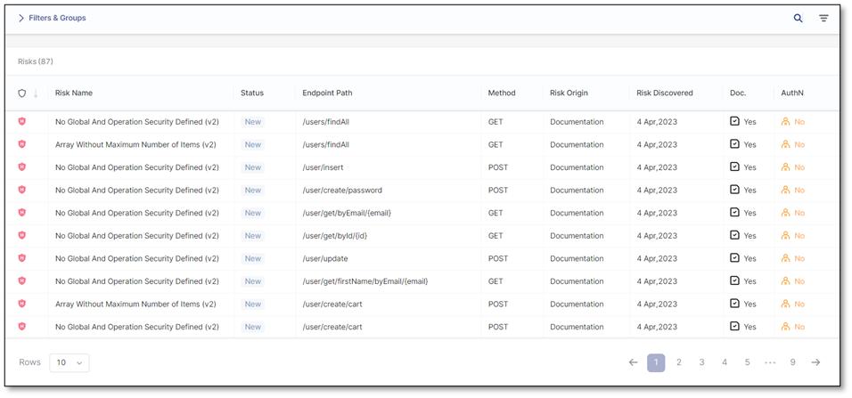<figcaption></figcaption></figure>


- Only **API Security** and **SAST** support incremental scans. If you select additional scanners for an **Incremental Scan**, a full scan is performed instead.
- **API Security** supports **Python Flask**, **Java - Spring**, **Express.js**, and **C# - ASP.NET Web API** .


Streamline your upload process by implementing a rule that allows you to define the file path either locally or from a repository like Github. Rules upload the swagger files directly according to their file paths, so you do not have to navigate away. There are three use cases for using Rules:

1. If you only scan code and not documentation, there is no need for a rule.
2. If scanning the code and the documentation, you must create a rule for your Swagger files.
3. If you want to scan only the documentation, you must have a rule and disable the SAST scan option. This will run only the API Security scan.

Navigate to the ellipsis at the end of the project row and select **Project Settings** to write your rule.

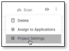

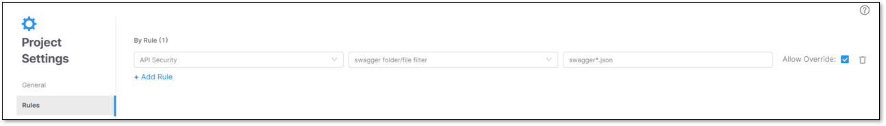

Rules enable you to scan API documentation efficiently. Click **+ Add Rule** to create your rule. Select **API Security** as the scan type. Please note that using the **\*** character is recommended in rules for flexibility in scanning multiple, similar named projects (Example: write: *swagger\*.json* instead of *swaggera.json* and then another rule *swaggerb.json*).


This feature is only available to those with DAST and API Security licenses.


DAST, when integrated with API Security scanning, provides real-time scanning of the API documentation, code, and testing, offering significant benefits in terms of risk assessment. This integration with API security is vital for a deeper and more comprehensive analysis of the risks found in your project. It displays all of your APIs (documented and undocumented) and their vulnerabilities in one place.

You can integrate your API Security with DAST for a project by navigating to the **Environments** page, clicking on the ellipsis at the end of the project row, selecting **Environment Settings** , and checking the "attached associate project". This links your project's API Security scan with DAST.

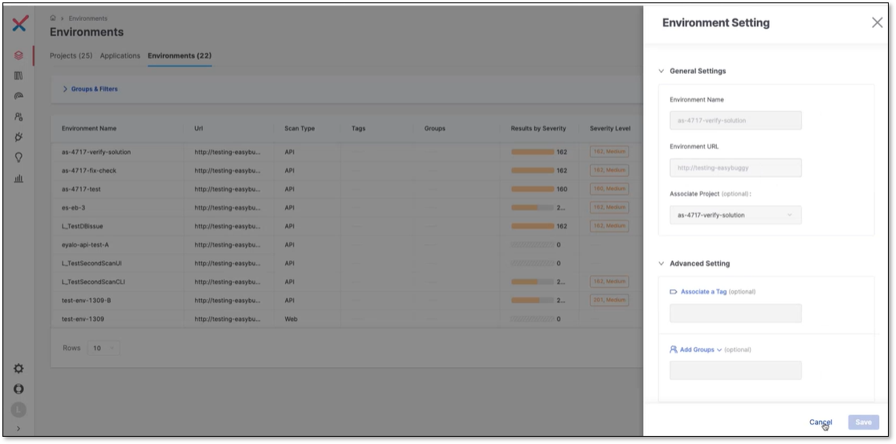

It's essential to highlight that DAST identifies risks, not APIs, and only those APIs flagged as risky by DAST will be shown as *Risk Found* APIs. To see this, navigate to the **Global API Inventory** page and click on the project's row.

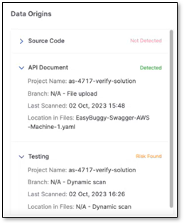

**Testing** (DAST) found a risk in the above project name, and now you can navigate to the risk and remediate it in DAST by clicking on **API Testing** on the neighboring card and redirecting to the DAST risks page.

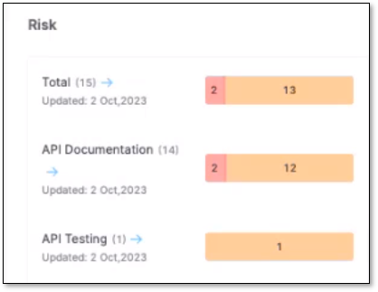

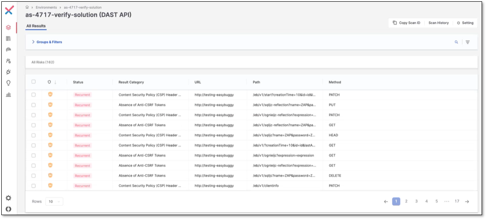
