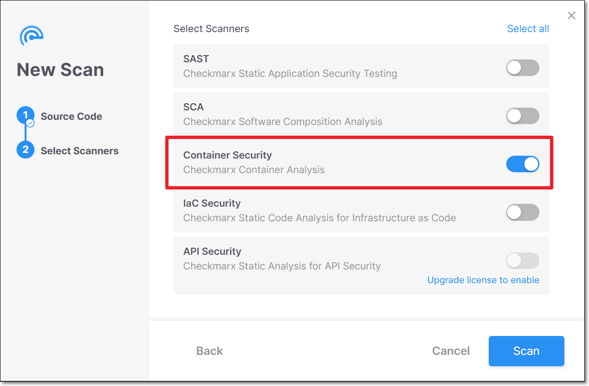
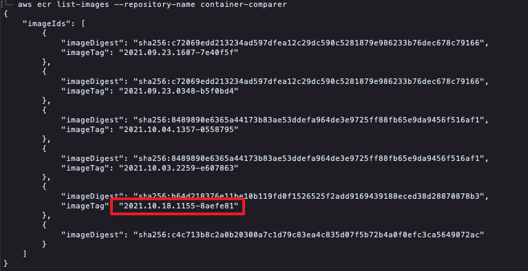
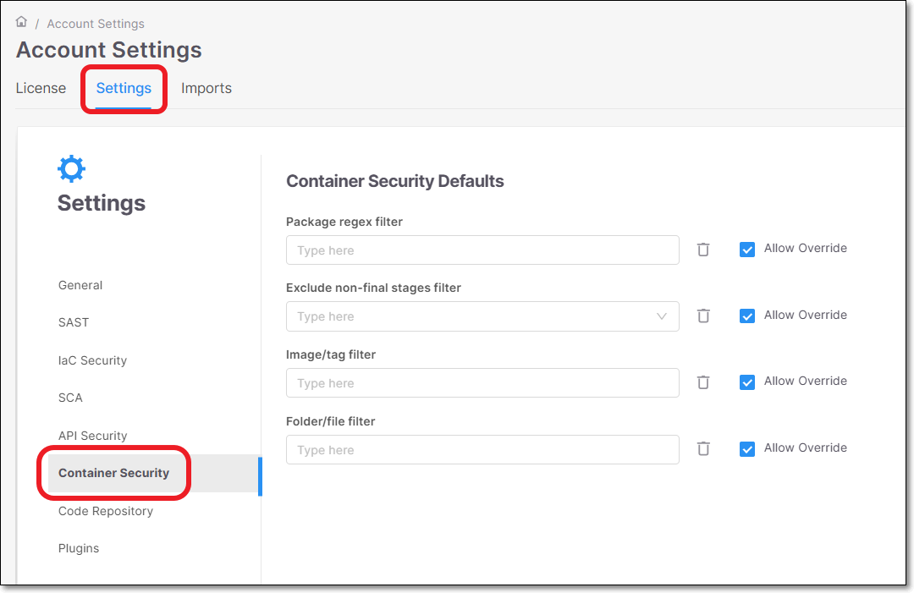

# Container Security


This page describes new Container Security scanner in Checkmarx One. This scanner now functions independently from SCA. This affects how scan are triggered as well as how the results are shown. The new **Container Security** scanner is easier to use and provides improved functionality.

For SCA standalone users, container scan functionality remains part of SCA, see Container Scans.


## Overview

The Container Security scanner scans the Dockerfiles in your project to identify the container images used in your project and the risks associate with those images. Checkmarx extracts all layers of each public base image located in the Dockerfile, and identifies the packages used by each layer. In addition to scanning the Dockerfile itself, we also scan the image that is created from the Dockerfile, using the Syft open source tool. This enables greater visibility into all packages used in the image for all languages supported by Checkmarx SCA as well as many non-supported languages (e.g., Dart, Haskell, Swift etc.).

In addition, you can use the Checkmarx One CLI tool to submit specific images from public or private registries for analysis.

### Key Features

- Simple workflow - Scanning of built images is done in the cloud, with no need to install additional tools.
- Triage vulnerabilities - Change State, Severity level and risk score of vulnerabilities and add comments.
- Remediation recommendations - Shows alternative versions of base images with fewer vulnerabilities.
- Malicious packages - In addition to vulnerable packages, this scanner also identifies malicious packages.
- Runtime usage - Prioritize remediation efforts based on runtime usage data, obtained via integration with Sysdig.
- Scan Risk Report - Scan risk reports contain a dedicated section for containers. This includes customized container data such as breakdown of images and layers in each scanned file.
- Policy Management - You can create customized policies for Container Security results based on a series of conditions and condition groups. These policies make it easy to identify projects that don't comply with your organization's security standards
- Custom Filters - Container Security has a specialized set of filter settings that enable users to configure their scans for precision and relevance. Filters can be applied to files, folders, packages and images. You can also limit the scan to include only final deployable images.

<details>

<summary>What We Scan</summary>

Images in Files

- Dockerfile base images
- Helm charts and yaml/yml files
- Docker-compose file images

Private Images

- Scan images directly from private registries (using Checkmarx One CLI)

Runtime Images (Containers)

- Integration with Sysdig for runtime analysis

</details>

## Running Container Security Scans

A container scan can be triggered by selecting the **Container Security** scanner when initiating a scan via the web application, CLI or API. This will scan the Dockerfile in your project. When you run a scan via the CLI, there is an additional option to specify a specific image to be scanned from a public or private repository.

### Running Scans via the Web Application

Follow the normal procedure for running a scan, making sure that the **Container Security** scanner is selected.



### Running Container Security Scans via the CLI

When running scans via the CLI you can choose to scan the project files in order to analyze the Dockerfile in your project or you can submit specific images for scanning.

Container Security scans are run via CLI by running `scan create` and specifying `container-security` in the `--scan-types`.

As of CLI version 2.3.29, by default scans are run in the cloud. You can submit the flag `--containers-local-resolution` to run container resolution locally.

#### Scanning Private Repos

By default, the CLI runs scans in the cloud. If you have set up an integration to allow Checkmarx One to access your private registry then the scan will include those registries. For more information about private registry integrations, see [Private Registry Integration for Container Security Scanner](private-registry-integration-for-container-security-scanner/README.md). Using these integrations is the recommended workflow.

If your repos are in an unsupported private registry or you haven't yet configured the integration, then you will need to scan your private registries locally, as described in the following section.

##### Scanning Private Repos Locally

You can run Container Security scans locally by adding the flag `--containers-local-resolution` to the `scan create` command. In this case, in order to access private registries you need to be authenticated in your container registry at the time that you run the scan via Checkmarx One CLI.

Authentication can be done via Docker or Podman.

Before running the scan, it is recommended to verify that you are able to access the image on your local machine.

For details about authentication for specific registries, see Authentication for Scanning Registries Locally.

<details>

<summary>Example - DockerHub Authentication</summary>

For DockerHub authentication make sure that your environment variables are set as:

- *DockerhubUsername* - your username
- *DockerhubToken* - your password or authorization token

</details>

#### Scan Procedure

1. Run the `scan create` command with all required parameters, and specify `container-security` in the `--scan-types`.

   ```
   ./cx scan create --project-name <Project Name> -s <Repository URL> --branch <branch name> --scan-types container-security
   ```
2. If you would like to apply filters, you can configure the specialized Container Security filters as described in [Filters for Container Security Scanner](../../cli-tool/checkmarx-one-cli-commands/scan/scan-create.md).
3. If you would like to scan specific images, add the `--container-images` flag followed by a comma separated list of images. Specify each image using the following syntax {image_name}:{image_tag}.

   ```
   ./cx scan create --project-name <Project Name> -s <Repository URL> --branch <branch name> --scan-types container-security --container-images “mycompany/myimage:myimagetag”
   ```

   
   For the syntax for images in specific registries, see [Scanning Specific Images](#scanning-specific-images).
   
4. If you want to scan **only** the specified images (not an entire project), do the following:

   
   In the context of scanning a specific image, the `-s` parameter isn't actually relevant. However, it is a required parameter, requiring the following workaround.

   Similarly, when scanning an image, the `--branch` parameter doesn't represent an actual repo branch, rather you should assign a name that represents this scan in the system.
   

   1. Create a "dummy" folder (for use in the `-s` parameter) and give it a name that indicates that it is used for scanning images, e.g., scan_ecr_image.
   2. In the CLI scan command, for the `-s` parameter give the path to the "dummy" folder that you created, e.g., `/Users/DemoUser/scan_ecr_image`.
5. If you are scanning images that are in a private repository that is not integrated with Checkmarx One, add the `--containers-local-resolution` flag and make sure that you are authenticated locally for accessing the repo, as explained in Authentication for Scanning Registries Locally.

##### Scanning Specific Images

If you would like to specify specific images for scanning, add the `--container-images` flag followed by a comma separated list of images. Specify each image using the following syntax {image_name}:{image_tag}. The following are some examples of the syntax used for different registries:

```
ghcr.io/company/image-name:image-version
123456789012.dkr.ecr.us-west-2.amazonaws.com/image-name:image-version
companyregistry.azurecr.io/image-name:image-version
quay.io/company/image-name:image-version
docker.io/company/image-name:image-version
nexus.company.com/repository/docker-hosted/image-name:image-version
harbor.mycompany.com/dev/image-name:image-version
```

Alternatively, the reference can be given as A tar file path: `<filename>.tar` or a prefixed reference using supported providers.

To learn more about precise syntax for each type of reference as well as best practices and troubleshooting suggestions, see [Scanning Container Images via Checkmarx One CLI - Flag Validation and Best Practices](scanning-container-images-via-checkmarx-one-cli---flag-validation-and-best-practices.md).

The following sections give more details about the naming syntax for specific registries.

<details>

<summary>Identifying the AWS ECR Image Name and Tag</summary>

The value submitted for the `--container-images` parameter for ECR uses the following syntax {repository_uri}:{image_tag}.

The following procedure describes how to obtain these values via the CLI.

1. To obtain the repository uri, run the CLI command `aws ecr describe-repositories --repository-name {your_repo_name}`, and make a note of the value returned for `repositoryUri`.

   
2. To obtain the image tags of the images in the repo, run the CLI command `aws ecr list-images --repository-name {your_repo_name}`, and make a note of the value returned for `ImageTag` for the desired image.

   
3. Run the CLI command with the `--container-images` flag specifying the desired images using the syntax {repository_uri}:{image_tag}. For example:

   ```
   --container-images 006765415138.dkr.ecr.us-east-1.amazonaws.com/container-comparer:2021.10.18.1155-8aefe81
   ```

</details>

<details>

<summary>Identifying the GAR Image Name and Tag</summary>

The value submitted for the `--images` parameter for GAR uses the following syntax {gar_region}-docker.pkg.dev/{project_id}/{image_name}:{image_tag}.

1. Obtain the values needed to identify this image.
2. Run the CLI command with the `--scan-containers` flag, and add the `--container-images` flag specifying the desired images using the syntax gcr.io/{project_id}/{image_name}:{image_tag}. For example:

   ```
   --container-images us-docker.pkg.dev/symbolic-eye-1234/quickstart-image:tag1
   ```

</details>

<details>

<summary>Identifying the GCR Image Name and Tag</summary>

The value submitted for the `--container-images` parameter for GCR uses the following syntax gcr.io/{project_id}/{image_name}:{image_tag}.

1. Obtain the value needed to identify this image. The following is on possible method for obtaining this info:

   - Open GCR in the Google Cloud portal and navigate to the image and tag of the desired image. Then, in the **PULL** tab, copy the value given in the **Pull by tag** snippet (without the "docker pull" command).

     
2. Run the CLI command with the `--container-images` flag specifying the desired images using the syntax gcr.io/{project_id}/{image_name}:{image_tag}. For example:

   ```
   --container-images gcr.io/symbolic-eye-1234/quickstart-image:tag1
   ```

</details>

##### Authentication for Scanning Registries Locally

If you are running the container scan locally, then you need to be authenticated for the registry on your local machine. The following sections explain how to authenticate for specific registries.

<details>

<summary>Authentication for AWS ECR</summary>

Before running scans via the CLI, make sure that your AWS IAM user is authenticated, and that the token is in the credentials file (AWS_SESSION _TOKEN) as explained [here](https://awscli.amazonaws.com/v2/documentation/api/latest/reference/sts/get-session-token.html). And, if you are scanning images in a different region, then make sure that the region is correctly configured in the credentials file (REGION).

###### Configuring Environment Variables for AWS ECR

The Checkmarx One CLI is configured to scan your AWS ECR repo assuming that the default values/paths are in use. If the “credentials” file is in the default AWS path, and you are using the “default” profile, then no action is needed. If you have changed these settings, then you need to configure the following environment variables.

- *AWS_PROFILE* (default value: “*default*”)


You can configure multiple profiles, e.g., for different environments.


- *AWS_CONFIG_FILE* (default path: “*~/.aws/config*”)
- *AWS_SHARED_CREDENTIALS_FILE* (default path: “*~/.aws/credentials*”)

See [AWS SDKs and Tools](https://docs.aws.amazon.com/sdkref/latest/guide/overview.html)

**Example of Credentials File**

File ““~/.aws/credentials”

```
[default]
aws_access_key_id=ASI
aws_secret_access_key=abcd
region=us-west -1
aws_session_token=Absd
[prod]
aws_access_key_id=AKI
aws_secret_access_key=xyz
region=us-west -1
```

</details>

<details>

<summary>Authentication for GAR</summary>

Before running scans via the CLI, make sure that you are authenticated in GAR. ou can test this by running the `docker pull` command for the desired image. Learn about possible authentication methods [here](https://cloud.google.com/artifact-registry/docs/docker/authentication).

The recommended authentication is using [gcloud](https://cloud.google.com/artifact-registry/docs/docker/store-docker-container-images#auth).

To authenticate using gcloud:

1. If it is the first time that you are pulling images, run the following command on your machine `gcloud auth configure-docker us-docker.pkg.dev`

   
   This command assumes that you are using the US region of GAR. If you are using a different region, then replace "us" with the name of your region.
   

</details>

<details>

<summary>Authentication for GCR</summary>

Before running scans via the CLI, make sure that you are authenticated in GCR. You can test this by running the `docker pull` command for the desired image. Learn about possible authentication methods [here](https://cloud.google.com/container-registry/docs/advanced-authentication).

The recommended authentication is using [gcloud](https://cloud.google.com/container-registry/docs/advanced-authentication#gcloud-helper).

To authenticate using gcloud:

1. Log in to gcloud as the user that will run Docker commands and run the command `gcloud auth login`.
2. Configure Docker using the following command `gcloud auth configure-docker`.

   Your credentials are saved in your user home directory.

   - Linux: $HOME/.docker/config.json
   - Windows: %USERPROFILE%/.docker/config.json

</details>

### Running Container Scans via API

You can run a Container Security scan using [POST /scans](https://checkmarx.stoplight.io/docs/checkmarx-one-api-reference-guide/branches/main/4fptcufpn3j9a-run-a-scan). In the config section specify the `type` as `containers`.


When running the Container Security scanner together with SCA, it is recommended to include the SCA config `enableContainersScan` and set it as false.


Sample request body:

```
{
    "type": "git",
    "handler": {
        "repoUrl": "https://github.com/myOrg/demorepo",
        "branch": "demoBranch"
    },
    "project": {
        "id": "71eacb3b-ae1d-4961-a96f-2b8593ff3dc7",
        "tags": {}
    },
    "config": [
     {
      "type": "sca",
      "value": {
        "enableContainersScan": "false"
      }
    },
     {
            "type": "containers",
            "value": {}
        }
    ],
    "tags": {}
}
```

### Applying Filters

Checkmarx One offers robust filter settings to enhance container security by enabling users to configure their scans for precision and relevance. Below is an overview of the four available filter settings, designed to reduce noise and focus on critical vulnerabilities in your scans.

These filters can be applied either on the account level or for specific projects.


These filters can also be added in the `scan create` command in the CLI, see [Filters for Container Security Scanner](../../cli-tool/checkmarx-one-cli-commands/scan/scan-create.md).


To apply filters on the account level, go to **Global Settings** > **Container Security** section.



To apply filters to a specific project, go to the project page > **Settings** tab and add a **Rule** for Container Security, specifying the filter details.

For an overview of the filter options, see [here](container-security-configuration-options.md).

Additional details about the usage and syntax for these filters is available in [Filter Usage Details](container-security-filter-usage.md#filter-usage-details).

## Policy Management

In the context of the Checkmarx One Policy Management feature, there are specialized conditions related to the Container Security scanner that can be used to create policy rules. For more info, see Container Security Conditions.

## Authentication for Scanning Registries Locally

If you are running the container scan locally, then you need to be authenticated for the registry on your local machine. The following sections explain how to authenticate for specific registries.

<details>

<summary>Authentication for AWS ECR</summary>

Before running scans via the CLI, make sure that your AWS IAM user is authenticated, and that the token is in the credentials file (AWS_SESSION _TOKEN) as explained [here](https://awscli.amazonaws.com/v2/documentation/api/latest/reference/sts/get-session-token.html). And, if you are scanning images in a different region, then make sure that the region is correctly configured in the credentials file (REGION).

#### Configuring Environment Variables for AWS ECR

The Checkmarx One CLI is configured to scan your AWS ECR repo assuming that the default values/paths are in use. If the “credentials” file is in the default AWS path, and you are using the “default” profile, then no action is needed. If you have changed these settings, then you need to configure the following environment variables.

- *AWS_PROFILE* (default value: “*default*”)


You can configure multiple profiles, e.g., for different environments.


- *AWS_CONFIG_FILE* (default path: “*~/.aws/config*”)
- *AWS_SHARED_CREDENTIALS_FILE* (default path: “*~/.aws/credentials*”)

See [AWS SDKs and Tools](https://docs.aws.amazon.com/sdkref/latest/guide/overview.html)

**Example of Credentials File**

File ““~/.aws/credentials”

```
[default]
aws_access_key_id=ASI
aws_secret_access_key=abcd
region=us-west -1
aws_session_token=Absd
[prod]
aws_access_key_id=AKI
aws_secret_access_key=xyz
region=us-west -1
```

</details>

<details>

<summary>Authentication for GAR</summary>

Before running scans via the CLI, make sure that you are authenticated in GAR. ou can test this by running the `docker pull` command for the desired image. Learn about possible authentication methods [here](https://cloud.google.com/artifact-registry/docs/docker/authentication).

The recommended authentication is using [gcloud](https://cloud.google.com/artifact-registry/docs/docker/store-docker-container-images#auth).

To authenticate using gcloud:

1. If it is the first time that you are pulling images, run the following command on your machine `gcloud auth configure-docker us-docker.pkg.dev`

   
   This command assumes that you are using the US region of GAR. If you are using a different region, then replace "us" with the name of your region.
   

</details>

<details>

<summary>Authentication for GCR</summary>

Before running scans via the CLI, make sure that you are authenticated in GCR. You can test this by running the `docker pull` command for the desired image. Learn about possible authentication methods [here](https://cloud.google.com/container-registry/docs/advanced-authentication).

The recommended authentication is using [gcloud](https://cloud.google.com/container-registry/docs/advanced-authentication#gcloud-helper).

To authenticate using gcloud:

1. Log in to gcloud as the user that will run Docker commands and run the command `gcloud auth login`.
2. Configure Docker using the following command `gcloud auth configure-docker`.

   Your credentials are saved in your user home directory.

   - Linux: $HOME/.docker/config.json
   - Windows: %USERPROFILE%/.docker/config.json

</details>

## In this section

- [Supported Registries and Ecosystems](supported-registries-and-ecosystems.md)
- [Scanning Container Images via Checkmarx One CLI - Flag Validation and Best Practices](scanning-container-images-via-checkmarx-one-cli---flag-validation-and-best-practices.md)
- [Container Security Results Viewer](container-security-results-viewer.md)
- [Triaging Container Security Results](triaging-container-security-results.md)
- [Container Security Configuration Options](container-security-configuration-options.md)
- [Container Security Filter Usage](container-security-filter-usage.md)
- [Private Registry Integration for Container Security Scanner](private-registry-integration-for-container-security-scanner/README.md)
- [Sysdig Integration - Runtime Usage](sysdig-integration---runtime-usage.md)
- [Checkmarx Docker Desktop Extension](checkmarx-docker-desktop-extension.md)
