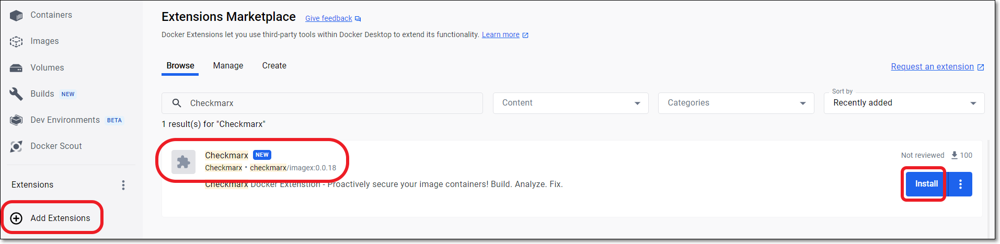
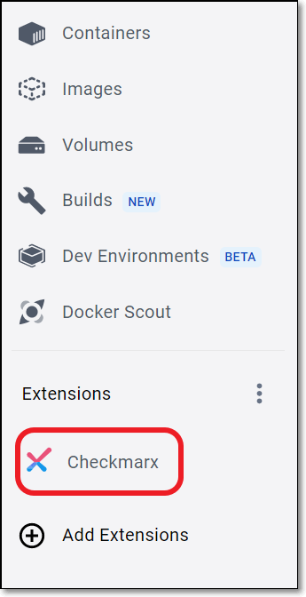
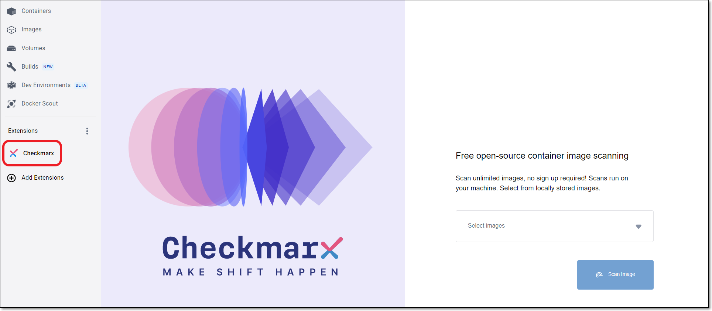
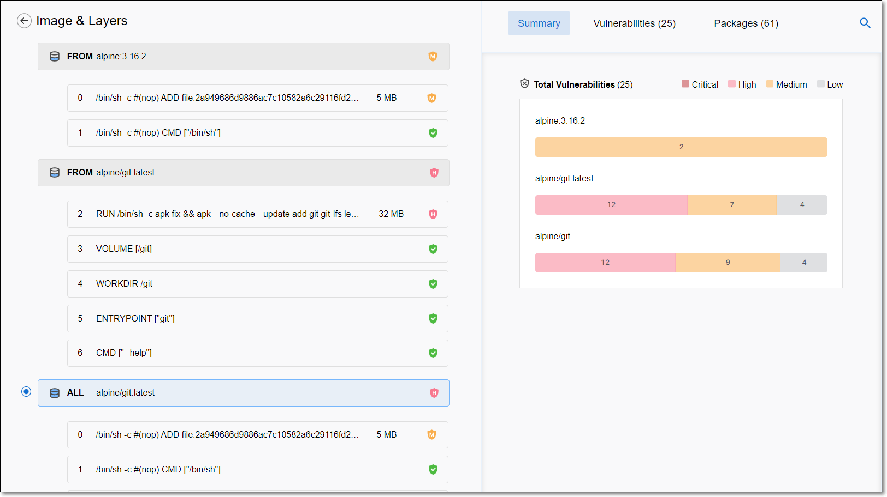
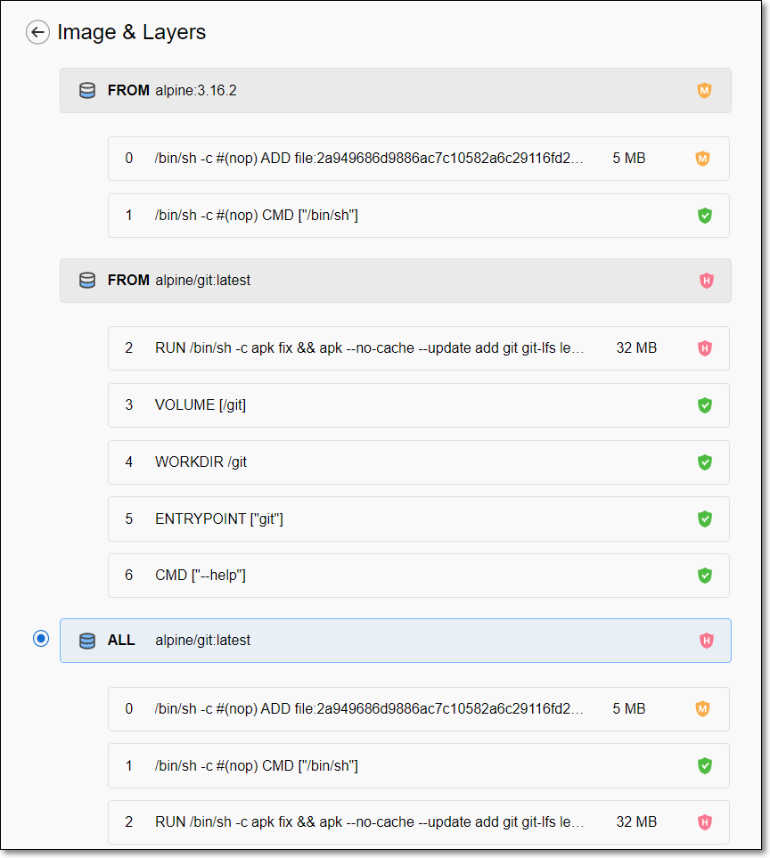
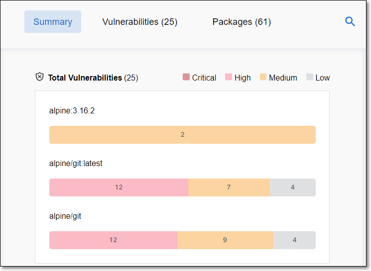
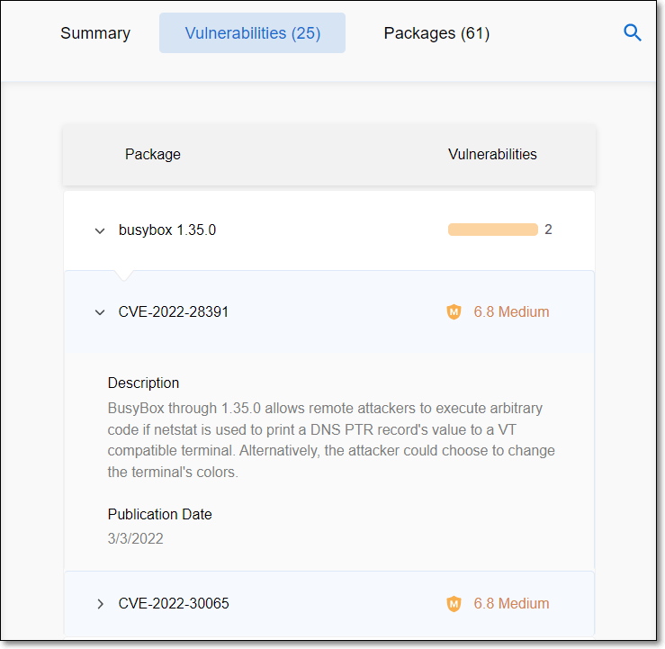
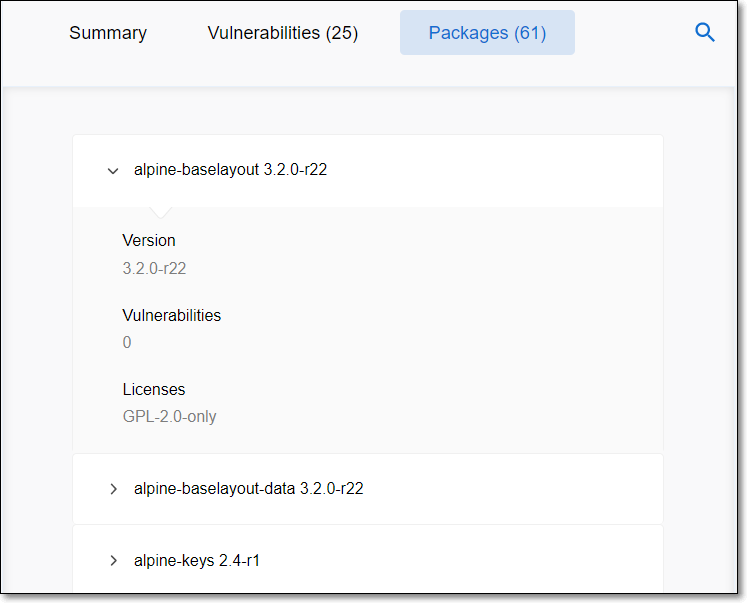

# Checkmarx Docker Desktop Extension

## Overview

The Checkmarx Docker Desktop Extension helps you to strengthen the security posture of your Docker images by taking a proactive approach to safeguarding against vulnerabilities and aligning with industry best practices for secure containerization. This tool offers robust features such as comprehensive scanning, package inspection, and vulnerability assessment. It leverages Checkmarx proprietary database to provide users with valuable insights and recommendations for protecting images against potential security threats and maintaining the integrity of their containerized environments.

Checkmarx Terms of Service

Checkmarx Master Software License and Services Agreement 230210

**PLEASE READ THESE TERMS OF SERVICE (THE “AGREEMENT”) CAREFULLY BEFORE DOWNLOADING, ACCESSING OR USING THE SOFTWARE. THIS AGREEMENT, WHICH INCLUDES A BINDING ARBITRATION CLAUSE THAT IMPACTS YOUR DISPUTE RESOLUTION RIGHTS, REPRESENTS A BINDING LEGAL AGREEMENT BETWEEN YOU AS THE INDIVIDUAL, THE COMPANY, OR THE LEGAL ENTITY THAT WILL BE UTILIZING THE SOFTWARE (“YOU” OR “CUSTOMER”) AND THE CHECKMARX ENTITY IDENTIFIED BELOW ("CHECKMARX").**

**IF YOU ARE ACCESSING OR USING THE SOFTWARE, OR ANY PART THEREOF, ON BEHALF OF A COMPANY OR OTHER LEGAL ENTITY, YOU HEREBY ACCEPT THIS AGREEMENT ON BEHALF OF SUCH COMPANY OR ENTITY, YOU ACKNOWLEDGE THAT SUCH COMPANY OR ENTITY IS LEGALLY BOUND BY THIS AGREEMENT, AND YOU REPRESENT AND WARRANT THAT YOU HAVE THE RIGHT, POWER AND AUTHORITY TO ACT ON BEHALF OF AND BIND SUCH COMPANY OR ENTITY. YOU MAY NOT ACCEPT THIS AGREEMENT ON BEHALF OF A COMPANY OR ENTITY UNLESS YOU ARE AN EMPLOYEE OR OTHER AUTHORIZED AGENT OF SUCH COMPANY OR ENTITY WITH THE RIGHT, POWER AND AUTHORITY TO BIND AND ACT ON BEHALF OF SUCH COMPANY OR ENTITY.**

**IF YOU DO NOT AGREE TO THIS AGREEMENT, YOU ARE NOT AUTHORIZED TO ACCESS OR USE THE SOFTWARE OR SERVICES OR ANY PART THEREOF. BY CLICKING “I ACCEPT,” “I AGREE,” OR SIMILAR ACCEPTANCE TEXT, BY EXECUTING A DOCUMENT INCORPORATING THIS AGREEMENT BY REFERENCE, OR BY ACCESSING OR USING THE SOFTWARE OR SERVICES, YOU HEREBY AGREE TO THIS AGREEMENT.**

1. ***Definitions***.

   1. “**Affiliate**” means, with respect to a Party, any entity that, directly or indirectly, controls, is controlled by, or is under common control with such Party, and “control” means the power to direct the management and policies of the controlled entity.
   2. “**Documentation**” means the current Software documentation located at [https://docs.checkmarx.com/](https://docs.checkmarx.com/).
   3. “**Local Country Addendum**” means, if applicable to Customer, the current additional country-specific terms located at [https://checkmarx.com/legal/terms/](https://checkmarx.com/legal/terms/).
   4. “**Software**” means the object code form of Checkmarx’s software programs, and all Software updates and maintenance releases provided by Checkmarx.
2. ***Software License Grants and Restrictions***.

   1. **Licenses and Usage Rights**. Subject to this Agreement, Checkmarx grants to Customer a limited, non-exclusive, non-transferable, non-sublicensable license to: (a) download and install one copy of the Software on a device owned by Customer; (b) access and use the Software and Documentation for Customer’s internal business purposes, and (c) retain a backup copy of the Software and Documentation for non-production, inactive backup and archival purposes only.
   2. **Usage Restrictions**. Customer may not, and may not permit others to: (a) attempt to access or use the Software by unauthorized means or circumvent any usage restrictions; (c) reverse engineer, decompile, disassemble, modify or create derivative works of the Software or Documentation; (d) attempt to derive the source code of the Software; (e) reproduce, publish, distribute, transfer, publicly display, resell, rent, lease, sublicense, loan, or lend the Software or Documentation to any third party; (f) use the Software to provide application security services to a third party, or make the Software available for use by a third party; (g) use the Software for the purpose of competitive analysis, competitive benchmarking or to build a competitive product or service; (h) transfer, assign or permit the sharing of passwords, license keys, access credentials, API keys or access codes to a third party; (i) make available to any third party any content from, or output of, the Software, including but not limited to benchmarking results; (j) use any robot, spider, data scraping or content extraction tool or similar mechanism with respect to the Software or Documentation; (k); upload malicious code, files scripts, agents or programs to the Software; (l) use the Software in violation of third party rights or applicable laws and regulations; or (m) infiltrate, hack, or attempt to circumvent or interfere with any authentication or security measures of the Software or Services.
   3. **Audit**. Customer agrees, upon written request by Checkmarx no more than once per year, to furnish Checkmarx with records demonstrating Customer’s compliance with this Agreement.
3. ***Customer Data.***

   1. **Customer Data.** Customer hereby grants Checkmarx and its Affiliates a limited, non-exclusive license to use the data provided by Customer during use of the Software (the “**Customer Data**”) as necessary to provide the Software to Customer, to provide technical support and assistance to Customer, to monitor the integrity and functioning of the Software, and to perform and administer the Agreement. Except as set out in Section 3.3, Customer owns all right, title and interest in the Customer Data.
   2. **Personal Information**. In the event Customer provides any personal data to Checkmarx, such data shall be handled in accordance with Checkmarx’s privacy policy located at [https://checkmarx.com/legal/privacy-policy/](https://checkmarx.com/legal/privacy-policy/).
   3. **Analytics and Service Data**. Checkmarx and its Affiliates may process and use the usage analytics and metadata generated during Customer’s use of the Software for statistical purposes, product improvement and other internal business purposes.
4. ***Title and Ownership; Proprietary Notices***.

   1. **Proprietary Rights**. The Software and Documentation are licensed, not sold, and Checkmarx, its Affiliates and licensors retain all right, title, and interest in and to the Software and Documentation, and all copies, improvements, enhancements, modifications, and derivative works of the Software and Documentation, including, without limitation, all patent, copyright, trade secret, trademarks, and other intellectual property rights. Any Software licenses granted in this Agreement do not grant any rights whatsoever to the source code of the Software. All express or implied rights to the Software and Documentation not specifically granted herein are expressly reserved to Checkmarx, its Affiliates and licensors.
   2. **Proprietary Notices**. Customer acknowledges that Checkmarx, its Affiliates and licensors own the copyright and other intellectual property rights in the Software and Documentation. Customer will not remove the copyright, trademark and other proprietary notices contained on or in the Software Documentation and any materials provided by Checkmarx under this Agreement.
   3. **Feedback**. In the event Customer provides Checkmarx with feedback regarding the operation, functionality or use of Checkmarx’s offerings Customer hereby grants Checkmarx and its Affiliates a perpetual, irrevocable, worldwide, sub-licensable, royalty-free license to use, modify, create derivative works, distribute, and otherwise exploit the feedback without further compensation to Customer.
5. ***Taxes***. Customer shall be responsible for the payment of all taxes and duties, however designated, which are paid or payable, based on the Customer's use or possession of the Software under this Agreement.
6. ***Disclaimer of Warranties***. TO THE MAXIMUM EXTENT PERMITTED BY LAW, THE SOFTWARE AND DOCUMENTATION ARE PROVIDED ON AN “AS IS” BASIS AND CHECKMARX DISCLAIMS ALL OTHER WARRANTIES, EXPRESS, IMPLIED, STATUTORY OR OTHERWISE. CHECKMARX EXPRESSLY DISCLAIMS ANY WARRANTIES OF MERCHANTABILITY, FITNESS FOR A PARTICULAR PURPOSE, NON-INFRINGEMENT OR ARISING OUT OF ANY COURSE OF DEALING OR USAGE OF TRADE. CHECKMARX DOES NOT REPRESENT OR WARRANT THAT THE SOFTWARE OR DOCUMENTATION WILL MEET THE REQUIREMENTS OF CUSTOMER, THAT THE OPERATION OF THE SOFTWARE WILL BE UNINTERRUPTED AND/OR ERROR FREE, OR THAT THE SOFTWARE WILL DETECT OR RENDER CUSTOMER’S CODE FREE FROM ALL ERRORS, VULNERABILITIES, OR INTRUSIONS.
7. ***Limitation of Liability***. EXCEPT FOR LIABILITY WHICH CANNOT BE EXCLUDED OR LIMITED AS A MATTER OF LAW, CHECKMARX AND ITS AFFILIATES SHALL NOT BE LIABLE OR OBLIGATED IN ANY MANNER FOR ANY LOST PROFITS, LOST REVENUE, LOSS OF USE, LOSS OR DAMAGE TO DATA, REMEDIATION COSTS, LOSS OF GOODWILL, OR ANY SPECIAL, INDIRECT, INCIDENTAL, PUNITIVE OR CONSEQUENTIAL DAMAGES, REGARDLESS OF THE FORM OF ACTION, WHETHER IN CONTRACT, TORT, NEGLIGENCE, STRICT PRODUCT LIABILITY OR OTHERWISE, EVEN IF INFORMED OF THE POSSIBILITY OF SUCH DAMAGES IN ADVANCE. EXCEPT FOR LIABILITY WHICH CANNOT BE EXCLUDED OR LIMITED AS A MATTER OF LAW, THE MAXIMUM AGGREGATE LIABILITY OF CHECKMARX AND ITS AFFILIATES ARISING OUT OF OR RELATED TO THIS AGREEMENT SHALL NOT EXCEED THE FEES PAID TO CHECKMARX UNDER THIS AGREEMENT DURING THE PREVIOUS TWELVE (12) MONTHS PRECEDING THE FIRST EVENT GIVING RISE TO A CLAIM.
8. ***Term and Termination***.

   1. **Term**. The term of this Agreement begins at the date that the Customer downloads the Software and shall end as set out in this Section 8.
   2. **Termination**. Either Party may terminate this Agreement: (a) upon written notice in the event of a material breach of this Agreement by the other Party which has not been cured after the expiration of five (5) days from the breaching Party’s receipt of written notice of the breach; (b) to the extent permitted by applicable law, if the other Party becomes the subject of any voluntary or involuntary petition pursuant to applicable bankruptcy or insolvency laws, or a request for receivership, liquidation, or composition for the benefit of creditors and such petition, request or proceeding is not dismissed within sixty (60) days of filing; or (c) immediately upon written notice in the event that either Party reasonably believes that this Agreement or a Party’s performance thereunder will result in a material violation of applicable law, and such violation cannot be promptly corrected to the Party’s reasonable satisfaction despite commercially reasonable measures, or is incurable as a matter of law. Without limiting the foregoing, this Agreement shall automatically terminate in the event of a breach of Section 12.
   3. **Checkmarx Termination**. Checkmarx may, without liability and without notice, immediately terminate this Agreement on written notice.
   4. **Effect of Termination**. Upon termination of this Agreement: (a) all licenses and rights granted to Customer under this Agreement shall immediately terminate; and (b) Customer shall promptly delete all unlicensed copies of the Software and Documentation.
   5. **Survival of Certain Provisions**. The Parties’ rights and obligations contained in Sections 3.2 (“Personal Information”); 3.3 (“Analytics and Service Data”); 4 (“Title and Ownership; Proprietary Notices”); 6 (“Disclaimer of Warranties”); 7 (“Limitation of Liability”); 8.4 (“Effect of Termination”); 10 (“Governing Law and Dispute Resolution”); and 11 (“General Provisions”), shall survive any termination or expiration of this Agreement.
9. ***Compliance and Regulatory***.

   1. **Export Law**. To the extent consistent with applicable local law, Customer agrees to comply with applicable anti-corruption, export control, and financial sanctions laws in connection with the Software and Documentation, including, but not limited to, the United States Export Administration Regulations, 15 CFR 730 et seq (“EAR”) and the United States Foreign Assets Control Regulations, 31 CFR 500 et seq (“OFAC Regulations”) (collectively “Trade Controls”). Customer represents and warrants that it is not, and that, absent an appropriate license obtained from the appropriate government authority, it will not export, re-export or transfer in-country to, or permit access to the Software or Documentation by: (1) any party that is a citizen of, ordinarily resident in, organized under the laws of, or owned or controlled by the government of, any country or region to which the EAR prohibits exports of EAR99 items without a license (see 15 C.F.R. 746) or with which Checkmarx or its financial institutions prohibit dealings as a matter of policy based on a variety of legal and commercial risks (collectively currently Cuba, Iran, Lebanon, Libya, North Korea, Syria, the Crimea Region, and the self-proclaimed the Donetsk People’s Republic and Luhansk People’s Republic); or (2) any party or end use subject to license requirements imposed by Trade Controls, including but not limited to parties enumerated on, or directly or indirectly owned 50 percent or more by parties enumerated on, the Specially Designated Nationals and Blocked Persons list administered by the United States Department of Treasury, any party enumerated on the Entity List or subject to a Denial Order maintained by the United States Department of Commerce, any party or end use otherwise described Parts 744 or 746 of the EAR (15 CFR 744-746), and any party acting on behalf of any such party.
   2. **Compliance with Laws**. Customer shall comply with all relevant laws and regulations applicable to its use of the Software and Documentation. Customer is solely responsible for determining whether the use of the Software or Documentation by Customer and its end users is appropriate and permitted by relevant laws in the jurisdiction(s) where such Software originates or will be accessed and used.
   3. **United States Government Rights in Commercial Off-the-Shelf Software**. The Software and Documentation constitute “commercial computer software,” and “commercial computer software documentation” and “technical data” as defined in FAR Section 12.212. Consistent with the applicable provisions of the applicable federal acquisition regulations, including but not limited to 48 C.F.R. §12.212 or 48 C.F.R. §227.7202-1 through 227.7202-4, as applicable, the Software and Documentation are being licensed to U.S. Government end users only as commercial items and pursuant solely to the terms and conditions herein.
10. ***Governing Law and Dispute Resolution***.

    1. **Governing Law**. Unless otherwise designated in a Local Country Addendum, this Agreement shall be governed by and interpreted in accordance with the laws of the State of New York, United States of America.
    2. **Dispute Resolution**. In the event of any controversy or claim arising out of or relating to this Agreement, the Parties shall consult and negotiate with each other and attempt to reach a solution satisfactory to both Parties. If the Parties do not reach a settlement within sixty (60) days, any unresolved controversy or claim arising out of or relating to this Agreement shall be resolved by binding arbitration conducted in accordance with the Commercial Arbitration Rules of the American Arbitration Association (“**AAA**”) and administered by the AAA, unless otherwise designated in a Local Country Addendum. The arbitration shall be conducted in the English language in New York, New York, unless otherwise agreed by the Parties.
    3. **Litigation Rights**. Notwithstanding any other provision of this Agreement, and regardless of the dispute resolution provisions and arbitration requirements set out herein, Checkmarx may, without waiving any remedy under this Agreement, seek relief from any court of competent jurisdiction to: (a) protect its confidential information or Intellectual Property Rights; or (b) pursue collections activity or compel the payment of Fees due hereunder.
11. ***General Provisions***.

    1. **Exclusions**. The United Nations Convention Relating to a Uniform Law on the International Sale of Goods, or any similar or successor convention or law, shall not apply to this Agreement. The Parties expressly agree that the Uniform Computer Information Transactions Act shall not apply to this Agreement and, to the extent that it is applicable, the Parties agree to opt-out of its applicability pursuant to its provisions.
    2. **Assignment**. This Agreement may not be assigned, delegated, or transferred by Customer without Checkmarx’s written consent, and any attempt to take such action shall be void and without effect. Checkmarx may assign this Agreement, or any rights or obligations found therein, including but not limited to its Affiliates, or to an entity which purchases all or substantially all of its assets, or acquires control of Checkmarx by reason of a merger or acquisition, sale of stock, or otherwise.
    3. **No Waiver**. The failure of either Party to enforce any provision of this Agreement shall not be interpreted to be a waiver of such provisions or of the right of such Party to enforce each and every such provision.
    4. **Add-Ons and Third-Party Integrations**. Checkmarx may make available certain optional add-ons or integrations (a “**Software Add-On**”) intended to enable the Software to access, integrate with, or be interoperable with other third-party platforms, products or services (a “**Third-Party Application**”). All use of the Software Add-Ons by Customer is at Customer’s own risk, and Checkmarx does not guarantee the continued availability of the Software Add-Ons, which Checkmarx may discontinue at its discretion. Any use by Customer of the Third-Party Applications, and any exchange of data between Customer and any third-party provider, is solely between Customer and the applicable third-party provider. Checkmarx does not warrant or support Third Party Applications, and Checkmarx is not responsible for any disclosure, modification or deletion of Customer Data by the Third-Party Applications or third-party providers.
    5. **Notices**. All notices or demands hereunder shall be by traceable express courier service or certified or registered mail, return receipt requested, sent to the address of the receiving party, and shall be deemed complete ten (10) days after mailing. Notices to Checkmarx shall be sent to the attention of: General Counsel, with a copy to cxlegal@checkmarx.com.
    6. **Force Majeure**. Except for a Party’s payment obligations, neither Party shall be held responsible for any delay or failure in performance under this Agreement to the extent such delay or failure is caused by fire, flood, strike, civil, governmental or military authority, act of God, labor conditions, earthquakes, or any other cause beyond its control and without the fault or negligence of the delayed or nonperforming Party. The Party affected by such force majeure event shall take all reasonable actions to minimize the consequences of the event.
    7. **Authorized Signatory**. Each Party represents and warrants to the other party that its signatory is duly authorized to enter into this Agreement on behalf of its respective Party and to bind such party to the terms of this Agreement.
    8. **Electronic Signatures**. The Parties agree that this Agreement may be signed via electronic signature. Whenever a Party executes an electronic signature on this Agreement, such Party represents and agrees that: (a) the Party's electronic signature has the same validity as a handwritten signature and shall be a legally binding equivalent; (b) the Party's electronic signature meets the requirements of an original signature as if actually signed by the Party in writing; and (c) no certification authority or other third-party verification is necessary for the enforceability of the Party's signature. A Party who executes this Agreement by electronic signature expressly waives the use of an electronic signature as a defense to the enforcement of this Agreement, to the maximum extent permitted by applicable law.
    9. **Counterparts**. This Agreement may be executed in two or more counterparts, each of which shall be an original instrument, but all of which shall constitute one and the same agreement. Signatures transmitted via electronic means shall be considered binding and deemed the same as an original written signature.
    10. **Amendment**. This Agreement may only be modified or supplemented by a written document executed by an authorized representative of each Party.
    11. **Partial Invalidation**. If any provision of this Agreement shall be held by law or found by a court or other tribunal of competent jurisdiction to be unenforceable, the unenforceable provision shall be severed, and the remaining provisions of this Agreement shall remain in full force and effect. In such an event, Checkmarx and Customer agree to negotiate in good faith a substitute provision that most nearly reflects the intent of the severed provision.
    12. **Entire Agreement**. This Agreement, including any and linked online terms incorporated herein by reference, constitutes the entire agreement between Checkmarx and Customer regarding the Software and Documentation. In the event a Local Country Addendum is applicable to Customer, such addendum is incorporated herein by reference and made a part of this Agreement. In the event of a contradiction or discrepancy between the terms of a Local Country Addendum and this Agreement, the terms of the Local Country Addendum shall prevail. Customer acknowledges that it is not entering into this Agreement on the basis of, and has not relied on, any representations not expressly contained in this Agreement. The provisions of this Agreement shall prevail over, and Checkmarx specifically objects to, any additional or conflicting provisions in any purchase order, acceptance notice, or other document issued by Customer, which shall be void and of no effect.
    13. **Headings and Wording**. Section and/or paragraph headings used in this Agreement are for reference purposes only and shall not be used in the interpretation hereof. No provision of this Agreement shall be construed against either Party as the drafter thereof.
    14. **Publicity**. Checkmarx shall be permitted to mention Customer as a current customer on Checkmarx’s website(s) and in customer lists. If approved in advance by Customer in writing, Checkmarx shall be permitted to (a) issue a press release indicating that Customer has purchased Checkmarx Software or Services; (b) to publish a case study based on Customer’s use of the Checkmarx Software or Services; and/or (c) use Customer as a reference customer.
    15. **No Third-Party Beneficiaries**. This Agreement is entered into solely for the benefit of Checkmarx and Customer. No third party shall be deemed to be a beneficiary of this Agreement, and no third party shall have the right to make any claim or assert any right under this Agreement.
    16. **Relationship of Parties**. The Parties hereto are independent contractors. Nothing contained herein or done in pursuance of this Agreement shall create a principal-agent, partner, or other relationship between the Parties for any purpose or in any sense whatsoever or create any form of joint enterprise whatsoever between the Parties.
    17. **Subcontracting**. Checkmarx may subcontract a portion of the Services to a third-party contractor provided that Checkmarx remains responsible for compliance of any such subcontractor with this Agreement and for its overall performance under this Agreement.
    18. **Contracting Entity**. For Customers in the United States of America or Canada, the Checkmarx contracting entity is defined as Checkmarx, Inc. For Customers outside the United States of America or Canada, the Checkmarx contracting entity is Checkmarx Ltd., unless a different Checkmarx contracting entity is specified in the Quote or designated in a Local Country Addendum.

### Main Features

- **Free tool**

  - No Checkmarx account required

    
    Soon we will be adding additional Premium features, which will be available specifically for Checkmarx customers.
    
- **Image scanning**

  - Scan local Docker images
  - View a detailed breakdown of image layers
- **Package inspection**

  - Inspect packages that are installed within your Docker images
- **Vulnerability assessment**

  - Identify vulnerabilities associated with packages within your Docker images
- **Recommendations and remediation** (Premium feature, COMING SOON)

  - Receive suggestions and recommendations for remediating identified vulnerabilities

### Requirements

Verify that your system meets the following specifications in order to ensure optimal performance:

- **Operatingsystem compatibility**

  - **amd64:** Windows, Linux, MacOS
  - **arm64:** MacOS M1
- **Docker compatibility**

  - Docker Desktop version 4.26 and above
- **Resource requirements**

  - Minimum 200MB disk space for the image to run
  - Minimum 8GB RAM

### Supported Package Managers

Non-OS Package Managers

- NPM
- Maven
- Gradle
- NuGet
- Pip (PyPi)

OS Distribution Package Managers

- Debian
- Alpine
- Ubuntu
- SUSE
- Oracle
- Red Hat
- Amazon

### Download Link

The extension is available on [Docker Marketplace](https://hub.docker.com/extensions/checkmarx/imagex). You can also install the extension directly from your Docker Desktop console as described below.

## Installing the Extension

**To install the extension:**

1. In your Docker Desktop console, click on **+ Add Extensions** and search for the **Checkmarx** extension.
2. Click **Install**.

   <figure><figcaption></figcaption></figure>
3. Follow on-screen prompts to complete the installation process.

   The Checkmarx extension is installed and the icon is shown in the **Extensions** section of the navigation pane.

   <figure><figcaption></figcaption></figure>

## Scanning Images

You can scan any image that you have in your Docker Desktop in order to get detailed information about its open source packages and the risks associated with those packages.


The extension stores scan results, so that if an image hasn’t been changed since the last scan, the results from that scan are shown and no new scan is initiated.


**To scan an image and view results:**

1. In the navigation pane, click on the **Checkmarx** extension.

   The Checkmarx screen opens.

   <figure><figcaption></figcaption></figure>
2. Click on the **Select images** field and select an image from the drop-down list.
3. Click on the **Scan Image** button.

   When the scan completes, the results are shown. The initial view shows the **Summary** tab. You can view additional details in the **Packages** and **Vulnerabilities** tabs.

   <figure><figcaption></figcaption></figure>

## Viewing Scan Results

After scanning an image, the results screen is shown. There are two main sections:

- Image & Layers
- Details Tabs

### Image & Layers

This pane shows a separate section for each build stage showing all layers within that stage, as well as the **ALL** section that includes all layers. Next to each item an icon indicates the overall risk level for that item.

This section serves as a navigation pane for the details tabs. When **All** is selected, all results are shown in the **Vulnerabilities** and **Packages** tabs. When a specific layer is selected, the **Vulnerabilities** and **Packages** tabs are filtered to show only results for that layer.

<figure><figcaption></figcaption></figure>

### Details Tabs

#### Summary Tab

This tab shows a summary of the number of vulnerabilities, broken down by severity, identified in each build stage as well as for the overall image.


This display isn’t affected by the selection made in the **Image & Layers** section.


<figure><figcaption></figcaption></figure>

#### Vulnerabilities Tab

This tab shows the vulnerabilities identified in each package. Click on a package to show the associated vulnerabilities. Drill-down further to see details about each vulnerability.


Use the search field at the top right to search by CVE or package name. Results are filtered as you type.


<figure><figcaption></figcaption></figure>

#### Packages Tab

This tab shows a list of packages that were identified. Click on a package to show detailed information about the package.


Use the search field at the top right to search by package name. Results are filtered as you type.


<figure><figcaption></figcaption></figure>
