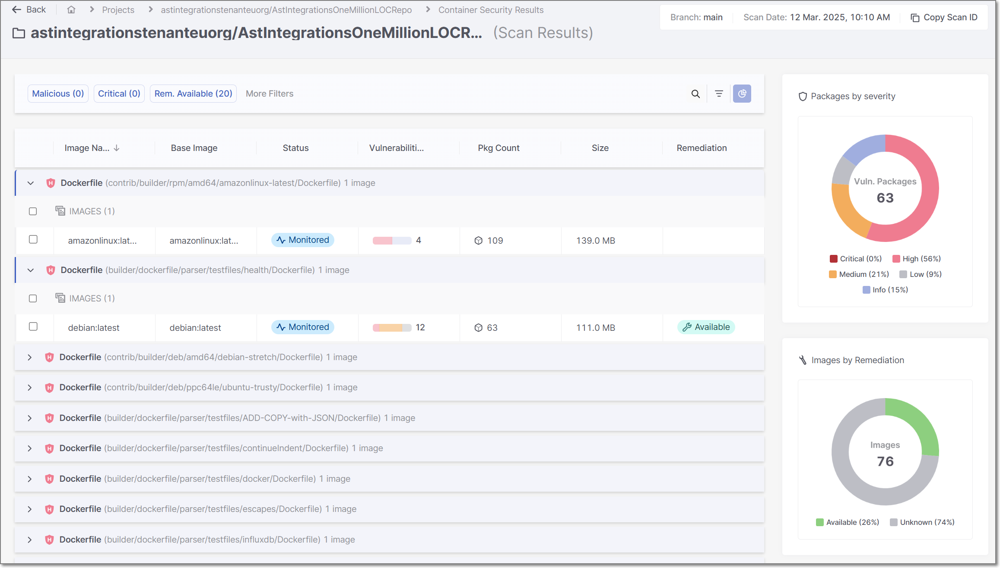
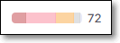
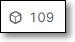
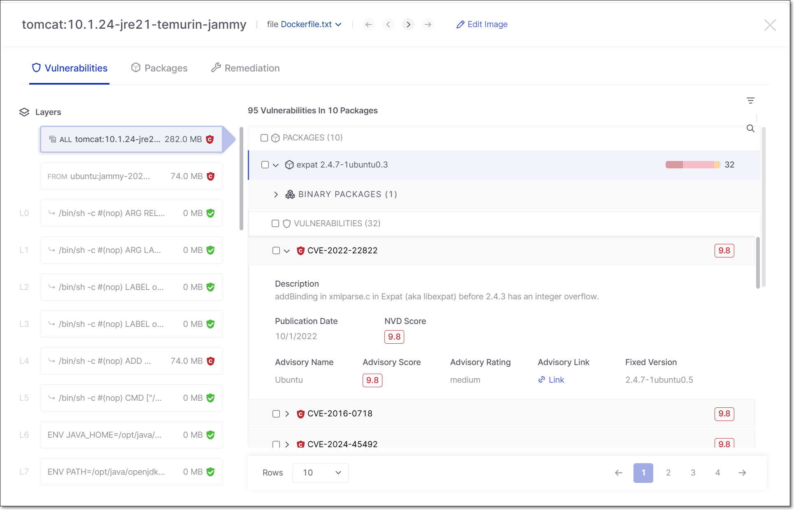
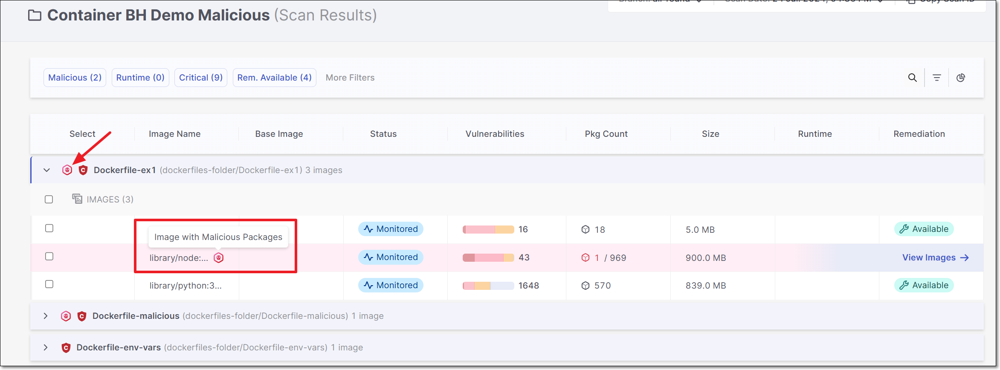
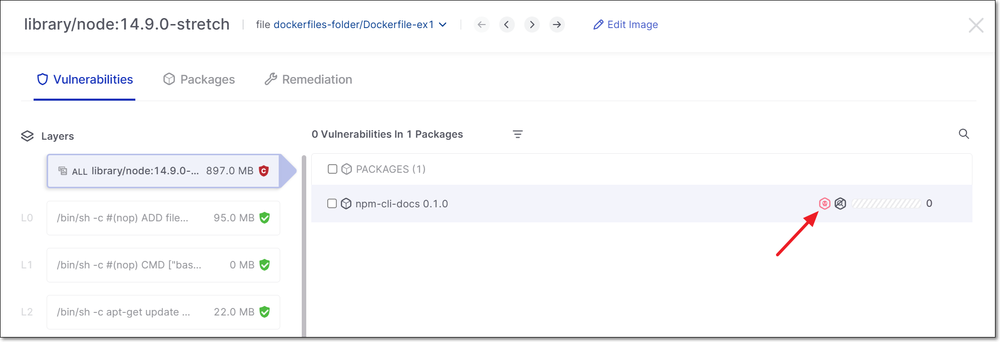
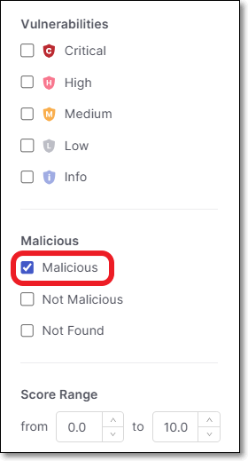
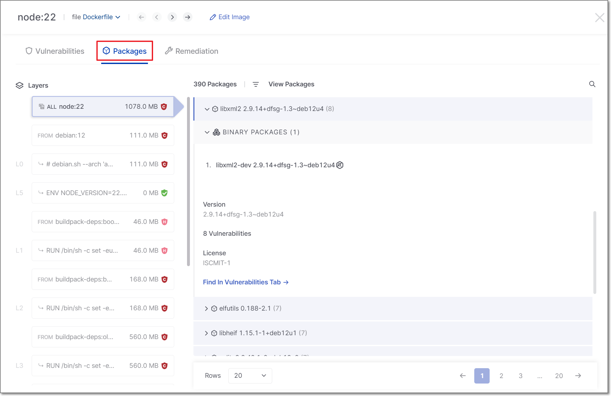
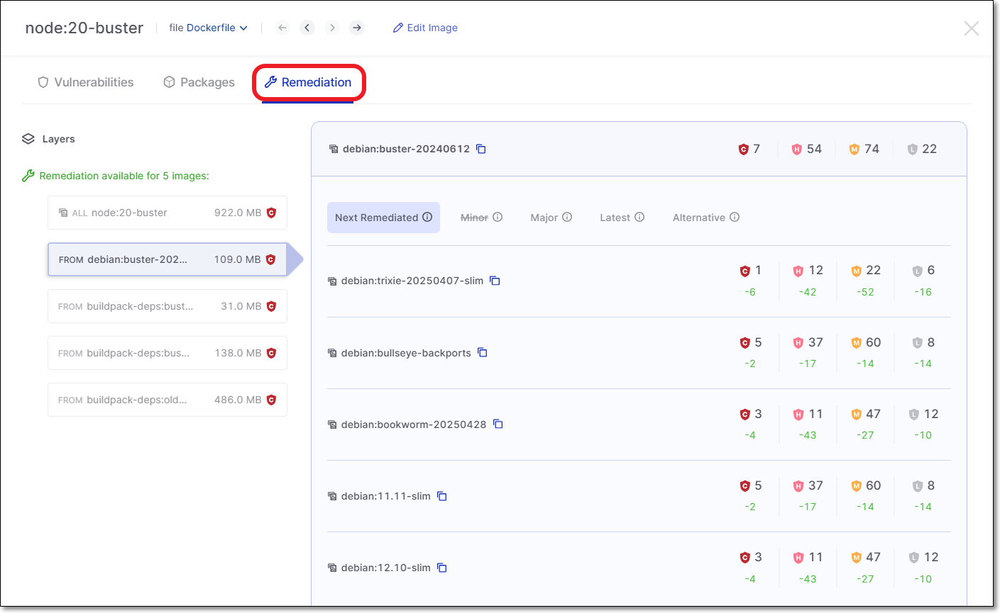

# Container Security Results Viewer

The **Container** scan results page shows info about the images identified in your project, the packages used in those images, and the vulnerabilities associated with them.

The main screen shows a list of images grouped by the Dockerfile in which they were identified. For each image, info is shown about the related packages and vulnerabilities. There are also dashboard widgets showing key metrics for the selected Dockerfile.

<figure><figcaption></figcaption></figure>

Click on an image to drill down to see detailed info about the packages and risks associated with that image.

The following table describes the information for each Image.

| **Item** | **Description** | **Possible Values** |
|---|---|---|
| **Image Name** | The name of the image that was scanned. | e.g., python |
| **Base Image** | The name of the base image. | e.g., 1.2.2-r1 |
| **Status** | The status of the image. | Monitored, Muted, Snoozed, Unresolved  For Unresolved images, hover over the status column to show a tooltip with info about why Checkmarx was unable to resolve the image.  |
| **Vulnerabilities** | A color coded bar graph indicating the number of vulnerabilities of each severity level. | e.g.,  |
| **Pkg Count** | The number of packages used in the image. | e.g.,  |
| **Size** | The memory size of the image. | e.g., 139.0 MB |
| **Remediation** | Indicates if a remediated version of the image is available for upgrade. | Available, Unknown |

## Images and Layers Viewer

This pane contains two main sections, **Images & Layers** and **Result Details**.

### Image & Layers Pane

This pane shows a separate section for each build stage showing all layers within that stage, as well as the **ALL** section that includes all layers. Next to each item, an icon indicates the overall risk level for that item.

This section serves as a navigation pane for the details tabs. When **ALL** is selected, all results are shown in the **Vulnerabilities** and **Packages** tabs. When a specific layer is selected, the **Vulnerabilities** and **Packages** tabs are filtered to show only results for that layer. The **Remediation** tab always shows recommendations for remediating the entire image.

<figure><figcaption></figcaption></figure>

#### Malicious Packages

In addition to vulnerable packages, this scanner also identifies malicious packages.

When a malicious package is identified, that package is marked with a "malicious" icon.

This icon is shown in the main table next to both the malicious file and image. You can hover over the malicious icon next to the image to get more info about the risk.

<figure><figcaption></figcaption></figure>

You can drill down to see more details about the malicious image.

<figure><figcaption></figcaption></figure>

You can also set the filter to show only malicious packages.

### Result Details Pane

The following sections describe the info shown in each of the tabs.

#### Vulnerabilities Tab

This tab shows the vulnerabilities identified in each package. Click on a package to show the associated vulnerabilities, then drill down further to see details about each one.

Each vulnerability details view provides key metadata to help you assess risk and plan remediation. The primary source of truth is the NVD (National Vulnerability Database), which provides the core scoring data:

- **Description** - A summary of the vulnerability
- **Publication date** - When the vulnerability was disclosed
- **NVD score** - The authoritative severity score used for risk assessment

Additional vendor-specific context is also shown, including the advisory name, advisory score, and advisory rating, along with a link to the official advisory. Note that advisory scores and ratings come from individual vendors and may not match the NVD score - they are provided as supplementary context, not as a replacement for the NVD score.

Where available, the affected version range and fixed version are also provided so that you can quickly determine whether a vulnerability is fixable and what version resolves it.


If a binary package shares the same CVEs as its source package, then they are shown as a single unified result and the CVEs are only counted once. The binaries are shown nested beneath the source package. If a binary package has different vulnerabilities than its source, it will appear as a separate entry.



Use the search field at the top right to search by CVE or package name. Results are filtered as you type. You can also apply filters for **State**, **Vulnerability Level**, **Malicious**, **Risk Score** or **Runtime Usage**.


<figure><figcaption></figcaption></figure>

#### Packages Tab

This tab shows a list of packages that were identified. Click on a package to show detailed information about the package.


Use the search field at the top right to search by package name. Results are filtered as you type. You can also apply filters based on runtime usage and malicious packages.


#### Remediation Tab

This tab shows info about recommended remediation actions. When you click on a base image in the navigation pane, a list of remediated versions of that image is displayed. The remediated versions are grouped by the type of version update (Next Remediated Versions, Remediated Major Versions, Remediated Minor Versions, Latest Remediated Versions, or Alternative Images). For each suggested version, the number of resolved vulnerabilities of each severity level is displayed. This enables users to choose the version that will most effectively remediate the vulnerabilities without requiring unnecessary code refactoring.

<figure><figcaption></figcaption></figure>
