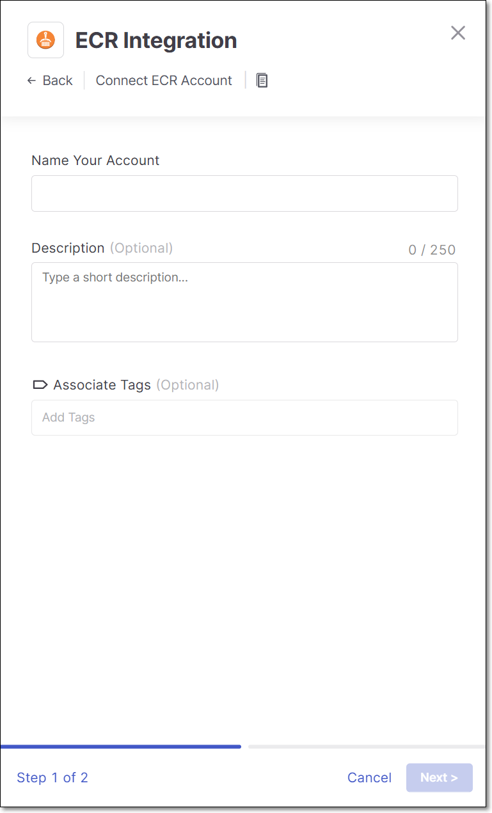
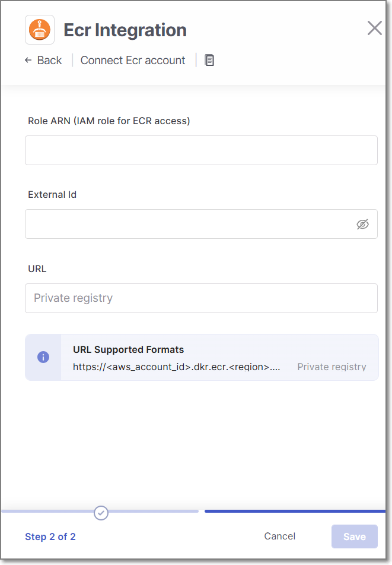

# AWS ECR Integration

Checkmarx One provides an integration with AWS ECR, enabling you to automatically pull images from your private ECR repos and scan them using the Checkmarx One Container Security scanner. The integration is done by creating an "Assume Role" in ECR (Role ARN), which grants access to Checkmarx to pull images from your repos.

We provide a convenient wizard on the Checkmarx One **Integrations** page that enables you to create the integration by submitting info about the "Assume Role" (Role ARN and External ID) that you created, and the repo that you are granting access to.


In AWS, you can create a role that grants access to multiple repos. However, in Checkmarx One you need to create a separate integration for each repo.


This integration will streamline the process of pulling and analyzing container images from private ECR registries without the need to access the customer’s AWS users directly.

## Step 1 - Create an ECR Policy

Create a policy that will grant permission to interact with the ECR registry and perform the necessary actions like checking if images exist, generating tokens for pulling images, and retrieving manifests.

**Create Policy with Permissions**

1. In the AWS IAM console, go to **Policies** and click on **Create Policy**.
2. In the **Policy editor** section, select **JSON**
3. Copy the following JSON (containing the required action permissions) and paste it into the editor.

   ```
   {
     "Version": "2012-10-17",
     "Statement": [
       {
         "Effect": "Allow",
         "Action": "ecr:GetAuthorizationToken",
         "Resource": "*"
       },
       {
         "Effect": "Allow",
         "Action": [
           "ecr:GetDownloadUrlForLayer",
           "ecr:BatchGetImage",
           "ecr:BatchCheckLayerAvailability",
           "ecr:DescribeRepositories",
           "ecr:GetRepositoryPolicy",
           "ecr:ListImages",
           "ecr:BatchCheckLayerAvailability",
           "ecr:DescribeImages"
         ],
         "Resource": [
           "<your_repo_url01>",
           "<your_repo_url02>"
         ]
       }
     ]
   }
   ```
4. In the "Resource" section at the bottom of the JSON, replace the placeholders with the names of one or more repos that you would like to allow Checkmarx One to access.

   
   You can put "\*" to replace the placeholders if you would like to allow access to all repos in your account.
   
5. Click **Next**.
6. On the **Review and create** screen, enter a **Policy Name** (e.g., **TrustedEcrPullPolicyCheckmarx**) and a **Description** (optional).
7. Click **Create Policy**.

## Step 2 - Create an Assume Role

**Create a Role ARN and attach the created Policy**

1. In the AWS IAM console, go to **Roles** and click on **Create role**.
2. Select **Custom trust policy**.
3. Under **Use case**, select **Elastic Container Registry**.
4. Click **Next**.
5. In the **Add Permissions** section, search for the Policy that you created in Step 1 (e.g TrustedEcrPullPolicyCheckmarx) and select the checkbox.
6. On the **Name, review, and create** screen, copy the following JSON (which grants access to a pre-configured Checkmarx user via an AssumeRole) and paste it into the **Trust policy** section.

   ```
   {
       "Version": "2012-10-17",
       "Statement": [
           {
               "Effect": "Allow",
               "Principal": {
                   "AWS": "arn:aws:iam::842737970584:role/CheckmarxCrossAccountScannerRole"
               },
               "Action": "sts:AssumeRole",
               "Condition": {
                   "StringEquals": {
                       "sts:ExternalId": "<specify_external_id>"
                   }
               }
           }
       ]
   }
   ```
7. In the JSON, under "Condition" > "StringEquals", replace the placeholder by specifying an **ExternalId** that you will use as an extra layer of security for this role. **Limitations:** up to 1224 characters, A-Z, a-z,0-9,+=.@-_:/ )

   
   Make a note of this value, as you will need to provide it in the Checkmarx One integration wizard.
   
8. Click **Next**.
9. Enter a meaningful **Role name** (e.g., TrustedEcrPullRoleCheckmarx) and a Description (optional).
10. Click **Create Role**.
11. In the **Summary** section of the role, make a note of the **ARN**, as you will need to provide this in the Checkmarx One integration wizard.

## Step 3 - Use the Checkmarx One Wizard to Set Up the Integration

**To set up an ECR integration:**

1. In the main navigation, select **Integrations** > **Cloud Connections**.
2. In the **Setup** tab, under **Private Registries for Containers**, hover over the **ECR** tile and click on **Configuration**.
3. In the side panel that opens, click **Start**.

   The **ECR Integration** wizard opens.

   
4. **Name Your Account** and optionally fill in the **Description** and **Associate Tags** fields, then click **Next**.
5. In the **Role ARN** field, enter the Role ARN of the ECR role that you created in Step 2.

   
6. In the **External Id** field, enter the ExternalId that you specified in your ECR **Trust policy**.
7. In the **URL** field, enter the URL of the ECR repo that you would like to allow Checkmarx One to access using the format `<aws_account_id>.dkr.ecr.<region>.amazonaws.com/<repository_name>`.

   
   You need to create a separate integration for each repo.
   
8. Click **Add Account**.

## Monitoring Integration Status

You can monitor the status of your ECR integrations to see whether or not the integration is connected. Possible statuses are:

- **Pending** - The integration was just set up and hasn't connected yet.
- **Connected** - The integration is running and you are able to scan images in your ECR repo.
- **Disconnected** - Checkmarx One is not currently able to access your private ECR repo.

**To monitor the integration status:**

1. In the main navigation, select **Integrations** > **Cloud Connections**.
2. In the **Cloud Connections** tab, check the **Status** column for each of your integrations.
