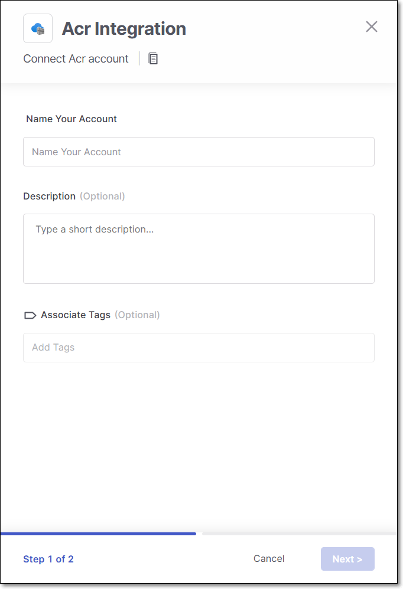
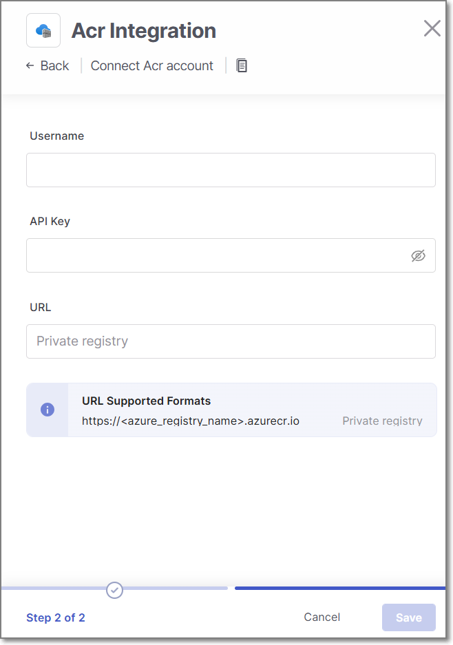

# Azure Container Registry (ACR) Integration

Checkmarx One provides an integration with Azure Container Registry (ACR), enabling you to automatically pull images from your private Azure registry and scan them using the Checkmarx One Container Security scanner. We provide a convenient wizard on the Checkmarx One **Integrations** page that enables you to submit your Azure credentials and create the integration.

## Prerequisites

- Authentication credentials for your Azure repository. The integration accepts two types of credentials:

  - [Service Principal App](https://learn.microsoft.com/en-us/azure/container-registry/container-registry-auth-service-principal), with Client ID and Secret
  - [Non-Microsoft Entra token-based repository permissions](https://learn.microsoft.com/en-us/azure/container-registry/container-registry-token-based-repository-permissions)

## Setting up an Integration

**To set up an Azure Container Registry Integration:**

1. In the main menu, select **Integrations** > **Cloud Connections**.
2. In the **Setup** tab, under **Private Registries for Containers**, hover over the **ACR** tile and click on **Configuration**.
3. In the side panel that opens, click **Start**.

   The **ACR Integration** wizard opens.

   
4. **Name Your Account** and optionally fill in the **Description** and **Associate Tags** fields, then click **Next**.
5. Under **Username** enter Service Principal App (Client) ID **or** for token based permissions enter your username.

   
6. In the **API Key** field, enter your Service Principal Password (Client Secret) or for token based permission enter your fine grained access scope token.
7. In the **URL** field, enter the URL for your Azure account using the format `https://<azure_registry_name>.azurecr.io`.
8. Click **Add Account**.

## Monitoring Integration Status

You can monitor the status of your ACR integrations to verify whether the integration is active. The possible statuses are:

- **Pending**: The integration was created but has not connected yet.
- **Connected**: The integration is active, and you can scan images in your ACR registry.
- **Disconnected**: Checkmarx One is currently unable to access your ACR registry.
- **Not Applicable**: This status appears only for private registries where connection status cannot be determined.

**To monitor the integration status:**

1. In the main navigation, select **Integrations** > **Cloud Connections**.
2. In the **Cloud Connections** tab, check the **Status** column for each of your integrations.
