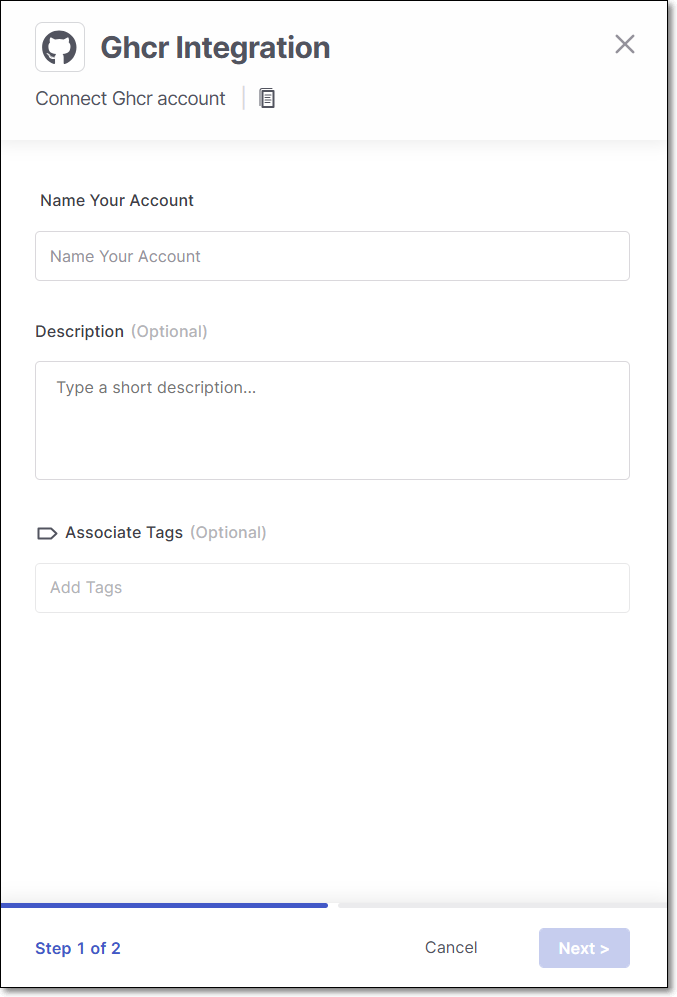
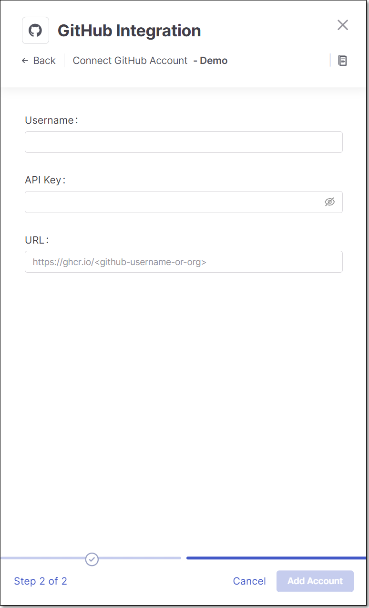

# GitHub Container Registry Integration

Checkmarx One provides an integration with GitHub Container Registry (GHCR), enabling you to automatically pull images from your private GitHub registry and scan them using the Checkmarx One Container Security scanner. We provide a convenient wizard on the Checkmarx One **Integrations** page that enables you to submit your GitHub credentials and create the integration.

## Prerequisites

- A Personal Access Token for the repository where the images are located, with permissions `read:packages` and `repo`.

  
  In the GitHub portal go to **Settings** > **Developer Settings** > **Personal Access Tokens** and generate the token.
  

## Setting up an Integration

**To set up a GitHub Private Registry Integration:**

1. In the main navigation, select **Integrations** > **Cloud Connections**.
2. In the **Setup** tab, under **Private Registries for Containers**, hover over the **GitHub** tile and click on **Configuration.**
3. In the side panel that opens, click **Start**.

   The **GitHub Private Registry Integration** wizard opens.

   <figure><figcaption></figcaption></figure>
4. **Name Your Account** and optionally fill in the **Description** and **Associate Tags** fields, then click **Next**.
5. Under **Username** enter the Username for your GitHub account.

   <figure><figcaption></figcaption></figure>
6. In the **API Key** field, enter the Personal Access Token for your GitHub registry (as described above in Prerequisites).
7. In the **URL** field, enter the URL for your GitHub account using the format `https://ghcr.io/<github-username-or-org>`.
8. Click **Add Account**.

## Monitoring Integration Status

You can monitor the status of your GitHub integrations to see whether or not the integration is connected. Possible statuses are:

- **Pending** - The integration was just set up and hasn't connected yet.
- **Connected** - The integration is running and you are able to scan images in your GitHub registry.
- **Disconnected** - Checkmarx One is not currently able to access your private GitHub registry.

**To monitor the integration status:**

1. In the main navigation, select **Integrations** > **Cloud Connections**.
2. In the **Cloud Connections** tab, check the **Status** column for each of your integrations.
