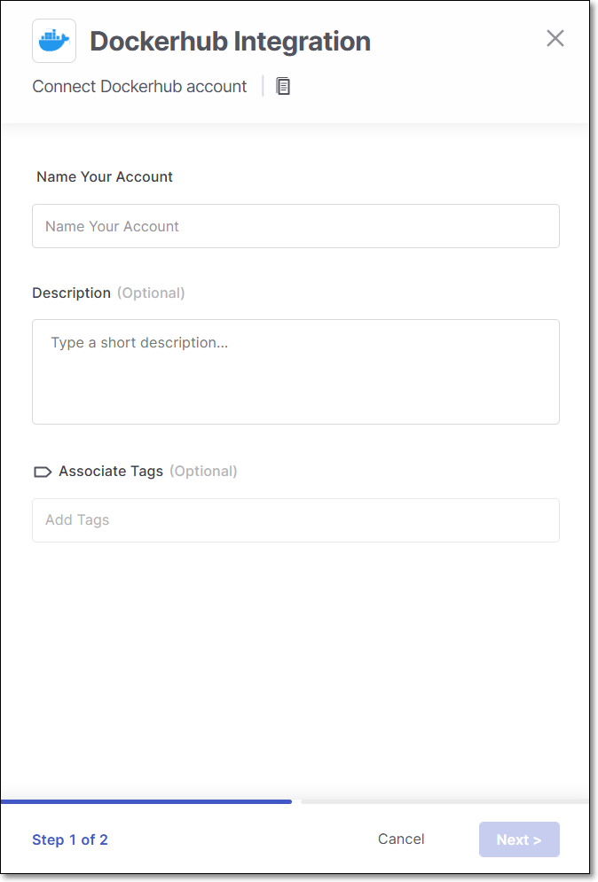
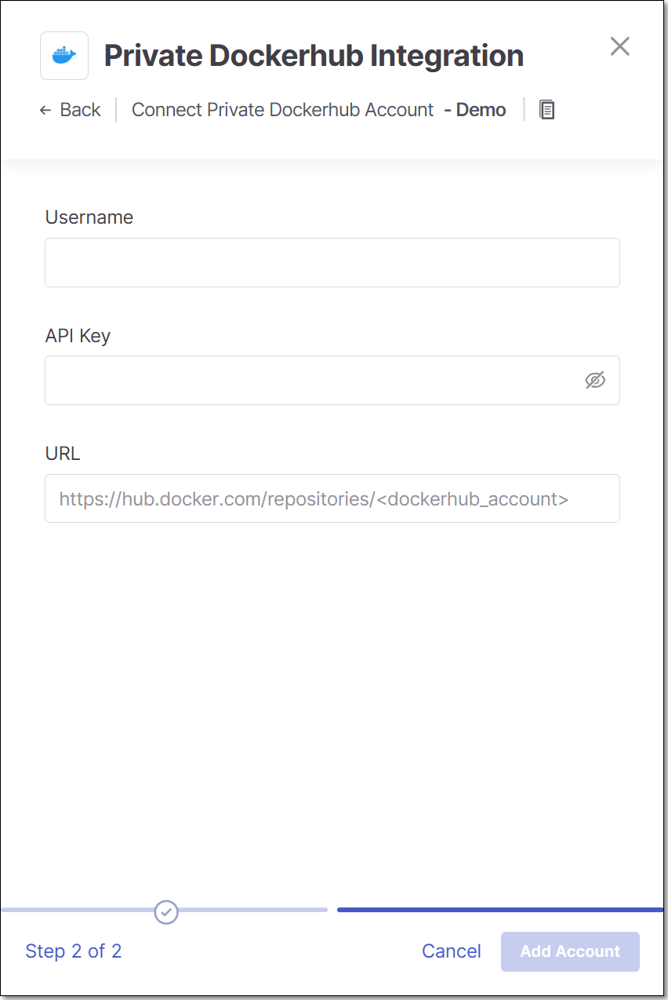

# Private DockerHub Integration

Checkmarx One provides an integration with Private DockerHub, enabling you to automatically pull images from your Private DockerHub and scan them using the Checkmarx One Container Security scanner. We provide a convenient wizard on the Checkmarx One **Integrations** page that enables you to submit your DockerHub credentials and create the integration.

## Prerequisites

- A Personal Access Token (API Key) for the repository where the images are located, with read access to the container registry.

  
  Log in to DockerHub and go to **Account Settings** > under **Security** > generate a **Personal Access Token** (API Key).
  

## Limitations

- The integration is not effective for scans run via the Checkmarx One CLI tool or associated plugins.

## Setting up an Integration

**To set up a Private DockerHub Integration:**

1. In the main navigation, select **Integrations** > **Cloud Connections**.
2. In the **Setup** tab, under **Private Registries for Containers**, click on the **Private DockerHub** tile.
3. In the side panel that opens, click **Start**.

   The **Private DockerHub Integration** wizard opens.

   <figure><figcaption></figcaption></figure>
4. **Name Your Account** and optionally fill in the **Description** and **Associate Tags** fields, then click **Next**.
5. Under **Username** enter the Username for your DockerHub account.

   <figure><figcaption></figcaption></figure>
6. In the **API Key** field, enter the Personal Access for your DockerHub (as described above in Prerequisites).
7. In the **URL** field, enter the URL for your DockerHub account using the format `https://hub.docker.com/repositories/<dockerhub_account>`.
8. Click **Add Account**.

## Monitoring Integration Status

You can monitor the status of your private DockerHub integrations to see whether or not the integration is connected. Possible statuses are:

- **Pending** - The integration was just set up and hasn't connected yet.
- **Connected** - The integration is running and you are able to scan images in your private DockerHub.
- **Disconnected** - Checkmarx One is not currently able to access your private DockerHub.

**To monitor the integration status:**

1. In the main navigation, select **Integrations** > **Cloud Connections**.
2. In the **Cloud Connections** tab, check the **Status** column for each of your integrations.
