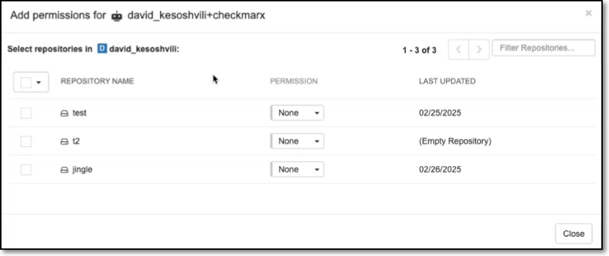
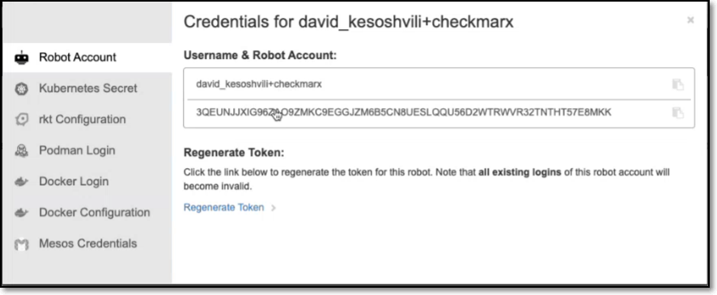
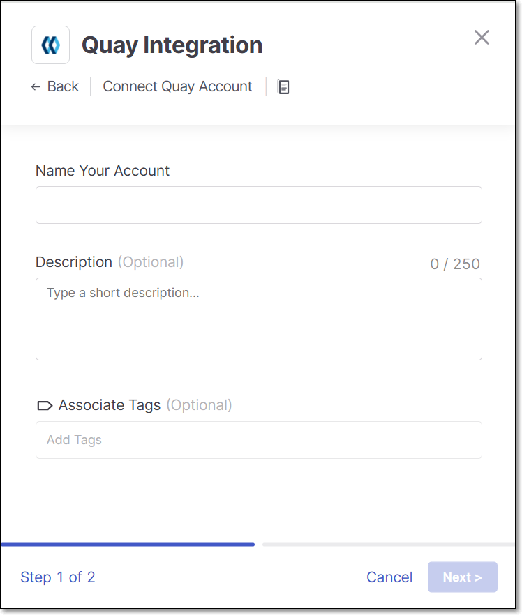

# Red Hat Quay Integration

Checkmarx One provides an integration with Red Hat Quay repositories, enabling you to automatically pull images from your private Quay repos and scan them using the Checkmarx One Container Security scanner. We provide a convenient wizard on the Checkmarx One **Integrations** page that enables you to submit your Quay credentials and create the integration.

## Prerequisites

- A Quay user with the ability to create a "Robot Account".

## Step 1 - Creating a Robot Account in Quay

**To create a Robot account in Quay:**

1. In the Quay console, go to **Account Settings** > **Robot Accounts**.
2. Click on the **+ Create Robot Account** button.
3. In the dialog that opens, specify a meaningful name for the account (e.g., Checkmarx Integration), and optionally add a description. Then, click **Create robot account**.

   A window opens showing a list of repos in your account.

   
4. Select the checkbox next to each repo that you would like to integrate with Checkmarx.
5. In the **Permissions** column, set **Read** access for each of the repos that you selected.
6. Click on the **Add permissions** button.

   The new robot account is created and shown on the **Robot Accounts** page.
7. Click on the name of the robot account.

   A dialog opens showing the name of the account and the authentication token (API Key).

   
8. Save the robot account name and token for use in the Checkmarx integration wizard, as described below.

## Step 2 - Setting up the Integration

The Quay integration is configured at the organization level. Checkmarx One will only be able to access the specific repos you granted Read access to in the Robot Account created in the previous step.

**To set up the Quay Integration:**

1. In the main navigation, select **Integrations** > **Cloud Connections**.
2. In the **Setup** tab, under **Private Registries for Containers**, hover over the **Quay** tile and click on **Configuration**.
3. In the side panel that opens, click **Start**.

   The **Quay Integration** wizard opens.

   
4. **Name Your Account** and optionally fill in the **Description** and **Associate Tags** fields, then click **Next**.
5. Under **Username** enter the Username for your Quay robot account.
6. In the **API Key** field, enter the API key (access token) for your Quay robot account.
7. In the **URL** field, enter the URL for your Quay organization, using the format `https://quay.io/repository/<quay_organization>`.

   Alternatively, if you have configured a CxLink to access this repo, enter the CxLink (using the following format: https://\<subdomain>.\<domain>/link/\<UUID>). Learn more about CxLink here.
8. Click **Add Account**.

## Monitoring Integration Status

You can monitor the status of your Quay integrations to see whether or not the integration is connected. Possible statuses are:

- **Pending** - The integration was just set up and hasn't connected yet.
- **Connected** - The integration is active, and Checkmarx One is able to pull and scan images from your Quay repositories.
- **Disconnected** - Checkmarx One is unable to access your Quay repositories. This may be due to an invalid or expired robot account token, insufficient repo permissions, or a network connectivity issue. Verify that your robot account credentials are valid and that Read access is correctly configured for all intended repos, then re-enter your credentials in the integration wizard.

**To monitor the integration status:**

1. In the main navigation, select **Integrations** > **Cloud Connections**.
2. In the **Cloud Connections** tab, check the **Status** column for each of your integrations.
