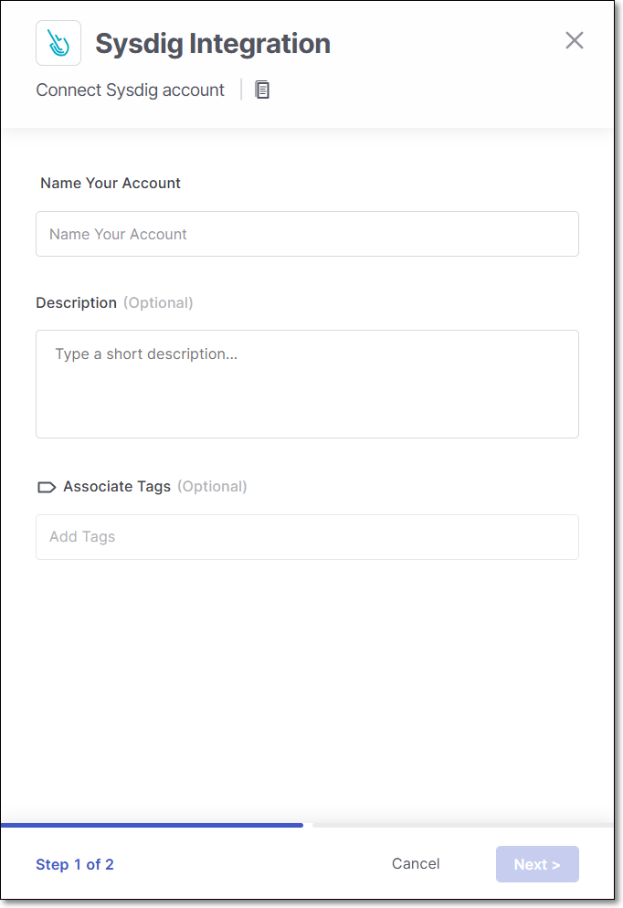
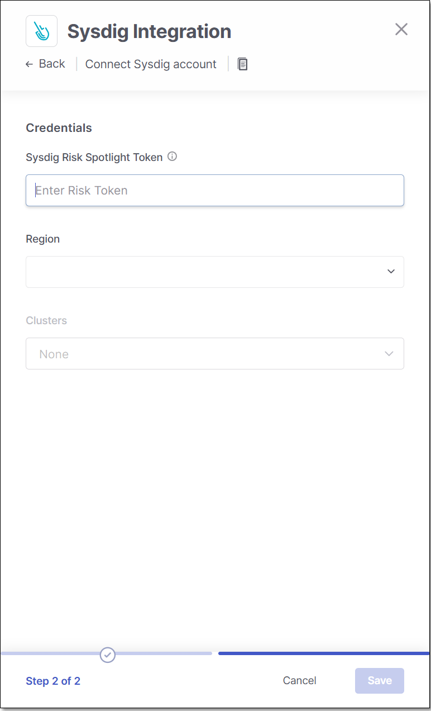
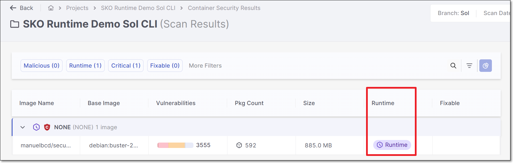
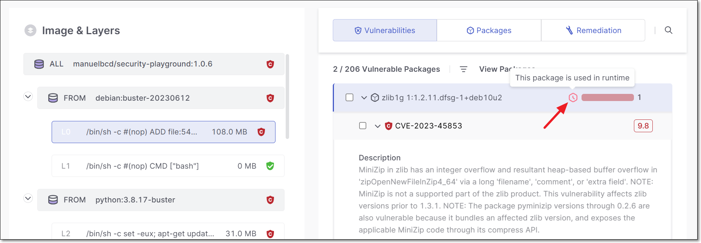
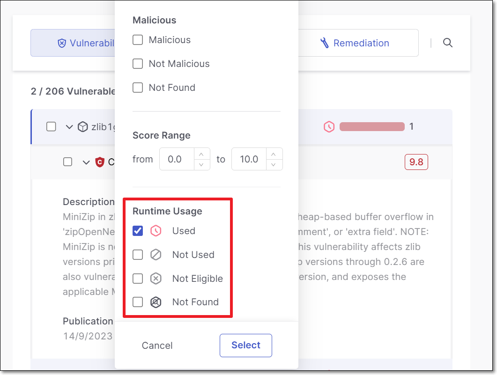

# Sysdig Integration - Runtime Usage

We have implemented an integration for the Checkmarx One Container Security scanner with [Sysdig Risk Spotlight](https://docs.sysdig.com/en/docs/sysdig-secure/vulnerabilities/runtime/risk-spotlight/). This integration identifies runtime usage of container packages. Once the integration is configured, the runtime usage data that was identified by Sysdig is shown as part of the Checkmarx Container Security scan results. The runtime data is updated approx. every 10 minutes. This provides important insights for prioritizing remediation activities based on actual risk of exploitation.

## Prerequisites

- You need to have a Sysdig license and you need to obtain a **Sysdig Risk Spotlight Token** for your account (can be found in your Sysdig **Account Settings**).
- Make sure that your Sysdig agents are configured to cover all images that you will be scanning in Checkmarx.

## Limitations

- Supported only for images scanned via the Checkmarx One CLI using the `--container-images` flag, see [here](README.md#running-container-security-scans-via-the-cli).
- Sysdig doesn't provide runtime data for base-images.

## Setting up an Integration


It is possible to set up several separate Sysdig integrations in your account, for example if you have clusters in several different regions.


**To set up a Sysdig integration:**

1. In the main navigation, select **Integrations** > **Cloud Connections**.
2. In the **Setup** tab, under **Runtime & Cloud**, hover over the **Sysdig** tile and click on **Configuration**.
3. In the side panel that opens, click **Start**.

   The **Sysdig Integration** wizard opens.

   
4. **Name Your Account** and optionally fill in the **Description** and **Associate Tags** fields, then click **Next**.
5. Under **Sysdig Risk Spotlight Token** enter the Risk Spotlight Token for your Sysdig account.

   
   This token can be found in the Account Settings of your Sysdig account.
   

   
6. In the **Region** field, select your Sysdig region.
7. In the **Clusters** field, select the clusters you would like to include in the integration (multi-select).
8. Click **Save**.

   The integration is set up and you are redirected to the **Integrations** > **Cloud Connections** tab where you can monitor the connection status. After a few minutes the integration should be **Connected**. Once connected, in the Container Security scan results you will begin seeing runtime data.

   
   Runtime data is only shown for images that were scanned via the CLI using the `--container-images` flag.
   

## Monitoring Integration Status

You can monitor the status of your Sysdig integrations to see whether or not the integration is connected. Possible statuses are:

- **Pending** - The integration was just set up and hasn't connected yet.
- **Connected** - The integration is running and runtime data is being updated every few minutes.
- **Disconnected**- Checkmarx One is not currently able to access data from your Sysdig environment. This may be because the initial integration failed or because of a connectivity issue that arose after the initial set up. When the integration becomes disconnected, the runtime data is no longer shown in your account.

**To monitor the integration status:**

1. In the main navigation, select **Integrations** > **Cloud Connections**.
2. In the **Cloud Connections** tab, check the **Status** column for each of your integrations.

   The different statuses are indicated as follows:

   - **Pending** - an orange icon with the word "pending."
   - **Connected** - a green icon with the name of the connected consumer.
   - **Disconnected** - a red icon with the name of the disconnected consumer.

## Viewing Runtime Data

Once the integration has been configured for your account, whenever you run a scan (currently supported only for scans run via the CLI using the `--container-images` flag) on an image that is covered by your Sysdig deployment, the Checkmarx scan results are supplemented with the runtime data.

On the **Container Scan Results** screen, there is a column **Runtime** which indicates which images are used in runtime.

Possible values for the image-level **Runtime Usage** are:

- **Runtime** - Runtime usage of this image was identified.
- **Unknown** - No runtime usage was identified.

You can drill down to see details about the packages in the image. An icon indicating runtime usage is shown in the **Vulnerabilities** tab, as part of the header bar for each vulnerable package.

Possible values for the package-level **Runtime Usage** are:

- **Used** - Runtime usage of this package was identified.
- **Not Used** - No runtime usage of this package was identified.
- **Not Eligible** - Runtime analysis isn’t supported for this package (for example, base-images aren't scanned by Sysdig).
- **Not Found** - We couldn’t identify runtime usage because this package isn’t covered by your runtime security integration. Try adjusting the configuration of your runtime security integration so that all relevant clusters are covered.

You can filter results to show only packages with specific runtime usage. For example, you can show only packages that are used in runtime.

