# Triaging Container Security Results

There are two ways by which you can triage Container Security results:

- **Management of Risks** - change the state and/or severity of a specific risk.
- **Management of Images/Packages** - change the state of an image or package to Muted or temporarily Snoozed.

## Triaging Vulnerabilities

Checkmarx Container Security tracks specific risk instances throughout your software development lifecycle (SDLC). After reviewing the results of a scan, you can triage the results and modify these predicates accordingly. If the identical risk instance is identified in subsequent scans of the same project, the predicate will automatically be applied to that instance.

A risk instance is defined as a specific risk affecting a specific package in a specific project. Therefore, changes that you make to the predicate of a risk aren’t applied to the identical risk when it is found in a different project. Also, if the risk affects other packages in your project, the changes won’t be applied to those risks.

Each risk instance has a predicate associated with it, which is comprised of the **State**, **Severity** and **Comments**.


The following permissions enable users to triage risks:

- update-result-state-not-exploitable (can change to this state only)
- update-result-state-propose-not-exploitable (can change to this state only)
- update-result-states (can change all states except not-exploitable; can’t change the severity)
- update-result-severity (can change only severities)

For additional details about triage permissions, see here.


### Triaging Risk State and Severity

A risk state is assigned to each risk instance in your Project. Initially, the state of each new risk is set as **To Verify**, indicating that it is a new finding that hasn’t yet been assessed by your AppSec team. The severity is determined primarily based on the CVSS score of the vulnerability. Your AppSec team can adjust the risk state to one of the following options:

- **Not Exploitable** - Select this state if your team has determined that this risk doesn’t pose a threat to your application (and isn’t expected to cause a risk at any time in the future).
- **Proposed Not Exploitable** - Select this state if your team has suggested tentatively that this risk doesn’t pose a threat to your application.
- **Confirmed** - Select this state if your team has confirmed that this risk does pose a threat and requires mitigation.
- **Urgent** - Select this state if your team has determined that this risk poses an imminent threat and requires urgent mitigation.


The states mentioned above are pre-configured for all Checkmarx One accounts. In addition, you can create custom states in your account. Once they are created, you can assign those custom states to results.

Custom states is currently supported for SAST, SCA, IaC Security and Container Security results. It is not yet available for all tenant accounts. For more info, see Custom States.


Based on your AppSec team's determination, the score can be adjusted to a score between 0.0 and 10.0 with the following severity breakdown:

- Critical - 9.0 to 10.0
- High - 7.0 to 8.9
- Medium - 4.0 to 6.9
- Low - 0.1 to 3.9
- Info - 0.0

### Triaging a Single Vulnerability

**To change the risk state and severity:**

1. On the Projects page, hover over the **Results** button for the desired project and select **Container Security**.

   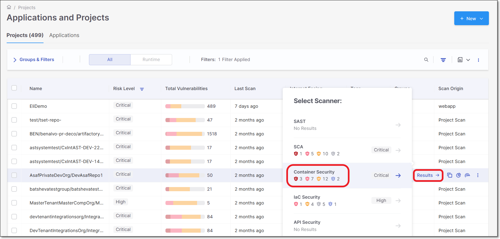
2. On the **Scan Results** page, hover over the desired Image.
3. Click on the **View Images** button that appears on the Image row.

   <figure>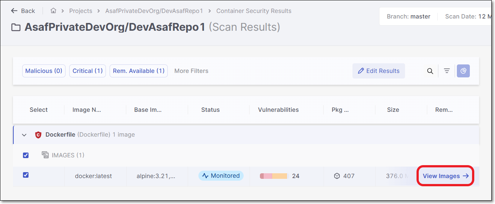<figcaption></figcaption></figure>

   The **Image Details** panel opens.
4. Select the desired layer from the **Layers** list.

   The packages used in the layer will be displayed to the right.

   <figure>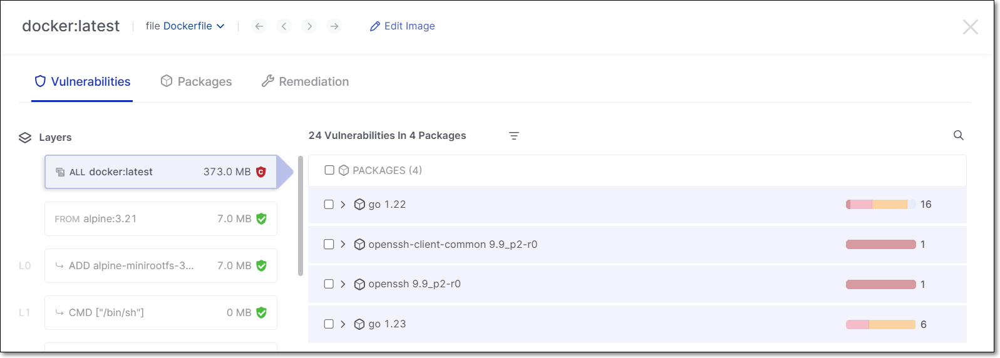<figcaption></figcaption></figure>
5. To view the vulnerabilities, expand the package by clicking on the arrow icon.
6. Hover over the desired vulnerability and click on the **Edit** button that appears.

   <figure>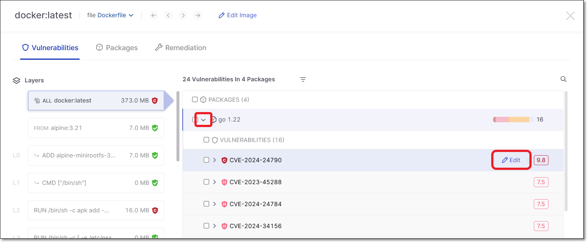<figcaption></figcaption></figure>

   The **Edit Result** panel appears.

   <figure>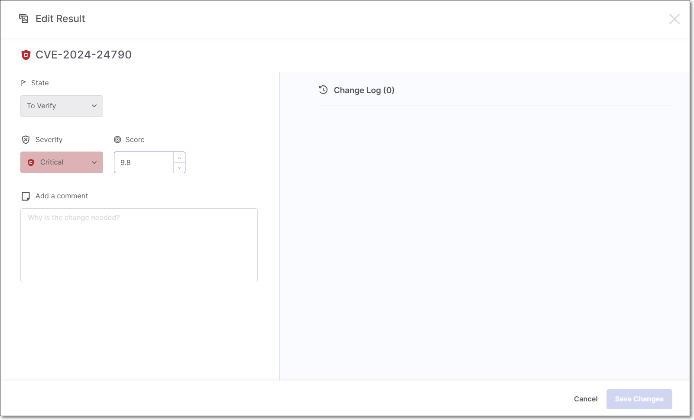<figcaption></figcaption></figure>
7. To change the state, click on the **State** field and select the desired state from the drop-down list.
8. To change the severity, click on the **Severity** field and select the desired severity from the drop-down list.
9. To change the score, enter the new score in the **Score** field, or use the arrows to raise or lower the score.
10. In the **Add a Comment** section, enter your comment.
11. Click **Save Changes**.

### Triaging Vulnerabilities - Bulk Action

**To bulk action triage vulnerabilities:**

1. In the **Image Details** panel **Vulnerabilities** tab, drill down to show the vulnerabilities in each package and select the checkbox next to each vulnerability that you would like to include in the bulk action triage. Then, click on **Edit Properties**.

   <figure>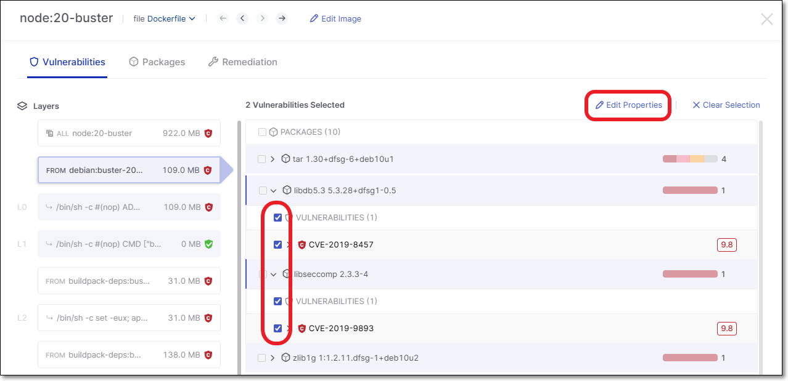<figcaption></figcaption></figure>

   All of the selected vulnerabilities are shown and you can click on each one to see the relevant details.
2. Make changes to the **Severity**, **State**, **Score**, and **Add a Comment**.

   <figure>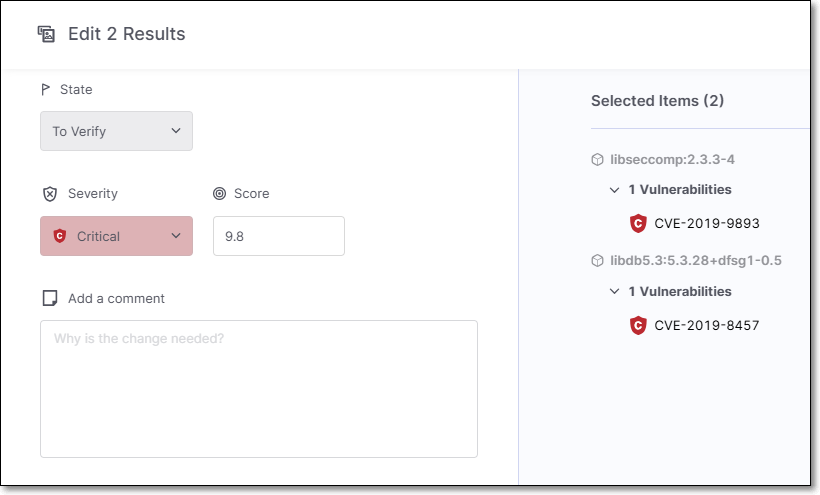<figcaption></figcaption></figure>
3. Click **Save Changes**.

   The changes are applied to all of the selected vulnerabilities.

## Management of Images and Packages

You can reduce noise in your system when you feel that a certain image or package (in the Container Security results viewer) does not pose a threat or where there is no available fixed version of the image or package. This is done by changing the State of the image/package as needed. By default all images and packages are assigned the state **Monitored**. You can change the state to **Muted** so that the vulnerabilities associated with that image/package won’t be shown as risks to your project. You can also “**Snooze**” an image/package so that it is muted for a fixed period of time after which it will automatically revert back to being a regular monitored image/package.

### Changing the State of an Image or Package

The image/package state can be modified based on your AppSec team's decision whether to have the image/package affect the project score or have it muted permanently or temporarily (snoozed).

- **Monitored** (default) - vulnerabilities are displayed based on the risk score.
- **Muted** - vulnerabilities associated with the package will permanently not be shown as risks to your project.
- **Snoozed** - vulnerabilities associated with the package will be muted temporarily. It is required to choose a date for the snooze to expire.


Only users with the roles `update-package-state-mute` and `update-package-state-mute-if-in-group` can mute images/packages.



Only users with the roles `update-package-state-snooze` and `update-package-state-snooze-if-in-group` can snooze images/packages.


### Triaging a Single Image

**To change the image state:**

1. On the Projects page, hover over the **Results** button for the desired project and select **Container Security**.

   
2. On the **Scan Results** page, select the checkbox for the desired Image.
3. Click on the **Edit Results** button that appears on the header bar.

   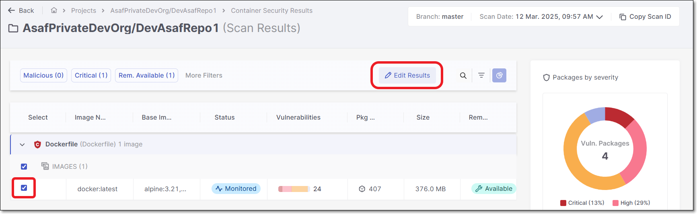

   The **Edit Image** panel opens.

   <figure>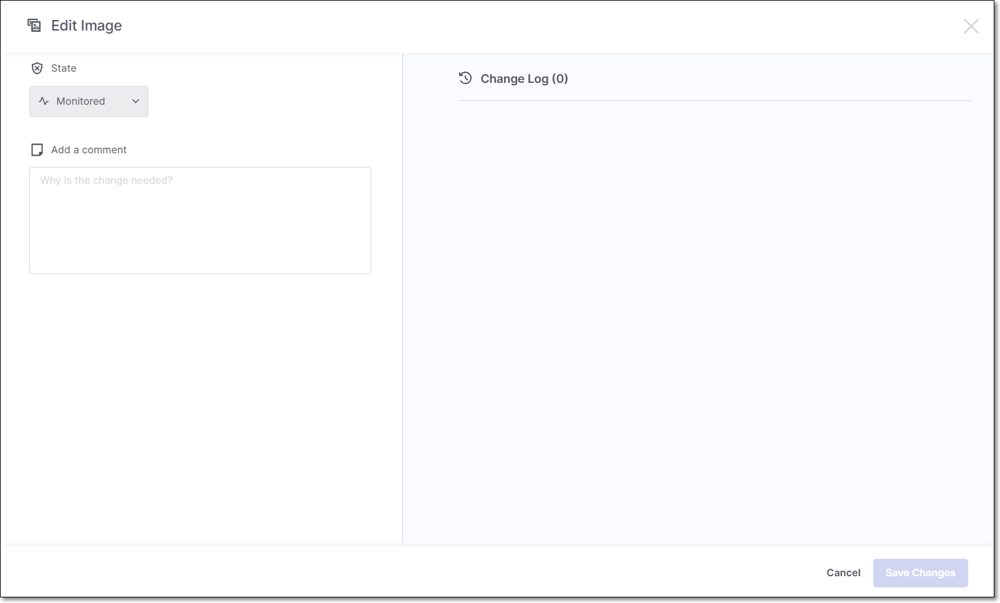<figcaption></figcaption></figure>
4. To change the state, click on the **State** field and select the desired state from the drop-down list.
5. In the **Add a Comment** section, enter your comment.
6. Click **Save Changes**.

### Triaging Images - Bulk Action

To triage the state of multiple images:

1. In the **Scan Results** page, select the checkbox next to each Image that you would like to include in the bulk action triage. Then, click on **Edit Results**.

   <figure>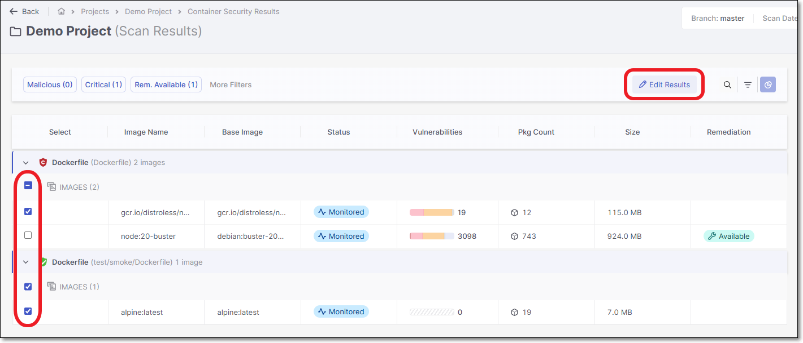<figcaption></figcaption></figure>
2. Make changes to the **State** and **Add a Comment**.

   <figure>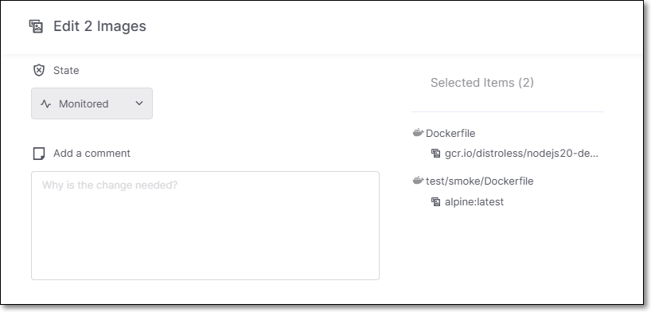<figcaption></figcaption></figure>
3. Click **Save Changes**.

   The changes are applied to all of the selected Images.

### Triaging a Single Package

**To change the package state:**

1. On the Projects page, hover over the **Results** button for the desired project and select **Container Security**.

   <figure><figcaption></figcaption></figure>
2. On the **Scan Results** page, hover over the desired Image.
3. Click on the **View Images** button that appears on the Image row.

   <figure><figcaption></figcaption></figure>

   The **Image Details** panel opens.
4. Select the desired layer from the **Layers** list.

   The packages used in the layer will be displayed to the right.

   <figure><figcaption></figcaption></figure>
5. Select the checkbox next to the desired package.
6. Click on the **Edit Properties** button that appears over the packages list.

   <figure>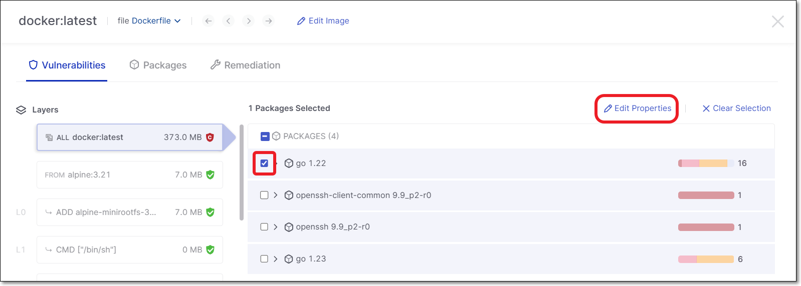<figcaption></figcaption></figure>

   The **Edit Package** panel appears.

   <figure>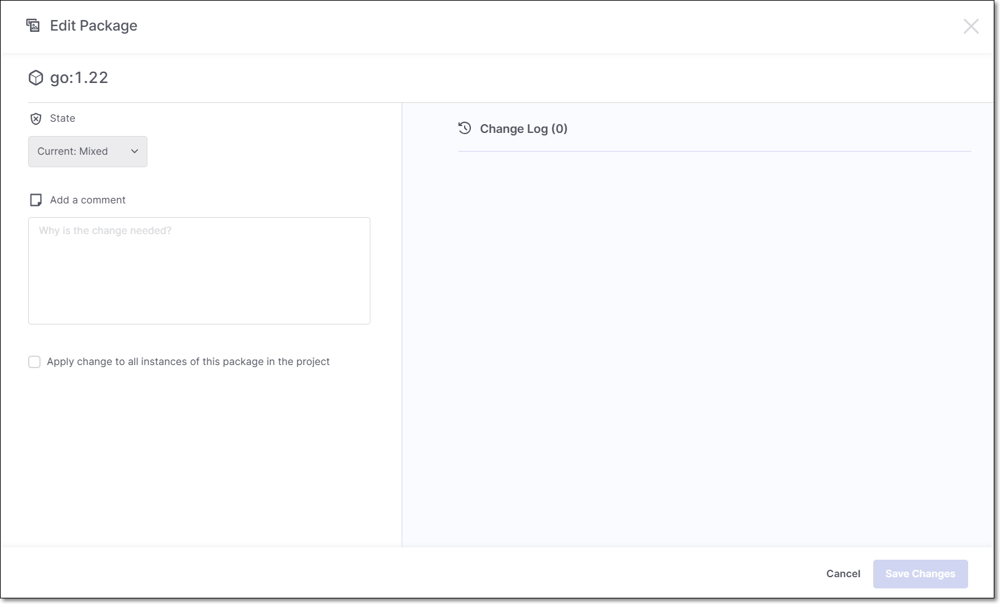<figcaption></figcaption></figure>
7. To change the state, click on the **State** field and select the desired state from the drop-down list.
8. In the **Add a Comment** section, enter your comment.
9. If desired, select the **Apply change to all instances of this package in the project** checkbox.

   
   Selecting **Apply change to all instances of this package in the project** will propagate the state change to every occurrence of each selected package across the project. This applies independently to each package in the bulk selection.
   
10. Click **Save Changes**.

### Triaging Packages - Bulk Action

**To bulk action triage packages:**

1. In the **Image Details** panel **Vulnerabilities** tab, select the checkbox next to each package that you would like to include in the bulk action triage. Then, click on **Edit Properties**.

   <figure>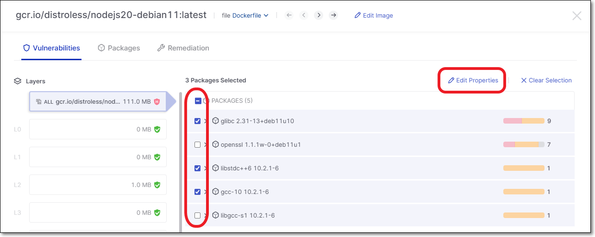<figcaption></figcaption></figure>
2. Make changes to the **State**, **Add a Comment** and **Apply change to all instances of this package in the project**.

   <figure>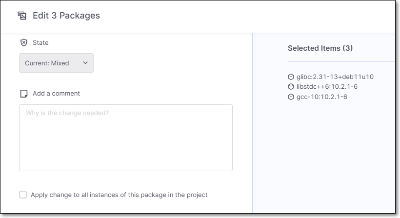<figcaption></figcaption></figure>
3. Click **Save Changes**.

   The changes are applied to all of the selected packages.
