# IaC Security Results Viewer

The **IaC Security Result** page contains 2 main sections that work in synergy.

- Vulnerabilities Table
- Code Viewer

## Vulnerabilities Table

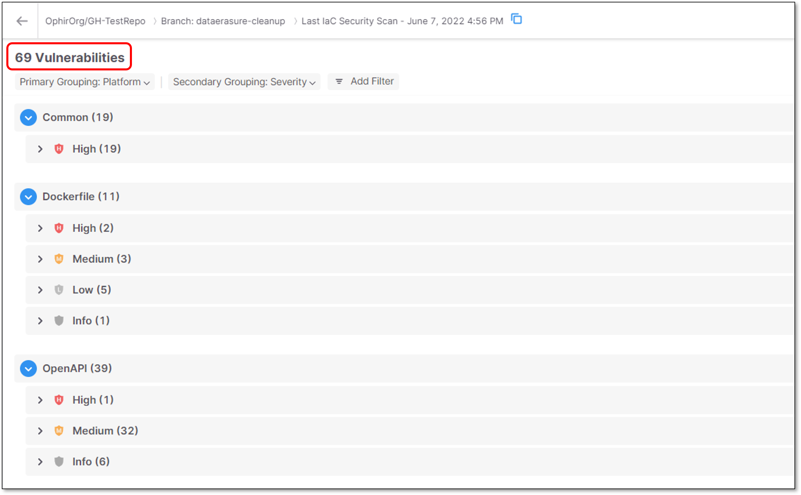

The **Vulnerabilities** **Table** displays the list of vulnerabilities that were found during the last IaC Security scan of the Project.

The scan results data is a reflection of a single IaC Security scan.

### Grouping Vulnerabilities

Vulnerabilities are shown in a nested tree structure with two grouping levels - **Primary** and **Secondary**.

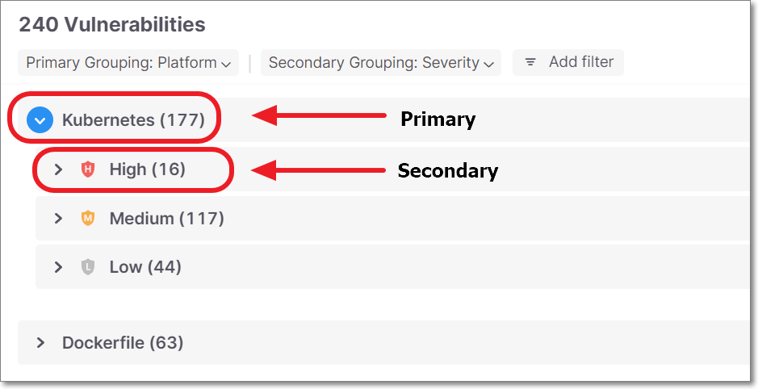

By default, the Primary grouping is by **Platform** and the Secondary grouping is by **Severity**.

You can adjust the Primary and Secondary grouping to any of the column parameters. You can also select **None** to remove a grouping level.

- None
- Platform - Default Primary
- Query Name
- Severity - Default Secondary
- Status
- State
- Issue Type
- Category
- File

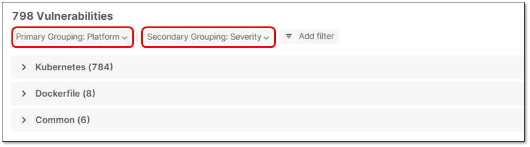

### Filtering Vulnerabilities

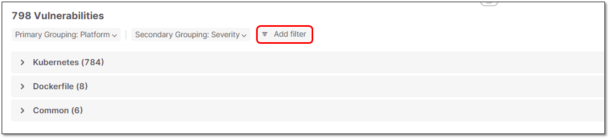

You can filter the vulnerabilities display by any column.

Filtering supports applying several filters at once (with an **AND condition** between the filtering options).

The following filtering options are available:

- Status
- Severity
- State
- Actual Value
- Expected Value

## Code Viewer

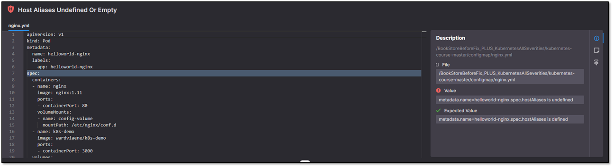

The **Code Viewer** section enables viewing a specific source code vulnerability, including its detailed information.

Code Viewer section includes the following functionalities:

- The panel is opened on demand by clicking on a vulnerability in the table.
- The panel can be resized by dragging the bottom bar, which resizes the code viewer section vs. the vulnerabilities section.
- An additional panel is integrated within the Code Viewer panel, containing the following options:

  - **Changes** - Includes information about **Severity** and/or **State** changes that were performed for a specific vulnerability, in addition to added **Comments**.
  - **Notes** - Includes all the comments that were added for a specific vulnerability.
  - **Description** - Shows a brief description of this vulnerability. The bottom section shows the file where the vulnerability was identified, as well as the problematic “value” and the “expected value” for that element.

### Opening Code Viewer

To open the Code Viewer section, perform the following:

1. Click on a vulnerability grouping to expand the display. Continue drilling down until the individual vulnerability instances are shown.
2. Click on a vulnerability instance to show the relevant code in the Code Viewer window.

## Triaging IaC Security Results


The following permissions enable users to triage risks:

- update-result-state-not-exploitable (can change to this state only)
- update-result-state-propose-not-exploitable (can change to this state only)
- update-result-states (can change all states except not-exploitable; can’t change the severity)
- update-result-severity (can change only severities)

For additional details about triage permissions, see here.


### Triaging Risk State and Severity

A risk state is assigned to each risk instance in your Project. Initially, the state of each new risk is set as **To Verify**, indicating that it is a new finding that hasn’t yet been assessed by your AppSec team. The severity is determined primarily based on the CVSS score of the vulnerability. Your AppSec team can adjust the risk state to one of the following options:

- **Not Exploitable** - Select this state if your team has determined that this risk doesn’t pose a threat to your application (and isn’t expected to cause a risk at any time in the future).

  
  When a Risk is marked as Not Exploitable, in the All Risks page the CVE is marked with a strikethrough line, and the Risk Details page is grayed out. Also, Not Exploitable risks aren't counted in the risk summary counters.
  
- **Proposed Not Exploitable** - Select this state if your team has suggested tentatively that this risk doesn’t pose a threat to your application.
- **Confirmed** - Select this state if your team has confirmed that this risk does pose a threat and requires mitigation.
- **Urgent** - Select this state if your team has determined that this risk poses an imminent threat and requires urgent mitigation.

Based on your AppSec team's determination, the score can be adjusted to a score between 0.0 and 10.0 with the following severity breakdown:

- Critical - 9.0 to 10.0
- High - 7.0 to 8.9
- Medium - 4.0 to 6.9
- Low - 0.1 to 3.9
- Info - 0.0

You can adjust the predicate for a specific vulnerability while viewing that vulnerability on the Scan Results page.

### Triaging a Single Vulnerability

**To edit the result predicate:**

1. Navigate to the vulnerability that you would like to edit.
2. To adjust the severity, click on the **Severity** field, and select from the dropdown list the severity that you would like to assign. Options are: Critical High, Medium, Low, Info.

   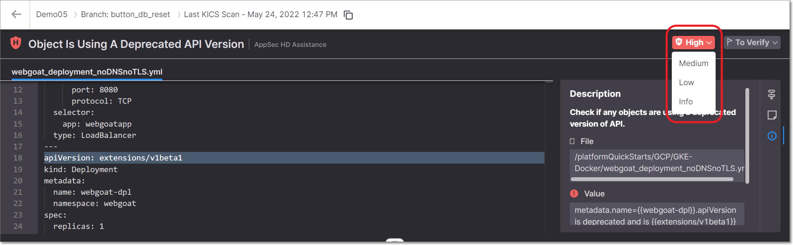
3. To adjust the state, click on the **State** field, and select from the dropdown list the state that you would like to assign. Options are: To Verify, Not Exploitable, Proposed Not Exploitable, Confirmed or Urgent.
4. To add a note, click on the **Note** icon in the toolbar. In the **Notes** pane that opens, click **+ Add** and then enter the desired text and click the **Add** button at the bottom.

   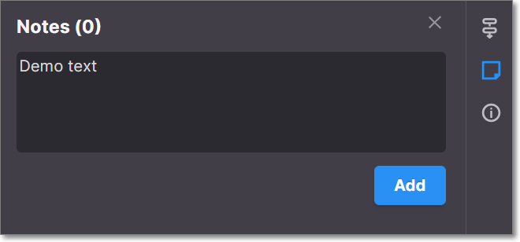

### Triaging Multiple Vulnerabilities (Bulk Action)

**To edit the result predicate for multiple vulnerabilities:**

1. In the Vulnerabilities table, select the checkbox next to each vulnerability for which you would like to make the changes.

   
   Alternatively, you can select all instances in a group of vulnerabilities by selecting the checkbox at the top of that section.
   

   A menu bar is shown at the top of the table.

   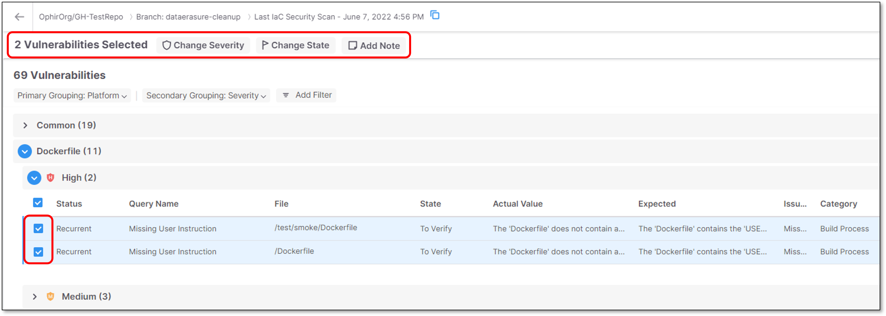
2. To adjust the severity, click on the **Change** **Severity** button, and select from the dropdown list the severity that you would like to assign.

   Options are: Critical High, Medium, Low, Info.

   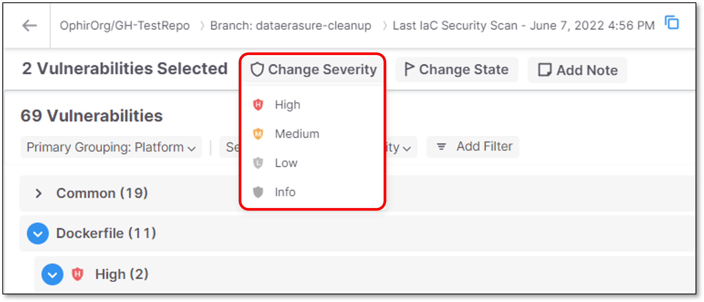
3. To adjust the state, click on the **Change** **State** button, and select from the dropdown list the state that you would like to assign.

   Options are: To Verify, Not Exploitable, Proposed Not Exploitable, Confirmed or Urgent.

   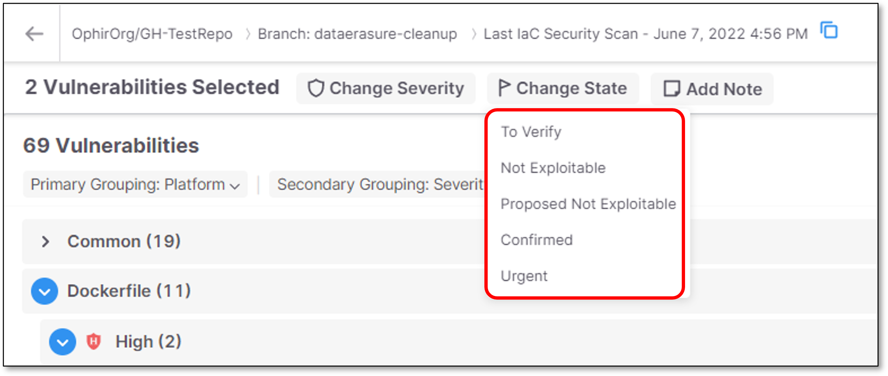
4. To add a note, click on the **Add Note** button. In the **Notes** pane that opens, enter the desired text and click **Save**.

   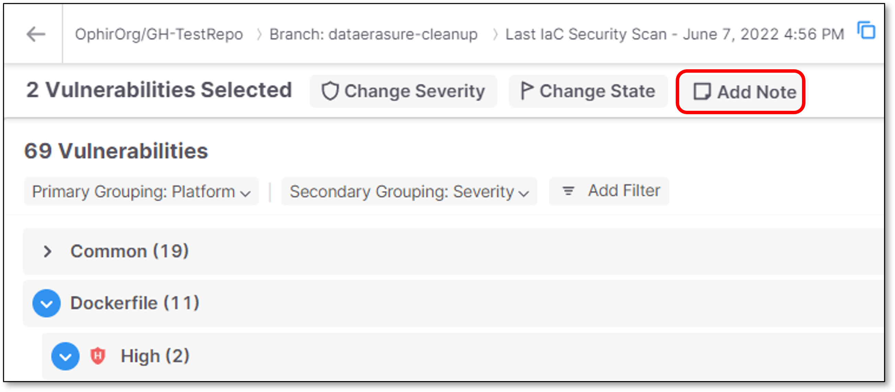
