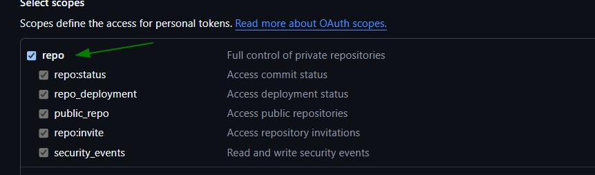
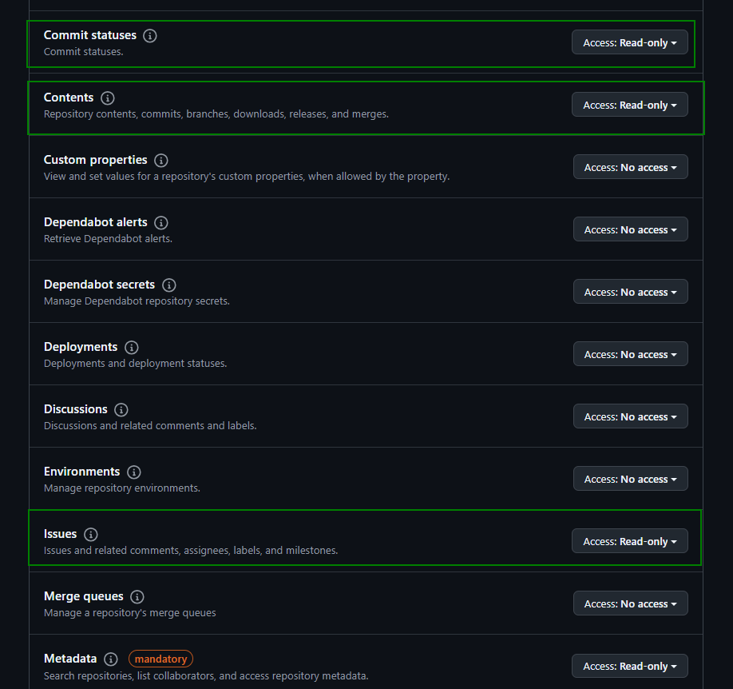

# Repository Health (OSSF Scorecard)

Continuously track health scores for all repositories included in your applications based on key factors, such as code quality, dependency management, CI/CD best practices, and project maintenance.

## Key Features

- **Continuous Repo Health Scoring** – Continuously track health scores for all repositories included in your applications based on key factors, in areas such as code quality, dependency management, CI/CD best practices, and project maintenance.
- **Automatic SCM-Triggered Scans** – Integration with SCM platforms enables scans to be run automatically upon repository updates, ensuring up-to-date repo health metrics with no manual effort.
- **Flexible On-Demand Scanning Options** – In addition to automatic SCM-triggered scans, developers and security teams can manually run repo health scans at any time via API, CLI, or the Checkmarx One UI.
- **Unified Risk Reporting** – Repository health scores are included in Checkmarx One reports, providing visibility into – and efficient prioritization of – security vulnerabilities, code quality issues, and repository health risks, all in one place.

## Prerequisites

- Your source code must be hosted on a GitHub Cloud repo.
- You need to have a personal access token for the GitHub repo with the required permissions, see below.

GitHub Token Permissions

You can use either of the two types of [GitHub tokens](https://docs.github.com/en/authentication/keeping-your-account-and-data-secure/managing-your-personal-access-tokens#types-of-personal-access-tokens): "Personal access token (classic)" or "Fine grained personal access token". The required permissions for each type of token are shown below.

For "Personal access token (classic)" you need to select the "repo" scope.

<figure><figcaption></figcaption></figure>

For "Fine grained personal access token" you need **read-only** access for Commit statuses, Contents, Issues and Metadata.

<figure><figcaption></figcaption></figure>

## Repository Health Checks

The SCS scanner identifies risks based on the following Repository Health checks.

Binary-Artifacts

**Risk:** High (non-reviewable code)

This check determines whether the project has generated executable (binary) artifacts in the source repository.

Including generated executables in the source repository increases user risk. Many programming language systems can generate executables from source code (e.g., C/C++ generated machine code, Java `.class` files, Python `.pyc` files, and minified JavaScript). Users will often directly use executables if they are included in the source repository, leading to many dangerous behaviors.

Problems with generated executable (binary) artifacts:

- Binary artifacts cannot be reviewed, allowing possible obsolete or maliciously subverted executables. Reviews generally review source code, not executables, since it's difficult to audit executables to ensure that they correspond to the source code. Over time the included executables might not correspond to the source code.
- Generated executables allow the executable generation process to atrophy, which can lead to an inability to create working executables. These problems can be countered with verified reproducible builds, but it's easier to implement verified reproducible builds when executables are not included in the source repository (since the executable generation process is less likely to have atrophied).

Allowed by Scorecard:

- Files in the source repository that are simultaneously reviewable source code and executables, since these are reviewable. (Some interpretive systems, such as many operating system shells, don't have a mechanism for storing generated executables that are different from the source file.)
- Source code in the source repository generated by other tools (e.g., by bison, yacc, flex, and lex). There are potential downsides to generated source code, but generated source code tends to be much easier to review and thus presents a lower risk. Generated source code is also often difficult for external tools to detect.
- Generated documentation in source repositories. Generated documentation is intended for use by humans (not computers) who can evaluate the context. Thus, generated documentation doesn't pose the same level of risk.


The Binary-Artifacts check always evaluates the repository's default branch, regardless of which branch a scan targets. If a scan is configured against a non-default branch, and binary artifacts are added to or removed from that scanned branch, the Binary-Artifacts results will continue to reflect the state of the default branch rather than the branch actually being scanned.

When investigating or remediating Binary-Artifacts findings, check the default branch first, even if your scan configuration points elsewhere.


**Remediation steps:**

- Remove the generated executable artifacts from the repository.
- Build from source.

Branch-Protection

**Risk:** High (vulnerable to intentional malicious code injection)

This check determines whether a project's default and release branches are protected with GitHub's [branch protection](https://docs.github.com/github/administering-a-repository/defining-the-mergeability-of-pull-requests/about-protected-branches) or [repository rules](https://docs.github.com/repositories/configuring-branches-and-merges-in-your-repository/managing-rulesets/about-rulesets) settings. Branch protection allows maintainers to define rules that enforce certain workflows for branches, such as requiring review or passing certain status checks before acceptance into a main branch, or preventing rewriting of public history.

Note: The following settings queried by the Branch-Protection check require an admin token: `DismissStaleReviews`, `EnforceAdmins`, `RequireLastPushApproval`, `RequiresStatusChecks` and `UpToDateBeforeMerge`. If the provided token does not have admin access, the check will query the branch settings accessible to non-admins and provide results based only on these settings. However, all of these settings are accessible via Repo Rules. `EnforceAdmins` is calculated slightly differently. This setting is calculated as `false` if any [Bypass Actors](https://docs.github.com/repositories/configuring-branches-and-merges-in-your-repository/managing-rulesets/creating-rulesets-for-a-repository#granting-bypass-permissions-for-your-ruleset) are defined on any rule, regardless of if they are admins.

Different types of branch protection protect against different risks:

- Require code review:

  - requires at least one reviewer, which greatly reduces the risk that a compromised contributor can inject malicious code. Review also increases the likelihood that an unintentional vulnerability in a contribution will be detected and fixed before the change is accepted.

  - requiring two or more reviewers protects even more from the insider risk whereby a compromised contributor can be used by an attacker to LGTM the attacker PR and inject a malicious code as if it was legit.
- Prevent force push: prevents use of the `--force` command on public branches, which overwrites code irrevocably. This protection prevents the rewriting of public history without external notice.
- Require [status checks](https://docs.github.com/en/github/collaborating-with-pull-requests/collaborating-on-repositories-with-code-quality-features/about-status-checks): ensures that all required CI tests are met before a change is accepted.

Although requiring code review can greatly reduce the chance that unintentional or malicious code enters the "main" branch, it is not feasible for all projects, such as those that don't have many active participants. For more discussion, see [Code Reviews.](https://github.com/ossf/scorecard/blob/main/docs/checks.md#code-review)

Additionally, in some cases these rules will need to be suspended. For example, if a past commit includes illegal content such as child pornography, it may be necessary to use a force push to rewrite the history rather than simply hide the commit.

This test has tiered scoring. Each tier must be fully satisfied to achieve points at the next tier. For example, if you fulfill the Tier 3 checks but do not fulfill all the Tier 2 checks, you will not receive any points for Tier 3.

Note: If Scorecard is run without an administrative access token, the requirements that specify “For administrators” can be safely ignored, and scores will be determined as if all such requirements have been met.

Tier 1 Requirements (3/10 points):

- Prevent force push
- Prevent branch deletion

Tier 2 Requirements (6/10 points):

- Require at least 1 reviewer for approval before merging (for administrators, this requirement weights twice than the others in this tier)
- For administrators: Require PRs prior to make any code changes
- For administrators: Require branch to be up to date before merging
- For administrators: Require approval of the most recent reviewable push

Tier 3 Requirements (8/10 points):

- Require branch to pass at least 1 status check before merging

Tier 4 Requirements (9/10 points):

- Require at least 2 reviewers for approval before merging
- Require review from code owners

Tier 5 Requirements (10/10 points):

- For administrators: Dismiss stale reviews and approvals when new commits are pushed
- For administrators: Include administrator for review

GitLab Integration Status:

- GitLab associates releases with commits and not with the branch. Releases are ignored in this portion of the scoring.

**Remediation steps:**

- Enable branch protection settings in your source hosting provider to avoid force pushes or deletion of your important branches.
- For GitHub, check out the steps for rulesets [here](https://docs.github.com/en/repositories/configuring-branches-and-merges-in-your-repository/managing-rulesets/creating-rulesets-for-a-repository)and rules [here](https://docs.github.com/en/github/administering-a-repository/managing-a-branch-protection-rule).

CII-Best-Practices

**Risk:** Low (possibly not following security best practices)

This check determines whether the project has earned an [OpenSSF (formerly CII) Best Practices Badge](https://www.bestpractices.dev/) at the passing, silver, or gold level. The OpenSSF Best Practices badge indicates whether or not that the project uses a set of security-focused best development practices for open source software. The check uses the URL for the Git repo and the OpenSSF Best Practices badge API.

The OpenSSF Best Practices badge has 3 tiers: passing, silver, and gold. We give full credit to projects that meet the [gold criteria](https://www.bestpractices.dev/criteria/2), which is a significant achievement for projects and requires multiple developers in the project. Lower scores represent a project that has met the silver criteria, met the passing criteria, or is working to achieve the passing badge, with increasingly more points awarded as more criteria are met. Note that even meeting the passing criteria is a significant achievement.

- [gold badge](https://www.bestpractices.dev/criteria/2): 10
- [silver badge](https://www.bestpractices.dev/criteria/1): 7
- [passing badge](https://www.bestpractices.dev/criteria/0): 5
- in progress badge: 2

Some of these criteria overlap with other Scorecard checks. However, note that in those overlapping cases, Scorecard can only report what it can automatically detect, while the OpenSSF Best Practices badge can report on claims and claim justifications from people (this counters false negatives and positives but has the challenge of requiring additional work from people).

**Remediation steps:**

- Sign up for the [OpenSSF Best Practices program](https://www.bestpractices.dev/).

Code-Review

**Risk:** High (unintentional vulnerabilities or possible injection of malicious code)

This check determines whether the project requires human code review before pull requests (merge requests) are merged.

Reviews detect various unintentional problems, including vulnerabilities that can be fixed immediately before they are merged, which improves the quality of the code. Reviews may also detect or deter an attacker trying to insert malicious code (either as a malicious contributor or as an attacker who has subverted a contributor's account), because a reviewer might detect the subversion.

The check determines whether the most recent changes (over the last ~30 commits) have an approval on GitHub or if the merger is different from the committer (implicit review). It also performs a similar check for reviews using [Prow](https://github.com/kubernetes/test-infra/tree/master/prow#readme) (labels "lgtm" or "approved") and [Gerrit](https://www.gerritcodereview.com/) ("Reviewed-on" and "Reviewed-by"). If recent changes are solely bot activity (e.g. Dependabot, Renovate bot, or custom bots), the check returns inconclusively.

Scoring is leveled instead of proportional to make the check more predictable. If any bot-originated changes are unreviewed, 3 points are deducted. If any human changes are unreviewed, 7 points are deducted if a single change is unreviewed, and another 3 are deducted if multiple changes are unreviewed.

Review by bots, including bots powered by artificial intelligence / machine learning (AI/ML), do not count as code review. Such reviews do not provide confidence that there will be a second person who understands the code change (e.g., if the originator suddenly becomes unavailable). However, analysis by bots may be able to meet (at least in part) the [SAST](https://github.com/ossf/scorecard/blob/main/docs/checks.md#sast) criterion.

Note: Requiring reviews for all changes is infeasible for some projects, such as those with only one active participant. Even a project with multiple active contributors may not have enough active participation to be able to require review of all proposed changes. Projects with a small number of active participants instead sometimes aim for a review of a percentage of proposals (e.g., "at least half of all proposed changes are reviewed").

Requiring review does not eliminate all risks. The other reviewers might fail to notice unintentional vulnerabilities or malicious code, be colluding with a malicious developer, or even be the same person (using a "[sock puppet](https://en.wikipedia.org/wiki/Sock_puppet_account)" account).

**Remediation steps:**

- If the project has only one contributor, or does not have enough reviewers to practically require that all contributions be reviewed, try to recruit more maintainers to the project who will be willing to review others' work. Ideally at least some of these people will be from different organizations (see [Contributors](https://github.com/ossf/scorecard/blob/main/docs/checks.md#contributors)). If the project has very limited utility, consider expanding its intended utility so more people will be interested in improving it, and make that larger scope clear to potential contributors.
- Follow security best practices by performing strict code reviews for every new pull request / merge request.
- Make "code reviews" mandatory in your repository configuration. ([Instructions for GitHub](https://docs.github.com/en/github/administering-a-repository/about-protected-branches#require-pull-request-reviews-before-merging).)Enforce the rule for administrators / code owners as well. ([Instructions for GitHub](https://docs.github.com/en/github/administering-a-repository/about-protected-branches#include-administrators).)

Dangerous-Workflow

**Risk:** Critical (vulnerable to repository compromise)

This check determines whether the project's GitHub Action workflows has dangerous code patterns. Some examples of these patterns are untrusted code checkouts, logging github context and secrets, or use of potentially untrusted inputs in scripts. The following patterns are checked:

Untrusted Code Checkout: This is the misuse of potentially dangerous triggers. This checks if a `pull_request_target` or `workflow_run` workflow trigger was used in conjunction with an explicit pull request checkout. Workflows triggered with `pull_request_target` /`workflow_run` have write permission to the target repository and access to target repository secrets. With the PR checkout, PR authors may compromise the repository, for example, by using build scripts controlled by the author of the PR or reading token in memory. This check does not detect whether untrusted code checkouts are used safely, for example, only on pull request that have been assigned a label.

Script Injection with Untrusted Context Variables: This pattern detects whether a workflow's inline script may execute untrusted input from attackers. This occurs when an attacker adds malicious commands and scripts to a context. When a workflow runs, these strings may be interpreted as code that is executed on the runner. Attackers can add their own content to certain github context variables that are considered untrusted, for example, `github.event.issue.title`. These values should not flow directly into executable code.

The highest score is awarded when all workflows avoid the dangerous code patterns.

**Remediation steps:**

- Avoid the dangerous workflow patterns. See this [post](https://securitylab.github.com/research/github-actions-preventing-pwn-requests/) for information on avoiding untrusted code checkouts. See this [document](https://docs.github.com/en/actions/security-guides/security-hardening-for-github-actions#understanding-the-risk-of-script-injections) for information on avoiding and mitigating the risk of script injections.

Dependency-Update-Tool

**Risk:** High (possibly vulnerable to attacks on known flaws)

This check tries to determine if the project uses a dependency update tool, specifically one of:

- Dependabot
- Renovate bot
- PyUp (Python)

Out-of-date dependencies make a project vulnerable to known flaws and prone to attacks. These tools automate the process of updating dependencies by scanning for outdated or insecure requirements, and opening a pull request to update them if found.

This check can determine only whether the dependency update tool is enabled; it does not ensure that the tool is run or that the tool's pull requests are merged.

Note: A project that fulfills this criterion with other tools may still receive a low score on this test. There are many ways to implement dependency updates, and it is challenging for an automated tool like Scorecard to detect them all. A low score is therefore not a definitive indication that the project is at risk.

**Remediation steps:**

- Sign up for automatic dependency updates with one of the previously listed dependency update tools and place the config file in the locations that are recommended by these tools. Due to dependabot/dependabot-core#2804 Dependabot can be enabled for forks where security updates have ever been turned on so projects maintaining stable forks should evaluate whether this behavior is satisfactory before turning it on.

  Unlike Dependabot, Renovate bot has support to migrate dockerfiles' dependencies from version pinning to hash pinning via the pinDigests setting without additional manual effort.

Fuzzing

**Risk:** Medium (possible vulnerabilities in code)

This check tries to determine if the project uses [fuzzing](https://owasp.org/www-community/Fuzzing) by checking:

1. if the repository name is included in the [OSS-Fuzz](https://github.com/google/oss-fuzz) project list;
2. if [ClusterFuzzLite](https://google.github.io/clusterfuzzlite/) is deployed in the repository;
3. if there are user-defined language-specified fuzzing functions in the repository.

   - currently only supports [Go fuzzing](https://go.dev/doc/fuzz/),
   - a limited set of property-based testing libraries for Haskell including [QuickCheck](https://hackage.haskell.org/package/QuickCheck), [Hedgehog](https://hedgehog.qa/), [validity](https://hackage.haskell.org/package/validity) or [SmallCheck](https://hackage.haskell.org/package/smallcheck),
   - a limited set of property-based testing libraries for JavaScript and TypeScript including [fast-check](https://fast-check.dev/).

Fuzzing, or fuzz testing, is the practice of feeding unexpected or random data into a program to expose bugs. Regular fuzzing is important to detect vulnerabilities that may be exploited by others, especially since attackers can also use fuzzing to find the same flaws.

Note: A project that fulfills this criterion with other tools may still receive a low score on this test. There are many ways to implement fuzzing, and it is challenging for an automated tool like Scorecard to detect them all. A low score is therefore not a definitive indication that the project is at risk.

**Remediation steps:**

- Integrate the project with OSS-Fuzz by following the instructions [here](https://google.github.io/oss-fuzz/).

Maintained

**Risk:** High (possibly unpatched vulnerabilities)This check determines whether the project is actively maintained.

**Scoring criteria:**

- Archived projects receive the lowest score.
- Projects with at least one commit per week over the past 90 days receive the highest score.
- Projects with issue activity from collaborators, members, or owners receive a partial score.

**Why maintenance matters:**

A project without recent activity may not receive security fixes, dependency updates, or ongoing testing. However, low activity does not always indicate a problem. Some code - particularly small, simple utilities - requires little or no ongoing maintenance. For example, a function that checks whether a number is even is unlikely to require changes unless the programming language itself changes. Low activity should be treated as a prompt for further review, not as a definitive issue.

**Age limit:**

This check applies only to projects **more than 90 days old**. Newer projects have not existed long enough to evaluate fairly, so users should review them directly to confirm they meet expectations.

**Remediation steps:**

There is no remediation work needed from projects with a low score; this check simply provides insight into the project activity and maintenance commitment. External users should determine whether the software is the type that would not normally need active maintenance.

Packaging

**Risk:** Medium (users possibly missing security updates)

IThis check tries to determine if the project is published as a package. It is currently limited to repositories hosted on GitHub, and does not support other source hosting repositories (i.e., Forges).

Packages give users of a project an easy way to download, install, update, and uninstall the software by a package manager. In particular, they make it easy for users to receive security patches as updates.

The check currently looks for [GitHub packaging workflows](https://docs.github.com/en/packages/learn-github-packages/publishing-a-package)and language-specific GitHub Actions that upload the package to a corresponding hub, e.g., [Npm](https://www.npmjs.com/). We plan to add better support to query package manager hubs directly in the future, e.g., for [Npm](https://www.npmjs.com/), [PyPi](https://pypi.org/).

You can create a package in several ways:

- Many program language ecosystems have a generally-used packaging format supported by a language-level package manager tool and public package repository.
- Many operating system platforms also have at least one package format, tool, and public repository (in some cases the source repository generates system-independent source packages, which are then used by others to generate system executable packages).
- Using container images.

Note: A project that fulfills this criterion with other tools may still receive a low score on this test. There are many ways to package software, and it is challenging for an automated tool like Scorecard to detect them all. A low score is therefore not a definitive indication that the project is at risk. If Scorecard fails to detect the way you publish a package and you think we should support your use case, please let us know by [opening an issue](https://github.com/ossf/scorecard/issues/new/choose).

**Remediation steps:**

- Publish your project as a downloadable package, e.g., if hosted on GitHub, use [GitHub's mechanisms for publishing a package](https://docs.github.com/en/packages/learn-github-packages/publishing-a-package).
- If hosted on GitHub, use a GitHub action to release your package to language-specific hubs.

Pinned-Dependencies

**Risk:** Medium (possible compromised dependencies)

This check tries to determine if the project pins dependencies used during its build and release process. A "pinned dependency" is a dependency that is explicitly set to a specific hash instead of allowing a mutable version or range of versions. It is currently limited to repositories hosted on GitHub, and does not support other source hosting repositories (i.e., Forges).

The check works by looking for unpinned dependencies in Dockerfiles, shell scripts, and GitHub workflows which are used during the build and release process of a project. Special considerations for Go modules treat full semantic versions as pinned due to how the Go tool verifies downloaded content against the hashes when anyone first downloaded the module.

Pinned dependencies reduce several security risks:

- They ensure that checking and deployment are all done with the same software, reducing deployment risks, simplifying debugging, and enabling reproducibility.
- They can help mitigate compromised dependencies from undermining the security of the project (in the case where you've evaluated the pinned dependency, you are confident it's not compromised, and a later version is released that is compromised).
- They are one way to [counter dependency confusion (aka substitution) attacks](https://azure.microsoft.com/en-us/resources/3-ways-to-mitigate-risk-using-private-package-feeds/), in which an application uses multiple feeds to acquire software packages (a "hybrid configuration"), and attackers fool the user into using a malicious package via a feed that was not expected for that package.

However, pinning dependencies can inhibit software updates, either because of a security vulnerability or because the pinned version is compromised. Mitigate this risk by:

- using automated tools to notify applications when their dependencies are outdated;
- quickly updating applications that do pin dependencies.

For projects hosted on GitHub, you can learn more about dependencies using the [GitHub dependency graph](https://docs.github.com/en/code-security/supply-chain-security/understanding-your-software-supply-chain/about-the-dependency-graph).

**Remediation steps:**

- If your project is producing an application, declare all your dependencies with specific versions in your package format file (e.g. `package.json` for npm, `requirements.txt` for python, `packages.config` for nuget). For C/C++, check in the code from a trusted source and add a README on the specific version used (and the archive SHA hashes).
- If your project is producing an application and the package manager supports lock files (e.g. `package-lock.json` for npm), make sure to check these in the source code as well. These files maintain signatures for the entire dependency tree and saves from future exploitation in case the package is compromised.
- For Dockerfiles used in building and releasing your project, pin dependencies by hash. See [Dockerfile](https://github.com/ossf/scorecard/blob/main/cron/internal/worker/Dockerfile) for example. If you are using a manifest list to support builds across multiple architectures, you can pin to the manifest list hash instead of a single image hash. You can use a tool like [crane](https://github.com/google/go-containerregistry/blob/main/cmd/crane/README.md) to obtain the hash of the manifest list like in this [example](https://github.com/ossf/scorecard/issues/1773#issuecomment-1076699039).
- For GitHub workflows used in building and releasing your project, pin dependencies by hash. See [main.yaml](https://github.com/ossf/scorecard/blob/f55b86d6627cc3717e3a0395e03305e81b9a09be/.github/workflows/main.yml#L27) for example. To determine the permissions needed for your workflows, you may use [StepSecurity's online tool](https://app.stepsecurity.io/secureworkflow/) by ticking the "Pin actions to a full length commit SHA". You may also tick the "Restrict permissions for GITHUB_TOKEN" to fix issues found by the Token-Permissions check.
- To help update your dependencies after pinning them, use tools such as those listed for the dependency update tool check.

Security-Policy

**Risk:** Medium (possible insecure reporting of vulnerabilities)

This check tries to determine if the project has published a security policy. It works by looking for a file named `SECURITY.md` (case-insensitive) in a few well-known directories.

A security policy (typically a `SECURITY.md` file) can give users information about what constitutes a vulnerability and how to report one securely so that information about a bug is not publicly visible.

This check examines the contents of the security policy file awarding points for those policies that express vulnerability process(es), disclosure timelines, and have links (e.g., URL(s) and email(s)) to support the users.

Linking Requirements (one or more) (6/10 points):

- A valid form of an email address to contact for vulnerabilities
- A valid form of a http/https address to support vulnerability reporting

Free Form Text (3/10 points):

- Free form text is present in the security policy file which is beyond simply having a http/https address and/or email in the file
- The string length of any such links in the policy file do not count towards detecting free form text

Security Policy Specific Text (1/10 points):

- Specific text providing basic or general information about vulnerability and disclosure practices, expectations, and/or timelines
- Text should include a total of 2 or more hits which match (case-insensitive) vuln and as in "Vulnerability" or "vulnerabilities"; `disclos` as "Disclosure" or "disclose"; and numbers which convey expectations of times, e.g., 30 days or 90 days

**Remediation steps:**

- Place a security policy file `SECURITY.md` in the root directory of your repository. This makes it easily discoverable by a vulnerability reporter.
- The file should contain information on what constitutes a vulnerability and a way to report it securely (e.g. issue tracker with private issue support, encrypted email with a published public key). Follow the [coordinated vulnerability disclosure guidelines](https://github.com/ossf/oss-vulnerability-guide/blob/main/maintainer-guide.md) to respond to vulnerability disclosures.
- For GitHub, see more information [here](https://docs.github.com/en/code-security/getting-started/adding-a-security-policy-to-your-repository).

Signed-Releases

**Risk:** High (possibility of installing malicious releases)

This check tries to determine if the project cryptographically signs release artifacts. It is currently limited to repositories hosted on GitHub, and does not support other source hosting repositories (i.e., Forges).

Signed releases attest to the provenance of the artifact.

This check looks for the following filenames in the project's last five [release assets](https://docs.github.com/en/repositories/releasing-projects-on-github/about-releases): [\*.minisig](https://github.com/jedisct1/minisign), \*.asc (pgp), \*.sig, \*.sign, \*.sigstore, [\*.intoto.jsonl](https://slsa.dev/).

If a signature is found in the assets for each release, a score of 8 is given. If a [SLSA provenance file](https://slsa.dev/spec/v0.1/index) is found in the assets for each release (\*.intoto.jsonl), the maximum score of 10 is given.

This check looks for the 30 most recent releases associated with an artifact. It ignores the source code-only releases that are created automatically by GitHub.

Note: The check does not verify the signatures.

**Remediation steps:**

- Publish the release.
- Generate a signing key.
- Download the release as an archive locally.
- Sign the release archive with this key (should output a signature file).
- Attach the signature file next to the release archive.
- If the source is hosted on GitHub, check out the steps [here](https://wiki.debian.org/Creating%20signed%20GitHub%20releases).

Token-Permissions

**Risk:** High (vulnerable to malicious code additions)

This check determines whether the project's automated workflows tokens follow the principle of least privilege. This is important because attackers may use a compromised token with write access to, for example, push malicious code into the project.

It is currently limited to repositories hosted on GitHub, and does not support other source hosting repositories (i.e., Forges).

The highest score is awarded when the permissions definitions in each workflow's yaml file are set as read-only at the [top level](https://docs.github.com/en/actions/reference/workflow-syntax-for-github-actions#permissions) and the required write permissions are declared at the [run-level](https://docs.github.com/en/actions/reference/workflow-syntax-for-github-actions#jobsjob_idpermissions). One point is reduced from the score if all jobs have their permissions defined but the top level permissions are not defined. This configuration is secure, but there is a chance that when a new job is added to the workflow, its job permissions could be left undefined because of human error.

Though a project's score won't be penalized, the check's details will include warnings for more sensitive run-level permissions, listed below:

- `actions` - May allow an attacker to steal GitHub secrets by approving to run an action that needs approval.
- `checks` - May allow an attacker to remove pre-submit checks and introduce a bug.
- `contents` - Allows an attacker to commit unreviewed code. However, points are not reduced if the job utilizes a recognized packaging action or command.
- `deployments` - May allow an attacker to charge repo owner by triggering VM runs, and tiny chance an attacker can trigger a remote service with code they own if server accepts code/location variables unsanitized.
- `packages` - Allows an attacker to publish packages. However, points are not reduced if the job utilizes a recognized packaging action or command.
- `security-events` - May allow an attacker to read vulnerability reports before a patch is available. However, points are not reduced if the job utilizes a recognized action for uploading SARIF results.
- `statuses` - May allow an attacker to change the result of pre-submit checks and get a PR merged.

This compromise makes it clear the maintainer has done what's possible to use those permissions safety, but allows users to identify that the permissions are used.

The check cannot detect if the "read-only" GitHub permission setting is enabled, as there is no API available.

**Remediation steps:**

- Set top-level permissions as `read-all` or `contents: read` as described in GitHub's [documentation](https://docs.github.com/en/actions/reference/workflow-syntax-for-github-actions#permissions).
- Set any required write permissions at the job-level. Only set the permissions required for that job; do not set `permissions: write-all` at the job level.
- To help determine the permissions needed for your workflows, you may use [StepSecurity's online tool](https://app.stepsecurity.io/secureworkflow/) by ticking the "Restrict permissions for GITHUB_TOKEN". You may also tick the "Pin actions to a full length commit SHA" to fix issues found by the Pinned-dependencies check.

## Running Scans

Repository Health scans (OSSF Scorecard) can be run on your Checkmarx One projects via web application, CLI or REST API. It is also possible to set up a code repository integration that automatically triggers a scan whenever a pull request or push event occurs in the SCM. Learn more about running scans here.


As noted above, the Binary-Artifacts check always resolves against the repository's default branch. If you run a scan targeting a non-default branch, Binary-Artifacts findings will reflect the default branch's content, not the scanned branch, even when binary artifacts were added or removed specifically on the scanned branch.

Keep this in mind when reconciling Binary-Artifacts results with scans configured against feature or release branches.


## In this section

- [Repository Health (Scorecard) Results Viewer](repository-health-scorecard-results-viewer.md)
