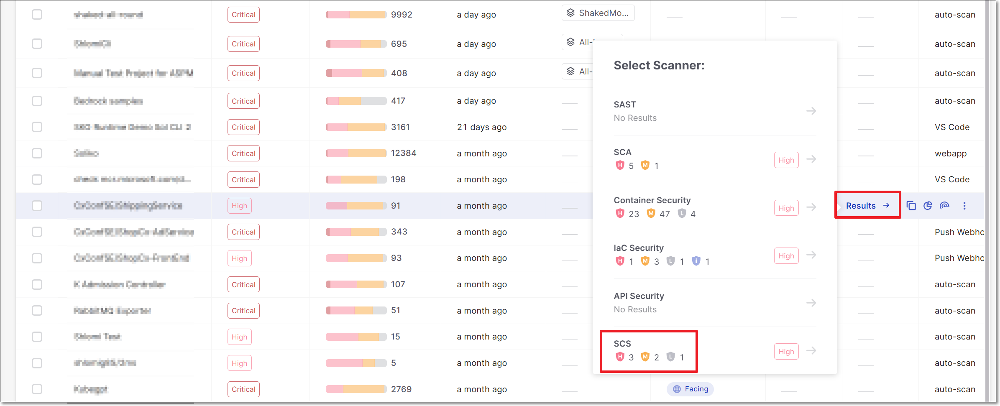
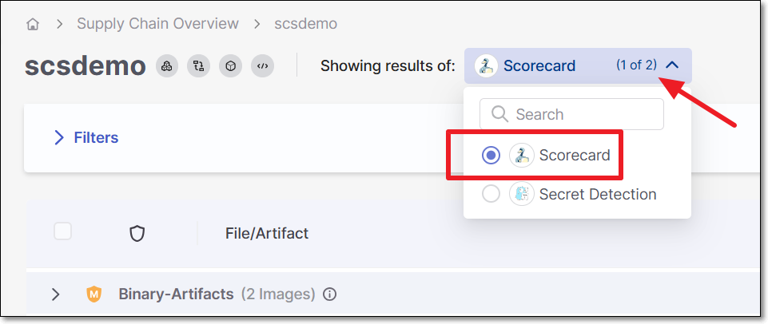
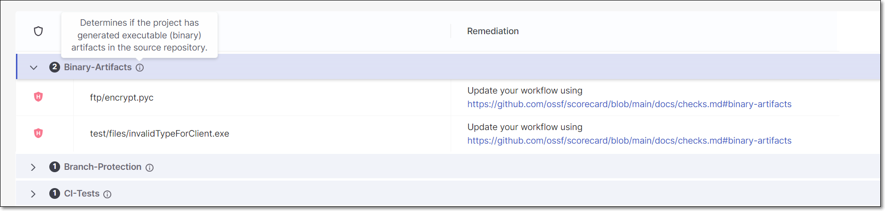

# Repository Health (Scorecard) Results Viewer

**To view Repository Health (Scorecard) scan results:**

1. Go to the **Workspace** > **Projects** page and hover over the Results button for the desired project.
2. Select the **SCS** scanner.

   <figure><figcaption></figcaption></figure>

   The SCS results viewer opens with **Secret Detection** selected for display.
3. If Secret Detection results are displayed, click on the selection at the top of the screen and select **Scorecard**.

   <figure><figcaption></figcaption></figure>

## Viewing Repository Health (Scorecard) Results

When the Scorecard scanner is selected in the SCS results viewer, results are grouped by the Repository Health check that identified the risk.

Hover over the info icon next to the name of a check type to see a description of that check.

Click on a check type to expand the section and show a list of risks of that type.

<figure><figcaption></figcaption></figure>


Additional details about the failing conditions and score calculation can be obtained using the [GET /results](https://checkmarx.stoplight.io/docs/checkmarx-one-api-reference-guide/branches/main/whqbw17zn6rg1-retrieve-scan-results-all-scanners) API.


The following table describes the information shown for each risk.

| Item | Description |
|---|---|
| Severity | The severity of the risk. |
| File/Artifact | The path to the file or artifact in which the risk was detected. |
| Remediation | Provides a link to the OSSF documentation which includes remediation recommendations for the relevant OSSF check. |
