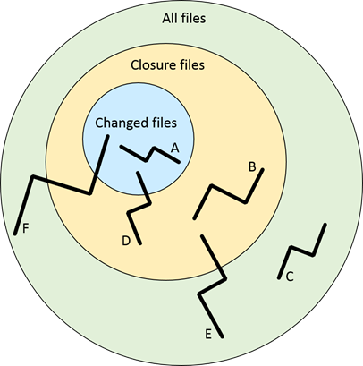
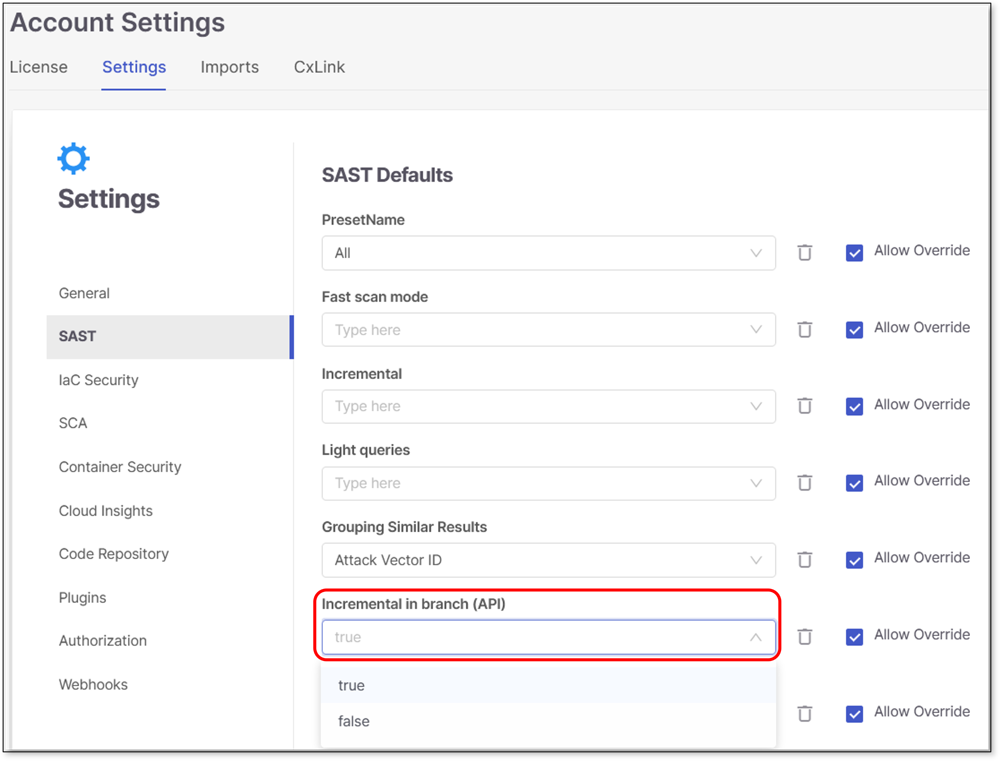

# SAST Scanner

## Overview

Checkmarx's Static Application Security Testing (SAST) scanner examines your application's code. It looks for common security weaknesses by analyzing the code's structure and how data flows through the application. The goal is to catch vulnerabilities early in the software development lifecycle, allowing developers to address security concerns before the application is run in production.

SAST builds a logical graph of the code's elements and flows without needing to build or compile a software project's source code. SAST then queries this internal code graph. SAST includes an extensive list of hundreds of pre-configured queries for known security vulnerabilities for each programming language. Using the Query Editor, you can configure your own additional queries for security, QA, and business logic purposes.

The input to SAST's scanning and analysis is the source code, not binaries, so no building or compiling is required, and no libraries need to be available. The code doesn't even need to be able to compile and link properly. Consequently, SAST can run scans and generate security reports at any given point in a software project's development life cycle.

## Key Features

### Fast Scan Configuration

Fast Scan configuration aims to find the perfect balance between thorough security tests and the need for quick and actionable results. There’s no need to choose between speed and security.

Fast Scan mode decreases the scanning time of projects up to 90%, making it faster to identify relevant vulnerabilities and enable continuous deployment while ensuring that security standards are followed. This will help developers tackle the most relevant vulnerabilities.

While the Fast Scan configuration identifies the most significant and relevant vulnerabilities, the In-Depth scan mode offers deeper coverage. For the most critical projects with a zero-vulnerability policy, it is advised also to use our In-Depth scan mode.

Fast Scan mode is activated by default. It can be deactivated manually on the **Tenant** (Account), **Project** or **Scan** level.


To expedite the results retrieval, the scanning process has been optimized to reduce the number of stages and flows involved in the scan. With this enhancement, the queries related to ASPM are not executed and results won’t be generated when utilizing this mode.

You may also notice impact on the API Security scanner results.


#### Fast Scan limitations

- Fast Scan is not advised for CPP, JS and Kotlin.
- Faster scans are achieved at the expense of comprehensive results.
- Differences in scan results are expected due to the methodology used by Fast Scan. It explores fewer flows compared to the "in-depth" mode, which may result in some vulnerabilities being missed or unique findings that differ from the standard scan.
- When fast scan mode is enabled, the language mode always runs as **Primary**, and any SAST rule that sets **languageMode** to multi is ignored until fast scan mode is turned off.

### Incremental Scans

#### Definition


Incremental scans are relevant only for the SAST scanner.


An incremental scan is a mechanism to scan a small portion of code to deliver fast results. This mechanism scans only the code changed from the ***last full scan*** and any code close to it (called "closure").


With every incremental scan, the changes from the last full scan are accumulated.


#### How does it work?

The results of every incremental scan are merged with its base full scan to provide a complete result set for the whole code. To understand the merge, we need to understand the different types of results. In the diagram below, only the "Changed files" and the "Closure files" are scanned by the incremental scan.

Each black line represents one result, flowing through several nodes:



- **A** – All of the result nodes are inside the changed files. New results like this returned from an incremental scan are "good results" that the total scan is expected to find.
- **B** – All of the result nodes are inside the closure files. New results like this returned from an incremental scan are "bad results" because these files weren't changed, so there cannot be a new result here. These result types are removed because they are filtered in the incremental scan, and the remaining results are those in at least one of their nodes inside the changed files (A, D)**.**
- **C** – All of the result nodes are outside the closure files. The incremental scan cannot find these because these files are not scanned. The last full scan results are merged with the incremental scan results and shown as "recurrent.”
- **D** – The result nodes are inside both the changed and closure files. New results returned from an incremental scan are "good results" that the incremental scan is expected to find.
- **E** – The result nodes are both inside and outside the closure files. The incremental scan cannot find this kind of result because some result files are not scanned. The last full scan results are merged with the incremental scan results and shown as "recurrent.”
- **F** - The result nodes are inside the changed files, the closure files, and the closure files. The incremental scan cannot find this kind of result because some result files are not scanned. The last full scan results are merged with the incremental scan results and shown as "recurrent.”

#### Adjusting the Incremental Scan Threshold

You can adjust the incremental scan threshold at the tenant and project levels in the **Account Settings** and **Project Settings** pages. The variable range is 0.5% to 10% with increments of 0.5%. The increment threshold at the tenant level applies to all projects in the tenant unless adjusted otherwise and overridden by a specific project's **Project Settings**.

To adjust the threshold at the **Tenant** level:

1. Navigate to  then **Global Settings** to open the **Account Settings** page.
2. Select **SAST** to open its list of default parameters.
3. Select the threshold in the dropdown beneath **Incremental threshold**.
4. Click **Save** when done.

To adjust the threshold at the **Project** level:

1. Click the  at the end of a project's row.
2. Select **Project Settings**.
3. Navigate to **Rules**.
4. Click **+ Add Rule**.
5. Adjust the rule where the scanner is **SAST**, the parameter is **Incremental threshold**, and the increment threshold amount.
6. Click **Save** when done.

#### Running Incremental Scans

There are several ways to run an incremental scan. The following are some of the possible methods.

- **Project Settings** - Go to **Project Settings** > **Rules** and create a **Rule** for the SAST scanner to run incremental scans. You can set whether or not this setting can be overridden when running an individual scan.
- **Running a scan** - When manually initiating a scan of a Project, you can mark the **Incremental scan** checkbox.
- **CLI** - When running the `scan create` command from the CLI, you can add the flag `--sast-incremental=true` to run an incremental scan.
- **API** - When running POST /scans, set the config value for sast scans to "incremental":"true".
- **IDE** - When a scan is initiated from the IDE (as described [here](https://docs.checkmarx.com/en/34965-68743-using-the-checkmarx-vs-code-extension---checkmarx-one-results.html#UUID-f6ae9b23-44c8-fcf3-bef2-7b136b9001a1_section-idm33333879576856)), it automatically runs as an incremental scan.

#### Limitations

- Incremental scans are only relevant for the SAST scanner. All other scanners always run full scans.
- An incremental scan can only run if the project has at least one completed full scan.
- By default, the threshold is 7% unless configured otherwise.
- Any scan breaching the threshold is converted to a full scan.

#### Incremental Scans of Branches

When working with branches within Checkmarx GitHub Integration, if you open a pull request to merge into the master branch, you could run a faster incremental scan instead of a longer full scan.

It is recommended to meet the following before running an incremental scan:

- Always have the base branch (master) run a full scan (preferably after every commit)
- Before every commit made to a pull request, rebase and merge from the base branch (master) to your branch


Incremental scans are most effective when the pull request source branch (master) is up-to-date with the pull request branch, and regular full scans are performed on the base branch (master) for accuracy. The existing logic prioritizes the most recent full scan in the two branches.


You can enable incremental scans for branches (API) by performing the following:

1. Access **Account Settings**.
2. Navigate to **SAST**.
3. Select **Incremental in branch (API)**.

   
4. Change the value from **false** (default) to **true**.

##### API

- POST api/scans

  - in sast config payload, send a value for baseBranch (no changes needed)

    ```
    "config":[{"type":"sast","value":{"incremental":"true","baseBranch":"master"}}]
    ```

### Light Queries

Light Queries are simplified versions of existing queries that focus on the most exploitable vulnerabilities. They help you prioritize threats while filtering out uncommon edge cases for clearer analysis. Light Queries are not intended to replace the more robust standard queries but offer an alternative form of analyzing code by focusing on the most immediate threats and readily exploitable weaknesses as quickly as possible. These queries offer a more straightforward way to analyze code, giving you key findings without the complexity. The Light Queries have a more restrictive subset of results regarding inputs and sinks and a broader one regarding sanitizers.


Consider the following when Light Queries are enabled:

- The Similarity ID, source, and sync remain unchanged whether or not Light Queries are enabled.
- When Light Queries are enabled, the scan results are a subset of those from a standard query (i.e., when Light Queries are disabled).
- When scanning with Light Queries enabled, the scan will likely get fewer results.


#### Supported Languages and Detected Vulnerabilities

Light Queries support the following languages:

- Java
- JavaScript
- C#

The following vulnerabilities are detected in all the above languages when Light Queries are enabled:

- SQL Injection
- Reflected XSS

### Query Editor

Checkmarx Query Editor complements the SAST scanner by enabling you to easily customize SAST’s analysis queries or configure additional queries for security, quality assurance, and application logic purposes.

Query Editor can adapt SAST’s basic security functionality to non-standard code. It includes intuitive tools for adding code elements to various parts of queries and for locating relevant parts of existing queries and combining them to create your own. This helps eliminate false positives and ensure that all real vulnerabilities are identified. Use it to expand on SAST’s functionality and include queries supporting your specific QA or application logic needs.


There is a hard limit of 5 sessions of Query Editor that may run at a time and an idle session timeout of 60 minutes.



Common queries cannot be edited in the Query Browser.


For more information about Query Editor, see SAST Query Editor.

### Presets

Presets are sets of queries that a user can select in order to be more accurate in the SAST scans results. By using presets, the user triages against the main capabilities that the SAST scanner provides.

Preset management is a new way to control standard/predefined presets. It provides an ability for users to easily create their own presets according to their needs.

Presets are mandatory for the SAST scanner. If no preset is selected for a SAST scan, the default preset that will be used for the scan is **ASA Premium**.

For more information about Presets, see SAST Presets Management.

## In this section

- [SAST Scanner - Supported Languages and Frameworks](sast-scanner---supported-languages-and-frameworks.md)
- [SAST Results Viewer](sast-results-viewer.md)
- [Triaging SAST Results](triaging-sast-results.md)
- [SAST Findings Analysis](sast-findings-analysis.md)
- [LLM-Based Scanning](llm-based-scanning.md)
- [SAST Configuration Options](sast-configuration-options.md)
