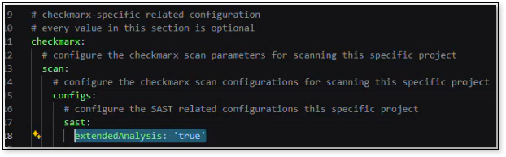
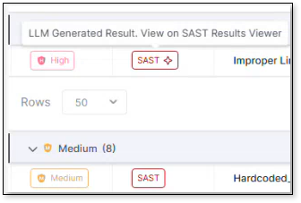

# LLM-Based Scanning

LLM-based scanning complements rule-based SAST. LLM-based scanning uses probabilistic reasoning to find and analyze vulnerabilities independent of language syntax and detects vulnerabilities in languages and extensions not supported by SAST.


Enable LLM-Based scanning for codebases with multiple languages not fully covered by SAST rules.


## Choosing Your Configuration Level

Use the following table to help determine where best to enable LLM-based scanning:

| Where to Enable | When to Enable |
|---|---|
| **Tenant-level** | Enable if your organization uses many languages; all projects inherit LLM-based scanning by default. |
| **Project-level** | Enable for specific high-risk or multi-language projects; fastest path for selective use. |
| **Scan-level** | Enable via your config as code file (config.yml) for specific scans or temporary testing without changing project settings |

## Enabling LLM-based Scanning

LLM-based scanning is configured at the tenant, project, and scan levels.


Ensure that the AI toggle is enabled: Select  > **Global Settings** > **AI**, and then under **AI Capabilities** , ensure **Allow AI Usage** is toggled on.

If **Allow AI Usage** is OFF, LLM-based scanning will not run even if enabled at project or scan level!


- To enable LLM-based scanning at the tenant-level: Go to  > **Global Settings** > **SAST** >, and set **LLM-based Settings** to **true**.

  
- To enable LLM-based scanning at the project level: Go to **Projects** > at the end of the project's row select  > **Project Settings** > **Rules**, and then set **LLM-based scanning** to true.
- To enable LLM based scanning on the scan leveI: add the parameter: `extendedAnalysis: 'true'` under the sast section in your configuration file (config.yml). See Configuring Projects Using Config as Code Files and, specifically, the **LLM-based scanning** SAST parameter for more information.

  

Alternatively, you can enable **LLM-based scanning** as a rule when you first create the project. See Creating Projects for more information on rules when creating projects.

## Understanding Results

Each finding displays whether it was detected by SAST rule-based scanning or LLM-based scanning. LLM-based scan results are denoted with a star in their tag in Risk Orchestration and in their own dedicated column in the SAST results viewer. For more information on viewing and understanding results see [SAST Results Viewer](sast-results-viewer.md).

