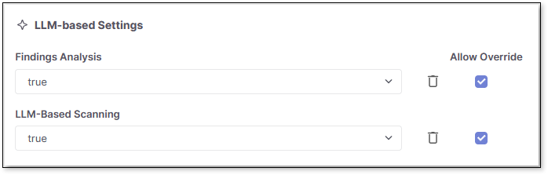
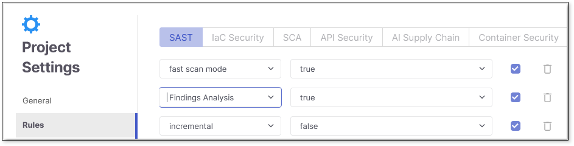
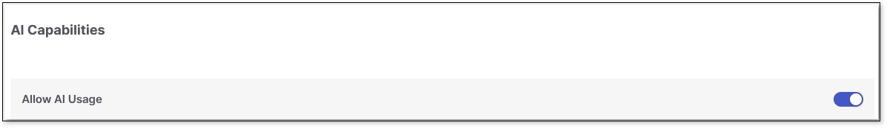
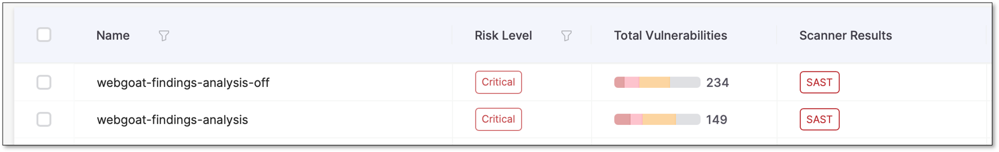
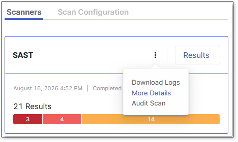
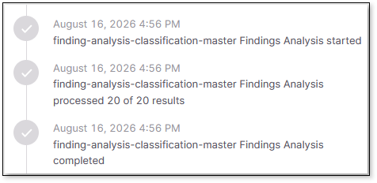

# SAST Findings Analysis

**Findings Analysis** is an optional capability in Checkmarx One that uses AI to automatically review SAST scan results and filter out likely false positives. When enabled, it reduces noise in your results so your team can focus on the findings that matter most, reducing manual triage.

## Configuring Findings Analysis

Findings Analysis can be configured globally, under your tenant's LLM-based settings or per project or per scan as an override to the global setting.


Configuration precedence: **Tenant** → **Project** → **Scan** (each level overrides the one before it).


- **Tenant-level**: Go to  > **Global Settings** > **SAST** >, and then under **LLM-based Settings**, set **Findings Analysis** to true to enable it (by default **Findings Analysis** is disabled and set to false).

  
- **Project-level**: Go to **Projects** > at the end of the project row, select  > **Project Settings** > **Rules**, and then set **Findings Analysis** to true.

  

  Alternatively, you can enable **Findings Analysis** as a rule when you first create the project. See Creating Projects for more information on rules when creating projects.
- **Scan-level**: Include an override in the scan configuration payload, and then set `scan.config.sast.findingsAnalysis` to `true` to enable it for that scan.

  ```
  {
      "key": "scan.config.sast.findingsAnalysis",
      "value": "true",
      "allowOverride": true
  }
  ```

**Findings Analysis** also follows your tenant's overall AI usage control. If AI features are disabled at the tenant level, **Findings Analysis** is disabled as well, regardless of its individual setting. Select  > **Global Settings** > **AI**, and then under **AI Capabilities** , ensure **Allow AI Usage** is toggled on.



## How Findings Analysis Works

When **Findings Analysis** is enabled, it automatically classifies eligible SAST findings as good (true positive) or bad (false positive) on the backend. Only **High**, **Medium**, **Low**, and **Info** severity findings are eligible for classification; **Critical** severity findings are never analyzed and are always returned in full, regardless of this setting.

Findings Analysis runs once SAST scan results are available, as part of the scan flow. Once classification is complete, only good results are displayed in the result set - bad results are filtered out.



Only new findings (**State** = **New**) are evaluated this way: on a project's first scan, all findings are analyzed, while on subsequent incremental scans only newly detected findings go through the classification. The classification from a finding's first analysis is retained and reapplied on later scans of the same project, so a finding classified as a false positive continues to be filtered out on subsequent scans without being re-analyzed. This prevents the same false positive from reappearing in results - so a scan showing few or no findings can mean all detected findings were already classified as false positives in an earlier scan, not that something went wrong. **Findings Analysis** runs after the scan. To confirm whether it ran for a given scan, go to **Scan History**, select the scan, open the **Scanners** tab, select **SAST** >  > **More Details** > scroll down to the **Findings Analysis** entries.




