# SCA Results Viewer

The **SCA Results** page displays the SCA results for the most recent scan of your Project. This includes a list of all 3rd party packages identified in your Project, as well as the specific risks associated with those packages, such as vulnerabilities, legal risks, and outdated versions.

<figure><figcaption></figcaption></figure>

To access the SCA Results Viewer, navigate to the **Projects** page, hover over the  icon in the desired project's row, and click on SCA results in the window that appears.

This screen includes a Header bar with general information about the Project and scan. It also shows detailed scan results, divided into the following tabs:

- Packages – shows info about the packages used by your project and the risks that are associated with those packages, including: security vulnerabilities, license violations, and outdated versions. This tab includes two types of pages:

  - **All Packages** – shows a list of all packages that were identified by this scan
  - **Package Details** – shows detailed info about the risks associated with a specific package.

  
  If a package needs recalculation (e.g., the Package was snoozed or muted), a red dot indicator will be displayed on the Packages tab.
  
- Risks – shows info about all of the security vulnerabilities that were identified in the open source packages used by your project, including: severity level, CVE references, remediation recommendations etc. This tab includes two types of pages:

  - **All Risks**– shows a list of all vulnerabilities identified in your open source dependencies.
  - **Risk Details** – shows detailed info about a specific vulnerability.
- Container (for projects with container images) – shows info about packages identified in your container images as well as the vulnerabilities associated with those packages.

  
  This tab, which is part of SCA results viewer, is only in use for accounts that are still using the original Container scanner. For accounts that use the new Container Security scanner, the results are shown in the separate [Container Security Results Viewer](../container-security/container-security-results-viewer.md).
  

  - **Container Packages** – shows a list of all of the packages identified in the container images.
  - **Container Vulnerabilities** – shows a list of all of the vulnerabilities associated with the container packages.
- Licenses - shows info about all of the licenses that are associated with the open source packages used by your project.

  - **All Licenses** – shows a list of all licenses associated with the open source packages identified in this scan.
  - **License Details** – shows detailed info about a specific license. Click on a row in the **All Licenses** tab to access this page.
- Remediation Tasks - shows info about specific remediation tasks that Checkmarx recommends implementing for your Project.

  - **All Remediation Tasks** – shows a list of remediation tasks that are recommended for this Project.
  - **Task Details** – shows detailed info about a specific task. Click on the **How to fix** button in a task row in the **All Remediation Tasks** sub-tab.

## Header Bar

The header bar shows general info about the Project and the scan that is currently displayed on the page.

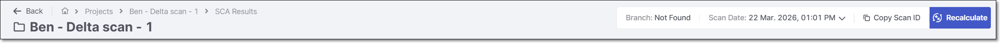

The following tables describe the information displayed in the Header bar and the available Action buttons.

<details>

<summary>Header Bar Info</summary>

| **Item** | **Description** | **Possible Values** |
|---|---|---|
| **Project Name** | The name of the project. | e.g., webgoat5 |
| **Scan Date** | The date and time that the scan was run. | e.g., Feb 23, 2021 11:51 AM |
| **Copy Scan ID** | When you hover over **Scan ID**, the unique identifier of the scan generated by Checkmarx SCA is shown. There is a button to copy the ID to your clipboard. | e.g., 95fc1f60-a4aa-4835-acfd-95aa315d4890 |
| 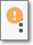<br>(When relevant) | A warning symbol is shown when there have been issues with the scan | |

</details>

### Actions

| **Icon** | **Action** | **Description** | **Options** |
|---|---|---|---|
|  | **Recalculate Scan** | Click to reevaluate the risks associated with the dependencies in your project. See [Recalculating SCA Scan Results](README.md#recalculating-sca-scan-results) | |
|  | **Scan Report** | Click on this button to download a file containing an overview of the security of your project as well as specific vulnerabilities, legal risks, and outdated versions identified by the scan. | **Report sections:**<br>• All data tables (Default)<br>• Packages<br>• Vulnerabilities<br>• Licenses<br>• Policy Violations<br>**File formats:**<br>• PDF (Default)<br>• XML<br>• JSON<br>• CSV |
|  | **Software Bill of Materials** | Click on this button to download a file containing detailed info about each of the open source packages used by your program, and the associated risks. You can specify how the SBOM will be formatted, [CycloneDX v1.7](https://cyclonedx.org/docs/1.7/#SchemaProperties) or [SPDX v2.3](https://spdx.github.io/spdx-spec/v2.3/). Learn more about Checkmarx's SBOMs here. | **File formats:**<br>• XML (for CycloneDx only)<br>• JSON |
|  | **Remediation Manifest** | Click on this button to start the process of remediating the Project’s manifest files. For more information see [Export Remediated Manifest File](https://docs.checkmarx.com/en/34965-322318-sca-scanner.html#UUID-2865b187-60e6-84f0-67c8-c5313ef205fc_section-idm33470162275302). | N/A |
|  | **Resolving Info** | Display info about the package resolution process.<br>• Package Identified By - Shows the number of packages identified, broken down by how they were identified:<br>• Manifests -<br>Lists the manifest files in the Project. For each file, an icon indicates whether or not Checkmarx SCA was able to resolve the dependencies from the file.<br>There is a **Hide Successful** switch that enables you to hide the manifest files that were successfully resolved. Toggle this switch ON (to the right) in order to hide successfully resolved files. | |
|  | **Scan Details** | Display details of the scan process. For each step in the scan run, the start time and duration are shown. | |
| 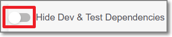 | **Hide Dev Dependencies toggle** | Toggle this switch on in order to hide results for dev packages. For more information, see below. | |

<details>

<summary>Hiding Dev & Test Dependencies</summary>

Checkmarx SCA is able to distinguish between development dependencies and production dependencies for several package managers. On the **Scan Results** page, the number in parenthesis next to the **Hide Dev & Test Dependencies** toggle indicates the number of dev & test dependencies in the Project. Toggle the **Hide Dev & Test Dependencies** switch ON if you would like to hide vulnerable packages that were identified as dev and test dependencies.


This filter can also be applied to the following REST APIs: [Results Summary](https://checkmarx.stoplight.io/docs/checkmarx-one-api-reference-guide/branches/main/510ldapufb6ns-retrieve-summary-of-scan-results) and [All Scanners Results](https://checkmarx.stoplight.io/docs/checkmarx-one-api-reference-guide/branches/main/bf7eab3023aac-retrieve-scan-results-all-scanners).


##### Identifying Dev Dependencies

The following table shows how dev dependencies are identified for specific package managers.

| **Package Manager** | **Dev Dependency Specification** |
|---|---|
| NPM | In the manifest file (package.json or bower.json), using the devDependencies attribute. For example,<br>`"devDependencies" : {`<br>` "my_test_framework": "^3.1.0".`<br>` "another_dev_dep": "1.0.0 - 1.2.0"`<br>`}` |
| Yarn | In the manifest file (package.json or bower.json), using the devDependencies attribute. For example,<br>`"devDependencies" : {`<br>` "my_test_framework": "^3.1.0".`<br>` "another_dev_dep": "1.0.0 - 1.2.0"`<br>`}` |
| Bower | In the manifest file (package.json or bower.json), using the devDependencies attribute. For example,<br>`"devDependencies" : {`<br>` "my_test_framework": "^3.1.0".`<br>` "another_dev_dep": "1.0.0 - 1.2.0"`<br>`}` |
| Composer | Packages under the require-dev section in the composer.json file. |

##### Identifying Test Dependencies

Any package with the word "test" in the file path is identified as a test dependency.

</details>

<details>

<summary>Procedure for remediation using a manifest file</summary>

##### Remediation using a Manifest File


This remediation method is effective only for remediating risks in direct dependencies. An alternative method (currently in BETA and supported only for npm) addresses remediation of transitive dependencies as well. The alternative method is accessed from the **Remediation Tasks** tab on the **SCA Scan Results Viewer** page, as described in [Remediation Tasks Tab](#remediation-tasks-tab).


Remediation is generally done by exporting the remediated file and manually replacing the manifest file in your project. However, if your project is hosted in a private GitHub repository, you can remediate your project directly from the UI by sending a pull request. If you have the required permissions, you can then merge the pull request into your project.

**To remediate your project, do the following:**

1. Go to the **SCA Scan Results Viewer** page for the scan of the Project that you would like to remediate.
2. Hover over the **Export**  icon at the top right corner of the page and click on **Remediation Manifest**.

   <figure>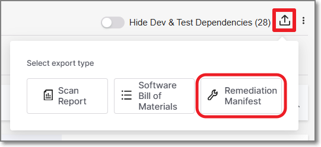<figcaption></figcaption></figure>

   The **Remediate manifest** message appears, displaying a list of all the manifest files that can be remediated. A checkbox is displayed next to each file in the list.

   <figure>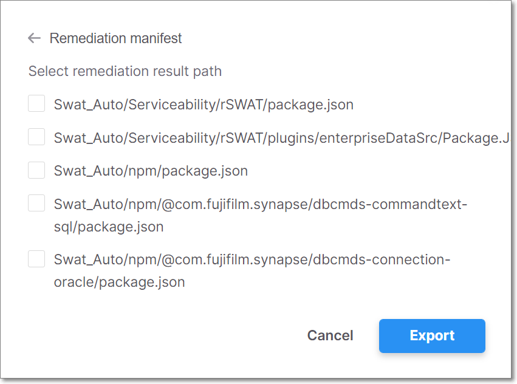<figcaption></figcaption></figure>

   
   For a project in a private GitHub repository, an **Open Pull Request** button is displayed next to the download icon.
   

   
   If a manifest file cannot be remediated, for example it already contains the latest packages or the latest packages have still not been fixed for the known vulnerabilities, the manifest file will not be displayed.
   
3. Select the checkbox for each manifest file that you would like to remediate.
4. If you want to remediate your project manually, select the checkbox and click **Export** to download the remediated manifest file and use it to update your project.
5. If you want to remediate your project directly in GitHub, use the following procedure.

   1. Click **Open Pull Request** next to the package manager file that you require. A pull request is sent to your project’s GitHub repository. The **Open Pull Request** button is replaced with a **View Pull Request** button.
   2. To view the pull request, click **View Pull Request**. GitHub opens to your project, displaying **CxSCA-Remediation**. Under **Packages updated by CxSCA-Remediation**, there is a list of the remediated open source packages, the updated version numbers, and the fixed vulnerabilities.
   3. You can merge the remediated open source packages into your project by clicking **Merge pull request**, displayed in GitHub. The next scan of your project should show fewer (or no) vulnerabilities.

</details>

## Packages Tab

The **Packages** tab shows detailed info about the packages that were identified in your source code and the vulnerabilities that they contain.


The **Packages** tab contains sub-tabs that show two types of pages:

- **All Packages** – shows a list of all packages that contain vulnerabilities that were identified by this scan.
- **Package** **Details** – shows detailed info about a specific package. Click on a row in the **All Packages** sub-tab to access this page.

  
  Alternatively, you can access this page by clicking on a package in the **Global Inventory & Risks > Packages** page.
  

You can navigate between the various tabs that you have opened.

### All Packages Page

The **All Packages** sub-tab shows separate tabs for the different types of packages (Direct 3rd Party Packages, Transitive 3rd Party Packages, Private Packages and Saas Providers). Each tab shows the overall number of packages of this type as well as the number of policy violations for that category.


For a package that is referenced both directly and transitively, the total number of packages shown at the top of the All Packages tab counts that package only once. Therefore, the total number of packages may be fewer than the total of the Direct packages plus the number of Transitive packages.


Clicking on a category heading expands that section, to show a list of packages of that type that were identified by this scan of your Project. For each package, info is shown about the risks related to that package. You can search for specific packages using the search box.

You can also sort by column headers and set filters for each column.

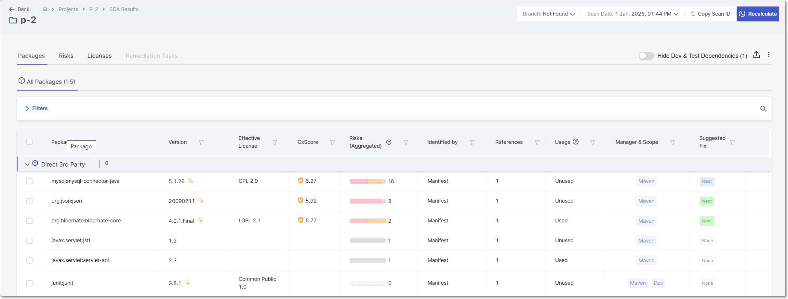

The following table describes the info shown for each package identified by this scan.

| **Item** | **Description** | **Possible Values** |
|---|---|---|
| **Package** | The name of the package.<br>This column also shows the  icon for direct dependencies if a remediated package version exists.<br>Clicking on the icon takes you to that item in the [Remediation Tasks Tab](#remediation-tasks-tab). | e.g., dom4j:dom4j |
| **Version** | The version of the package that you are using.<br>This column also shows the  icon for packages that are outdated (i.e., a newer version is available).<br>Hover over the icon to view addition info about the more recent versions. | e.g., 1.6.1 |
| **Effective License** | Shows the Licenses that are associated with the package. For multiple licenses, hover over the display to show all licenses and the associated legal risks. | e.g., GPL 2.0, Apache2.1 |
| **CxScore** | A composite risk metric that combines vulnerability severity with real-world exploitability to prioritize remediation. For more information, see [CxScore](../../general-product-information/checkmarx-one-calculation-of-severity-level/README.md). | • Critical - 9.0-10.0<br>• High - 7.0 to 8.9<br>• Medium - 4.0 to 6.9<br>• Low - 0.1 - 3.9<br>• Info - 0.0 |
| **Risks (Aggregated)** | A color coded bar graph indicating the number of vulnerabilities of each severity level. Hover over the bar to view a breakdown of the results by Vulnerability, Legal Risk and Suspected Malware.<br>For malicious packages the  icon is shown.<br><br>You can apply complex filters to show only packages that contain risks of a specific type and of a specific severity.<br><br>You can also apply filters to show only packages of a specific **state** (e.g. Monitored, Muted or Snoozed).<br><br><br>The color coded bar graph is shown for **Monitored** packages only. If a Package is **muted** or **snoozed**, the respective icon will be placed instead of the bar.<br> | e.g.,<br>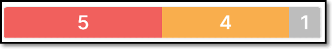 |
| **Identified By** | Indicates how the package was identified. | • **Manifest** – identified by resolving the manifest file<br>• **Binary** – identified by analyzing hashes and fingerprints of files in the Project |
| **References** | Shows the number of paths that reference this package.<br><br>Packages that are referenced both directly and transitively, are included in the **Direct 3rd Party** section and the number of direct (D) and transitive (T) paths are given.<br> | e.g., 1D, 12T |
| **Usage**<br>(for Projects with Exploitable Path activated) | Indicates whether or not this package is used (called) by your project’s source code. | • **Used** – Package is directly used by the source code.<br>• **Potentially** – The package is a transitive dependency of a direct package that your source code uses.<br>• **Unused** – No usage was detected.<br>• **Package to be analysed soon** – The package is newly seen and has been added to the analysis queue. Usage information will be available in an upcoming scan.<br>• **Package source code not available** – Package source code was unavailable or could not be analyzed.<br>• **Failed to analyze source code** - An error occurred while analyzing the package or your source code.<br>• **Unsupported language** – Usage analysis is not supported for the package language.<br><br>The **No SAST** and **Unknown** statuses are legacy statuses and may still be displayed for scans performed before the introduction of the native reachability engine.<br> |
| **Manager & Scope** | Shows labels that Checkmarx applied to the package. There is a label indicating the package manager used for package resolution. Additional labels are applied to special types of dependencies. | • **Package Manager** - shows the package manager that was used for resolution, e.g., Maven, Pip, Nuget, Npm etc.<br>• **Dev** - is applied to dev dependencies.<br>• **Test** - is applied to all packages that have the word "test" in their file path.<br>• **Verified by NPM** - is applied to packages for which the signatures were verified using `npm audit signatures`.<br>• **Private Package** - is applied to packages that are hosted on private repositories.<br>• **Framework** - is a package that is included in the Framework installation. These packages usually can't be remediated without updating the version of the overall framework.<br><br>Currently supported only for .NET projects.<br> |
| **Suggested Fix** | Provides an at-a-glance indication of upgrade opportunities for each dependency. The column indicates whether a safer package version is available and whether the suggested upgrade fully or partially remediates the associated vulnerabilities.<br>Hover over the Suggested Fix indicator for additional remediation details. For more information, see [Suggested Fix Tooltip](#suggested-fix-tooltip).<br>Click See details to open the remediation side panel. For more information, see Package Details Side Panel. | • **None** – No vulnerabilities exist, or no better version is available.<br>• **Next** – A safer version is available.<br>• **Latest** – Only the most recent version resolves the issue.<br>The indicators are color-coded to reflect the effectiveness of the suggested upgrade:<br>• **Green** – The suggested version fully resolves all vulnerabilities.<br>• **Purple** – The suggested version improves security but does not fully remediate all vulnerabilities. |
| **AppSec Knowledge Center** | Link to the AppSec Knowledge Center page for each package. |  |

#### Suggested Fix Tooltip

Hovering over the indicator provides additional context, including the recommended version number and a breakdown of how many vulnerabilities are reduced compared to the current version, segmented by severity level. This allows for quick impact assessment without leaving the view.

<figure><figcaption></figcaption></figure>

#### Package Details Side Panel

Clicking **See details** opens a side panel with deeper remediation insights. This includes the recommended most secure versions, showing both the next version that resolves the issue and the latest available version. A **Version Timeline** toggle provides visibility into intermediate versions between the current, next, and latest releases. You can also navigate directly to the **AppSec Knowledge Center** to explore the full package history and all associated vulnerabilities.

<figure><figcaption></figcaption></figure>

Hovering over a recommended version in the side panel reveals a **Copy Version** option, allowing you to quickly copy the version number and paste it directly into your project configuration for faster remediation.

### Package Details Page

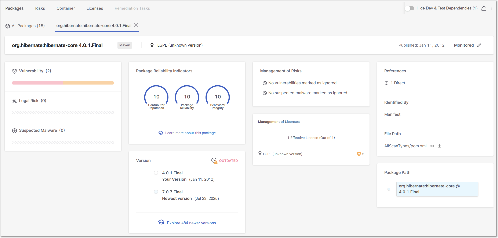

The **Package Details** sub-tab shows detailed info about a specific package. The top info pane gives general info about the package, and the separate cards below it show detailed info about various aspects of the risks posed by the package. If the package requires recalculation (e.g., the package was snoozed or muted), a red dot indicator will be shown on the sub-tab.

#### Info Pane

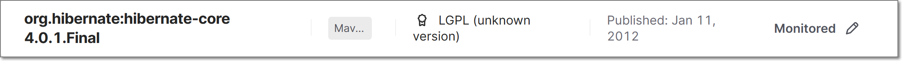

| **Item** | **Description** |
|---|---|
| **Package** | The name and version of the package. |
| **Remediation Task**<br> | A link to the recommended remediation task in the **Remediation Tasks** tab.<br>(Only shown when available) |
| **Dependency Type** | The type of package manager used for this package. |
| **License(s)** | Shows all licenses that you have that are associated with this package. |
| **Published** | The date that this version of the package was published. |
| **State** | The state of the package. Clicking on the state opens a side panel with a drop down list to choose the state from.<br><br>Changes in package state are a serious matter; Saving changes can only be implemented with a comment explaining your consideration.<br><br>Options are:<br>• **Monitored (default)** - vulnerabilities are displayed based on the risk score.<br>• **Muted** - vulnerabilities associated with the package will permanently not be shown as risks to your project.<br>• **Snoozed** - vulnerabilities associated with the package will be muted temporarily. It is required to choose a date for the snooze to expire.<br>The side panel includes a History tab where you can view a log of previous state changes and comments. |

#### Package Details Sections

<figure>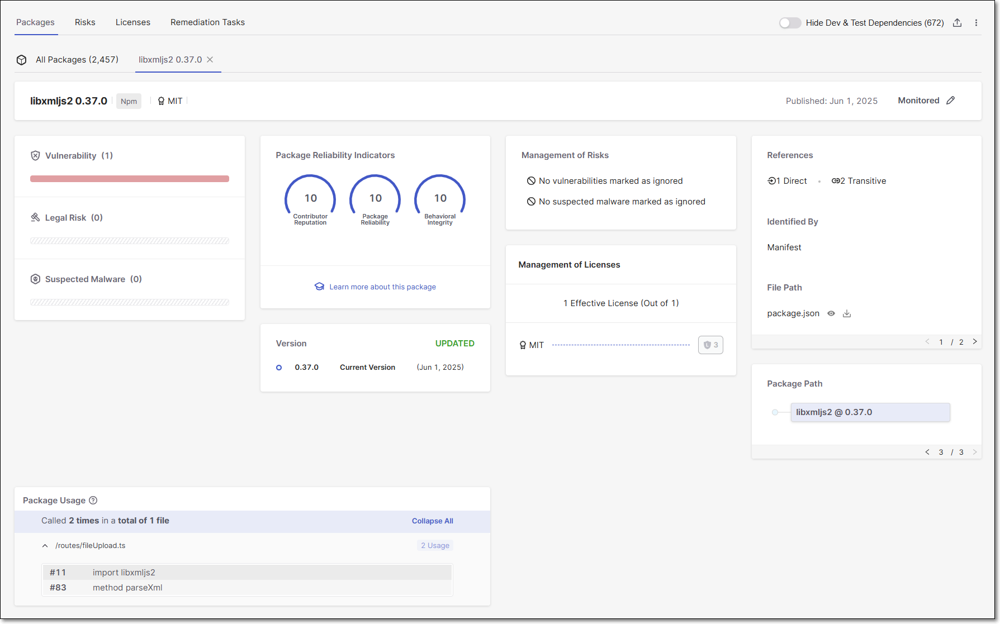<figcaption></figcaption></figure>

| **Item** | **Description** |
|---|---|
| **Watch Out!**<br>(for malicious packages) | This warning card will be displayed if this version of the package is known to be malicious. |
| **Vulnerability** | The total number of vulnerabilities in this package, followed by a color coded bar graph indicating the number of vulnerabilities of each severity level. |
| **Legal Risk** | The total number of Legal Risks in this package, followed by a color coded bar graph indicating the number of Legal Risks of each severity level. |
| **Suspected Malware** | The total number of Suspected Malware risks affecting this package, followed by a color coded bar graph indicating the number of Suspected Malware risks of each severity level. |
| **Package Reliability Indicators** | Shows gauge widgets representing three risk categories (Reputation, Reliability and Behavior). The scores are given on a scale of 0-10, with 10 indicating the highest level of security. |
| **Version** | Shows the version you are using, the newest version, the number of newer versions released since you last updated and an overall assessment of whether there is a need to update your version. |
| **Learn More About This Package** | Shows a link to the AppSec Knowledge Center for more information about this package. |
| **Management of Risks** | Shows if any vulnerabilities and Suspected Malware risks have been marked as ignored. |
| **Management of Licenses** | Shows the number of Licenses that have been marked as Effective Licenses.<br>In addition, a link is given to view detailed information about this license in the risk details tab. |
| **References** | Shows the number of manifest files that refer to this package and indicates whether it is a direct or transitive dependency. |
| **Identified By** | Indicates how the vulnerable package was identified. Possible values are:<br>• *Manifest* – identified by resolving the manifest file<br>• *Binary* – identified by analyzing hashes and fingerprints of files in the Project |
| **File Path** | The file path to the manifest file where this package was identified is shown. Click on the icons to view or download the file. |
| **Package Path** | The selected package is displayed in blue. If this is a transitive dependency (i.e., it is accessed via other packages), then the full path by which the package is accessed is shown above it. You can click on any package shown in the path in order to open a new tab showing details for that package. If there are multiple paths to this package, then you can click on the forward and back arrows at the bottom of the pane to view each of the paths.<br><br>For packages that were identified by binaries (and not by a manifest file), no data is shown for the package path.<br><br><br>Frequently you can fix the vulnerabilities by updating the transitive packages with their latest versions.<br> |
| **Package Usage**<br>(for projects with Exploitable Path activated) | Shows the places in your code where the vulnerable package is called. Results are grouped by file path. Expand an item to see the line number and node of each place where the package is called. |

## Risks Tab

The **Risks** tab shows info about all of the Risks that are associated with the open source packages used by your project. This includes vulnerabilities (e.g., CVEs), as well as suspected malware (e.g., malicious packages), legal risks and outdated packages.

<figure>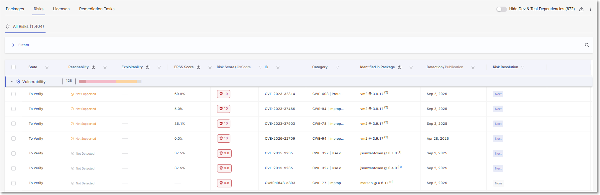<figcaption></figcaption></figure>

The **Risks** tab contains sub-tabs that show two types of pages:

- **All Risks** – shows a list of all Risks identified by this scan. This tab is accessed by clicking on the **Show All** button on the **Project** page and then selecting the **Risks** tab. The results on the All Risks tabs are divided into the following tabs:

  - **Vulnerability** - shows a list of vulnerabilities in your open source packages that can be exploited by an attacker. This includes vulnerabilities that have been published as CVEs as well as vulnerabilities identified by the Checkmarx Vulnerability Research Team (i.e., Cx). The summary graph shows the total number of vulnerabilities and a breakdown by severity level.
  - **Suspected Malware** - shows various types of suspected malware risks that affect the packages in your project, such as packages that are Malicious by design and packages that are vulnerable to ChainJacking attacks etc. The summary graph shows the total number of suspected malware risks and a breakdown by severity level.
  - **Legal Risk** - shows all of the Legal Risks relating to the licensing of the packages used in your project. The summary graph shows the total number of legal risks and a breakdown by severity level. Learn more about Legal Risks in the section [below](#legal-risks).
  - **Outdated** - shows a list of all packages that have vulnerabilities or suspected malware risks, for which a more recent package version is available. The summary graph shows the total number of vulnerable outdated packages as well as a breakdown by severity level (i.e., highest severity vulnerability in the package).
- **Risk Details** – shows detailed info about a specific Risk. Click on a row in the **All Risks** tab to access this page.


Alternatively, you can access this page by clicking on a Risk in the **Global Inventory & Risks > Risks** page.



Clicking on a **Legal Risk** opens the **[Licenses](#licenses-tab)** tab filtered for the relevant license.

The packages listed in the **Outdated** section aren’t clickable and don’t have a Risk Details page associated with them.


You can navigate between the various tabs that you have opened.

### Legal Risks

#### Overview

Checkmarx identifies all of the licenses associated with the open source packages used in your project. The complete list of licenses is shown in the **Scan Results** > **Licenses** tab.


The License Score represents the level of risk associated with using a package under that license. However, the license doesn't pose an actual risk to your project unless you are actually using the package under that license (i.e., it is your Effective license).


In addition, Checkmarx identifies actual risks to your project based on legal issues related to improper usage of open source packages. These risks are shown in the **Scan Results** > **Risks** tab in the **Legal Risk** section.

<figure><figcaption></figcaption></figure>

##### Marking Licenses as Effective or Not Effective

Packages often have several different licenses associated with them. This gives users the option to choose which license to consider "effective" for that package, i.e., which set of license restrictions they would like to follow. As long as you are abiding by the terms of the effective license, the other licenses don't constitute a legal risk.

Initially, the state of most licenses is set as **To Verify**. However, when there is a sole license for a package and it was identified in a reliable source, that license is automatically marked as **Effective**. You can then review the licenses and mark each license as **Effective** or **Not Effective** based on your assessment of the package usage. Changing the state of a license is done via the Checkmarx One web application, on the **Risk Details** page.

Whether or not a license is marked as Effective impacts on the determination of whether it constitutes a **Legal Risk**, as described in the following section.

##### Types of Legal Risks

We currently identify the following types of legal risks.

- **Risky effective license** - A license has a **high** severity License Score and is also marked as **Effective** for this package.
- **Package with no effective license** - There is an open source package in your project for which no license has been marked as Effective.
- **Package with no license** - Checkmarx didn't identify any licenses associated with this package.

#### Recommended Workflow

The following E2E workflow explains how you can leverage the legal risk functionality provided by Checkmarx to get results that accurately reflect the security posture of your project from a legal perspective.

1. Create a project and run a scan.
2. Go to the **Risks** tab > **Legal Risks** and check for packages with no license associated.
3. If you aware of the relevant licenses for these packages, add them via API, using POST /management-of-risk/package-licenses.
4. Go to the **Scan Results** > **Licenses** tab. Review each license and mark whether or not it is the **Effective** license for the specified package (via the web application).
5. On the **Scan Results** page, click on > **Recalculate Last Scan**.
6. After the recalculation is complete, go to the **Risks** tab > **Legal Risks** and check what **Legal Risks** were identified in your project.
7. Take the required steps to remediate these risks.

### All Risks Page

The **All Risks** sub-tab shows separate tabs for the different types of Risks (Vulnerability, Suspected Malware, Legal Risk and Outdated). Each tab shows the overall number of Risks for this type and the number of Risks for each risk level. Clicking on the arrow on the left of the tab expands a list below it to show all Risks of this type identified by this scan of your Project. For each Risk, info is shown about the nature of the Risk. You can search for specific Risks using the search box.


If a risk affects several packages in your Project, a separate record is listed for each instance of the risk.


You can also sort by column headers and set filters for each column.

<figure>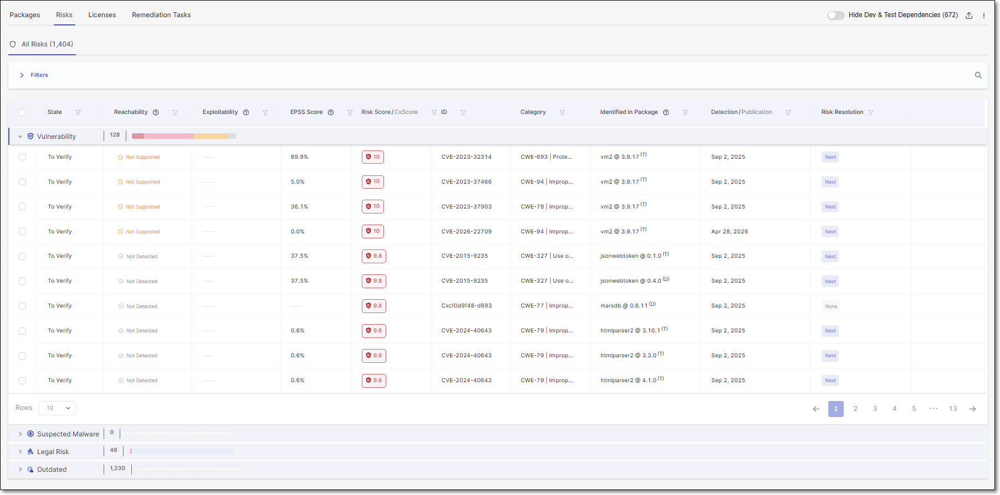<figcaption></figcaption></figure>

Clicking on the arrow on the left of the tab expands a list showing all of the risks of that type.


Risks that have been marked as **Not Exploitable** are shown with a strikethrough line and they aren't counted towards the total number of risks. However, changes to the summary counters only take effect when a subsequent scan or scan recalculation is run.


The following table describes the info shown for each vulnerability identified by this scan.

| **Item** | **Description** | **Possible Values** |
|---|---|---|
| **State** | Indicates the state of this vulnerability for this project. | For vulnerability or suspected malware risks:<br>• **To Verify** - This is the initial state of all vulnerabilities and suspected malware risks, indicating that it is a new finding that hasn’t yet been assessed by your AppSec team.<br>• **Not Exploitable** - Select this state if your team has determined that this risk doesn’t pose a threat to your application (and isn’t expected to cause a risk at any time in the future).<br>• **Proposed Not Exploitable** - Select this state if your team has suggested tentatively that this risk doesn’t pose a threat to your application.<br>• **Confirmed** - Select this state if your team has confirmed that this risk **does** pose a threat and requires mitigation.<br>• **Urgent** - Select this state if your team has determined that this risk poses an imminent threat and requires urgent mitigation.<br><br>When the state is set as **Not Exploitable**, the risk is marked with a strikethrough line and the **Risk Details** page is grayed out.<br><br><br>The states mentioned above are pre-configured for all Checkmarx One accounts. In addition, you can create custom states in your account. Once they are created, you can assign those custom states to results.<br><br>Custom states is currently supported for SAST, SCA, IaC Security and Container Security results. It is not yet available for all tenant accounts. For more info, see Custom States.<br><br>Indicates a legal risk that was marked as “effective”. |
| **Reachability** | Shows the vulnerability's Exploitable Path status.<br><br>Results are only returned if Exploitable Path was activated for this project and the project uses a language that is supported for Exploitable Path.<br> | • **Exp. Path Found** - A code path was found from your source code to the vulnerable method in the package. The vulnerability is reachable and can potentially be triggered.<br>• **Not Detected** - Exploitable Path was evaluated for this finding, but no code path to the vulnerable method was found in your project<br>• **Pending Analysis** - The package is newly seen and has been added to the analysis queue. This finding will be evaluated for Exploitable Path in an upcoming scan.<br>• **Not Supported** - Exploitable Path can't be evaluated for this finding. This covers a few underlying cases: the package's source code isn't available, the package is only used as a transitive dependency, or the language or package manager isn't yet supported for Exploitable Path.<br>• **Calculation Failed** - An error occurred while analyzing the source code for this finding. |
| **Exploitability** | Shows which exploitability indicators apply to this vulnerability. | • **Known** - This vulnerability is cataloged by CISA as a [Known Exploited Vulnerability](https://www.cisa.gov/known-exploited-vulnerabilities-catalog) (KEV), indicating that it poses a severe and imminent threat.<br>• **PoC** - A Proof of Concept (POC) for exploiting this vulnerability is available in the wild, making it easy for threat actors to implement an exploitation of this vulnerability. We draw this info from Offensive Security's [Eploit Database](https://www.exploit-db.com/). |
| **EPSS Score** | The EPSS (Exploit Prediction Scoring System) is a risk score provided by [First](https://first.org), indicating the likelihood of a vulnerability being exploited. The score is presented as a percentage, representing the likelihood of this vulnerability to be exploited within the next 30 days. Hovering over the score will display a percentile indicating the ranking of this risk relative to other vulnerabilities. | e.g., 1.6%, 87th percentile |
| **Risk Score** | Shows the the severity level of the vulnerability based on its CVSS score in the NVD, as well as the precise CVSS score.<br><br>The Common Vulnerability Scoring System (CVSS) is an open framework for communicating the characteristics and severity of software vulnerabilities.<br> | • Critical - 9.0 to 10.0<br>• High - 7.0 to 8.9<br>• Medium - 4.0 to 6.9<br>• Low - 0.1 to 3.9<br>• Info - 0.0<br>For more info about SCA risk severity, see [here](../../general-product-information/checkmarx-one-calculation-of-severity-level/README.md). |
| **CxScore** | A composite risk metric that combines vulnerability severity with real-world exploitability to prioritize remediation. For more information, see [CxScore](../../general-product-information/checkmarx-one-calculation-of-severity-level/README.md). | • Critical - 9.0-10.0<br>• High - 7.0 to 8.9<br>• Medium - 4.0 to 6.9<br>• Low - 0.1 - 3.9<br>• Info - 0.0 |
| **ID** | The ID of the CVE listing. The ID consists of the CVE prefix followed by the year that the CVE was discovered and the serial counter for that year's CVE listings.<br><br>Vulnerabilities discovered by the Checkmarx Vulnerability Research Team which are net cataloged as CVEs, are indicated by the “Cx” prefix.<br> | e.g., CVE-2020-9488 |
| **Category** | The category of the vulnerability. For CWEs, the CWE is given as well as a brief description of the vulnerability. | e.g., CWE-89\|SQL Injection, Malicious, ChainJacking etc. |
| **Identified in Package** | The name and version of the package in which the vulnerability was identified.<br>In addition, an indication is shown for the type of dependency:<br>• D - Direct dependency<br>• T - Transitive dependency<br>• M - Mixed dependency (i.e., the package is used in the project both directly and also transitively)<br>Results can be filtered by dependency type. | e.g., loadash @ 4.13.1 <sup>(T) </sup> |
| **Detection / Publication** | Shows the date that this vulnerability was first officially published on a supported public Security Advisory. | e.g., Nov 16, 2020 |
| **Risk Resolution** | Provides an at-a-glance indication of remediation opportunities for a specific vulnerability. The column indicates whether a package version is available that fully or partially remediates the vulnerability.<br><br>In the context of the Risks tab, remediation recommendations are vulnerability-specific. Different vulnerabilities within the same package may suggest different upgrade versions.<br><br>Hover over the Risk Resolution indicator for additional remediation details. For more information, see [Risk Resolution Tooltip](#risk-resolution-tooltip).<br>Click See details to open the remediation side panel. For more information, see Package Details Side Panel. | • **None** – No remediation version is available.<br>• **Next** – the earliest version of the package that solves the risk.<br>• **Latest** – Only the latest version remediates the vulnerability.<br>The indicators are color-coded to reflect the effectiveness of the suggested upgrade:<br>• **Green** – The suggested version fully resolves the vulnerability.<br>• **Purple** –The suggested version reduces the risk but does not fully remediate it. |
| **Explore in AppSec Knowledge Center** | Click on the icon to learn more about this vulnearbility in our AppSec Knowledge Center. |  |

#### Risk Resolution Tooltip

Hovering over the indicator provides additional context, including the recommended version number and remediation guidance for the suggested upgrade.

<figure>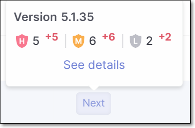<figcaption></figcaption></figure>

#### Package Details Side Panel

Clicking **See details** opens a side panel with deeper remediation insights. This includes the recommended secure versions, showing both the next version that remediates the vulnerability and the latest available version.A **Version Timeline** toggle provides visibility into intermediate versions between the current, next, and latest releases. You can also navigate directly to the **AppSec Knowledge Center** to explore the full package history and all associated vulnerabilities.

<figure>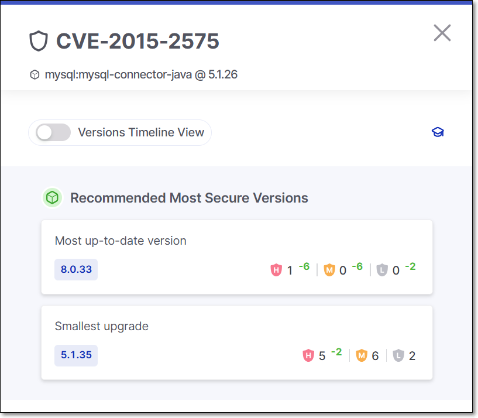<figcaption></figcaption></figure>

Hovering over a recommended version reveals a **Copy Version** option, allowing you to quickly copy the version number and paste it directly into your project configuration for faster remediation.

### Risk Details Page

The **Risk Details** sub-tab shows detailed info about a specific Risk. The top info pane gives general info about the vulnerability, and the separate cards below it show detailed info about various aspects of the risks posed by the vulnerability.

The different risk types are:

- **Vulnerability** - a vulnerability that can be exploited by an attacker. This includes vulnerabilities that have been published as CVEs as well as vulnerabilities identified by Checkmarx AppSec experts (i.e., Cx).
- **Suspected Malware** - shows various types of Suspected Malware risks that affect the packages in your project, such as packages that are Malicious by design and packages that are vulnerable to ChainJacking attacks.


There are no **Risk Details** pages associated with **Legal Risks** or **Outdated** packages. Clicking on a **Legal Risk** opens the **Licenses** tab filtered for the relevant license. **Outdated** packages aren’t clickable.


Each type of risk shows different cards on the details page. The different cards are described in the tables below.

#### Vulnerability Details

Vulnerabilities are risks that can be exploited by an attacker. This includes vulnerabilities that have been published as CVEs as well as vulnerabilities identified by the Checkmarx Vulnerability Research Team (i.e., Cx).

##### Info Pane

<figure>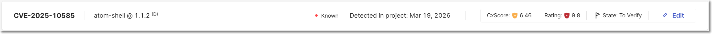<figcaption></figcaption></figure>

| **Item** | **Description** | **Possible Values** |
|---|---|---|
| **ID** | The ID of the CVE listing. The ID consists of the CVE prefix followed by the year that the CVE was discovered and the serial counter for that year's CVE listings.<br><br>Vulnerabilities discovered by the Checkmarx Vulnerability Research Team which are net yet catalogued as CVEs, are indicated by the “Cx” prefix.<br> | e.g., CVE-2019-12384 |
| **Package** | The name of the package in which the vulnerability was identified. | e.g., com.fasterxml.jackson.core:jackson-databind 2.9.8 |
| **Version** | The version of the package where the vulnerability was identified. | e.g., 5.1.26 |
| **Exploitability** | Shows which exploitability indicators apply to this vulnerability. | • KEV<br>• POC<br>• Exploitable Path |
| **Detected in Project** | The date that the vulnerability was first identified in this project. | e.g., May 12, 2024 |
| **CxScore** | A composite risk metric that combines vulnerability severity with real-world exploitability to prioritize remediation. For more information, see [CxScore](../../general-product-information/checkmarx-one-calculation-of-severity-level/README.md). | • Critical - 9.0-10.0<br>• High - 7.0 to 8.9<br>• Medium - 4.0 to 6.9<br>• Low - 0.1 - 3.9<br>• Info - 0.0 |
| **Rating** | Shows the severity level of the vulnerability based on its CVSS score in the NVD, as well as the precise CVSS score. | • Critical - 9.0 to 10.0<br>• High - 7.0 to 8.9<br>• Medium - 4.0 to 6.9<br>• Low - 0.1 to 3.9<br>• Info - 0.0<br>For more info about SCA risk severity, see [here](../../general-product-information/checkmarx-one-calculation-of-severity-level/README.md). |
| **Risk State** | This indicates the current state of the vulnerability as determined by your AppSec team. All new risks are initially marked as To Verify. A user with `manage-risk` role (e.g., Admin, SCA Manager) can change the Risk state for this Project by clicking on the **Risk State** field and selecting the radio button for the desired state. See Risk Management. | • To Verify<br>• Not Exploitable<br>• Proposed Not Exploitable<br>• Confirmed<br>• Urgent<br><br>When the state is set as Not Exploitable, the page is grayed out and the risk is marked with a strikethrough line on the **All Risks** tab.<br> |

##### Vulnerability Details Sections

<figure>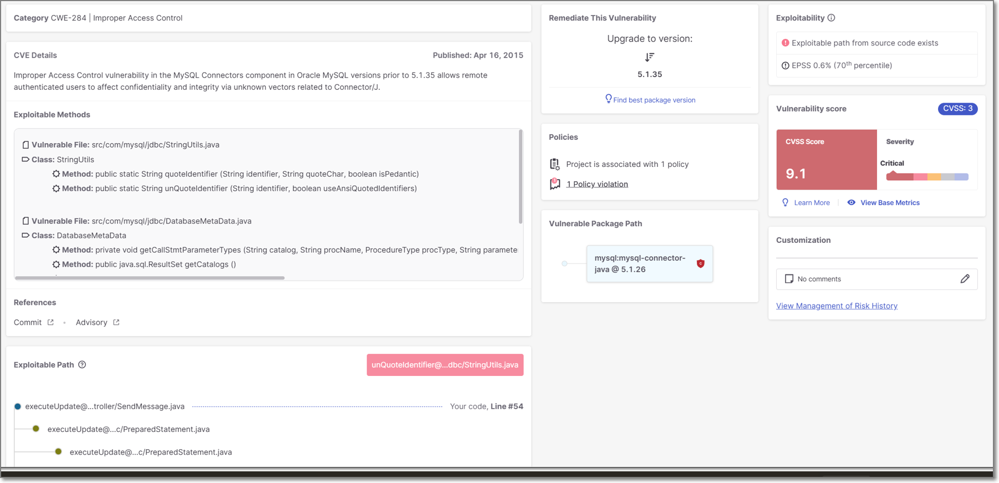<figcaption></figcaption></figure>

| **Item** | **Description** |
|---|---|
| **Category** | The ID and description of the CWE (Common Weakness Enumeration) listing. The ID consists of the CWE prefix followed by the serial counter. |
| **CVE Details** | A description of the nature of the threat posed by the vulnerability and the date the vulnerabiliity was published in the NVD. |
| **Exploitable Methods** | Details about the vulnerable methods that expose the vulnerability to exploitation. When the relevant details are available, we show the vulnerable file path, class, and method. This visibility increases transparency into how we evaluate exploitable paths, and provides actionable data for cases where full exploitable path analysis is not possible. |
| **References** | Links to external resources about the vulnerability. Links are given for topics such as: Advisory, Commit, Release Notes, Issue etc. |
| **Exploitable Path** | If a path was detected from your source code to the vulnerable method in the package, a map of the path is displayed. |
| **Remediate this Vulnerability** | Recommended steps that should be taken to remediate this vulnerability. If available, a remediated version of the package is recommended for upgrade. Otherwise, the **AI Package Finder** button is shown that enables you to get AI generated suggestions for non-vulnerable replacement packages.<br><br>The recommended package version, is the minimum version that does not contain this particular vulnerability. To find the minimum version that doesn’t contain any vulnerabilities, click on **Find best package version**.<br> |
| **Policies** | The number of Policies the Project is assigned to and the number of Policy violations. |
| **Vulnerable Package Path** | The vulnerable package is displayed in blue. If this is a transient dependency (i.e., it is accessed via other packages), then the full path by which the package is accessed is shown above it. You can click on any package shown in the path in order to open a new tab showing details for that package.<br><br>Frequently, you can fix the vulnerabilities by updating the transient packages with their latest versions.<br> |
| **Exploitability** | Shows which exploitability indicators apply to this vulnerability. (KEV, POC, EPSS and Exploitable Path) |
| **Vulnerability Score** | Shows the CVSS Version, Score, and Severity, as well as the components that make up the CVSS score including: Attack Vector, Confidentiality Impact, Attack Complexity, Integrity Impact, Authentication, and Availability Impact. For a full explanation of the metrics that make up the CVSS score, see [CVSS Score Details](#cvss-score-details). |
| **Customization** | Displays comments regarding this vulnerability and a link to view the risk management history. |

##### CVSS Score Details

The metrics that are used for calculating the CVSS score are different for each version. Therefore, the metrics shown when you click on **View Base Metrics** on the Risk page differ according to the version. Additional information about CVSS score calculation is available [here](https://www.first.org/cvss/specification-document).


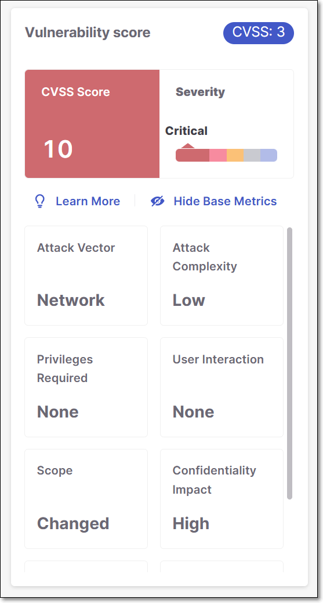


<details>

<summary>API Responses</summary>

Detailed results for SCA vulnerabilities can be returned using the `GET /results` API. The results for each SCA vulnerability include a `vulnerabilitiesDetails` object. The attributes returned for this object differ depending on the CVSS version that is used for that vulnerability. You may need to adjust some of your workflows to accommodate the schema of the new type of results.

| CVSS 2.0 | CVSS 3.1 | CVSS 4.0 |
|---|---|---|
| "vulnerabilityDetails": { "cvssScore": 2.1, "cveName": "CVE-2015-3010", "cweId": "CWE-200", "cvss": { "score": 2.1, "version": 2, "severity": \["INFO", "NONE", "LOW", "MEDIUM", "HIGH"\], "integrity": \["NONE", "PARTIAL", "COMPLETE"\], "attackVector": \["LOCAL", "ADJACENT NETWORK", "NETWORK"\], "availability": \["NONE", "PARTIAL", "COMPLETE"\], "authentication": \["NONE", "SINGLE", "MULTIPLE"\], "confidentiality": \["NONE", "PARTIAL", "COMPLETE"\], "attackComplexity": \["LOW", "MEDIUM", "HIGH"\], "exploitCodeMaturity": "3.9" } } | "vulnerabilityDetails": { "cvssScore": 5.5, "cveName": "CVE-2023-50120", "cweId": "CWE-835", "cvss": { "scope": \["CHANGED", "UNCHANGED"\], "score": 5.5, "version": 3, "severity": \["INFO", "NONE", "LOW", "MEDIUM", "HIGH", "CRITICAL"\], "integrity": \["NONE", "LOW", "HIGH"\], "attackVector": \["NETWORK", "ADJACENT", "LOCAL", "PHYSICAL"\], "availability": \["NONE", "LOW", "HIGH"\], "confidentiality":\["NONE", "LOW", "HIGH"\], "userInteraction": \["NONE", "REQUIRED"\], "attackComplexity": \["LOW", "HIGH"\], "privilegesRequired": \["NONE", "LOW", "HIGH"\], "exploitCodeMaturity": "3.9" } } | "vulnerabilityDetails": { "cvssScore": 4.800000190734863, "cveName": "CVE-2024-6064", "cweId": "CWE-416", "cvss": { "score": 4.8, "version": 4, "severity": \["INFO", "NONE", "LOW", "MEDIUM", "HIGH", "CRITICAL"\], "attackVector": \["NETWORK", "ADJACENT", "LOCAL", "PHYSICAL"\], "userInteraction": \["NONE", "PASSIVE", "REQUIRED"\], "attackComplexity": \["LOW", "HIGH"\], "attackRequirements": \["NONE", "PRESENT"\] "privilegesRequired": \["NONE", "LOW", "HIGH"\], "subsequentSystemIntegrity": \["NONE", "LOW", "HIGH"\], "vulnerableSystemIntegrity": \["NONE", "LOW", "HIGH"\], "subsequentSystemAvailability": \["NONE", "LOW", "HIGH"\], "vulnerableSystemAvailability": \["NONE", "LOW", "HIGH"\], "subsequentSystemConfidentiality": \["NONE", "LOW", "HIGH"\], "vulnerableSystemConfidentiality": \["NONE", "LOW", "HIGH"\] } } |

Examples of `vulnerabilitiesDetails` object for each CVSS version.

CVSS 2.0

```
"vulnerabilityDetails": {
  "cvssScore" : 2.0999999046325684,
  "cveName" : "CVE-2015-3010",
  "cweId" : "CWE-200",
  "cvss" : {
    "score" : 2.1,
    "version" : 2,
    "severity" : "Low",
    "integrity" : "NONE",
    "attackVector" : "LOCAL",
    "availability" : "NONE",
    "authentication" : "NONE",
    "confidentiality" : "PARTIAL",
    "attackComplexity" : "LOW",
    "exploitCodeMaturity" : "3.9"
  }
}
```

CVSS 3.1

```
"vulnerabilityDetails": {
  "cvssScore" : 7.5,
  "cveName" : "CVE-2024-24265",
  "cweId" : "CWE-401",
  "cvss" : {
    "scope" : "UNCHANGED",
    "score" : 7.5,
    "version" : 3,
    "severity" : "High",
    "integrity" : "NONE",
    "attackVector" : "NETWORK",
    "availability" : "HIGH",
    "confidentiality" : "NONE",
    "userInteraction" : "NONE",
    "attackComplexity" : "LOW",
    "privilegesRequired" : "NONE"
  }
}
```

CVSSS 4.0

```
"vulnerabilityDetails": {
  "cvssScore" : 4.800000190734863,
  "cveName" : "CVE-2024-6064",
  "cweId" : "CWE-416",
  "cvss" : {
    "score" : 4.8,
    "version" : 4,
    "severity" : "Medium",
    "attackVector" : "LOCAL",
    "userInteraction" : "NONE",
    "attackComplexity" : "LOW",
    "attackRequirements" : "NONE",
    "privilegesRequired" : "LOW",
    "subsequentSystemIntegrity" : "NONE",
    "vulnerableSystemIntegrity" : "LOW",
    "subsequentSystemAvailability" : "NONE",
    "vulnerableSystemAvailability" : "LOW",
    "subsequentSystemConfidentiality" : "NONE",
    "vulnerableSystemConfidentiality" : "LOW"
  }
}
```

</details>

#### Suspected Malware Details

Suspected Malware includes various types of risks that affect the packages in your project, such as packages that are Malicious by design and packages that are vulnerable to ChainJacking attacks.

<details>

<summary>How We Detect Malware Risks</summary>

The Checkmarx One SCA scanner identifies packages with a wide range of known or suspected malware risks, and lists those risks in the scan results. Checkmarx SCA identifies suspected malware vulnerabilities of the following types:

- Reputation - There is reason to suspect the credibility of the owner or contributors of the package, e.g., a newly created user is registered as the package owner.
- Reliability - There are irregularities in the naming or maintenance patterns of the package, e.g., Typeosquatting, or Chainjacking.
- Behavior - The behaviors of the package are unsafe. The package may be malicious by design or it may inadvertently introduce risks into your project. This category includes packages that exfiltrate info about OSs, user credentials etc.

The following table shows some examples of suspected malware risks of each type that are identified by Checkmarx SCA.

| **Title** | **Description** |
|---|---|
| Reputation | |
| New User | The owner of this package is a newly created user. |
| Protestware | Software that includes functionality which aims to protest or raise an issue - [learn more](https://checkmarx.com/blog/new-protestware-found-lurking-in-highly-popular-npm-package/) |
| Repojacking | Taking over the repository of a legitimate package - [learn more](https://www.linkedin.com/posts/tzachi-zornstain_supplychainsecurity-github-repojacking-activity-6966415993157922816-ZgDK?utm_source=share&utm_medium=member_desktop) |
| Account takeover | The compromise of a good maintainers account by an attacker which is then used to spread malicious packages - [learn more](https://www.linkedin.com/posts/tzachi-zornstain_supplychain-threatintelligence-opensourcesecurity-activity-6971041430546853888-1t7b?utm_source=share&utm_medium=member_desktop) |
| Reliability | |
| Typosquatting | This package mimics the name of a popular package, inducing users to inadvertently call this package. [learn more](https://medium.com/checkmarx-security/typosquatting-attack-on-requests-one-of-the-most-popular-python-packages-3b0a329a892d) |
| StarJacking | There is a weak link between the package metadata and the referenced Git repository. [learn more](https://checkmarx.com/blog/starjacking-making-your-new-open-source-package-popular-in-a-snap/) |
| ChainJacking | This package is stored in a renamed GitHub repository, making it vulnerable to an attacker taking control of the repo and serving malicious code through the package. |
| Behavior | |
| Harmful File Download | This package downloads a harmful file. |
| Malicious Package | This package was manually inspected by a security researcher and flagged as being malicious by design. |
| Data Exfiltration | This package exfiltrates sensitive information such as stored credentials or computer and operating system details. |
| Network Anomaly | This package initiates one of the following anomalous network behaviors:<br>• This package sends information via DNS Tunneling, which exploits the highly trusted DNS protocol to tunnel malware and other data through a client-server model.<br>• This package communicates with a service (domain address) commonly used by attackers. |
| Crypto Miner | This package executes crypto mining software. |

</details>

##### Info Pane

<figure>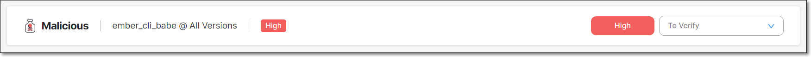<figcaption></figcaption></figure>

| **Item** | **Description** | **Possible Values** |
|---|---|---|
| **ID** | An internal ID starting with the “Cx” prefix that was assigned to this risk by the Checkmarx Vulnerability Research Team. | e.g., Cx27b685d0-978d |
| **Package** | The name of the package in which the vulnerability was identified. | e.g., com.fasterxml.jackson.core:jackson-databind 2.9.8 |
| **Version** | The version of the package where the vulnerability was identified. | e.g., 5.1.26 |
| **Risk Level** | The severity level of the vulnerability, based on its CVSS score in the CVE database. Malicious (suspected malware) packages are labeled Malicious and the icon is shown. | • - Malicious<br>• **HIGH**<br>• **MEDIUM**<br>• **LOW**<br>For more info see Severity Levels. |
| **Risk State** | This indicates the current state of the suspected malware Risk as determined by your AppSec team. All new risks are initially marked as **To Verify**. A user with `manage-risk` role (e.g., Admin, SCA Manager) can change the Risk state for this Project by clicking on the **Risk State** field and selecting the radio button for the desired state. See Risk Management | • To Verify<br>• Not Exploitable<br>• Proposed Not Exploitable<br>• Confirmed<br>• Urgent<br><br>When the state is set as Not exploitable, the page is grayed out and the risk is marked with a strikethrough line on the **All Risks** tab.<br> |

##### Suspected Malware Details Sections

<figure><figcaption></figcaption></figure>

| **Item** | **Description** |
|---|---|
| **Information** | A description of the nature of the threat posed by the suspected malware and the date the suspected malware was published on the NVD. |
| **References** | Links to external resources about the risk. Links are given for topics such as: Article, etc. |
| **Remediate this Vulnerability** | Recommended steps that should be taken to remediate this vulnerability. |
| **Policies** | The number of Policies the Project is assigned to and the number of Policy violations. |
| **Vulnerable Package Path** | The vulnerable package is displayed in blue. If this is a transient dependency (i.e., it is accessed via other packages), then the full path by which the package is accessed is shown above it. You can click on any package shown in the path in order to open a new tab showing details for that package.<br><br>Frequently, you can fix the vulnerabilities by updating the transient packages with their latest versions.<br> |
| **CVSS/Risk Score** | Shows the CVSS Version, Score, and Severity. For a full explanation of the metrics that make up the CVSS score, see section 2 of this [article](https://www.first.org/cvss/specification-document). |

#### License Details Page

This tab shows detailed information about a specific license, including the Legal Risks relating to the license.


##### Info Pane

<figure><figcaption></figcaption></figure>

| **Item** | **Description** | **Possible Values** |
|---|---|---|
| **ID** | The name of the License. | e.g., MIT |
| **Package** | The name and version of the package that the license is associated with. | e.g., Fuzzball@1.4.0 |
| **State** | The current state of the license. | • **To Verify**<br>• **Effective**<br>• **Not Effective** |

##### Legal Risk Details Sections

| **Item** | **Description** |
|---|---|
| **Information** | The source of the license detection followed by a description of the nature of the threat posed by the legal risk. |
| **References** | Links to external resources about the vulnerability. Links are given for topics such as: License URL, etc. |
| **Customization** | View state changes and comments for this license. An admin user can mark a license as “Effective” for this package (i.e., if they intend to consume this package in accordance with the licensing restrictions of this license.). |
| **Policies** | The number of Policies the Project is assigned to and the number of Policy violations. |
| **Legal Score** | Shows the License Score and Severity, as well as the components that make up the License score including: Copyright Risk, Patent Risk and Copyleft. For an explanation on the calculation of these scores, see below. |
| **License Details** | Additional details about the terms of use of the license. This is divided into sections for **Permissions**, **Limitations** and **Conditions**. |

##### Understanding the License Score Section

The **License Score** pane shows the overall License Score and severity as well as information about specific license risk characteristics. The following table explains these items:


The License Score represents the level of risk associated with using a package under that license. However, the license doesn't pose an actual risk to your project unless you are actually using the package under that license (i.e., it is your Effective license).


| **Field** | **Value type and range** | **Details** |
|---|---|---|
| **Copyright Risk Score** | A number between 1 and 7 | The score is defined as follows:<br>• 1 - Licensed users may use code without restriction.<br>• 2 - Anyone who distributes the code must retain any attributions included in original distribution.<br>• 3 - Anyone who distributes the code must provide certain notices, attributions and/or licensing terms in documentation with the software.<br>• 4 - Anyone who distributes a modification of the code may be required to make the source code for the modification publicly available at no charge.<br>• 5 - Anyone who distributes a modification of the code or a product that is based on or contains part of the code may be required to make publicly available the source code for the product or modification, subject to an exception for software that dynamically links to the original code.<br>• 6 - Anyone who distributes a modification of the code or a product that is based on or contains part of the code may be required to make publicly available the source code for the product or modification.<br>• 7 - Anyone who develops a product that is based on or contains part of the code, or who modifies the code, may be required to make publicly available the source code for that product or modification if s/he (a) distributes the software or (b) enables others to use the software via hosted or web services.<br><br>The Legal Risk calculation is based on the copyright risk score, where Level 1-3 is considered as a low risk, Level 4-5 as a medium risk, and Level 6-7 as a high risk.<br> |
| **Patent Risk Score** | A number between 1 and 4<br>Sometimes represented as multiplications of 20, since in CxOSA is presented on a scale of 1-100 | Ranks the license based on<br>• 1- Royalty free and no identified patent risks<br>• 2- Royalty free unless litigated<br>• 3- No patents granted<br>• 4- Specific identified patent risks |
| **Copyleft** | One of the following:<br>Full, Partial, No | Copyleft is a property of the license that means that the package is free to use, but it is forbidden to make it proprietary.<br>A copyleft license is also viral since any work containing a package that has a copyleft-license must also retain this property.<br>The valid values are described as follows:<br>• Full - Full copyleft license<br>• Partial - Copyleft applies on modifications only<br>• No - Not a copyleft license |

## Container Tab


This tab, which is part of SCA results viewer, is only in use for accounts that are still using the original Container scanner. For accounts that use the new Container Security scanner, the results are shown in the separate [Container Security Results Viewer](../container-security/container-security-results-viewer.md).


In addition to scanning the packages in your source code itself, Checkmarx SCA also scans the containers (i.e., Docker image files) on which your source code runs. Checkmarx SCA identifies each of the Docker files being used, extracts all layers of each Image file and identifies the packages used by each layer.

The **Container** tab shows the container packages identified in your project and the vulnerabilities associated with them.

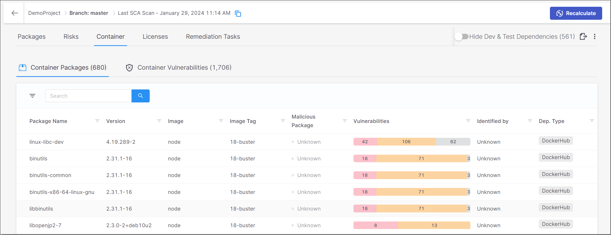

The **Container** tab contains two sub-tabs:

- **Container Packages** – shows a list of all of the packages identified in the container images.
- **Container Vulnerabilities** – shows a list of all of the vulnerabilities associated with the container packages.

<details>

<summary>Container Packages Page</summary>

The **Container Packages** sub-tab shows a list of all of the packages identified in the container images. For each container package, info is shown about the risks related to that package. You can search for specific packages and images using the search box.

You can also sort by column headers and set filters for each column.


The following table describes the info shown for each package identified in the containers.

| **Item** | **Description** | **Possible Values** |
|---|---|---|
| **Package Name** | The name of the package. | e.g., musl |
| **Version** | The version of the package. | e.g., 1.2.2-r1 |
| **Image** | The name of the image that was scanned. | e.g., python |
| **Image Tag** | The version of the image. | e.g., rc-alpine3.13 |
| **Vulnerabilities** | A color coded bar graph indicating the number of vulnerabilities of each severity level. | e.g.,<br> |
| **Identified By** | The path to the Docker file in which the specific image is found. (Hover to view the entire path.) | e.g., Joao4/JavaVulnerableLab-dockerfile/JavaVulnerableLab-master/dockerfile1/Dockerfile |
| **Dep. Type** | The repository in which the image is located. | e.g., Docker Hub |

</details>

<details>

<summary>Container Vulnerabilities Page</summary>

The **Container Vulnerabilities** sub-tab shows a list of all of the vulnerabilities associated with the container packages. Detailed information is shown for each vulnerability. You can search for specific vulnerabilities and packages using the search box.

You can also sort by column headers and set filters for each column.

You can click on a vulnerability to open a new tab showing additional info about the vulnerability.

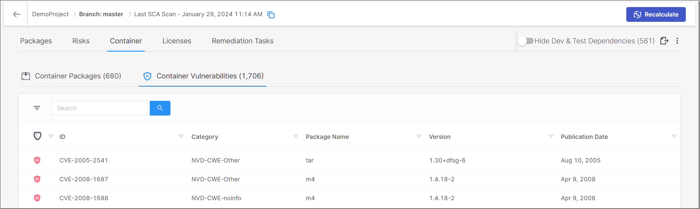


Container vulnerabilities for which the Category is "unknown" are marked as Low severity. Also, these vulnerabilities are only shown in the summary table, but you can't drill down to view the details page, since there are no details that we can provide.


The following table describes the info shown for each vulnerability that was identified in the containers.

| **Item** | **Description** | **Possible Values** |
|---|---|---|
| **Risk Level** | The severity level of the vulnerability. | • **HIGH (RED)** - (7.1 to 10.0)<br>• **MEDIUM (ORANGE)** - (3.1 to 7.0)<br>• **LOW (GREY)** - (0.0 - 3.0)<br>For more info see Severity Levels. |
| **ID** | The ID of the CVE listing. The ID consists of the CVE prefix followed by the year that the CVE was discovered and the serial counter for that year's CVE listings. | e.g., CVE-2020-9488 |
| **Category** | The category of the vulnerability. | e.g., CWE-20 |
| **Package Name** | The name of the package in which the vulnerability was identified. | e.g., musl |
| **Version** | The version of the package in which the vulnerability was identified. | e.g., 1.2.2-r1 |
| **Publication Date** | The date that this vulnerability was first officially published on a supported public Security Advisory. | e.g., Nov 16, 2020 |

</details>

## Licenses Tab

The **Licenses** tab shows info about all of the licenses that are associated with the open source packages used by your project.


This page shows all licenses, even those that don't pose any particular legal risk. All license that pose a specific legal risk are shown in the **Legal Risks** section on the **Risks** tab.


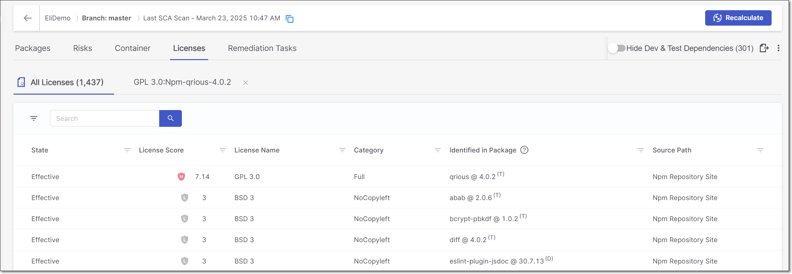

The **Licenses** tab contains sub-tabs that show two types of pages:

- **All Licenses** – shows a list of all licenses associated with the open source packages identified in this scan.
- **License Details** – shows detailed info about a specific license. Click on a row in the **All Licenses** tab to access this page.

You can navigate between the various tabs that you have opened.

### All Licenses Page

The **All Licenses** sub-tab shows a list of all licenses associated with the open source packages identified in this scan. A separate row is shown for each license that applies to a particular package version. Therefore, if a license applies to multiple packages or package versions, then a separate row will be shown for each instance.

You can also sort by column headers and set filters for each column.


The following table describes the info shown for each license identified by this scan.

| **Item** | **Description** | **Possible Values** |
|---|---|---|
| **State** | Indicates whether or not this license is the "effective" license for your organization's use of this package. Also, if the package to which the license applies has been muted or snoozed, this is indicated in the State column.<br><br>A license that was identified from a reliable source and is the sole license for the package is automatically marked as Effective. Otherwise it is marked as Not Effective by default and it can be manually changed to Effective.<br> | • To Verify<br>• Effective<br>• Not Effective<br>• Muted Package<br>• Snoozed Package |
| **License Severity and Score** | Shows the severity level and score indicating the overall risk level associated with this license.<br><br>If this isn't the effective license for this package, then a high license score doesn't necessarily pose a legal risk.<br> | • High - 6-10<br>• Medium - 4-5<br>• Low - 1-3<br>• Info - 0 |
| **License Name** | The name of the license. | e.g., GPL 3.0, MIT etc. |
| **Category** | The category of the license. | • No Copyleft<br>• Full - Copyleft applies<br>• Partial - Copyleft applies on modifications only<br>• Empty |
| **Identified in Package** | The name and version of the package that the license is associated with.<br>In addition, an indication is shown for whether this is a direct. transitive or mixed (i.e., both direct and transitive) dependency (D, T or M). Results can be filtered by Direct/Transitive/Mixed. | e.g., loadash @ 4.13.1 <sup>(T) </sup> |
| **Source Path** | The source from which the license was identified. | e.g., Manifest File, Npm Repository Site, Official Website, Statically Observed etc.<br><br>The category "Statically Observed" indicates that the license was identified in the source code (e.g., README files) using regex and other identification methods.<br> |

### License Details Page

The tab shows detailed information about a specific license, including the Legal Risks relating to the license.

<figure>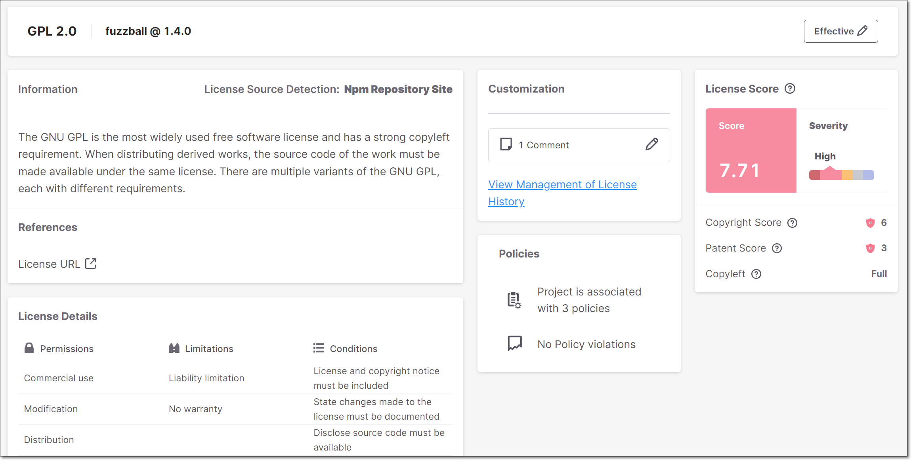<figcaption></figcaption></figure>

#### Info Pane

<figure><figcaption></figcaption></figure>

| **Item** | **Description** | **Possible Values** |
|---|---|---|
| **Name** | The name of the License. | e.g., GPL 2.0 |
| **Package** | The name and version of the package that the license is associated with. | e.g., Fuzzball@1.4.0 |
| **State** | The current state of the license. | • **To Verify**<br>• **Effective**<br>• **Not Effective** |

#### License Info Sections

| **Item** | **Description** |
|---|---|
| **Information** | The source of the license detection followed by a description of the nature of the threat posed by the legal risk. |
| **References** | Links to external resources about the vulnerability. Links are given for topics such as: License URL, etc. |
| **Customization** | View state changes and comments for this license. An admin user can mark a license as “Effective” for this package (i.e., if they intend to consume this package in accordance with the licensing restrictions of this license.). |
| **Policies** | The number of Policies the Project is assigned to and the number of Policy violations. |
| **License Score** | Shows the License Score and Severity, as well as specific characteristics of the license, including: Copyright Risk, Patent Risk and Copyleft. For an explanation of these items, see below. |
| **License Details** | Additional details about the terms of use of the license. This is divided into sections for **Permissions**, **Limitations** and **Conditions**. |

#### Understanding the License Score Section

The **License Score** pane shows the overall License Score and severity as well as information about specific license risk characteristics. The following table explains these items:


The License Score represents the level of risk associated with using a package under that license. However, the license doesn't pose an actual risk to your project unless you are actually using the package under that license (i.e., it is your Effective license).


| **Field** | **Value type and range** | **Details** |
|---|---|---|
| **Copyright Risk Score** | A number between 1 and 7 | The score is defined as follows:<br>• 1 - Licensed users may use code without restriction.<br>• 2 - Anyone who distributes the code must retain any attributions included in original distribution.<br>• 3 - Anyone who distributes the code must provide certain notices, attributions and/or licensing terms in documentation with the software.<br>• 4 - Anyone who distributes a modification of the code may be required to make the source code for the modification publicly available at no charge.<br>• 5 - Anyone who distributes a modification of the code or a product that is based on or contains part of the code may be required to make publicly available the source code for the product or modification, subject to an exception for software that dynamically links to the original code.<br>• 6 - Anyone who distributes a modification of the code or a product that is based on or contains part of the code may be required to make publicly available the source code for the product or modification.<br>• 7 - Anyone who develops a product that is based on or contains part of the code, or who modifies the code, may be required to make publicly available the source code for that product or modification if s/he (a) distributes the software or (b) enables others to use the software via hosted or web services.<br><br>The Legal Risk calculation is based on the copyright risk score, where Level 1-3 is considered as a low risk, Level 4-5 as a medium risk, and Level 6-7 as a high risk.<br> |
| **Patent Risk Score** | A number between 1 and 4<br>Sometimes represented as multiplications of 20, since in CxOSA is presented on a scale of 1-100 | Ranks the license based on<br>• 1- Royalty free and no identified patent risks<br>• 2- Royalty free unless litigated<br>• 3- No patents granted<br>• 4- Specific identified patent risks |
| **Copyleft** | One of the following:<br>Full, Partial, No | Copyleft is a property of the license that means that the package is free to use, but it is forbidden to make it proprietary.<br>A copyleft license is also viral since any work containing a package that has a copyleft-license must also retain this property.<br>The valid values are described as follows:<br>• Full - Full copyleft license<br>• Partial - Copyleft applies on modifications only<br>• No - Not a copyleft license |

## Remediation Tasks Tab

### Overview

The **Remediation Tasks** tab shows detailed information about specific remediation tasks that Checkmarx recommends implementing for your Project. These tasks involve replacing vulnerable packages in your project with non-vulnerable versions of those packages.

<figure>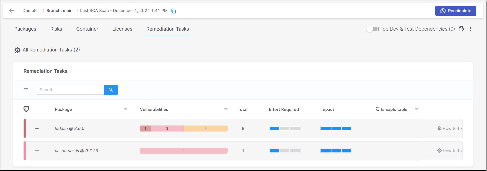<figcaption></figcaption></figure>

The **Remediation Tasks** tab contains sub-tabs that show two types of pages:

- **All Remediation Tasks** – shows a list of remediation tasks that are recommended for this Project, with general info about each task.
- **Task Details** – shows detailed info about a specific task. The task details tab is opened by clicking on the **How to fix** button in a task row in the **All Remediation Tasks** sub-tab.

You can navigate between the various tabs that you have opened.

#### Limitations

- Remediation tasks are currently supported only for JavaSript npm packages and for Nuget packages with .csproj manifest files, otherwise this tab isn't shown.
- We only show tasks for direct packages that have vulnerabilities in the package itself or in the transitive packages that it uses. Similarly, sub-tasks are only shown for transitive packages that have vulnerabilities.

  
  For example, if a direct package doesn't have any vulnerabilities itself but it uses 5 transitive packages of which 3 have vulnerabilities, then the direct package will be shown as well as the 3 vulnerable transitive packages.
  
- We only show remediation tasks when there is an available version of the package in which **all of the vulnerabilities** have been remediated.

  
  There are some circumstances in which the remediated package does have vulnerabilities. This occurs when all exisiting vulnerabilities were remediated, but some new vulnerabilities were introduced in the remediated version.
  

### All Remediation Tasks

The **All Remediation Tasks** sub-tab shows a list of remediation tasks that are recommended for this Project.


Each task relates to a specific direct package in your project.


The data shown for each task relates to the vulnerabilities identified in the direct package as well as in the transitive dependencies associated with it. You can click on the “+” button for a task to expand the view of that task to show the transitive dependencies called by the package. The number of vulnerabilities of each severity level is shown for each transitive package.

<figure>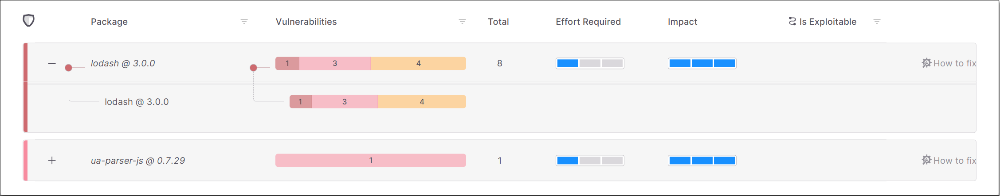<figcaption></figcaption></figure>

The following table describes the info shown for each task:

| **Parameter** | **Description** |
|---|---|
| +/- Button | Expand the display to show the transitive packages or collapse the display to show only the direct package. |
| Package | The name of the package and its version number. |
| Vulnerabilities | The number of vulnerabilities of each severity level in the package. |
| Total | The total number of vulnerabilities in the package. |
| Effort Required | An assessment of the degree of effort required to implement the recommended remediation task, e.g., if it requires fixing broken API methods. |
| Impact | An assessment of the impact that the remediation task will have on your Project, i.e., the extent to which the procedure will remove risks from your Project. |
| Is Exploitable | Indicates whether the vulnerabilities in this package are exploitable in the context of your Project.<br><br>This data is only shown for scans which ran using the Exploitable Path feature.<br> |
| “How to fix” button | Click on this button to open a new sub-tab showing details about this remediation task. |

### Remediation Task Details

The **Remediation Task Details** sub-tab shows detailed info about a specific remediation task.


Each task relates to a specific direct package in your project.


The info on this screen is shown in the following panes.

- **Overview** - shows key metrics for the remediation task.
- **Summary** - shows general info about the remediation task.
- **Remediation Impact** - shows a comparison between the current vulnerabilities and the vulnerabilities that will remain after remediation.
- **Developer Walkthrough** - shows a breakdown of the steps that need to be taken to remediate this package.

#### Overview

<figure>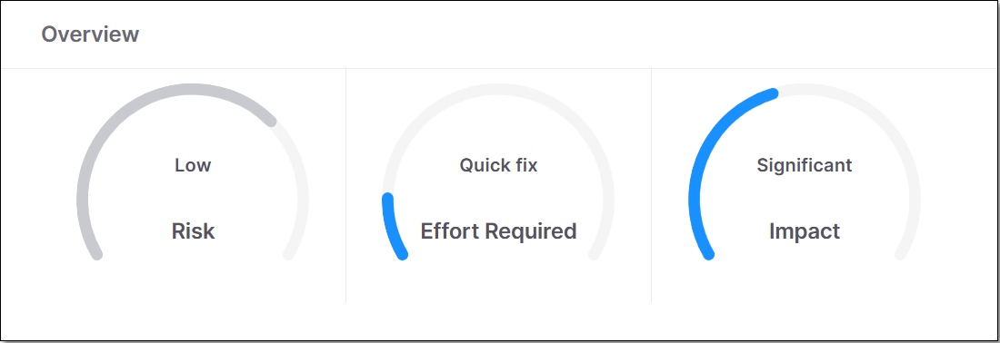<figcaption></figcaption></figure>

This pane shows gauge widgets indicating the overall risk level for the specified package, the effort required to implement the suggested remediation procedure and the impact of remediation.

#### Summary

<figure><figcaption></figcaption></figure>

This pane shows a summary of the remediation task, including the package name, number of vulnerabilities and total number of remediation steps.

#### Remediation Impact

<figure><figcaption></figcaption></figure>

This pane shows a side-by-side comparison between the vulnerabilities currently in the direct and transitive dependencies and the vulnerabilities that will remain after remediation.

#### Developer Walkthrough

<figure><figcaption></figcaption></figure>

This section breaks down the task into specific steps that need to be taken. Each step indicates the element that needs remediation and gives details about how it should be fixed. There are three types of steps:

- **Upgrade package dependency** - indicates the direct package that needs to be upgraded, where it appears in your code, and which version it should be upgraded to.
- **Add package dependency** - indicates a specific version of a package that needs to be added to your manifest file (for transitive dependencies).

  
  Recommended steps for remediating transitive vulnerabilities are given for each package independently. We recommend a secure version of the package that can be added to the manifest file in order to ensure that only that version will be used.

  In some cases it may be possible to remediate transitive dependencies by upgrading the direct dependency to a version that references a newer, secure version. For Maven packages, the Maven repository shows the transitive package versions referenced by each package.
  
- **Fix broken API methods** - shows each of the API methods that was broken and which upgrade caused the API to break. Fix broken API methods is shown as a sub-step under the “Upgrade package dependency” step that causes the broken method.

  
  Broken methods are only identified in scans for which the Exploitable Path feature is run.

  We identify broken API methods by comparing the number of parameters used in the public method for the new package with the number of parameters used for the original package. If the number of parameters is different, then we notify of the need to fix the API method.
  
