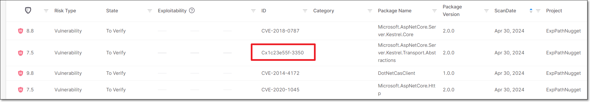

# SCA Scanner FAQ

## Vulnerability Database

What are "CxID" vulnerabilities? And, how do they differ from standard CVEs?

**Answer:** The "Cx" prefix indicates an "untracked" vulnerability that Checkmarx’s customers should be aware of. This can occur for two reasons:

1. Our Checkmarx AppSec experts have identified a new vulnerability that hasn't yet been registered as a CVE.

   
   In such cases, if the vulnerability is eventually registered as a CVE, it will be handled as a NEW vulnerability in Checkmarx One and your triage updates will not be applied.
   
2. We have determined that a known vulnerability, despite never officially being registered as a CVE, may pose a threat to users. This may occur because neither of the relevant entities (the reporter or the maintainer) bothered to submit it to an authorized CVE Numbering Authority (CNA) for cataloging. It can also occur when there is a dispute between the involved parties. When we see that an uncatalogued vulnerability poses a real risk, we take the “security first“ approach by curating and publishing these issues, branding them with our "CxID", and making them available to our customers, to help them maintain a healthy cyber security posture.

Are "zero-day" vulnerabilities included in the Checkmarx One database?

**Answer:** When our AppSec experts identify a new vulnerability, we follow the industry standard practice of notifying the package maintainer and allowing them 90 days to remediate the vulnerability before disclosing it to the public. In the interim, we add the "zero-day" vulnerability to our database as a “Cx” vulnerability. However, we do not give details about the nature of the vulnerability until the remediation period has passed.

Do OSA and SCA share the same DB?

**Answer:** Yes

Which public Vulnerability databases does Checkmarx One make use of?

Checkmarx One is constantly collecting info about vulnerabilities from a wide range of sources. The following are some of our primary sources of info:

- [*Vuldb*](https://vuldb.com/)
- [*NVD*](https://nvd.nist.gov/)
- [*CVE-MiTRE*](https://cve.mitre.org/)
- [*Retirejs*](https://retirejs.github.io/)
- [*Npm*](https://www.npmjs.com/)
- [*Bugzilla*](https://www.bugzilla.org/)
- [*NodeSecurity*](https://github.com/nodesecurity)
- [Github Advisory Database](https://github.com/advisories?query=type%3Areviewed)

This list is constantly being updated and may change without notice.

What is Checkmarx's process for incorporating new vulnerabilities into their database ?

Analysis of newly-reported CVEs is handled by Checkmarx Zero, a research team that carefully analyzes each vulnerability database entry, enriches it with their own research findings, and corrects errors. The team uses various custom automations and tools to maximize efficiency and accuracy. When a new CVE is incorporated into the data, Checkmarx Zero applies curation and enrichment using information from relevant advisory databases. Below are examples of how this data is curated and enriched:

- Enhance advisory data — often advisories have incomplete or inaccurate lists of affected versions, identify components incorrectly, etc. We analyze the affected items and correct the advisory data.
- Identify exploitable paths — advisories typically do not include information about where in the code the affected component has a vulnerability. Our analysts determine this alongside other exploitable path data to enable Exploitable Path analysis.

Performing this process for each new CVE takes time, which can create a gap between the publication of a vulnerability and the delivery of a complete analysis to customers. To address this, we use an automated process that provides immediate, preliminary analysis as soon as a CVE is collected. This ensures that customers receive timely updates, even before our research team has completed the full analysis.

