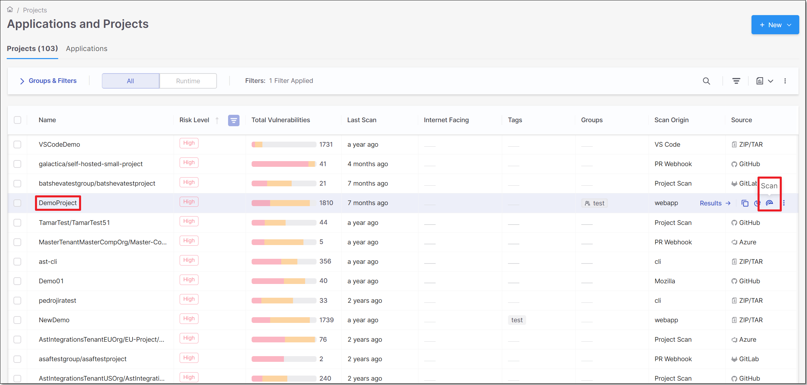
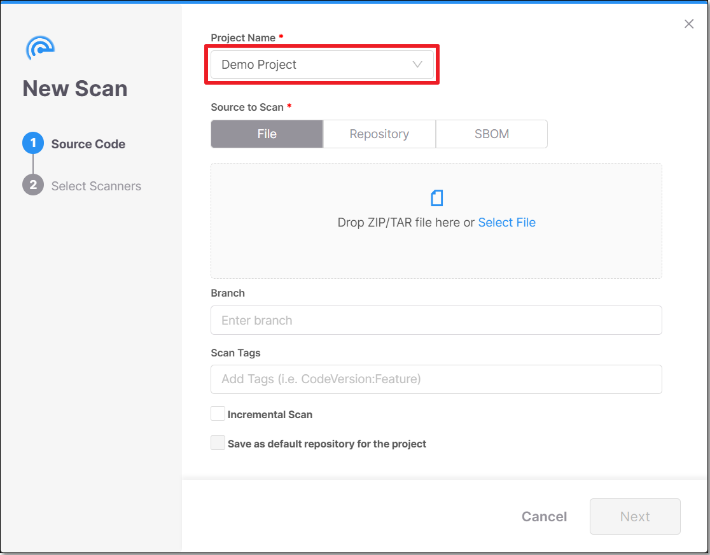
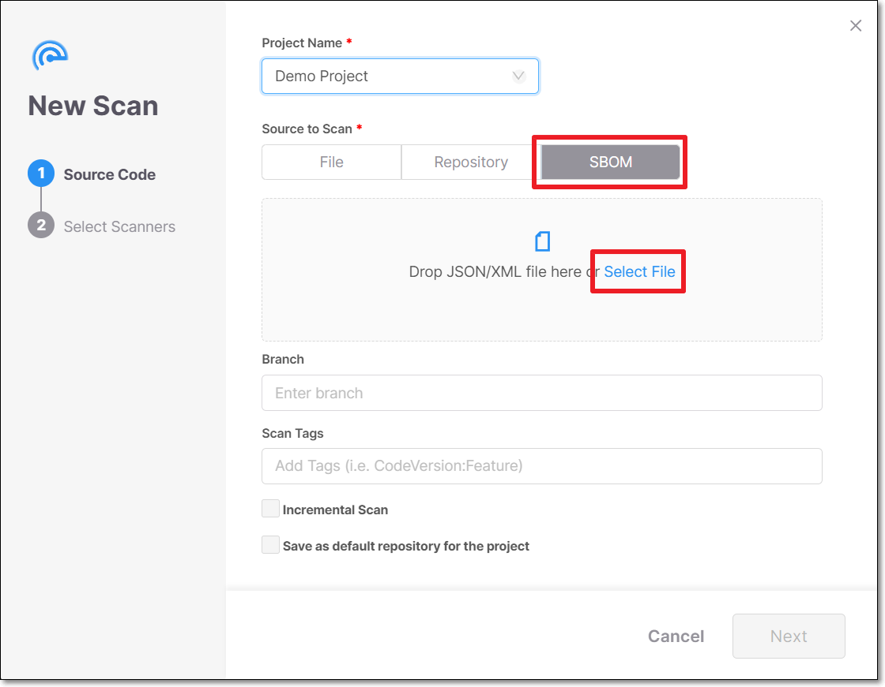
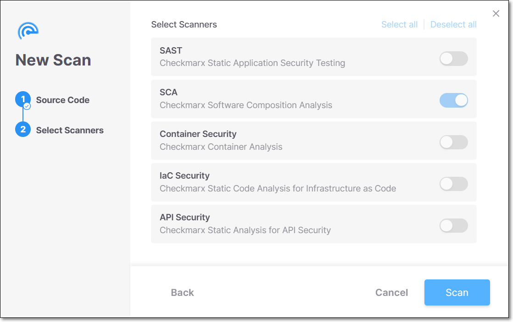
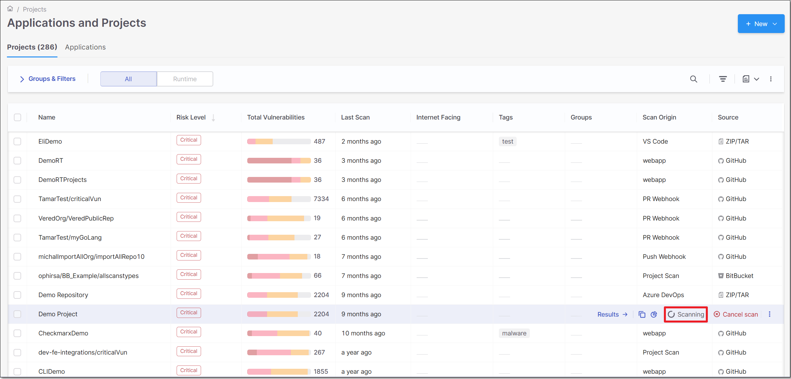

# Scanning SBOMs

You can submit a Software Bill of Materials (SBOM) file to Checkmarx One for scanning instead of submitting your actual source code or compiled artifacts. Checkmarx extracts the Package URL (PURL) from each component in the file and queries our vulnerability database for every recognized package. This lets you assess third-party risk based on an SBOM produced by any build pipelines, third-party vendors, or other SCA tools.


This scan mode analyzes declared packages only. Source code is not scanned, and packages without a recognized PURL are excluded from results.


## Supported SBOM formats

| Format | Supported versions | File types |
|---|---|---|
| CycloneDX | 1.0, 1.1, 1.2, 1.3, 1.4, 1.5, 1.6 | JSON, XML |
| SPDX | 2.2, 2.3 | JSON only |

## PURL requirements

Checkmarx only analyzes SBOM components that include a valid PURL. Components that lack a PURL field (for example, those identified only by a CPE or file hash) are skipped silently (i.e., they are not analyzed, but the scan proceeds normally and no error is logged).

### Supported PURL Types

Checkmarx recognizes the following PURL type values (matching is **case-insensitive**). Components with any other PURL type are silently skipped and do not appear in scan results.

| Checkmarx package manager | Accepted PURL type values |
|---|---|
| NPM | `npm`, `yarn`, `bower` |
| Python (Pip) | `pip`, `python`, `pypi`, `poetry` |
| NuGet | `nuget` |
| Maven | `maven`, `sbt`, `ivy`, `gradle` |
| PHP (Composer) | `php`, `composer` |
| Swift / iOS | `ios`, `swift`, `swiftpm`, `carthage`, `cocoapods` |
| Go | `go`, `golang`, `gomodules` |
| C++ (Conan) | `conan`, `cpp`, `deb` |
| Ruby (RubyGems) | `gem`, `ruby`, `rubygems` |
| Unity | `unity` |
| Perl (CPAN) | `perl`, `cpan` |
| Dart (Pub) | `dart`, `pub` |

**Notes:**

- Build-tool aliases are accepted: `gradle`, `sbt`, `ivy`, and `maven` all resolve to the same Maven vulnerability database. Similarly, `yarn` and `bower` resolve to the npm database.
- `cocoapods` and `carthage` are accepted aliases for the Swift/iOS package manager, not separate ecosystems.
- `poetry` is accepted as an alias for Python/PyPI.
- `cpp` and `deb` are accepted as aliases for C++ (Conan). `deb` in this context refers to C++ library packages (for example, `libcurl4-openssl-dev`), not OS-level Debian packages.

For the full list of supported languages and frameworks per package manager, see [SCA Scanner - Supported Languages and Package Managers](https://docs.checkmarx.com/en/34965-322679-sca-scanner---supported-languages-and-package-managers.html).

### Unsupported Purl Types

The following PURL types are silently skipped in the SBOM scan.

| PURL type | Why it is skipped |
|---|---|
| `rpm` | OS-level packages; not covered by the Checkmarx vulnerability database |
| `apk` | OS-level packages; not covered by the Checkmarx vulnerability database |
| `generic` | No package registry association; cannot be matched to vulnerability records |
| `docker` | Container images are not analyzed in this scan mode |
| `cargo` | Not currently supported |
| `hex` | Not currently supported |
| All other types | Not recognized; skipped without error |


**SBOMs from container images or Linux distributions** often include a mix of application packages and OS-level packages (`rpm`, `apk`). Only the application packages with a supported PURL type will be analyzed. OS-level packages are skipped without error and without any indication in the results. Note that `deb` is supported as a C++ package type, not as a general OS package alias.


## SPDX requirements

For SPDX files, you must indicate which packages are direct dependencies. Declare a relationship of type `DESCRIBES` or `DEPENDS_ON` from the `SPDXID` of the SBOM's main component to each direct package. If no such relationships are defined, Checkmarx treats all packages in the file as direct dependencies.

**Example relationship block (SPDX JSON):**

```
{
  "spdxId": "SPDXRef-DOCUMENT",
  "relationshipType": "DESCRIBES",
  "relatedSpdxElement": "SPDXRef-Package-lodash"
}
```

```
{
  "spdxId": "SPDXRef-MyApp",
  "relationshipType": "DEPENDS_ON",
  "relatedSpdxElement": "SPDXRef-Package-requests"
}
```

## How to Scan an SBOM

SBOM scans can be run from the UI as well as via CLI or [REST API](https://checkmarx.stoplight.io/docs/checkmarx-one-api-reference-guide/branches/main/07jx5a2de1zlu-scans-service-rest-api#scanning-from-an-sbom-for-sca).

### Using the CLI

**To scan an SBOM from the Checkmarx CLI:**

1. For the `-s` parameter, submit the full path to the SBOM file.
2. For `--scan-types`, specify `sca`.
3. Add the `--sbom-only` flag.

Pass the SBOM file path directly. Checkmarx detects the format (CycloneDX or SPDX) automatically from the file content.

```
cx scan create \
  --project-name "my-project" \
  --scan-types sca \
  --s /path/to/sbom.json
```

### Using the REST API

To scan an SBOM via the REST API, use the same Scan Upload flow as a file-based scan, specifying the SBOM file as the upload source and sca as the scan type. See documentation in the [Checkmarx One API Reference Guide](https://checkmarx.stoplight.io/docs/checkmarx-one-api-reference-guide/branches/main/07jx5a2de1zlu-scans-service-rest-api#scanning-from-an-sbom-for-sca) for details.


This is different from the [SBOM File Analysis API](https://checkmarx.stoplight.io/docs/checkmarx-one-api-reference-guide/branches/main/5rdrm15x0nf6p-checkmarx-sca-file-analysis-service-rest-api), which analyzes an SBOM standalone and returns a report without creating a project scan. Use the method described in this page when you want SBOM results to appear alongside your other Checkmarx One project results; use File Analysis only if you want a one-off report with no project association.


### Using the web portal

1. On the **Application and Projects** home page select the **Projects** tab.
2. Hover over the row of the project that you would like to scan, click on the Scan icon .

   

   The **New Scan** window opens. By default, under **Project Name**, the project of the row in which you clicked the Scan icon is selected.

   

   
   If you would like to scan a different project, it is possible to select it from the drop-down menu.
   
3. In the **Source to Scan** section, select **SBOM**.
4. In the box below, either drag a file into the box or click on **Select File** and navigate to the relevant file.

   
5. In the **Branch** field you can specify the name of the branch of the project. (Optional)
6. In the **Scan Tags** field you can add tags to the scan. (Optional)

   Tags can be added in two different formats:

   - **Label:** \<string>
   - **key:value:** \<key string:value string>
7. Click **Next**.
8. The SCA scanner is the only selected scanner because it is the only one supported when scanning SBOMs.

   
9. Click **Scan**.

   The **New Scan** dialog closes and the scan starts.
10. You can monitor the scan's status in the Projects tab when hovering over the project.

    

## Understanding the results

After the scan completes, results appear in the SCA Results view under the project.

**What is included:**

- Vulnerabilities detected for each analyzed package, matched by PURL name and version.
- License information for analyzed packages where available.

**What is not included:**

- Components with an unsupported PURL type (see the table above).
- Components missing a `purl` field in the SBOM.

> **Note:** Components without a version in their PURL are evaluated against the latest version in the Checkmarx vulnerability database. Results for versionless components may not reflect the actual risk of the package in use.

### Verifying scan coverage

Checkmarx does not currently display a count of skipped components in the results view. To verify that your SBOM was fully covered, compare the number of components in your input file against the number of packages listed in the scan results. A lower package count in the results indicates that some components were skipped, most likely due to unsupported PURL types or missing PURL fields.

To identify which components were skipped before submitting the file, filter your SBOM by PURL type and remove or flag any entries that are not in the supported list above.

> **Coming in a future release:** Checkmarx will provide in-product visibility into which PURLs were accepted and which were discarded (with the reason), eliminating the need for manual comparison.

## Troubleshooting

**Fewer results than expected**

Check whether your SBOM contains components with unsupported PURL types (`rpm`, `generic`, `apk`, `docker`, etc.). These are skipped silently.

**Scan fails with an error about no valid PURLs**

If Checkmarx cannot extract any valid PURLs from the SBOM, the scan terminates with an error rather than completing with zero results. This typically means the file contains no components with a supported PURL type, all PURLs are malformed, or the file does not follow a supported format. Open the SBOM file and confirm that at least one component has a valid `purl` field matching the format `pkg:type/[namespace/]name@version` with a type from the supported list.

**npm scoped packages not found in results**

Check that the `@` sign in scoped package names is percent-encoded as `%40` in the PURL. For example, `@angular/core` must appear as `pkg:npm/%40angular/core@14.2.0`, not `pkg:npm/@angular/core@14.2.0`.

**Gradle / SBT / Ivy packages not found**

These build tools are aliased to the Maven package manager. Ensure the PURL uses `pkg:gradle/...`, `pkg:sbt/...`, or `pkg:ivy/...` (or `pkg:maven/...`) and that the namespace follows Maven conventions: `groupId/artifactId`.
