# Triaging SCA Results

There are two ways by which you can triage SCA results:

- **Management of Risks** - change the state and/or severity of a specific risk.
- **Management of Packages** - change the state of a package to Muted or temporarily Snoozed.

## Management of Risks

Checkmarx SCA tracks specific risk instances throughout your software development lifecycle (SDLC). After reviewing the results of a scan, you can triage the results and modify these predicates accordingly. If the identical risk instance is identified in subsequent scans of the same project, the predicate will automatically be applied to that instance.

A risk instance is defined as a specific risk affecting a specific package in a specific project. Therefore, changes that you make to the predicate of a risk aren’t applied to the identical risk when it is found in a different project. Also, if the risk affects other packages in your project, the changes won’t be applied to those risks.

For **Vulnerabilities** and **Suspected Malware** risks each risk instance has a predicate associated with it, which is comprised of the **State**, **Severity** and **Comments**.

For **Vulnerabilities**, in addition to standard triage predicates, you can enrich your workflow by incorporating **V**ulnerability **E**xploitability e**X**change (**VEX**) information to assess whether a vulnerability is actually exploitable in your product. See[**V**ulnerability **E**xploitability e**X**change (**VEX**)](#vulnerability-exploitability-exchange-vex) for more details.

For **Legal Risks**, you can adjust the state of the related license, marking it as Effective or Not Effective. Learn about triaging legal risks [below](#managing-legal-risks).


The following permissions enable users to triage risks:

- update-result-state-not-exploitable (can change to this state only)
- update-result-state-propose-not-exploitable (can change to this state only)
- update-result-states (can change all states except not-exploitable; can’t change the severity)
- update-result-severity (can change only severities)

For additional details about triage permissions, see here.


### Triaging Risk State and Severity

A risk state is assigned to each risk instance in your Project. Initially, the state of each new risk is set as **To Verify**, indicating that it is a new finding that hasn’t yet been assessed by your AppSec team. The severity is determined primarily based on the CVSS score of the vulnerability. Your AppSec team can adjust the risk state to one of the following options:

- **Not Exploitable** - Select this state if your team has determined that this risk doesn’t pose a threat to your application (and isn’t expected to cause a risk at any time in the future).

  
  When a Risk is marked as Not Exploitable, in the All Risks page the CVE is marked with a strikethrough line, and the Risk Details page is grayed out. Also, Not Exploitable risks aren't counted in the risk summary counters.
  
- **Proposed Not Exploitable** - Select this state if your team has suggested tentatively that this risk doesn’t pose a threat to your application.
- **Confirmed** - Select this state if your team has confirmed that this risk does pose a threat and requires mitigation.
- **Urgent** - Select this state if your team has determined that this risk poses an imminent threat and requires urgent mitigation.

Based on your AppSec team's determination, the score can be adjusted to a score between 0.0 and 10.0 with the following severity breakdown:

- Critical - 9.0 to 10.0
- High - 7.0 to 8.9
- Medium - 4.0 to 6.9
- Low - 0.1 to 3.9
- Info - 0.0


Only users with the permissions `Update-result-severity` or `Update-result-severity-if-in-group` can change the risk severity or score.


#### Guidelines for Triaging Risks

Before defining a new state for a Risk or package, it is important to ensure not only the security threat that the Risk currently poses but the threat that it may cause at any stage in your project’s development and deployment. On the other hand, it is sufficient to ensure that the presence of the Risk in this particular package and in this Project does not pose a threat, even if the Risk would pose a threat if it is identified in a different package and/or a different Project.

The following are some common reasons for changing the state of Risk or package:

- There is no exploitable path from your source code to the package that contains the Risk.
- The Risk doesn't affect the OS that you're running.
- You don't consider the threat to be severe enough to require remediation.
- Snoozing or muting a package will reduce noise in the system if there is no available fixed package version.

#### Vulnerability Exploitability eXchange (VEX)

Vulnerability Exploitability eXchange (VEX) enables you to triage vulnerabilities in open-source dependencies using a standardized, machine-readable format that communicates whether a known vulnerability, such as a CVE, actually affects your software. In many cases, a product may include a component that is technically vulnerable while the vulnerability itself is not exploitable within the specific product context. VEX allows vendors and stakeholders to clarify real exploitability status, reducing alert noise and improving risk prioritization.

VEX is applied to specific risks as part of the triage process, as described [below](#how-to-change-the-risk-state-severity-and-vex). After completing VEX triage, the associated information can be exported within SBOMs and other reports. Reports generated in XML, JSON, or CSV formats automatically include VEX data. In contrast, when exporting an SBOM, VEX information is not included unless explicitly selected during export. VEX is supported for CycloneDX SBOMs only; not supported for SPDX format. For more information on exporting VEX-compliant SBOMs, see Generating SBOM Report for a Project.


This capability complements existing triage workflows. All current triaging methods remain fully supported.


VEX Triage Model

Below are tables describing the various VEX fields that define the exploitability assessment:

| Field | Required | Description |
|---|---|---|
| State | Yes | Defines exploitability status |
| Justification | Required when `state = Not affected` | Explains why vulnerability does not affect product |
| Response | Optional | Action to be taken (Cannot fix, Update, etc.) |
| Detail | Optional | Free-text notes |

**State Options**

| State | Description |
|---|---|
| Resolved | Vulnerability has been remediated. |
| Resolved with pedigree | Vulnerability has been remediated and evidence of the changes are provided in the affected components pedigree, containing verifiable commit history and/or diff(s). |
| Exploitable | Vulnerability may be directly or indirectly exploitable. |
| In triage | Vulnerability is being investigated. |
| False positive | Vulnerability is not specific to the component or service and was falsely identified or associated. |
| Not affected | Vulnerability does not affect the component or service. |

**Justification Options**

| Justification | Description |
|---|---|
| Code not present | Code has been removed. |
| Code not reachable | Vulnerable code is not invoked at runtime. |
| Requires configuration | Exploitability requires a configurable option to be set/unset. |
| Requires dependency | Exploitability requires a dependency that is not present. |
| Requires environment | Exploitability requires a certain environment that is not present. |
| Protected by compiler | Exploitability requires a compiler flag to be set/unset. |
| Protected at runtime | Exploits are prevented at runtime. |
| Protected at perimeter | Attacks are blocked at physical, logical, or network perimeter. |
| Protected by mitigating control | Preventative measures have been implemented that reduce the likelihood and/or impact of the vulnerability. |

#### How to Change the Risk State, Severity and VEX

##### Triaging a Single Risk

**To change the risk state and severity:**

1. On the Projects page, hover over the **Results** button for the desired project and select **SCA**.

   <figure>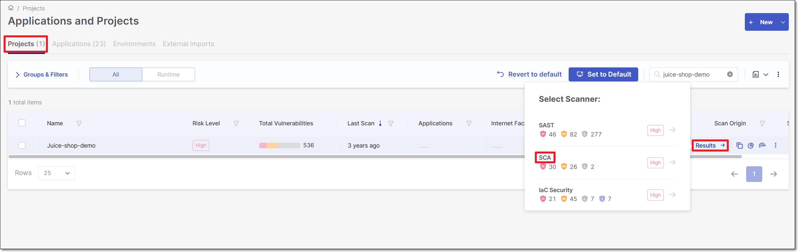<figcaption></figcaption></figure>
2. On the **Scan Results** page, click on the **Risks** tab. The **All Risks** sub-tab is displayed.
3. Click on a risk to open the **Risk Details** page for that risk.
4. Click on the **Edit** button.

   <figure>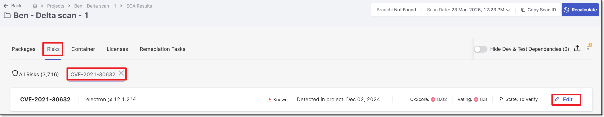<figcaption></figcaption></figure>

   The **Management of Risk** panel opens.

   <figure>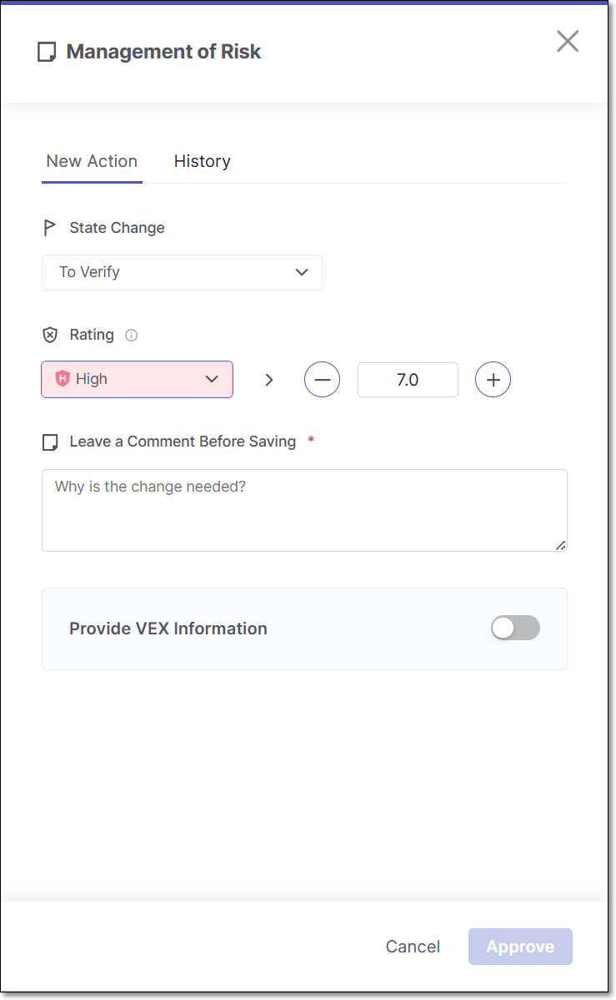<figcaption></figcaption></figure>

   
   Alternatively, you can open the **Management of Risk** panel by clicking on the Comments button in the **Customization** section at the bottom of the **Risk Details** page.
   
5. To change the state, click on the **State** field, and select from the drop-down list the desired state.
6. To change the severity, either click on the **Rating** field and select from the drop-down list the desired severity or customize the severity score using the **+ / -** buttons.

   
   Changing the severity score from the drop-down list will assign the lowest severity from that level (e.g., selecting Medium, the risk will be assigned a score of 4.0).
   
7. In the **Leave a Comment Before Saving** section, enter your comment. For example, you can add resources related to the vulnerability, assessment of exploitability in the context of your code, remediation steps, assignment of responsibility for remediation etc.

   
   After changing the state, you are required to add a comment explaining the rationale behind the change before the option to **Approve** the change becomes available.
   
8. If you would like to adjust the VEX parameters, proceed as follows:,

   1. Adjust the toggle to enable **VEX** options.

      <figure>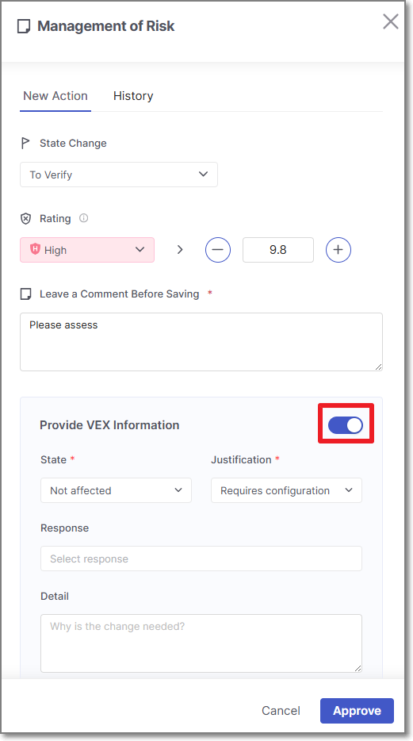<figcaption></figcaption></figure>

      By *default*, VEX state is mapped from the risk state set in the regular triage workflow as follows:

      - If the risk state = `To Verify`, the VEX state will default to `In triage`.
      - If the risk state = `Not Exploitable`, the VEX state will default to `Not affected`.
      - If the risk state = `Confirmed`, the VEX state will default to `Exploitable`.
   2. Configure the various **VEX** fields as described [above](#vex-triage-model).

      When state is set to `Not affected`, the **Justification** field will appear to its right.
9. Click **Approve**.

##### Triaging Risks - Bulk Action

**To bulk action triage risks:**

1. Go to SCA results viewer > **Risks** tab > **All Risks** sub-tab.
2. Select the checkbox next to each risk you would like to include in the bulk action triage, and click **Manage States**.

   <figure>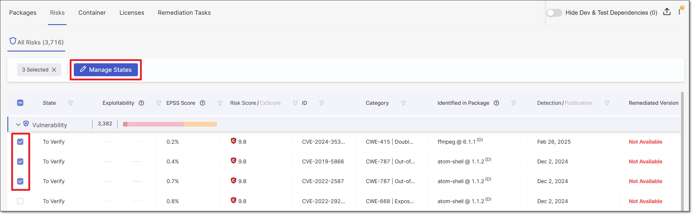<figcaption></figcaption></figure>

   The **Management of Risks** panel opens.

   <figure>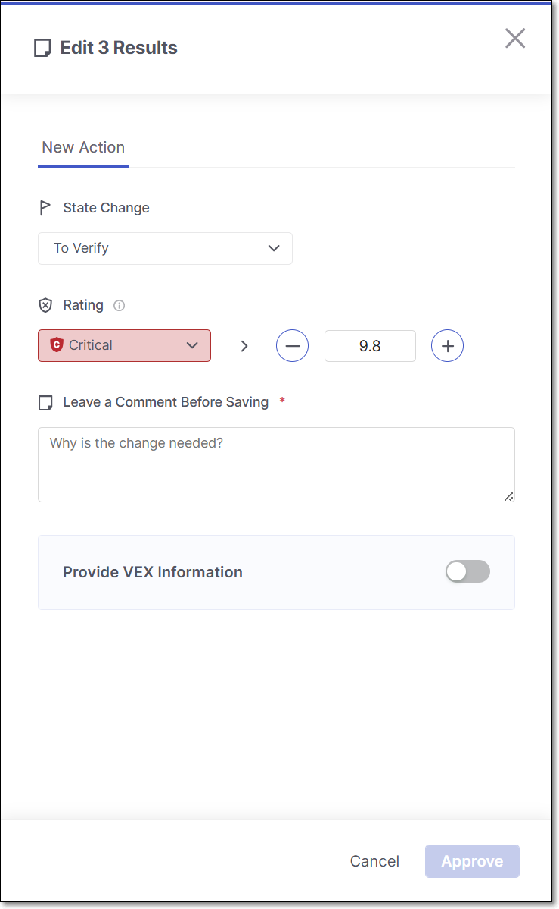<figcaption></figcaption></figure>
3. Make changes to the **State**, **Rating**, and **Make a Comment Before Saving**.
4. If you would like to adjust the VEX parameters, proceed as follows:,

   1. Adjust the toggle to enable **VEX** options.

      <figure><figcaption></figcaption></figure>

      By *default*, VEX state is mapped from the risk state set in the regular triage workflow as follows:

      - If the risk state = `To Verify`, the VEX state will default to `In triage`.
      - If the risk state = `Not Exploitable`, the VEX state will default to `Not affected`.
      - If the risk state = `Confirmed`, the VEX state will default to `Exploitable`.
   2. Configure the various **VEX** fields as described [above](#vex-triage-model).

      When state is set to `Not affected`, the **Justification** field will appear to its right.
5. Click **Approve**.

   The changes are applied to all of the selected risks.

#### Viewing Risk Change History

Once a change has been made, the new State and Severity are immediately shown in the web application. However, the risk summary counters aren't recalculated until a new scan or scan recalculation is run on the project. Until the recalculation, a red dot will be displayed for the risk indicating that recalculation is required.

State changes are shown in the **All Risks** table. Not Exploitable risks are marked with a strikethrough line.

<figure><figcaption></figcaption></figure>

In addition, a detailed history of all changes is shown in the **History** tab in the **Management of Risk** and **Management of packages**panels. For each change that was made, the name of the user who made the change and the time of the change are shown. In addition, the new state and/or severity is shown alongside the previous state/severity.

<figure>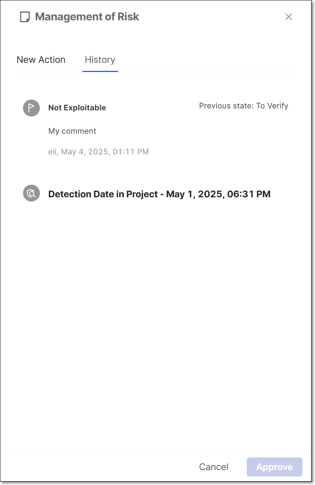<figcaption></figcaption></figure>

## Management of Packages

You can reduce noise in you system when you feel that a certain package (in the SCA results viewer) does not pose a threat or where there is no available fixed version of the package. This is done by changing the State of the package as needed. By default all packages are assigned the state **Monitored**. You can change the state to **Muted** so that the vulnerabilities associated with that package won’t be shown as risks to your project. You can also **Snooze** a package so that it is muted for a fixed period of time after which it will automatically revert back to being a regular monitored package.


When the designated snooze period ends, an **auto-scan** (i.e., automatic scan recalculation) is triggered in order to update the project data and risk counters to include data for the package that has been returned to Monitored state.


While viewing the Package Details page for a specific package, you can open a side panel by clicking on the **State** button on the header bar, with tabs for **New Action** (i.e., making changes to the state) and for viewing **History** of changes made.

<figure>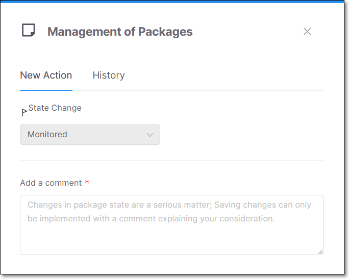<figcaption></figcaption></figure>

### Limitations

Changing the state of a package affects only the data displayed in the Project Overview and Scan Results. It does not impact the Analytics Dashboards or the Project and Scan Reports.

### Changing the Package State

The package state can be modified based on your AppSec team's decision whether to have the package affect the project score or have it muted permanently or temporarily (snoozed).

- **Monitored** (default) - vulnerabilities are displayed based on the risk score.
- **Muted** - vulnerabilities associated with the package will permanently not be shown as risks to your project.
- **Snoozed** - vulnerabilities associated with the package will be muted temporarily. It is required to choose a date for the snooze to expire.


Only users with the roles `update-package-state-mute` and `update-package-state-mute-if-in-group` can mute packages.



Only users with the roles `update-package-state-snooze` and `update-package-state-snooze-if-in-group` can snooze packages.


#### Changing Package State for a Single Package


When you mute or snooze a package in SCA, you trigger a scan recalculation that resets all CVE‑level triage states (e.g **Confirmed**) to **To_Verify**. Your package‑level action overrides any individual CVE decisions, so previous CVE states are cleared during the update.


**To change the package state for a single package:**

1. On the Projects page, hover over the **Results** button for the desired project and from the scanner drop-down click on **SCA**.

   <figure><figcaption></figcaption></figure>
2. On the **Scan Results** page, click on the **Packages** tab. The **All Packages** sub-tab is displayed.
3. Click on a package to open the **Package Details** page for that package.
4. In the tab's header bar, click on the **State** button (showing the current state).

   <figure>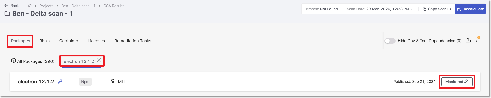<figcaption></figcaption></figure>

   The **Management of Packages** panel opens.

   <figure>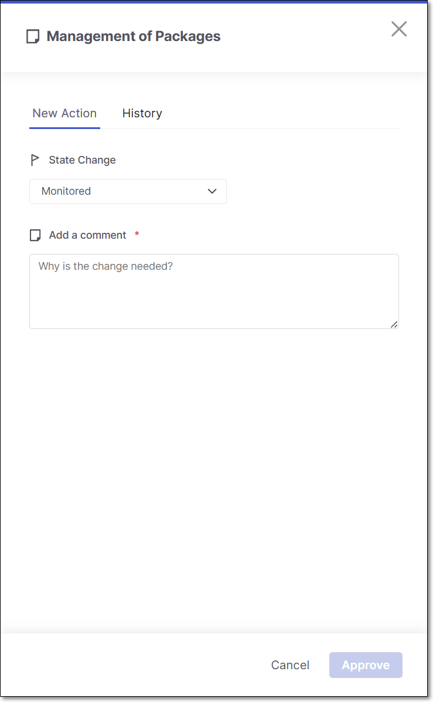<figcaption></figcaption></figure>

   
   Alternatively, you can open the **Management of Packages** panel by clicking on the Comments button in the **Customization** section at the bottom of the **Package Details** page.
   
5. To change the state, click on the **State Change** field, and select from the drop-down list the desired state.

   
   After changing the state, you are required to add a comment before the option to **Approve** the change becomes available.
   
6. In the **Add a Comment** section, enter your comment.
7. Click **Approve**.

   The new State is immediately shown in the web application. However, the package summary counters aren't recalculated until a new scan or scan recalculation is run on the project. Until the recalculation, a red dot will be displayed for the package indicating that recalculation is required.

#### Triaging Packages - Bulk Action


When you mute or snooze a package in SCA, you trigger a scan recalculation that resets all CVE‑level triage states (e.g **Confirmed**) to **To_Verify**. Your package‑level action overrides any individual CVE decisions, so previous CVE states are cleared during the update.


**To bulk action triage packages:**

1. Go to SCA results viewer > **Packages** tab > **All Packages** sub-tab.
2. Select the checkbox next to each risk you would like to include in the bulk action triage, and click **Manage States**.

   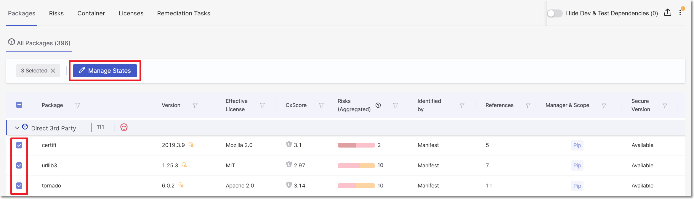

   The **Management of Risks** panel opens.

   <figure>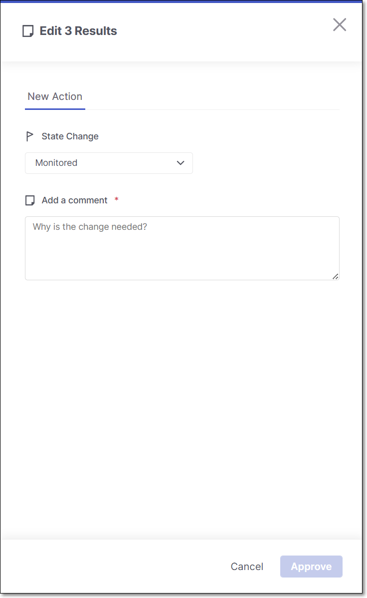<figcaption></figcaption></figure>
3. Change the **State**, and add a **Comment** (required).
4. Click **Approve**.

   The changes are applied to all of the selected packages.

### Viewing Package Change History

Once a State change has been made, a red dot is shown next to the relevant Package. This indicates that you need to run a scan recalculation in order to update all of the result counters to reflect the change.

State changes are shown in the **Package Details** page. Muted packages will have a pink background for the header bar with a muted icon and Snoozed packages will have a yellow background for the header bar with a snoozed icon.

<figure>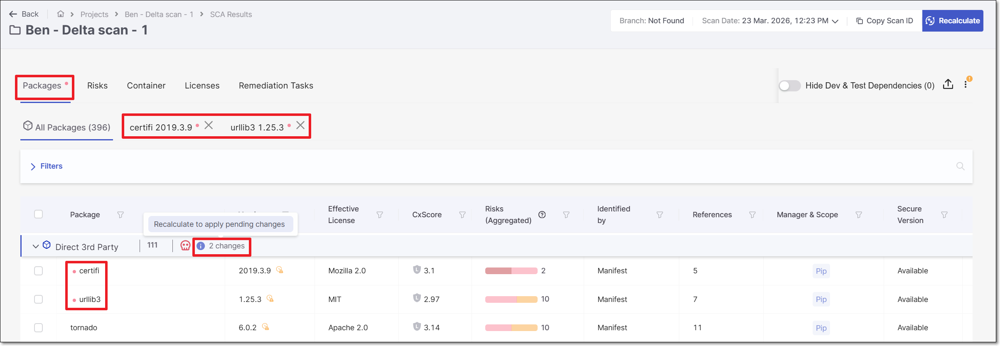<figcaption></figcaption></figure>

In addition, a detailed history of all changes is shown in the **Management of Risk** panel > **History** tab. For each change that was made, the name of the user who made the change and the time of the change are shown. In addition, for state changes, the new state is shown alongside the previous state.

<figure>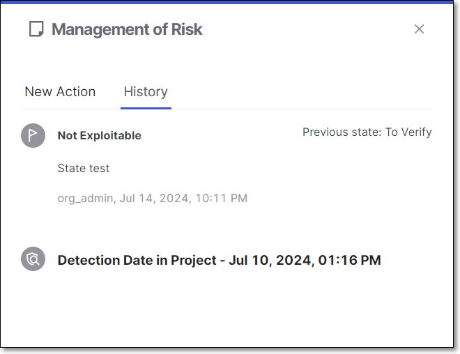<figcaption></figcaption></figure>

## Managing Legal Risks

Packages often have several different licenses associated with them. This gives users the option to choose which license to consider "effective" for that package, i.e., which set of license restrictions they would like to follow. As long as you are abiding by the terms of the effective license, the other licenses don't constitute a legal risk. Therefore, Checkmarx only considers a risky license as constituting a **Legal Risk** if it is marked as the Effective license for that package.

Initially, the state of most licenses is set as **To Verify**. However, when there is a sole license for a package and it was identified in a reliable source, that license is automatically marked as **Effective**. You can then review the licenses and mark each license as **Effective** or **Not Effective** based on your assessment of the package usage. Changing the state of a license is done via the Checkmarx One web application, on the **Risk Details** page.

Learn more about Legal Risks [here](sca-results-viewer.md#legal-risks).

## Triage Using the Global Inventory

Many SCA triage decisions need to be applied consistently across multiple projects. When the same package, vulnerability, malware risk, or license appears in more than one project, triaging each instance individually can be time-consuming and lead to inconsistent results. The Global Inventory provides cross-project triage, allowing you to locate an item once and apply a single triage action to all of its occurrences across the tenant. This applies to packages, associated vulnerabilities and malware risks, as well as licenses, enabling scalable and consistent SCA triage across all projects.

For example, if you decide that a particular package is not a concern, you can search for all instances of that package in the Packages tab and mark them all as **Muted**.

Use the procedure below to triage items across projects in the Global Inventory.:


This procedure demonstrates how to triage a package across multiple projects. The steps for triaging vulnerabilities, malware risks, or licenses are the same—navigate to the **Vulnerabilities and Malware** or **Licenses** tab and follow the procedure described below.


1. Access the **Global Inventory and Risks** page by clicking on the **Resources > SCA Inventory and Risks** in the main navigation.

   <figure>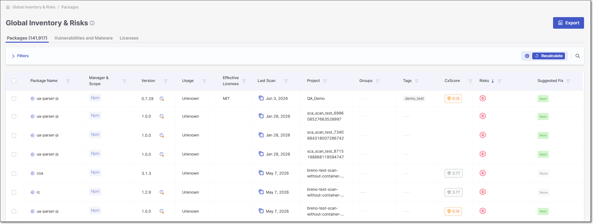<figcaption></figcaption></figure>
2. Use the search bar to find the particular package you want to triage.
3. Check the selection boxes of the instances of the package you want to triage.

   The **Manage States** button appears in the header bar.
4. Click on the **Manage States** button.

   The **Management of Packages** side panel is opened.

   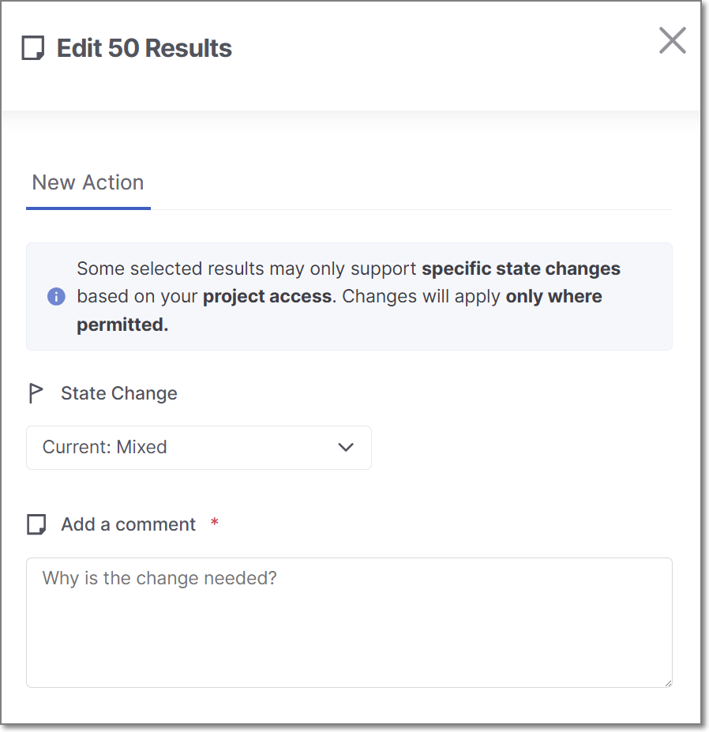
5. To change the state, click on the **State Change** field, and select from the drop-down list the desired state.

   
   After changing the state, you are required to add a comment before the option to **Approve** the change becomes available.
   
6. In the **Add a Comment** section, enter your comment.
7. Click **Approve**.

   The new State is immediately shown in the web application. However, the package summary counters aren't recalculated until a new scan or scan recalculation is run on the project. Until the recalculation, a red dot will be displayed for the package indicating that recalculation is required.
