# Secret Detection Pre-Receive Hook

To help prevent sensitive data from being introduced into repositories, the secret detection pre-receive hook can be installed on supported self-managed SCMs.

This feature runs a scan before changes are accepted into the remote repository, ensuring that commits containing hardcoded secrets or credentials are rejected automatically. It is especially useful for enforcing security policies and reducing the risk of accidental exposure in shared codebases.

The purpose of this document is to explain how to set up a pre‑receive hook on each of the supported self‑managed SCMs:

- GitHub
- GitLab
- Bitbucket

This document includes links to the official documentation for each SCM, along with an example configuration. Since some steps may vary depending on the server version or type, refer to the official documentation for complete and up-to-date instructions.

## GitHub Enterprise Server

Installing a pre-receive hook on GitHub Enterprise Server involves:

- **An execution environment**

  A virtual machine or container where the hook script will run. ([https://docs.github.com/en/enterprise-server@3.17/admin/enforcing-policies/enforcing-policy-with-pre-receive-hooks/creating-a-pre-receive-hook-environment](https://docs.github.com/en/enterprise-server@3.17/admin/enforcing-policies/enforcing-policy-with-pre-receive-hooks/creating-a-pre-receive-hook-environment) )
- **The hook script**

  Executed for each push event in the configured environment. ([https://docs.github.com/en/enterprise-server@3.17/admin/enforcing-policies/enforcing-policy-with-pre-receive-hooks/creating-a-pre-receive-hook-script](https://docs.github.com/en/enterprise-server@3.17/admin/enforcing-policies/enforcing-policy-with-pre-receive-hooks/creating-a-pre-receive-hook-script) )

### Create and Configure the Environment

Let’s start by creating the environment where the script will run. This feature is integrated through the Checkmarx CLI, so the CLI must be installed and granted the appropriate permissions in the environment. The following is the Docker file used to create the environment.

```
FROM --platform=linux/amd64 debian:stable

ARG CX_CLI_VERSION=<THE_CLI_VERSION_YOU_WANT_TO_USE>

ARG CX_BASE_URI
ARG CX_BASE_AUTH_URI
ARG CX_TENANT
ARG CX_APIKEY

RUN apt-get update && apt-get install -y git bash curl
RUN rm -fr /etc/localtime /usr/share/zoneinfo/localtime

# Download and install the Checkmarx CLI
RUN curl -L "https://github.com/Checkmarx/ast-cli/releases/download/${CX_CLI_VERSION}/ast-cli_${CX_CLI_VERSION}_linux_x64.tar.gz" \
        -o /tmp/ast-cli.tar.gz && \
    tar -xzf /tmp/ast-cli.tar.gz -C /usr/local/bin cx && \
    chmod +x /usr/local/bin/cx && \
    rm /tmp/ast-cli.tar.gz

# Authenticate
RUN cx configure set --prop-name cx_base_uri --prop-value "${CX_BASE_URI}" && \
    cx configure set --prop-name cx_base_auth_uri --prop-value "${CX_BASE_AUTH_URI}"&& \
    cx configure set --prop-name cx_tenant --prop-value "${CX_TENANT}" && \
    cx configure set --prop-name cx_apikey --prop-value "${CX_APIKEY}" && \
    cx auth validate

RUN mv "${HOME}/.checkmarx" /etc/.checkmarx \
 && mkdir -p /etc/.checkmarx/logs \
 && : > /etc/.checkmarx/secrets-pre-receive-config.yaml \
 && chmod -R 777 /etc/.checkmarx

WORKDIR /hooks

ENTRYPOINT ["/bin/bash"]
```

Important notes regarding the Docker file:

- The CLI version must include the pre-receive feature.
- The file name `secrets-pre-receive-config.yaml` and the folder name `logs` can be changed, but they must match later in the configuration. This guide assumes these exact names.

On the developer's local machine, build the Dockerfile (using Unix shell syntax in this example), then run:

```
docker build -f Dockerfile -t pre-receive.debian . \
--build-arg CX_BASE_URI=<YOUR_BASE_URI> \
--build-arg CX_BASE_AUTH_URI=https:<YOUR_BASE_AUTH_URI> \
--build-arg CX_TENANT=<YOUR_TENANT> \
--build-arg CX_APIKEY=<YOUR_API_KEY>
```

Then:

```
docker create --name pre-receive.debian pre-receive.debian /bin/true
```

And finally this:

```
docker export pre-receive.debian | gzip > debian.tar.gz
```

This will create a `debian.tar.gz` archive in the current folder.

Next, transfer the archive to the server machine using scp. In this example, the archive is copied to `/home/admin`:

```
scp -i <PATH_TO_PRIVATE_KEY> -P <SSH_PORT> -r <LOCAL_DIR>/debian.tar.gz \
    <REMOTE_USER>@<REMOTE_HOST>:/home/admin
```

Now that the environment archive is on the server, run the following command to create the pre-receive environment:

```
ghe-hook-env-create CheckmarxEnv /home/admin/debian.tar.gz
```

Expected output:

`Pre-receive hook environment 'CheckmarxEnv' (YOUR_ENVIRONMENT_ID_HERE) has been created.`

Assume the environment ID is 22 for the remainder of this guide.

To update the configuration file (for details, see below) first run this command on the server:

```
sudo ls /data/user/git-hooks/environments/22
```

This should output a single folder name representing the isolated environment. For example, if the output is:

```
ed0dd7b353b3a3b9c22222e0d60abab2971f0c0d94591f9c3e4ec5f6bfc5b0e6
```

Then the configuration file can be edited with:

```
sudo vi /data/user/git-hooks/environments/22/ed0dd7b353b3a3b9c22222e0d60abab2971f0c0d94591f9c3e4ec5f6bfc5b0e6/etc/.checkmarx/secrets-pre-receive-config.yaml
```

This configuration file can be updated at any time. It is not required during the initial setup.

### Create the Hook Script

Create a script inside the repository - for example, `checkmarx.sh` - with the following content:

```
#!/bin/bash
export CX_CONFIG_FILE_PATH="/etc/.checkmarx/checkmarxcli.yaml"
/usr/local/bin/cx hooks pre-receive secrets-scan --config /etc/.checkmarx/secrets-pre-receive-config.yaml
```

Before pushing the script to the remote repository, mark it as executable in Git by running:

```
git update-index --chmod=+x checkmarx.sh
```

### Import Step Before Final Setup

As mentioned earlier, the script runs in an isolated environment, where additional security rules apply. One such rule is the restriction on which system calls are allowed. By default, GitHub does not permit three system calls required for the secret scanner script to function:

- pidfd_open (ID: 434)
- pidfd_getfd (ID: 438)
- pidfd_send_signal (ID: 424)

To override this default behavior, these system calls must be added to the hook.seccomp file. Since this file is read-only, elevated permissions and temporary overrides are required to modify it.

To edit the file (for example, using `vi`), run:

```
sudo vi /etc/nsjail/hook.seccomp
```

In this file, locate a section similar to the following:

```
#define S_IFMT 00170000
#define S_IFIFO 0010000

/* system calls not known by https://github.com/google/kafel are added by ID */
#define rseq 334
#define statx 332
#define faccessat2 439
#define clone3 435
#define close_range 436

POLICY hook {
    ALLOW {
        accept,
        accept4,
        ...
        writev
    }
}
```

The system calls not known by `kafel` are added by ID. Modify the file as follows, ensuring correct formatting:

```
#define S_IFMT 00170000
#define S_IFIFO 0010000

/* system calls not known by https://github.com/google/kafel are added by ID */
#define rseq 334
#define statx 332
#define faccessat2 439
#define clone3 435
#define close_range 436
#define pidfd_open 434
#define pidfd_getfd 438
#define pidfd_send_signal 424

POLICY hook {
    ALLOW {
        accept,
        accept4,
        ...
        pidfd_open,
        pidfd_getfd,
        pidfd_send_signal,
        ...
        writev
    }
}
```

Save the changes. The environment is now ready for the final setup steps.

### Final Steps

The final step is to connect the script to the isolated environment and enable it in the desired repositories.

1. In the GitHub Enterprise Server UI, click your profile picture (top-right corner).
2. Select **Enterprise settings**.
3. At the top of the page, click **Settings**:

   <figure>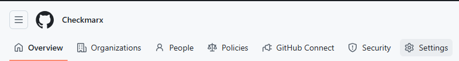<figcaption></figcaption></figure>
4. In the left-hand menu, select **Hooks**:
5. Click **Add pre-receive hook**:

   <figure>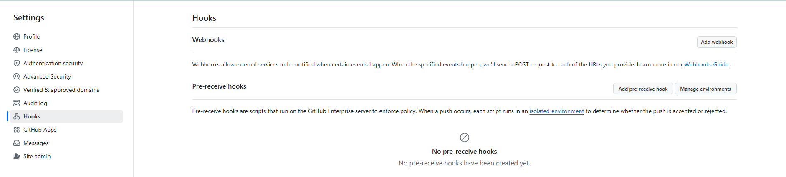<figcaption></figcaption></figure>

Next, enter a name for the hook, then select the environment you created earlier (if following this guide exactly, it will be named CheckmarxEnv). After that, choose the repository where the script is stored, and specify the path to the script within that repository.

<figure>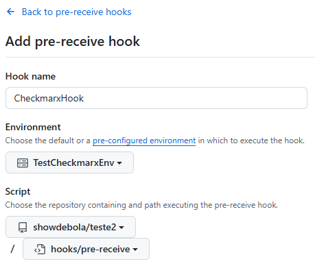<figcaption></figcaption></figure>

Finally, ensure the first option, **Use the exit-status to accept or reject pushes**,” is enabled. The other two options are not required. However, for initial setup, it's recommended to disable the second option, **Enable this pre-receive hook on all repositories by default**, so the hook can be tested on a specific repository first, minimizing the risk of disruptions in other repositories.

<figure>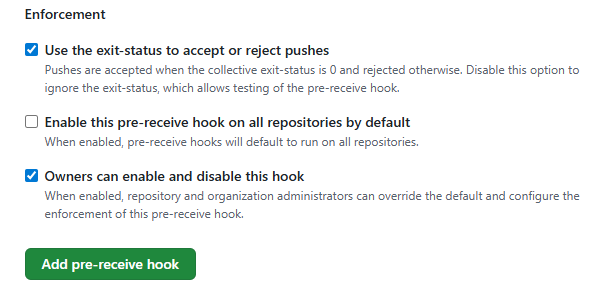<figcaption></figcaption></figure>

To enable the hook for a specific repository, first navigate to that repository. Then, at the top of the page, click on **Settings**.

In the left pane, click on **Hooks**:

<figure>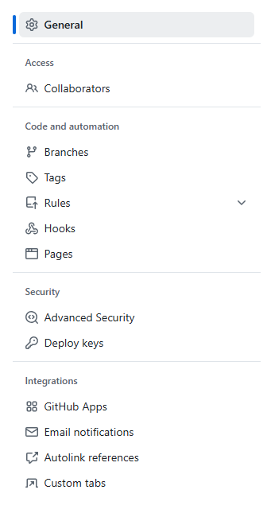<figcaption></figcaption></figure>

And then you will be able to enable/disable the hook for that specific repository:

<figure>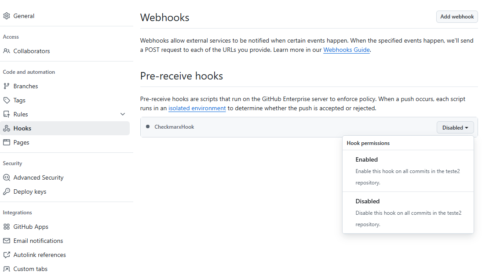<figcaption></figcaption></figure>

### Important Note on Log Limitations in GitHub

In GitHub Enterprise Server, any files created during a git push - within the context of the isolated environment - do not persist after execution. This affects the logs_folder_path configuration: although files may be written at runtime, they are not saved on the server afterward. As a result, users cannot access these logs post-push.

This is a known limitation. In the meantime, as an alternative, users can rely on the Audit Log feature in GitHub Enterprise Server to track when the pre-receive hook is triggered, along with details about which user triggered it.

To access the audit log, follow the same UI flow shown earlier:

**Profile Picture → Enterprise Settings → Settings:**

<figure>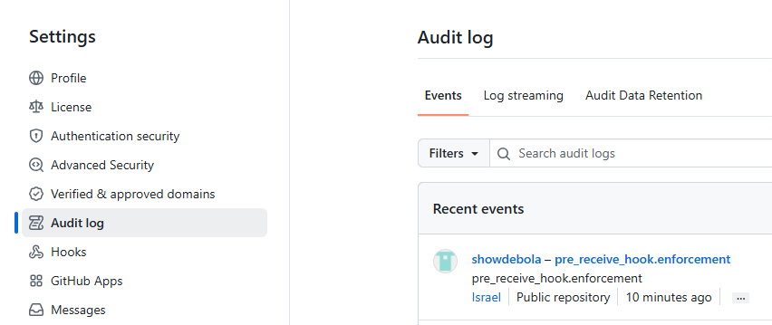<figcaption></figcaption></figure>

Clicking on the ellipsis inside the recent events will show more information about the user and the event.

### Important Final notes

GitHub enforces a **non‑configurable 5-second** timeout for evaluating pushes. While routine pushes typically complete within this window, more intensive operations - such as pushing an entire repository - may risk timing out. (for more details, click [here](https://docs.github.com/en/enterprise-server@3.17/admin/enforcing-policies/enforcing-policy-with-pre-receive-hooks/about-pre-receive-hooks#impact-on-performance-and-workflows)).

If needed, the hook can be temporarily disabled or the secret scanner can be skipped entirely.

## GitLab

For this guide, a GitLab version above 15.10 is used. For versions 15.10 or earlier, refer to the [official documentation](https://docs.gitlab.com/administration/server_hooks/?tab=GitLab+15.10+and+earlier).

Keep in mind that there are additional nuances beyond just the version. The steps provided here reflect a working configuration from one setup and are intended as general guidance. Always refer to the official documentation of your Git provider for the most accurate and up-to-date information.

### Install CLI on the Server Machine

On the server machine, run the following command, replacing `<CX_CLI_VERSION>` with the desired version (make sure the selected version includes the pre-receive feature):

```
sudo curl -L "https://github.com/Checkmarx/ast-cli/releases/download/<CX_CLI_VERSION>/ast-cli_<CX_CLI_VERSION>_linux_x64.tar.gz" \
     -o /tmp/ast-cli.tar.gz && \
sudo tar -xzf /tmp/ast-cli.tar.gz -C /usr/local/bin cx && \
sudo chmod +x /usr/local/bin/cx && \
sudo rm /tmp/ast-cli.tar.gz
```

This will install the cx cli and ensure it has executable permission.

### Configure Authentication

Run the following command and write the necessary input:

```
cx configure
```

Refer to [this page](http://https://docs.checkmarx.com/en/34965-68621-checkmarx-one-cli-quick-start-guide.html#UUID-8e001f55-673e-aec4-40b8-856a37ac7fde_id_ASTCLIQuickStartGuide-QuickStart) for details.

### Set Up Folders and Configuration File on the Server

Before creating the pre-receive hook, two preparations are needed:

- Create the logs folder (if logs are needed).
- Create the configuration file for the secret scanner. This file can be set up anytime; for now, create an empty file.

The location can be chosen freely, but for this guide, a `checkmarx` folder will be created under `/var/atlassian/application-data/bitbucket`.

On the server machine, run the following command to create the folders and file and set the correct permissions:

```
sudo mkdir -p /var/opt/gitlab/checkmarx/logs \
  && sudo touch /var/opt/gitlab/checkmarx/secrets-pre-receive-config.yaml \
  && sudo chown -R git:git /var/opt/gitlab/checkmarx
```

With this setup in place, the configuration file can be updated with any desired settings at any time. For instance, using vi:

```
sudo vi /var/opt/gitlab/checkmarx/secrets-pre-receive-config.yaml
```

### Create a Hook for a Specific Repository

First, find the relative path of the repository through the UI.

Log in as an admin, then locate **Admin Area** in the bottom corner of the left sidebar:

<figure>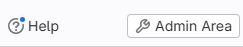<figcaption></figcaption></figure>

Click **Admin Area**, and in the left sidebar select **Projects**.

Next, choose the project where the hook should be added:

<figure>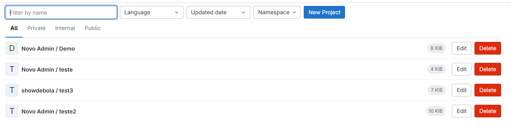<figcaption></figcaption></figure>

You will now see the relative repository path - for example:

<figure>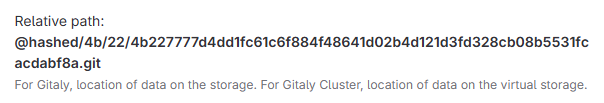<figcaption></figcaption></figure>

This path will be used to continue the guide, but be sure to use your own.

On the server machine, create a folder for custom hooks (the location is flexible). For example:

```
mkdir -p ~/custom_hooks
```

Inside this folder, create a file named exactly pre-receive (no extension) with the following content:

```
#!/bin/bash
/usr/local/bin/cx hooks pre-receive secrets-scan --config /var/opt/gitlab/checkmarx/secrets-pre-receive-config.yaml
```

Make the file executable:

```
chmod +x ~/custom_hooks/pre-receive
```

Next, package the hook by creating a tar archive of the folder (assuming it’s in `~`):

```
cd ~
tar -cf custom_hooks.tar custom_hooks
```

Finally, apply the hook to the repository by running:

```
cat custom_hooks.tar | \
  sudo -u git -- /opt/gitlab/embedded/bin/gitaly hooks set \
    --storage default \
    --repository @hashed/4b/22/4b227777d4dd1fc61c6f884f48641d02b4d121d3fd328cb08b5531fcacdabf8a.git \
    --config /var/opt/gitlab/gitaly/config.toml
```

If the server hook is set up correctly, it will execute when pushing changes to the selected remote repository.

### Create a Global Server Hook for All Repositories

Create a script - e.g., `checkmarx.sh` - in the directory `/var/opt/gitlab/gitaly/custom_hooks/pre-receive.d/` with the following content:

```
#!/bin/bash
/usr/local/bin/cx hooks pre-receive secrets-scan --config /var/opt/gitlab/checkmarx/secrets-pre-receive-config.yaml
```

Then, make the script executable by running:

```
sudo chmod +x /var/opt/gitlab/gitaly/custom_hooks/pre-receive.d/checkmarx.sh
```

If the server hook is implemented correctly, it will execute on every push to any remote repository.

### Removing a Hook for a Specific Repository

To remove server hooks from a repository, an empty tarball must be passed to hooks set to indicate that no hooks should be present.

First, create an empty directory and package it into a tarball:

```
mkdir empty_dir
tar -cf empty_hooks.tar empty_dir
```

Then, using the example from the *Secret Detection | Pre-Receive Documentation*, run:

```
cat empty_hooks.tar | \
  sudo -u git -- /opt/gitlab/embedded/bin/gitaly hooks set \
    --storage default \
    --repository @hashed/4b/22/4b227777d4dd1fc61c6f884f48641d02b4d121d3fd328cb08b5531fcacdabf8a.git \
    --config /var/opt/gitlab/gitaly/config.toml
```

After this, pushing changes to the specified repository will no longer trigger the secret detection hook.

### Bitbucket

For this guide, a Bitbucket version above 8.0 is used. If you're using version 8.0 or below, refer to the [official documentation](https://support.atlassian.com/bitbucket-data-center/kb/how-to-create-a-simple-hook-in-bitbucket-data-center/#HowtocreateasimplehookinBitbucketDataCenter-ForBitbucketversion8.0andabove).

### Install the CLI on the Server Machine

On the server machine, run the following command - replacing `<CX_CLI_VERSION>` with the desired version (ensure it includes the pre-receive feature):

```
sudo curl -L "https://github.com/Checkmarx/ast-cli/releases/download/<CX_CLI_VERSION>/ast-cli_<CX_CLI_VERSION>_linux_x64.tar.gz" \
     -o /tmp/ast-cli.tar.gz && \
sudo tar -xzf /tmp/ast-cli.tar.gz -C /usr/local/bin cx && \
sudo chmod +x /usr/local/bin/cx && \
sudo rm /tmp/ast-cli.tar.gz
```

This installs the `cx` CLI and ensures it has executable permissions.

### Configure Authentication

Run the following command and write the required input (refer to this page for comprehensive details):

```
cx configure
```

### Set Up Folders and Configuration File inside the Server

Before setting up the pre-receive hook, two preparations are needed:

- Create the logs folder (if log output is desired).
- Create the configuration file for the secret scanner. This file can be updated at any time; for now, it will be created as an empty placeholder.

The location is flexible, but for this guide, a `checkmarx` folder will be created under: `/var/atlassian/application-data/bitbucket`.

On the server machine, run the following command to create the necessary folders and files, and to apply the correct permissions:

```
sudo mkdir -p /var/atlassian/application-data/bitbucket/checkmarx/logs \
  && sudo touch /var/atlassian/application-data/bitbucket/checkmarx/secrets-pre-receive-config.yaml \
  && sudo chown -R atlbitbucket:atlbitbucket /var/atlassian/application-data/bitbucket/checkmarx
```

Once this is done, configuration details can be added to the file at any time.

For example, to edit the file using `vi`:

```
sudo vi /var/atlassian/application-data/bitbucket/checkmarx/secrets-pre-receive-config.yaml
```

### Creating the Hook

On a local or server machine, create a file named `checkmarx.sh` in the current directory (you can use any folder) with the following content:

```
#!/bin/bash
/usr/local/bin/cx hooks pre-receive secrets-scan --config /var/atlassian/application-data/bitbucket/checkmarx/secrets-pre-receive-config.yaml
```

This assumes that the configuration file exists at the specified path on the server: `/var/atlassian/application-data/bitbucket/checkmarx/secrets-pre-receive-config.yaml`.

To upload the script to Bitbucket, run the following command from the same directory where `checkmarx.sh` is located:

```
curl -F "content=@checkmarx.sh" \
     -F "name=checkmarx" -F "description='Run Checkmarx scan'" \
     -F "type=PRE" \
     -H 'X-Atlassian-Token:no-check' \
     -u <YOUR_USERNAME>:<YOUR_PASSWORD> \
     <BITBUCKET_HOST>:<PORT>/rest/api/latest/hook-scripts
```

A successful response should return a JSON object. For example:

```
{
   "id":12,
   "name":"checkmarx",
   "pluginKey":"com.atlassian.bitbucket.server.bitbucket-hook-scripts",
   "size":118,
   "type":"PRE",
   "createdDate":1752679748942,
   "updatedDate":1752679748942,
   "version":0,
   "description":"'Run Checkmarx scan'"
}
```

Associate the hook with a specific repository on a local/server machine by running:

```
curl -v -X PUT \
  --header 'Content-Type: application/json' \
  --data '{}' \
  -u <YOUR_USERNAME>:<YOUR_PASSWORD> \
  <BITBUCKET_HOST>:<PORT>/rest/api/latest/projects/<PROJECT_NAME>/repos/<REPO_NAME>/hook-scripts/<HOOK_ID>
```

To associate the hook at the project level (applies to all repositories within the project), run:

```
curl -v -X PUT \
  --header 'Content-Type: application/json' \
  --data '{}' \
  -u <YOUR_USERNAME>:<YOUR_PASSWORD> \
  <BITBUCKET_HOST>:<PORT>/rest/api/latest/projects/<PROJECT_NAME>/hook-scripts/<HOOK_ID>
```

Replace `<HOOK_ID>` with the ID returned during upload - in this example, 12. For instance, based on the example screenshot:

<figure>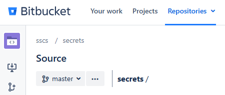<figcaption></figcaption></figure>

The project name is `sscs` and the repository name is `secrets`.

With the hook uploaded and associated, the setup is complete and ready to enforce secret scanning during pushes.

### Removing the Hook

To dissociate the hook from a specific repository, run the following command on a local/server machine:

```
curl -X DELETE \
  -u <YOUR_USERNAME>:<YOUR_PASSWORD> \
  <BITBUCKET_HOST>:<PORT>/rest/api/latest/projects/<PROJECT_NAME>/repos/<REPO_NAME>/hook-scripts/<HOOK_ID>
```

To dissociate the hook at the project level, run:

```
curl -X DELETE \
  -u <YOUR_USERNAME>:<YOUR_PASSWORD> \
  <BITBUCKET_HOST>:<PORT>/rest/api/latest/projects/<PROJECT_NAME>/hook-scripts/<HOOK_ID>
```

To completely remove the uploaded hook, run the following command:

```
curl -X DELETE \
  -u <YOUR_USERNAME>:<YOUR_PASSWORD> \
  <BITBUCKET_HOST>:<PORT>/rest/api/latest/hook-scripts/<HOOK_ID>
```

### Limitations of Skip Configuration in Bitbucket

Bitbucket does not fully support Git push options, which are used to control behavior in pre-receive hooks (specifically the -o flag in git push).

Because of this limitation, the skip configuration used to bypass the scanner will not work as expected in Bitbucket.

Users will not be able to skip the scanner during a push, even if skip flags are configured.

## Config File

This section applies to all servers.

### Sample Config File

```
logs_folder_path: "/path/to/logs/folder"
exclude_path:
  - "docs/*"
  - "internal/tests/*"
  - "*.md"
ignore_rule_id:
  - "github-pat"
ignore_result_id:
  - "6981a34c1d94db7b5465fbc8b8f4fb97c2c97426"
allow_skip: false
```

### Config Fields Explained

- `logs_folder_path`

  Folder where scan logs are written. If omitted, no log files are created. (limitation in GitHub)
- `exclude_path`

  Glob patterns for files/directories to skip (e.g. `"docs/*"`, `"*.md"`).
- `ignore_rule_id`

  List of rule IDs whose findings should be suppressed.
- `ignore_result_id`

  Specific finding IDs to ignore (one-off exceptions).
- `allow_skip`

  When set to `false`, users cannot bypass the scan; `true` allows pushes with a skip flag. Defaults to `false`.

### Bypassing the Secret Scanner (Limitation in Bitbucket)

This section describes how to temporarily bypass the pre-receive secret scanner by adjusting configuration settings and using the appropriate `git push` option.

#### Prerequisites

- **Enable** `allow_skip` **in your Checkmarx config**

  Set `allow_skip: true` so the scanner hook will accept a skip flag on push.
- **Allow Git push options**

  Your Git server must advertise support for push options. While some servers enable this by default, you can ensure that the remote repository has it enabled by running:

  ```
  git config --get receive.advertisePushOptions # should print "true"
  ```

  If it’s not enabled, run:

  ```
  git config receive.advertisePushOptions true
  ```


This command should be ran inside the repository in the server machine, not in the local machine


#### Skipping a Push

With both prerequisites met, you can bypass the secret scanner by adding the `skip-secret-scanner` push option:

```
git push -o skip-secret-scanner
```
