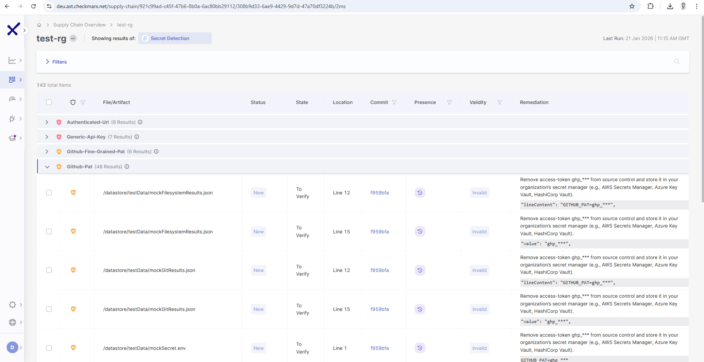
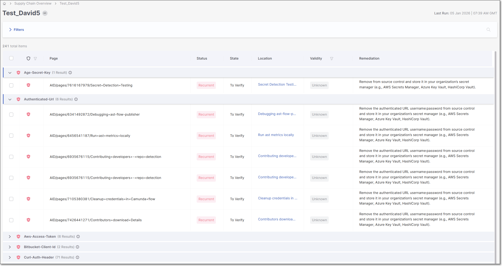

# Secret Detection Results Viewer

**To view Secret Detection scan results:**

1. Go to the **Workspace** > **Projects** page and hover over the **Results** button for the desired project.
2. Select the **SCS** scanner.

   

   The SCS results viewer opens with **Secret Detection** selected for display.

## Viewing Secret Detection Results

When the Secret Detection scanner is selected in the SCS results viewer, results are grouped by the type of secret detected. When you click on a type, a list of risks of that type is shown.

The following table describes the information shown for each risk.

| Item | Description |
|---|---|
| Severity | The severity of the risk.  The severity for detected secrets is generally set as High. However, when the validity test is run (i.e. for supported secret types), valid secrets are set as Critical and invalid secrets are set as Medium.  |
| File/Artifact | The path to the file or artifact in which the secret was detected. |
| Status | Indicates the recurrence status of the detected secret. • **New** - The secret was detected for the first time in this project. • **Recurrent** - The same secret has been detected before, either in the source code or in commit history. |
| State | Represents the current triage state of the finding. |
| Location | The line in which the secret was detected. |
| Commit | Shows the Git commit ID in which the secret was detected. Clicking the commit ID opens the relevant commit in the source repository. |
| Presence | Indicates where the secret exists in the repository. • **Source** – The secret is present in the current source code. • **History** – The secret exists in Git commit history. |
| Validity | Indicates whether or not the secret is currently valid. |
| Remediation | Shows a few characters of the detected secret, with the remaining characters masked for security purposes. The recommended remediation for detected secrets is to first remove the secret from your file and then to change the secret. |

### Viewing Confluence Scan Results

When viewing Secret Detection results for a Confluence-based project, results are presented with different information columns than those displayed for other Secret Detection scans. Results are grouped by the type of secret detected. When you click on a type, a list of risks of that type is shown.

The following table describes the information shown for each risk.

| Item | Description |
|---|---|
| Severity | The severity of the risk.  The severity for detected secrets is generally set as High. However, when the validity test is run (i.e. for supported secret types), valid secrets are set as Critical and invalid secrets are set as Medium.  |
| Page | The confluence page in which the exposed secret was detected. |
| Status | Indicates the recurrence status of the detected secret. • **New** - The secret was detected for the first time in this project. • **Recurrent** - The same secret has been detected before, either in the source code or in commit history. |
| State | Represents the current triage state of the finding. |
| Location | A link to the Confluence page that exposes this secret. |
| Validity | Indicates whether or not the secret is currently valid. |
| Remediation | Shows a few characters of the detected secret, with the remaining characters masked for security purposes. The recommended remediation for detected secrets is to first remove the secret from your file and then to change the secret. |
