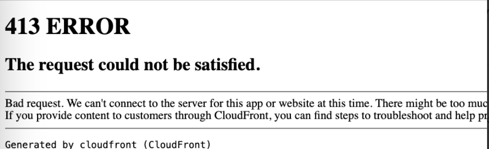
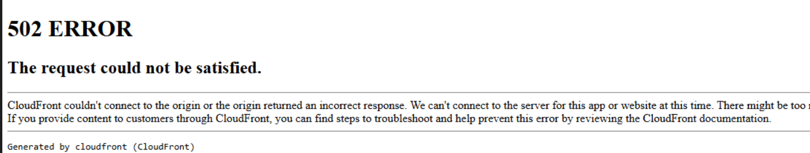
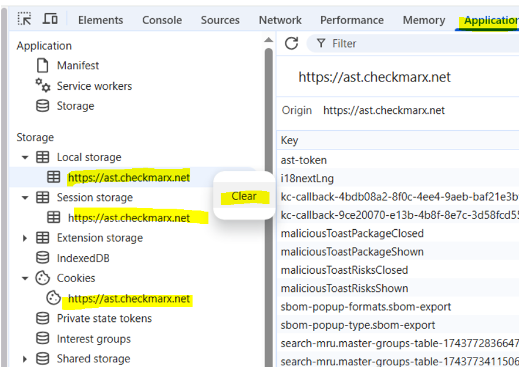

# Checkmarx One Support Content

The following sections represent content related to Checkmarx One that was created by the support team and imported from Salesforce.

Default-Role added automatically to SSO users

- **manage-keys** - Provide access to the API Keys Tab inside the IAM
- **offline-access** - The idea is that during login, your client application will request an Offline token instead of a classic Refresh token [https://wjw465150.gitbooks.io/keycloak-documentation/content/server_admin/topics/sessions/offline.html](https://wjw465150.gitbooks.io/keycloak-documentation/content/server_admin/topics/sessions/offline.html)
- **uma-authorization** - Keycloak automatically assigns the role *uma_authorization* to the user. The *uma_authorization* role is a default realm role. [https://wjw465150.gitbooks.io/keycloak-documentation/content/authorization_services/topics/service/authorization/whatis-obtain-aat.html](https://wjw465150.gitbooks.io/keycloak-documentation/content/authorization_services/topics/service/authorization/whatis-obtain-aat.html)
- **user** - The basic IAM role that is used in many places.
- **access-iam** - Allow user to access IAM

CxOne Login Fail : 413 or 502 ERROR The request could not be satisfied

<figure><figcaption></figcaption></figure>

<figure><figcaption></figcaption></figure>

**Cause:** Browser cache and/or bookmarked URL after CxOne upgrade.

**Resolution:** One or more of the following:

- On the login page, click change tenant at the top right. Enter in your tenant name on the prompt and sign in again
- If using a bookmarked URL, try accessing the CxOne site directly and not using bookmark
- Clear browser cache
- Clear browser cookies
- Clear 3 site cookies from Browser Dev tools - Application Tab as shown here:

  <figure><figcaption></figcaption></figure>

If none of these work, capture browser logs while accessing the page, open a support case, and attach the HAR file. To learn how to generate an HAR file, see the following topic.

How to capture web browser's traffic information

When troubleshooting issues, it may be necessary to gather information on the network traffic (requests and responses) from the user's web browser. To gather this information, follow these steps:

1. Press **F12, Ctrl + Shift + I**, or from the web browser's menu select **More tools > Developer tools**
2. From the panel that will open at the bottom or side of your screen, select the **Network tab**
3. Make sure the **Record** button in the upper left corner of the Network tab is shown in red. If it's grey, click it once to start recording
4. Check the boxes next to **Preserve log** and **Disable Cache**
5. Click the **Clear** button to clear out any existing logs from the Network tab
6. Now try to reproduce the issue
7. Once you have reproduced the issue, **right-click** anywhere on the grid of network requests
8. Select **Save as HAR with Content**
9. Save the file to your computer

