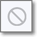
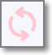

# Ignore Images in Cloud Insights

You can now mark container images in the Cloud Insights inventory as **Ignored** to reduce noise from images that don’t require remediation. From the inventory table, select one or more images and choose Ignore to hide them from the main view. Ignored images remain accessible through the **Asset Status** filter, where you can review them and restore them to the inventory at any time. This helps keep your inventory focused and actionable while preserving full control and visibility.

## Ignoring Images

When you open the **ASPM** > **Cloud Insights** page, the image inventory table is filtered by default to exclude ignored images.

<figure><figcaption></figcaption></figure>

There are two methods of marking an image as ignored:

**Option A**

Click on the **actions menu** in the desired image row, click **Ignore/Unignore**, and select **Ignore**.

<figure><figcaption></figcaption></figure>

**Option B**

1. Select the checkbox of one or more images that you would like to ignore.
2. Click on the **Ignore Images** button and select **Ignore** from the dropdown list.

   <figure><figcaption></figcaption></figure>

## Viewing Ignored Images

To view ignored images, toggle the **Asset Status** filter to show ignored images.

1. Click on the filter icon next to the Asset Type column header.
2. Mark the checkbox next to **Ignored**.
3. Click **Apply**.

   <figure><figcaption></figcaption></figure>

   The image inventory table will now display both ignored and unignored images. Ignored images appear as faded out and have the ignore icon  displayed next to the asset type in that row.

## Restoring Ignored Images

Once you have set the filter to show Ignored images, you can restore them in one of two ways:

**Option A**

<figure><figcaption></figcaption></figure>

Click on the **actions menu** in the desired image row, click **Ignore/Unignore**, and select **Unignore**.

The image inventory table will now display the newly unignored image. A **re-sync** is required to complete the process. Until a re-sync is completed, the image will appear as faded out and have the re-sync icon  displayed next to the asset type in that row.

**Option B**

1. Select the checkbox of one or more images that you would like to restore.
2. Click on the **Ignore Images** button and select **Unignore** from the dropdown list.

   <figure><figcaption></figcaption></figure>

   The image inventory table will now display the newly unignored images. A **re-sync** is required to complete the process. Until a re-sync is completed, the images will appear as faded out and have the re-sync icon  displayed next to the asset type in that row.
