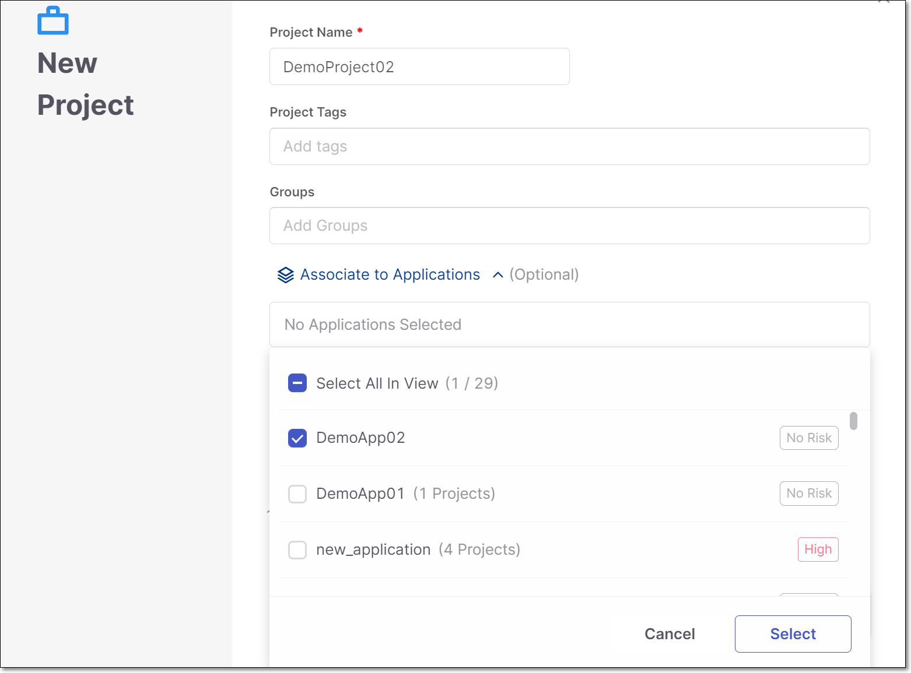
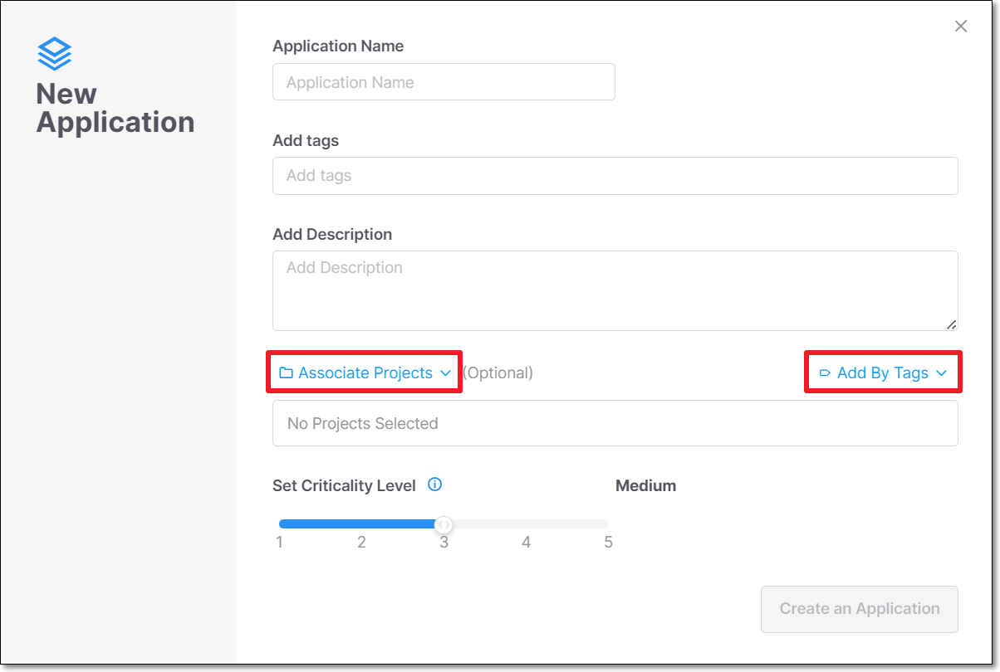
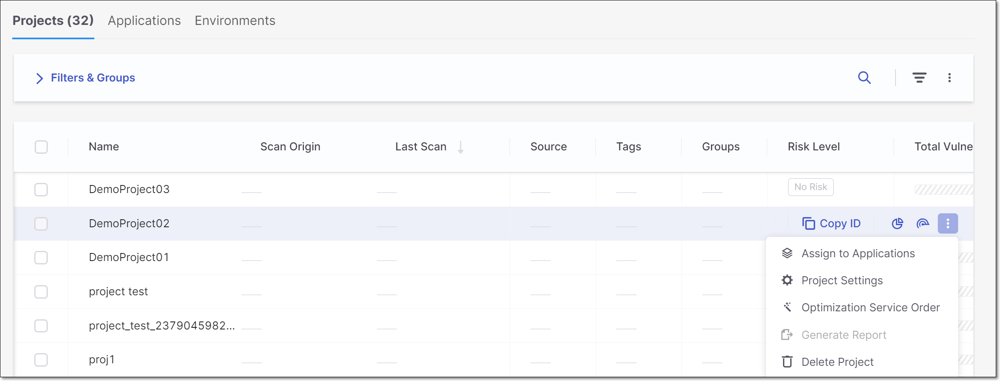
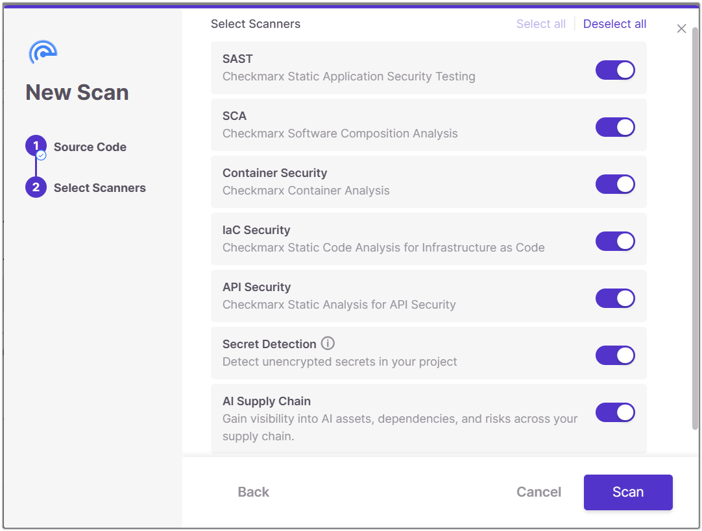
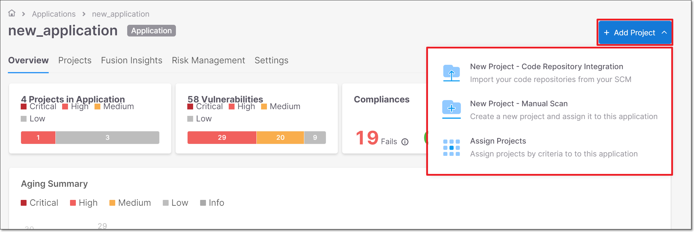
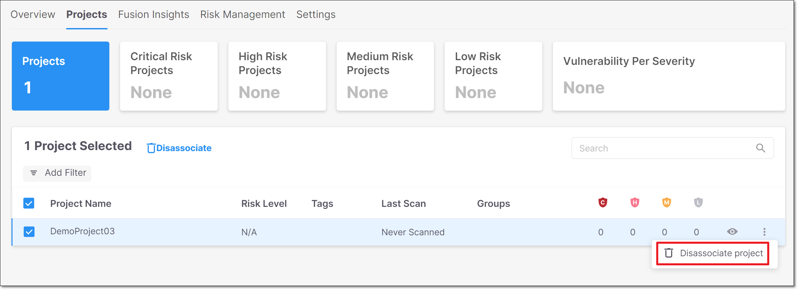

# New Association of Projects to Applications via the Web Application


This page describes upcoming changes that will affect how Projects are associated with Applications. These changes haven’t yet been implemented in production environments. However, we recommend preparing in advance to be ready when the changes occur.


This page describes the changes to the procedures for associating Projects with Applications via the Checkmarx One web application. For documentation of the related REST APIs, see [New Association of Projects to Applications - API Compatibility](new-association-of-projects-to-applications---api-compatibility.md).

In order to make the association of Projects to Applications more transparent and easier to manage, we are changing the method by which the association is made.

Previously, association of Projects with Applications was done based on “Rules”. Each Application had a series of rules that defined what characteristics a Project needed to have in order to be associated with that Application (e.g., any Project with the tag Demo is included in the Application “DemoApp”).

The new functionality will be that Projects are associated explicitly to Applications by selecting the specific Projects that you want to associate with that Application. It will now be possible to assign Projects to Applications when:

- Creating a Project
- Creating or editing an Application
- As an independent "association" action


The ability to associate multiple Projects with an Application as well as associating an individual Project with multiple Applications remains unchanged.


## Old Workflow

- Create Application, specifying rules that define Project association.
- Create Project with characteristics defined in the rules and the Project is automatically associated with the Application.

  
  In the old workflow, it didn't matter whether the Project was created before or after the Application.
  

## New Workflow

The association of Projects to Applications can be done as part of the process of creating a Project or an Application, or as a separate action.

When selecting Projects to associate with an Application, you can specify the Projects by Project name or by Tags.


When associating Projects using Tags, only Projects that **currently** have that tag are associated with the Application. If the specified tag is added later to additional Projects, those Projects will **not** be associated with the Application.


1. Create an Application.
2. Create a Project, specifying the Application (or multiple Applications) with which it is associated.

   <figure><figcaption></figcaption></figure>

OR

1. Create Projects.
2. Create an Application, specifying the Projects that are associated with it. Projects can specified directly or by selecting a Project tag.

   <figure><figcaption></figcaption></figure>

OR

1. Create Projects.
2. Create Applications.
3. Set the association between the Projects and the the Applications.

   Associations can be set, using the following methods:

   - On the **Projects** page, in the row of the relevant Project, click and select **Assign to Applications**.

     <figure><figcaption></figcaption></figure>
   - On the **Applications** page, in the row of the relevant Application, click and select **Associate Projects**.

     <figure><figcaption></figcaption></figure>
   - Open the Application page for the relevant Application and click on the **+ Add Project button**. You can click on **Assign Projects** and then select the relevant Projects. Projects can specified directly or by selecting a Project tag. Alternatively, you can create a new Project and it will automatically be associated with this Application.

     <figure><figcaption></figcaption></figure>

### Disassociating Projects from Applications

You can disassociate (remove) a Project from an Application by opening the **Application Settings** > **Projects** tab. In the row of the relevant Project, click and select **Disassociate project**.

<figure><figcaption></figcaption></figure>
