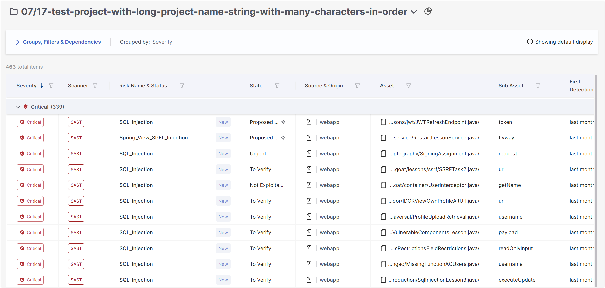
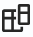
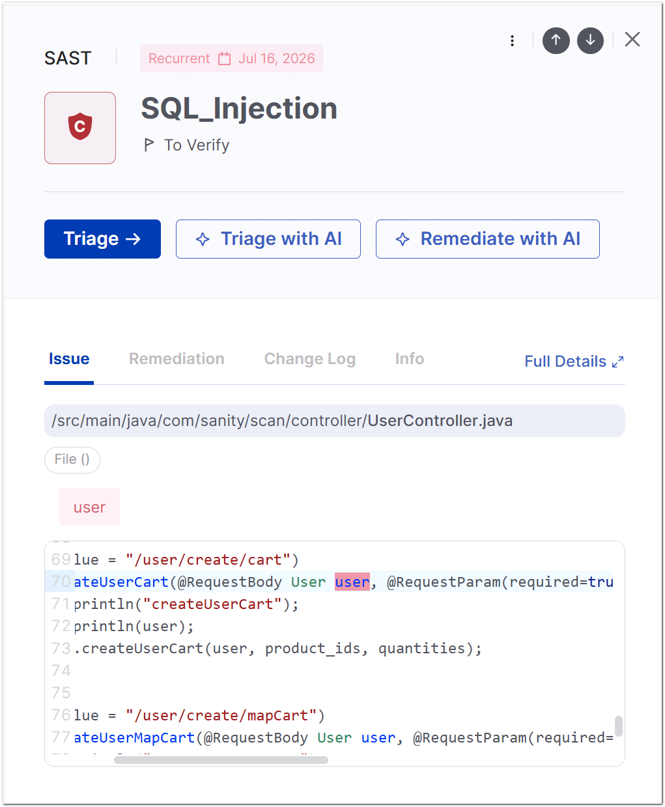
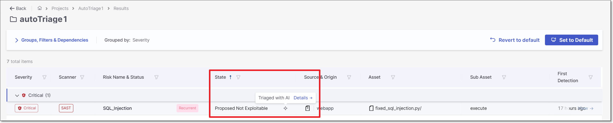
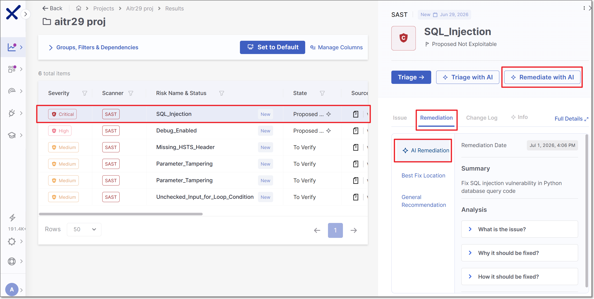

# Risk Orchestration

Risk Orchestration provides a unified view of all scan results across your security engines in a single, consolidated table. Instead of reviewing findings separately in each scanner, you can see everything in one place, organized by severity, and act on it without switching contexts.

Risk Orchestration is designed for everyone involved in application security:

- **Developers** can quickly locate and understand specific vulnerabilities in their code, review fix suggestions, and see exactly which file and line is affected.
- **AppSec managers** can monitor vulnerability trends across projects, track triage activity, and see who initiated each scan, helping identify whether development teams are reducing the vulnerabilities they introduce over time.
- **CISOs** can assess overall risk exposure at a glance, prioritize internet-facing assets, and have confidence that all scanner results are visible in one authoritative view.


If your account has an **AI Triage & Remediation (T&R)** license, this screen also surfaces AI-generated analysis and fixes at several points, called out below wherever they appear. See AI Triage & Remediation for full details on how the underlying AI agents work and how to configure automated runs.


## Accessing Risk Orchestration


In order to access the Risk Orchestration page, you need to have the following permissions: `view-projects`, `view-scans`, and `view-results`.


You can open Risk Orchestration from two entry points.

### From the ASPM menu

1. In the left navigation pane, go to **ASPM > Risk Orchestration**.
2. In the **Select a project** panel, search for or select a project.
3. Click **Load Project**.

### From the Projects page

1. In the left navigation pane, go to **Workspace > Projects**.
2. Locate the project you want to review. The **Scanner Results** column shows which engines ran on the project during the last scan. Color indicates severity: darker colors represent more critical findings.
3. Click anywhere on the project row to open Risk Orchestration for that project.


To open the project's overview page instead, click the project name directly.


## Reviewing Scan Results

<figure><figcaption></figcaption></figure>

The Risk Orchestration table displays all findings from the last scan, across all engines. By default, results are grouped by severity (Critical, High, Medium, Low, Info). Each group can be expanded or collapsed.

If the project is identified as publicly accessible, an Internet-Facing badge () is shown next to the project's name in this unified table, so you can quickly spot and prioritize publicly accessible projects when assessing risk. This badge is sourced from data provided by [Cloud Insights](https://docs.checkmarx.com/en/34965-231468-cloud-insights.html), so it's only available for accounts with a configured Cloud Insights integration.

Each row shows:

| Column | Description |
|---|---|
| **Severity** | The risk level of the finding |
| **Scanner** | Which engine detected it (SAST, SCA, or IaC) |
| **Risk Name & Status** | The vulnerability name and whether it is a new finding |
| **State** | The current triage state. **If your account has an AI T&R license and the state was set by AI Triage, an AI icon (◇) is shown next to it.** Hover over the icon for a link straight to the AI analysis details in the side panel — see AI Triage results below. |
| **Source & Origin** | The branch or reference from which the scan was triggered |
| **Asset** | The repository or resource where the vulnerability was found |
| **Sub Asset** | The specific file, function, or component within the asset |
| **First Detection** | When the vulnerability was first identified |

### Changing the grouping

1. Click **Groups, Filters & Dependencies** at the top of the table.
2. Under **Grouped by**, switch from **Severity** to **Scanner** (or another available option) to reorganize the table.

### Sorting and filtering

Every column supports sorting and filtering. Click the filter icon next to any column header to apply a filter. Use these controls to focus on specific scanners, severities, states, or assets.

### Managing columns

The Risk Orchestration table lets you customize which columns are displayed, in what order, and how they're used to filter and sort risk data.

Because each engine exposes a different set of attributes, shared columns remain consistent across all engines, while engine-specific columns are also available so you can drill into the context most relevant to a given risk type. This allows you to tailor the table to your team's workflow instead of working with a fixed, one-size-fits-all layout.

**To open the Columns Management panel:**

1. In the Risk Orchestration table, click the **Columns Management** icon () in the top-right corner of the table.
2. The **Columns Management** panel opens, listing all available columns.

In the **Columns Management** panel, each column has a toggle next to it.

- Toggle a column **on** to display it in the table.
- Toggle a column **off** to hide it from the table.

Some columns are pinned by default and cannot be hidden or reordered. Pinned columns are indicated by a pin icon. You can pin up to three columns at a time.

To change the order in which columns appear in the table, use the drag handle to the left of the column name to drag it up or down in the list.

Any visible column can be used to filter or sort the table.

After adjusting your columns do one of the following:

- To save your changes and update the table view, click **Apply**.
- To discard your changes and close the panel without applying them, click **Cancel**.

Your column preferences, including visibility, order, and pinned columns, are saved to your user profile and persist across sessions, so the table appears as you configured it the next time you access Risk Orchestration.

## Viewing Vulnerability Details

1. Click any row in the results table.
2. A side panel opens on the right, showing the vulnerability name, severity, scanner, and current state.

   <figure><figcaption></figcaption></figure>
3. Use the tabs in the panel to explore different aspects of the finding. To open the full details page, click **Full Details** in the top-right corner of the panel at any time.

Every vulnerability has a **Triage →** button in the side panel for manual triage (see Triaging a Vulnerability).


**If your account has an AI T&R license**, two additional buttons appear alongside Triage: **Triage with AI** and **Remediate with AI**. Clicking either runs the corresponding AI agent on the selected risk and consumes Checkmarx Credits. **These two buttons are currently only available for SAST risks** — on SCA or IaC findings you'll see the standard Triage button only. Each AI action populates results into the tabs described below.


### Issue

The **Issue** tab shows the precise location of the vulnerability in your code. It includes the full file path, the file type, and a syntax-highlighted code snippet with the affected line flagged.

For SAST findings, the Full Details view expands the Issue tab to show the complete Attack Vector - the end-to-end data flow from the tainted input to the vulnerable sink. The attack vector is represented as a sequential list of nodes (source node, intermediate propagation steps, and sink node), each linked to the corresponding line in the code. The **Best Fix Location (BFL)** - the point in the flow where the vulnerability is most efficiently remediated - is marked inline in the code view.

### Remediation

The **Remediation** tab provides remediation guidance tailored to the specific finding. It includes:

- **Found Value**: The exact condition or configuration detected that constitutes the vulnerability.
- **Expected Value**: The secure value, pattern, or configuration that should replace it.

For SCA findings, the tab also includes recommended package upgrades where a safer version is available.


**If your account has AI T&R license** an additional **AI Remediation** sidetab appears under this tab. Once AI Remediation has been run on the risk (via the **Remediate with AI** button above), this tab shows an expandable Analysis with three sections: What is the issue?, Why it should be fixed?, and How it should be fixed?

For GitHub Code Repository Integration projects, running AI Remediation also opens a pull request in GitHub containing the suggested fix — a link to it appears here. For other project types, the fix guidance shown in this tab is the full output; no pull request is created.


### Change Log

The **Change Log** tab provides a full audit trail of all triage activity on the vulnerability. Each entry includes:

- The **previous and new state** (e.g., To Verify → Proposed Not Exploitable)
- The **previous and new severity**, if it was changed
- Any **note** attached at the time of triage
- The **user** who performed the action
- The **date and time** the action was taken

If no triage actions have been taken, the tab displays "No data available."


State changes made by AI Triage appear here too, attributed to "AI Assist" rather than a specific user. Click **Show more** to view the reasoning behind the change.

For AI Triage changes, the user who triggered the triage—either manually or through automatic configuration—is also identified. A link to the AI Triage summary in the **Info** tab is also provided.


### Info

The Info tab is organized into three sections:

- **Vulnerability Details**: Technical metadata about the finding, including: Similarity ID, Source Node, Source File, Sink Node, and Sink File. For SCA findings, this section also includes: affected package name, manifest file, dependency type, risk score, exploitability rating, reachability, exploitability method, and exploitability path (where detected).
- **Description**: A plain-language explanation of the vulnerability class, why it represents a risk, and its potential impact.
- **About Your Scan**: Metadata about the scan that produced the finding, including the scan initiator. This information helps AppSec managers and CISOs track whether development teams are reducing the vulnerabilities they introduce over time.


**If your account has AI T&R license** an additional **AI Triage** option appears at the tob of this tab. Once AI Triage has been run on the risk, this tab shows a summary of the risk assessment as well as an Analysis section with AI's determination of whether or not the vulnerability is Reachable and/or Exploitable.


## Triaging a Vulnerability

Triaging lets you update the state and severity of a vulnerability and attach a note for your team. You can triage directly from the side panel without losing your place in the results table.

1. Click a row to open the side panel.
2. Click **Triage →**.
3. In the **Triage Result** panel, update the **State** using the dropdown.
4. Optionally, adjust the **Severity**.
5. To add a note, check **Attach Note** and type your comment in the text field.
6. Click **Save**.

The results table updates immediately to reflect the new state. The vulnerability row remains selected so you can continue reviewing without losing context. The triage action and any note you added are recorded in the **Change Log**.

## Running AI Triage and Remediation from This Screen


This section applies only to accounts with an **AI Triage & Remediation** license.


You can run AI analysis directly on a selected risk without leaving Risk Orchestration:

1. Click on a row to open the side panel.
2. Click **Triage with AI** to have the AI agent assess Reachability and Exploitability and, where justified, automatically update the State. Results appear in the Info tab's AI Triage section and in the Change Log.
3. Click **Remediate with AI** to generate a suggested code fix. Results appear in the Remediation tab. For GitHub Code Repository Integration projects, this also creates a pull request.

Each run consumes Checkmarx Credits; re-running on an already-triaged identical result does not consume additional credits. See Monitoring Checkmarx Credit Consumption for details, and AI Triage & Remediation for automated (non-manual) ways to trigger these agents, such as on scan completion or via GitHub pull requests.

## Viewing AI Triage & Remediation Results


This section applies only to accounts with an **AI Triage & Remediation** license.


Once an AI action has run on a risk in this project - whether manually from this screen or via automatic configuration - its outputs surface in the same places you'd look for any other triage or remediation info:

- **Results table**: an AI icon (◇) in the State column marks AI-driven state changes.

  <figure><figcaption></figcaption></figure>
- **Info tab**: an AI Triage section with the summary and Reachability/Exploitability analysis.

  <figure><figcaption></figcaption></figure>
- **Remediation tab**: the suggested fix, with a linked pull request for GitHub-integrated projects.

  
- **Change Log**: an audit entry attributed to AI Assist that identifies the user who triggered the AI Triage and provides a link to the AI Triage section in the info tab.

  <figure><figcaption></figcaption></figure>

For an organization-wide view of AI Triage & Remediation activity — total triages/remediations run, unique developers, estimated time saved — see the AI Triage & Remediation Dashboard in Analytics.
