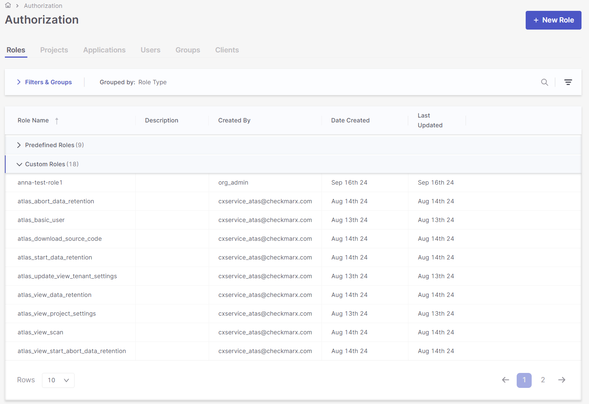
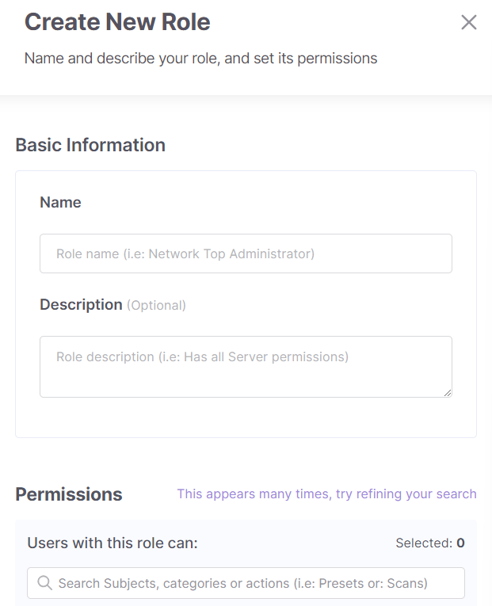
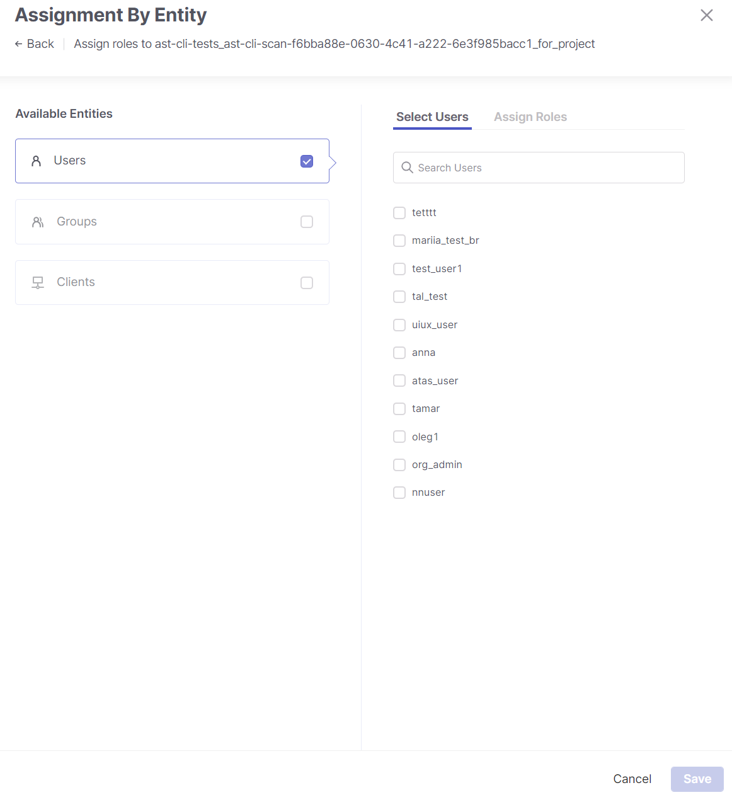
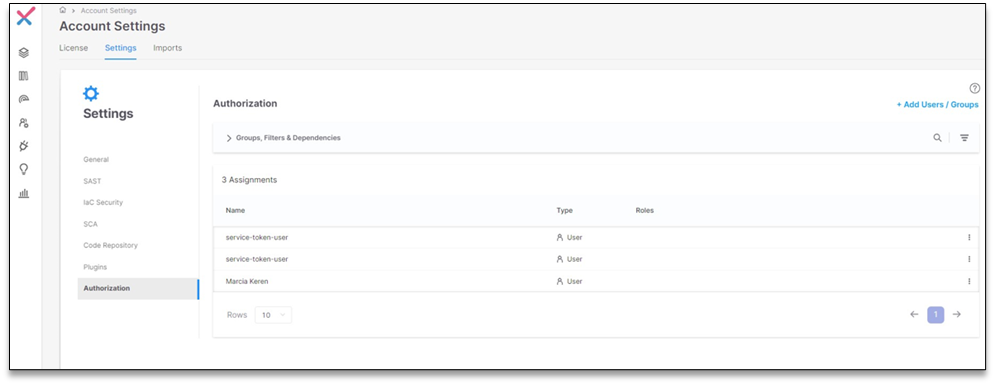
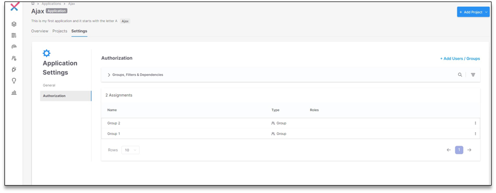
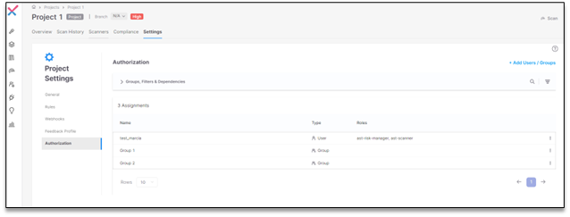

# Understanding the Authorization Page


The **manage_access** permission is required to view and use this page.


The Authorization page lets you view and manage your Access Management system. It has six tabs, each with a table view; in each table, you create, modify, and assign entities and resources to each other. Selecting a tab will change your table view to the tab you selected. The tables are searchable and customizable and can be filtered, sorted, and organized to best suit your needs.

<figure><figcaption></figcaption></figure>

## Customizing Your Table View

To filter, hover over a column header, click the filtering icon, and select your filter(s) from the dropdown list or search. Applied filters and groups are listed in the **Filters** **& Groups** bar.

To sort, hover over a column header and click the sorting icon to toggle between sorting in ascending or descending order.

Irrespective of your tab and table view, you may always create a new role by clicking **+New Role**. This opens a side panel where you can fill out the name and description of your new role and select all the permissions you wish to apply. Permissions are organized by feature and are searchable. Remember to **Save** when done.

<figure><figcaption></figcaption></figure>

**Roles:** The **Roles** tab displays a table that lists the roles, their descriptions, creator, creation date, and last updated date. The table's default setting displays 50 rows of results per page, as indicated in the **Rows** dropdown. Select the dropdown to toggle the view to 10, 25, or 100 rows.

There are two types of roles in the **Role Name** column: **Predefined Roles**, which are out-of-the-box roles, and **Custom Roles**, which are roles you or other users created. You may only view or duplicate predefined roles. Duplicating a role creates a copy of the role you can edit to your needs. Custom roles can be viewed, edited, duplicated, and deleted.


Predefined roles cannot be deleted or edited.


At the end of a role’s row, hover and click **View** to open a side panel to view or edit the role’s name, description, and permissions. Clicking **Duplicate** will open a similar side panel to edit your new role. Use the search to find permissions easier. By **Custom Roles**, you can also hover and click **Edit** to open a side panel to edit the role or **Delete** to delete it. While every user can see the existing roles, users with the **manage-roles** permission can create/edit/delete custom roles.

**Projects:** The **Projects** tab displays a table that lists the projects, their tags, and assignments. The table's default setting displays 100 rows of results per page, as indicated in the **Rows** dropdown. Select the dropdown to toggle the view to 25 or 50 rows.


- If you are assigned to the tenant and have the **view-assignments** permission, you can view assignments for all projects.
- If you are assigned to at least one project and have the **view-assignments** permission, you can view assignments for those projects.
- If you are assigned to at least one project and have the **update-assignments** permission, you can edit assignments for those projects.


Hover and click **Edit** at the end of a project row to open a side panel that lists its assignments: assigned entities, the entity type, and their overridden roles. Marking an entity’s checkbox allows you to add or update roles by clicking on their respective dropdowns or remove the entity from the project by clicking the delete icon. Updating roles replaces all assigned roles with ones marked in the dropdown. Hover and click the end of an entity’s row to edit the entity’s assigned roles or remove the entity from the project.

**+Add Assignment** opens a side panel for mapping entities and roles to the project. You can mark multiple entities and map multiple clients and assigned roles simultaneously. Remember to save when you are done.

<figure><figcaption></figcaption></figure>

**Applications:** The **Applications** tab displays a table that lists the applications, their associated projects, tags, and assignments. The table's default setting displays 100 rows of results per page, as indicated in the **Rows** dropdown. Select the dropdown to toggle the view to 25 or 50 rows.


- If you are assigned to the tenant and have the **view-assignments** permission, you can view assignments for all applications. Similarly, if you are assigned to the tenant and have the **update-assignments** permission, you can update assignments for all applications.
- If you are assigned to at least one application and have the **view-assignments** permission, you can edit assignments for the allowed applications and their assigned projects.
- If you are assigned to at least one application and have the **update-assignments** permission, you can edit assignments for the allowed applications and their assigned projects.


Hover and click **Edit** at the end of a project row to open a side panel listing its assignments, associated entities, entity type, and roles. Marking an entity’s checkbox allows you to add or update roles by clicking on their respective dropdowns or remove the entity from the project by clicking the delete icon. Updating roles replaces all assigned roles with ones marked in the dropdown. Hover and click the end of an entity’s row to edit the entity’s assigned roles or remove the entity from the project.

**+Add Assignment** opens a side panel for mapping entities and roles to the application. You can mark multiple entities and map multiple clients and assigned roles simultaneously. Remember to save when you are done.

**Users:** The **Users** tab displays a table that lists the users, their base roles, and assignments. The table's default setting displays 100 rows of results per page, as indicated in the **Rows** dropdown. Select the dropdown to toggle the view to 10, 25, or 50 rows.


- To view the users, you need the **view-users-authorization** permission on the base-role.
- You can create user assignments with the **update-assignments** permission for at least one resource.


Hover and click **Edit** at the end of a user’s row to open a side panel listing its assignments, associated entities, entity type, and roles. Marking an entity’s checkbox allows you to add or update roles by clicking on their respective dropdowns or remove the entity from the project by clicking the delete icon. Updating roles replaces all assigned roles with ones marked in the dropdown. Hover and click the end of an entity’s row to edit the entity’s assigned roles or remove the entity from the project.

**Groups:** The **Groups** tab displays a table that lists the groups, their base roles, and assignments. The table's default setting displays 100 rows of results per page, as indicated in the **Rows** dropdown. Select the dropdown to toggle the view to 10, 25, or 50 rows.


- To view the groups, you need the **view-groups-authorization** permission on the base-role.
- You can create group assignments with the **update-assignments** permission for at least one resource.


Hover and click **Edit** at the end of a group’s row to open a side panel listing its assignments, associated entities, entity type, and roles. Marking an entity’s checkbox allows you to add or update roles by clicking on their respective dropdowns or remove the entity from the project by clicking the delete icon. Updating roles replaces all assigned roles with ones marked in the dropdown. Hover and click the end of an entity’s row to edit the entity’s assigned roles or remove the entity from the project.

**Clients:** The **Clients** tab displays a table that lists the clients, their base roles, and assignments.


- You need the **view-clients-authorization** permission on the base role to view the OAuth clients.
- You can create assignments for OAuth clients with the **update-assignments** permission for at least one resource.


Hover and click **Edit** at the end of a client’s row to open a side panel listing its assignments, associated entities, entity type, and roles. Marking an entity’s checkbox allows you to add or update roles by clicking on their respective dropdowns or remove the entity from the project by clicking the delete icon. Updating roles replaces all assigned roles with ones marked in the dropdown. Hover and click the end of an entity’s row to edit the entity’s assigned roles or remove the entity from the project.

## Resource levels

The revamped Access Management involves associating users, groups, and clients with various resources and determining their hierarchical access levels within the system. Three resource levels are introduced: Tenant, Application, and Project. A user with `manage-access` permissions can link users, groups, and clients to various levels based on their access levels.


In each **Settings** window shown below, the **Roles** column in the **Authorization** tab displays the roles assigned in the IAM module.


- **Tenant Level:** Users assigned at the tenant level obtain access to all system components. Assigning users at the Tenant Level is done in the **Account Settings** section.

<figure><figcaption></figcaption></figure>

- **Application Level:** In **Application Settings**, users, groups, and clients can be added to the application level. Users assigned at the application level gain access to all projects associated with that application.

<figure><figcaption></figcaption></figure>

- **Project Level:** Under **Project Settings**, users, groups, and clients can be added to the project level. Users assigned at the project level have access only to the specified project.

<figure><figcaption></figcaption></figure>
