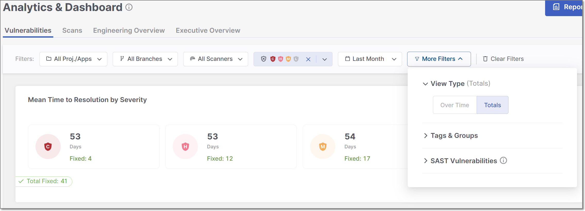
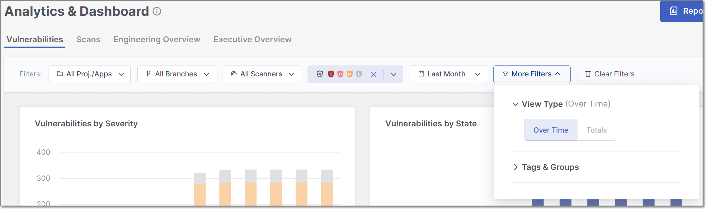
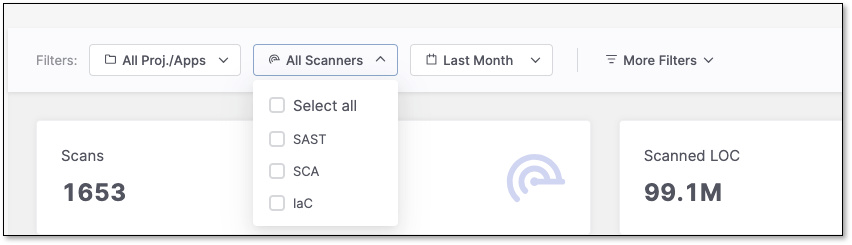
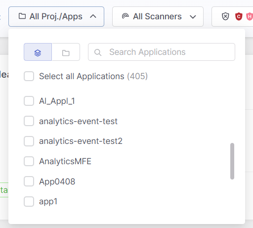
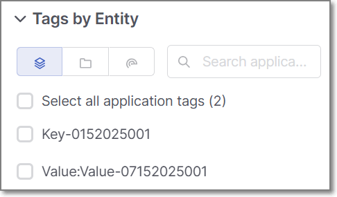
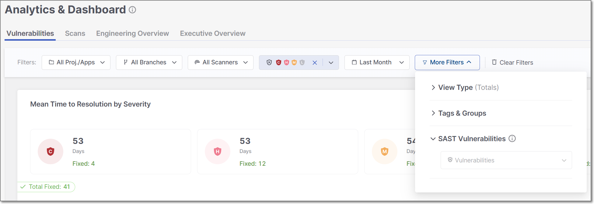

# Analytics

## Overview

The Analytics module is a tool for executives and AppSec administrators, providing valuable and actionable insights into their data in Checkmarx One. With the ability to switch between Totals and Over Time view modes, users can clearly understand their application security landscape. Whether analyzing Scans or Vulnerabilities, this module offers various informative charts for better decision-making.

Vulnerabilities KPIs offer actionable insights, allowing users to directly access vulnerability details with one click. This feature speeds up remediation, reduces exposure, and bridges the gap between AppSec and development teams.

To help you with data analysis, the module also features a flexible tag filtering system.

The Analytics module is a user-friendly tool for making informed decisions, enhancing security practices, and optimizing your organization's application security posture.

### Limitations

- Data is only available for the previous year.

### Permissions

To execute various actions in the Analytics feature, a user needs to be assigned one of the following permissions:

- **analytics-reports-admin** - View all analytics dashboards and reports.
- **analytics-scan-dashboard-view** - View scan dashboard.
- **analytics-vulnerability-dashboard-view** - View vulnerability dashboard.
- **analytics-executive-overview-view** - View executive overview dashboard.
- **manage-reports** - Export, share the dashboard, and generate a report.

### Focus on Production Branches

Analytics and vulnerability dashboards filter data to show only production branches to exclude non-production noise. The definition of production branches uses the following logic:

- **Primary Branch Configuration**: The branch marked as primary on the project overview page is prioritized for analysis.
- **Protected Branches**: Any branches explicitly marked as protected during the integration setup are also included.
- **Naming Convention**: Branches with the following names are included by default: `main`, `master`, `dev`, `Develop`, `Development`, or `Merge`.

#### FAQ

How can I configure the primary branch settings?

Go to **Project Settings** in Checkmarx One and select the desired branch as primary. The system will then prioritize this branch in Analytics views upon the next scan.

What happens if a branch is no longer the primary/protected branch?

Scans performed while the branch was set as the primary branch or as a protected branch will continue to be displayed in Analytics.

What happens if a new branch is set as the primary branch?

Future scans performed on the new primary branch will be displayed in Analytics. Future scans from the previous primary branch will no longer appear (unless that branch is otherwise designated as a protected branch).

## Dashboards

The Analytics module includes five dashboards, each highlighting a different aspect of your organization’s security data:

- **Vulnerabilities** — Detailed visibility into identified vulnerabilities, their distribution, and remediation status.
- **Scans** — Overview of scan activity, coverage, and scanner usage patterns.
- **Engineering Overview** — Security metrics organized by engineering structures such as projects, applications, environments. tags, and teams.
- **Executive Overview** — High-level portfolio health, risk trends, and top vulnerable applications and projects.
- **AI Assist Usage** - Visibility into how developers use Checkmarx Developer Assist IDE plugins for AI remediation during development.

Together, these dashboards provide a comprehensive view of your security posture from multiple perspectives.

### View Types

In the **Vulnerabilities**, **Scans** and **AI Assist Usage** tabs of the Analytics module, users can choose between two modes of data presentation: **Totals** view type and **Over Time** view type. These modes serve different analytical purposes and allow for a more comprehensive understanding of your data.

In both view types, data is displayed across multiple widgets, each with its own unique properties. Each view type includes a distinct set of widgets. Refer to the documentation for each Analytics tab (**Vulnerabilities,** **Scans** and **AI Assist Usage**) for a detailed explanation of the widgets available in each view.


The Analytics charts show data starting from December 19 onward. No data from before this date is available.


#### Totals view type

In the Totals view type, data is aggregated to provide a snapshot of the cumulative or aggregate statistics. This mode is ideal for assessing your applications and projects' overall performance and security status without considering specific time intervals.

<figure><figcaption></figcaption></figure>

It's useful for gaining insights into the current state of your data, such as the total number of successful and failed scans, lines of code, and projects. This mode offers a general view of your security posture.

#### Over Time view type

The Over Time view type, on the other hand, focuses on tracking and visualizing how your data security evolves across specific time intervals. It's designed to help you monitor trends, patterns, and changes in your security landscape.

<figure><figcaption></figcaption></figure>

This mode is particularly useful for identifying shifts in your program's effectiveness, understanding the impact of security improvements or practice changes, and planning for future security initiatives. You can set custom date ranges to see how metrics have changed over time, which is essential for trend analysis.

Switching between these two view types provides a well-rounded perspective of your data. For instance, you can use Totals to see the total number of failed scans across all projects and then switch to Over Time to track whether the frequency of failed scans has decreased or increased over the past year, helping you set priorities for ongoing security efforts.

## Filtering

The Analytics module offers advanced data filtering options, allowing users to customize their analysis to specific criteria. The available filters can be accessed directly at the top of the table. Some additional filters can be accessed from the drop-down menu at the top-right corner.

<figure><figcaption></figcaption></figure>

The following logic is applied to filtering:

- The filter will not be applied if no values are selected or entered for a particular attribute.
- Within a single filter, selected values are combined using an OR operator. For instance, if you choose the values `SAST` and `SCA` for the **Scanners** filter, Checkmarx One will display issues associated with SAST or SCA scanners.
- Different filters are combined using an AND operator. For example, if you select `SAST` for the **Scanners** filter and a specific project for the **Projects/Apps** filter, Checkmarx One will only display issues that match both criteria: `SAST` scanner and the selected project.

Specific filters are described below.

### Resources

This filter allows you to toggle between viewing Projects, Applications or Environments, and searching for specific project, application or environment names in the selected category.

<figure><figcaption></figcaption></figure>

### Branches

This filter lets you narrow your analysis to data of a specific branch, e.g. `main`, `dev`.

### Scanners

This filter lets you narrow your analysis to data generated by specific scanners. By selecting particular scanners, you can assess their performance and effectiveness in identifying vulnerabilities and securing your applications.

### States

Within the **Vulnerabilities,** **Engineering Overview**, and **Executive Overview** tabs, users can filter all widgets and tables to show only data for selected states, including custom states. By *default*, the tables are filtered to show four states: To Verify, Not Exploitable, Proposed Not Exploitable and Confirmed.


The states mentioned above are pre-configured for all Checkmarx One accounts. In addition, you can create custom states in your account. Once they are created, you can assign those custom states to results. Custom states are currently supported for SAST, SCA, IaC Security and Container Security. This feature is only available for accounts that have the New Access Management (Phase 1) activated. For more info see [Custom States](../managing-triaging-vulnerabilities/README.md#custom-states).


### Severity

Within the **Vulnerabilities** and **Engineering Overview** tabs, users can filter all widgets and tables to show only data for selected severity levels.

### Time Range

Users can define custom date ranges to analyze data within specific timeframes, such as daily, weekly, monthly, or annually. You can also define exact start and end dates using a classic date picker. This filter is particularly useful for identifying trends and evaluating the impact of changes in security practices over time.

### Tags by Entity

This filter lets you refine results using tags from **Projects**, **Applications**, and **Scans**.

Select an entity icon to view and choose from its available tags:

<figure><figcaption></figcaption></figure>

- **Within a category**: Multiple selected tags use **OR logic** (results match *any* selected tag).
- **Across categories**: Selections use **AND logic** (results must match *at least one tag in each selected category*).

**Example:** Selecting multiple Application and Project tags returns results that match any chosen Application tag **and** any chosen Project tag.


When creating a scan, you can assign tags at the time the scan is created.

Analytics dashboards take into account **only the scan tags that were applied at the time the scan ran**. Tags added or modified after the scan has completed are not reflected in dashboard data.

This limitation does **not** apply to application or project tags, which are always reflected in analytics dashboards regardless of when they are added or updated.


### Groups

Filter and categorize data using the groups associated with a specific project or application.

### SAST Vulnerabilities

This filtering option is available only in the **Vulnerabilities** tab. It allows you to select a specific vulnerability by name from a dropdown list.

<figure><figcaption></figcaption></figure>

Filtering by SAST vulnerabilities impacts two widgets: the "Top 20 Vulnerabilities" and the "Top 20 Oldest Vulnerabilities." The data displayed in these widgets will be adjusted according to the selected vulnerability.

## In this section

- [Vulnerabilities Dashboard](vulnerabilities-dashboard.md)
- [Scans Dashboard](scans-dashboard.md)
- [Engineering Overview Dashboard](engineering-overview-dashboard.md)
- [Executive Overview Dashboard](executive-overview-dashboard.md)
- [AI Assist Usage Dashboards](ai-assist-usage-dashboards.md)
