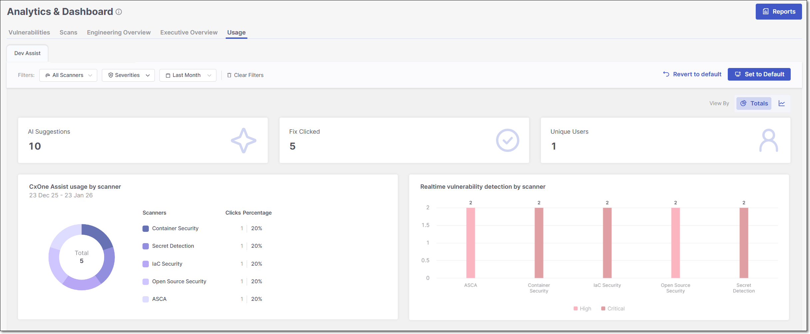
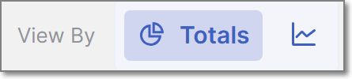

# AI Assist Usage Dashboards

## Dev Assist Dashboard

The **Dev Assist** dashboard provides visibility into how developers use Checkmarx Developer Assist IDE plugins during development. The metrics show the volume of AI-generated remediation suggestions, how often fixes are generated, and real-time vulnerability detection activity. It helps teams understand adoption, usage patterns, and the impact of Checkmarx Assist and Realtime Scanners over time.

The **Dev Assist** dashboard can be viewed in two different modes: **Over Time** view type and **Totals** view type. To toggle between the two views, click on the **View By** icons at the top right of the page.

<figure><figcaption></figcaption></figure>


For a broader explanation of the advantages and purpose of each view type, refer to the documentation on Data presentation modes.


### Filtering

The **Dev Assist** dashboard offers advanced data filtering options, allowing users to customize their analysis to specific criteria. The available filters can be accessed directly at the top of the table.

For a detailed description of each filter, see [Filtering](README.md#filtering)

Below is a list of available filters for this dashboard:

- **Scanners**
- **Severity** - *Default:* Critical, High and Medium.
- **Time Range** - *Default:* Last Month.

### Dashboard Widgets

At the top of the **Dev Assist** dashboard, three summary widgets are consistently displayed across all view types - **AI Suggestions**, **Fix Clicked**, and **Unique Users**, . The remaining widgets, **CxOne Assist Usage by scanner** and **Realtime vulnerability detection by scanner**, vary depending on whether the dashboard is set to the Over Time view or the Totals view, allowing you to explore different perspectives of the scan data.

Below is a breakdown of the different widgets with their descriptions.

#### Dashboard Widgets

- **AI Suggestions:** shows the total number of AI-generated remediation recommendations surfaced to developers.
- **Fix Clicked:** shows how many times developers actively clicked on the **Fix with Checkmarx One Assist** button to get an AI generated fix.
- **Unique Users:** shows the number of distinct users who used the Developer Assist IDE plugins.
- **CxOne Assist Usage**

  In **Totals** view: shows how often developers clicked AI-generated fixes, broken down by scanner type and displayed as a donut chart with percentages representing each scanner’s share of total usage.

  In **Over Time** view: shows how often developers clicked AI-generated fixes over the selected period, broken down by scanner type and displayed as a time-based trend to illustrate usage patterns over time.

  
  Supported scanners: **IaC Security**, **Container Security**, **ASCA** and **Open Source Security**.
  
- **Realtime Vulnerability Detection**

  In **Totals** view: shows the total number of vulnerabilities detected by Checkmarx Realtime Scanners while developers code in the IDE, aggregated by severity for the selected period.

  In **Over Time** view: shows when vulnerabilities were detected by Checkmarx Realtime Scanners over the selected period, with separate trend lines for each severity level.

  
  Supported scanners: **IaC Security**, **Container Security**, **ASCA** and **Open Source Security**.
  

## AI Triage and Remediation Dashboard

<figure><figcaption></figcaption></figure>

The **AI Triage and Remediation** dashboard provides an overview of how AI Triage & Remediation is being used across your organization. It includes high-level **impact** metrics such as the number of AI triages and remediations performed, unique developers using the feature, and estimated developer time saved. The dashboard also displays **activity** trends over time and provides **insight** into adoption patterns, triage outcomes, remediation results, and project usage. Use the filters at the top of the page to view analytics for specific resources, branches, scanners, time periods, or other criteria.

### Filtering

The **AI Triage and Remediation** dashboard offers advanced data filtering options, allowing users to customize their analysis to specific criteria. The available filters can be accessed directly at the top of the table.

For a detailed description of each filter, see [Filtering](README.md#filtering)

Below is a list of available filters for this dashboard:

- **Resources**
- **Branches**
- **Scanners**
- **Time Range** - *Default:* Last Month.
- **Tags by Entity**
- **Groups**

### Dashboard Widgets

The **AI Triage and Remediation** dashboard is organized into three sections: **Impact**, **Activity** and **Insight**. Each section highlights a different aspect of AI Triage and Remediation usage and results. The following sections describe the widgets in each area and explain the metrics they display.

#### Impact

The **Impact** section summarizes how AI Triage & Remediation has been used across your organization and estimates the productivity benefits it has delivered. It shows the total number of AI-assisted triage and remediation actions, how those actions were initiated, how many developers have used the capability, and the estimated amount of developer time saved.

- **Total AI Triages**: Displays the total number of AI triage operations performed. The breakdown below the total shows how many triages were initiated by users versus performed automatically by Auto-Triage, along with the percentage each represents.
- **Total AI Remediations**: Displays the total number of AI-generated remediations performed. The breakdown indicates whether remediations were initiated by users or performed automatically through Auto-Remediation, together with the percentage of each.
- **Unique Developers**: Displays the number of distinct developers who used AI Triage or AI Remediation. Each developer is counted only once, regardless of how many actions they performed.
- **Developer Time Saved**: Estimates the total amount of developer time saved by using AI Triage and AI Remediation. The estimate is calculated using average processing times of 30 minutes per vulnerability triage and 60 minutes per vulnerability remediation, and is intended to provide an approximation of the productivity gains achieved through AI-assisted workflows.

#### Activity

The **Activity** section shows how AI Triage & Remediation is being used over time and provides key effectiveness metrics. It displays activity trends for AI triage and remediation operations, along with measurements of remediation acceptance and developer engagement.

- **Number of Triages and Remediations**: Displays the number of AI triage and AI remediation operations performed over the selected time period. The line chart shows activity trends over time, allowing you to identify periods of increased or decreased AI usage and compare the volume of triage and remediation actions.
- **Accuracy**: Displays the percentage of AI-generated remediation suggestions that were accepted by developers. This metric provides an indication of how often AI remediation recommendations are considered suitable without requiring an alternative solution.
- **Engagement**: Displays the percentage of pull requests in which developers interacted with AI triage or AI remediation suggestions. This metric helps measure adoption of AI-assisted workflows within the development process.

#### Insight

The **Insight** section provides a deeper analysis of AI Triage & Remediation activity. It highlights the projects making the greatest use of AI capabilities and summarizes the outcomes of AI-generated triage and remediation actions, helping you understand where AI is delivering the most value.

- **Top Projects by AI Triage / AI Remediation**: Displays the projects with the highest number of AI triage or AI remediation operations during the selected time period. Use the AI Triage and AI Remediation tabs to switch between rankings based on the selected activity.
- **AI Triages**: Displays the outcome of AI triage operations. The chart shows the total number of AI triages and the percentage that resulted in each triage decision.

  *Confirmed* – Vulnerabilities confirmed as valid findings.

  *PNE* – Vulnerabilities marked as Proposed Not Exploitable (PNE), indicating that AI determined they are not exploitable in the application's context.
- **AI Remediations**: Displays the outcome of AI remediation operations. The chart shows how AI-generated remediation suggestions progressed through the pull request workflow.

  *PR Created* – AI remediation generated a pull request.

  *PR Merged* – The generated pull request was successfully merged into the target branch.
