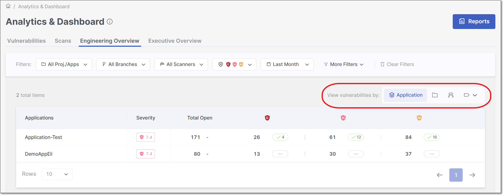

# Engineering Overview Dashboard

## Overview

The **Engineering Overview Dashboard** in the **Analytics** module offers a powerful, flexible view of engineering insights, allowing users to analyze data grouped in multiple ways and prioritized by severity. This guide explains how to navigate and use the dashboard effectively.

The dashboard presents data in a **paginated table that is prioritized by severity level**, ensuring that assets with the most severe open vulnerabilities are always displayed first. This makes it easier to focus remediation efforts on the areas that matter most.

To align with real-world organizational structures, the dashboard allows you to analyze vulnerabilities from multiple perspectives. You can group and review data by **application, project, environement, tags**, or **groups**, enabling flexible analysis across teams and projects. If you have a DAST scanner, there is

### Data Inclusion Rules

- The dashboard displays data **based on the latest available scan for each project** within the selected filter criteria.
- Projects without scans in the selected time range, branch, scanner, or project/application filter are excluded from the results.
- Projects that have scans but no detected vulnerabilities are displayed with zero results.

### Asset Grouping

The **Engineering Overview Dashboard** allows you to group vulnerabilities in multiple ways, enabling you to analyze risk from different organizational and technical perspectives.

You can switch between grouping types using the **View vulnerabilities by** selection at the top of the dashboard. Each grouping determines how vulnerabilities are aggregated and displayed in the table.


The dashboard remembers the **last selected grouping**, ensuring that the same view is preserved the next time the dashboard is opened.


The following grouping options are available:

**By Application: **

Groups vulnerabilities by application, aggregating the latest open vulnerabilities across all projects associated with each application. This view helps assess application-level risk and compare security posture across applications.

**By Project:**

Displays vulnerabilities organized by individual projects. This view is useful for understanding risk at a more granular, project-specific level.

**By Environment:**

Displays vulnerabilities by environment.

**By AM (Access Management) Groups: **

Displays vulnerabilities grouped by organizational groups associated with projects, such as teams or departments. If a project is associated with multiple groups, its vulnerabilities are reflected under each relevant group.

**By Project Tags: **

Groups data by project tags. Vulnerabilities from all projects associated with the same tag are aggregated and displayed together. If a tag is associated with multiple projects, vulnerabilities from all of those projects are included under that tag.

**By Application Tags: **

Groups data by application tags. The dashboard aggregates vulnerabilities from all applications associated with each tag and presents them as a single view. This enables analysis across logical groupings of applications, such as business units or platforms.

**By Environment Tags: **

Groups data by environment tags. The dashboard aggregates vulnerabilities from all environments associated with each tag and presents them as a single view.

### Filtering

The **Engineering Overview Dashboard** offers advanced data filtering options, allowing users to customize their analysis to specific criteria. The available filters can be accessed directly at the top of the table. Some additional filters can be accessed from the drop-down menu at the top-right corner.

For a detailed description of each filter, see [Filtering](README.md#filtering)

Below is a list of available filters for this dashboard:

- **Resource**
- **Branches**
- **Scanners**
- **States**
- **Severity**
- **Time Range**
- **Tags by Entity**
- **Groups**

#### Context-aware Filtering

The Engineering Overview Dashboard uses **context-aware filtering** to automatically adjust and expand the displayed data based on your selections. This behavior helps ensure that the results shown are relevant and consistent across related entities.

When a filter is applied, the dashboard dynamically updates the view to include related assets, allowing you to understand how vulnerabilities are distributed across applications, projects, tags, and groups.

## Metrics and Data Display

The dashboard presents a tabular view with paginated rows (10, 20 or 50 rows), showing one row per asset (based on your selected grouping). Rows are ordered by severity, with assets containing the most severe open vulnerabilities displayed first.

Below is a table describing the various columns in each row.

| **Item** | **Description** |
|---|---|
| **Asset Name** | The name of the Project, Application, Environment, Tag or Group. |
| **Severity** | Displays the Application risk score (only for Application grouping). |
| **Total Open** | Total number of open vulnerabilities. Includes trend indicators, comparing the number of open vulnerabilities in the current selected period with the same length of time immediately before it. • **Green arrow and percentage**: A decrease in open vulnerabilities. • **Red arrow and percentage**: An increase in open vulnerabilities. These indicators help you quickly understand whether the situation is improving or getting worse, and are consistent with those used in the [Top Vulnerable Applications](executive-overview-dashboard.md#top-20-vulnerable-resources) KPI. |
| **Open Vulnerabilities** | Count of open vulnerabilities, by severity: *Default* displays Critical, High and Low, You can modify this using the global severity filter. If there are fixed vulnerabilitirs, a green pill square with the number of fixed vulnerabilities is displayed. |
