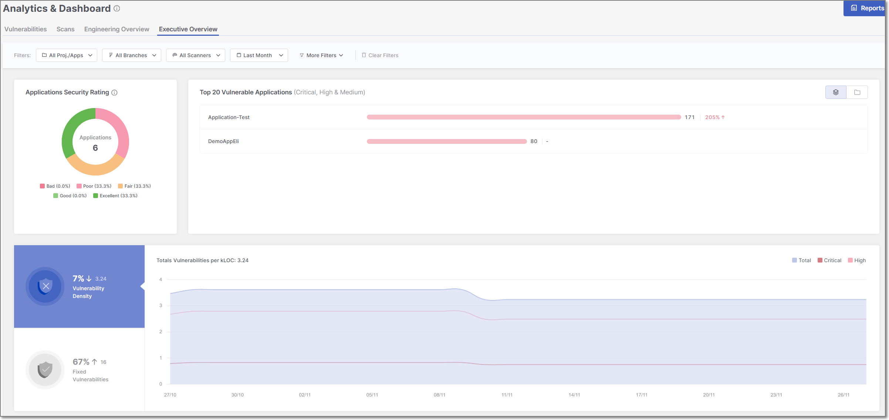
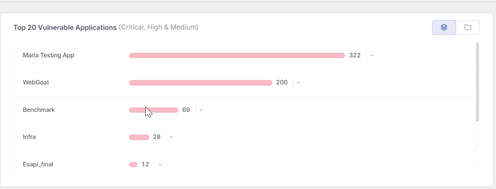

# Executive Overview Dashboard

## Overview

The **Executive Overview** dashboard offers a holistic view of an organization's application security portfolio, empowering executives to make informed decisions.

### Filtering

The **Executive Overview** dashboard offers advanced data filtering options, allowing users to customize their analysis to specific criteria. The available filters can be accessed directly at the top of the table. Some additional filters can be accessed from the drop-down menu at the top-right corner.

For a detailed description of each filter, see [Filtering](README.md#filtering)

Below is a list of available filters for this dashboard:

- **Resources**
- **Branches**
- **Scanners**
- **States**
- **Time Range**
- **Tags**

  
  When creating a scan, you can assign tags at the time the scan is created.

  Analytics dashboards take into account **only the scan tags that were applied at the time the scan ran**. Tags added or modified after the scan has completed are not reflected in dashboard data.

  This limitation does **not** apply to application or project tags, which are always reflected in analytics dashboards regardless of when they are added or updated.
  
- **Groups**

## Dashboard Widgets

The Executive Overview dashboard displays three data widgets - **Application Security Rating**, **Top 20 Vulnerable Resources**, and **Vulnerability Density Over Time**. Below is a description of the different widgets:

### Applications Security Rating

The Applications Security Rating provides an overview of the overall health of the application portfolio.

The widget is synchronized automatically on an hourly schedule; therefore, changes made within your applications will not be reflected in the widget data until the next synchronization cycle.

The following approach is applied to determine the Rating score:

| Score | Explanation |
|---|---|
| **Bad** | • Applications with at least one project containing a Critical severity issue. • Applications where more than 50% of projects have at least one High severity issue. |
| **Poor** | Applications where more than 25% of projects have at least one High severity issue. |
| **Fair** | Applications in which more than 0% and up to 5% of projects have at least one High severity issue. |
| **Good** | Applications with no Critical or High severity issues in any project. |
| **Excellent** | Applications with no Critical, High, or Medium severity issues in any project. |

### Top 20 Vulnerable Resources

This widget displays the top 20 most vulnerable resources, where *resources* refers to applications, projects, and environments. The list always represents a **single resource type**, not a combination. Use the buttons in the top-right corner to switch views.

This list is instrumental in prioritizing security efforts, focusing on applications that urgently require attention due to their current vulnerability status.

In addition, recent changes in the health of each resource are indicated at the end of each bar, enabling managers to track progress in mitigating associated risk factors.

<figure><figcaption></figcaption></figure>

### Vulnerabilitie Density Over Time

This widget provides a time-based view of vulnerability trends across your resources using *vulnerability density*, which measures the number of vulnerabilities per thousand lines of code.


This widget includes only **Critical** and **High** severity vulnerabilities. **Medium**, **Low**, and **Info** severity vulnerabilities are not included in the graph or the summary metrics.


The widget is divided into three sections:

#### Main Graph (Right Section)

The large section on the right displays a graph of vulnerability density over time across all applications. When dashboard filters are applied, the graph reflects only the resources that match those filters.

Each severity level is represented by a separate line. The x-axis displays one data point per time interval based on the selected date range—for example, selecting **Last year** shows twelve points (one per month), while selecting **Last week** shows seven points (one per day).

#### Vulnerability Density Change (Top-Left Section)

The top-left section summarizes how vulnerability density has changed over the selected time range.

The displayed percentage reflects the relative change between the start and end of the selected period. A positive percentage indicates an increase in vulnerability density, while a negative percentage indicates a decrease.

#### Fixed Vulnerabilities (Bottom-Left Section)

The bottom-left section displays the total number of vulnerabilities fixed during the selected time range. This metric highlights remediation activity and updates according to the dashboard filters applied.
