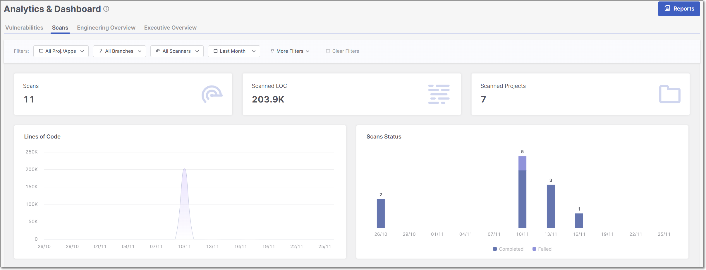

# Scans Dashboard

## Overview

In the **Scans** dashboard, you can explore such metrics as the total number of scans (**Scans**), lines of code (**Scanned LOC**), the total number of scanned projects (**Scanned Projects**), the total number of developers and scans for each tool or IDE (**IDE Usage Over Time**), etc.

The **Scans** dashboard can be viewed in two different modes: **Over Time** view type and **Totals** view type. Each of these view types serves a different analytical purpose, and displays a different selection of data widgets. To toggle between the two view types, click on the **View By** icons at the top right of the page.

<figure><figcaption></figcaption></figure>


For a broader explanation of the advantages and purpose of each view type, refer to the documentation on Data presentation modes.


### Filtering

The **Scans** dashboard offers advanced data filtering options, allowing users to customize their analysis to specific criteria. The available filters can be accessed directly at the top of the table. Some additional filters can be accessed from the drop-down menu at the top-right corner.

For a detailed description of each filter, see [Filtering](README.md#filtering)

Below is a list of available filters for this dashboard:

- **Resources**
- **Branches**
- **Scanners**
- **Time Range**
- **Tags by Entity**
- **Groups**

## Dashboard Widgets

At the top of the **Scans** dashboard, four summary widgets are consistently displayed across all view types - **Scans**, **Scanned LOC**, **Scanned Paths** and **Scanned Resource**, . The remaining widgets on the page vary depending on whether the dashboard is set to the Over Time view or the Totals view, allowing you to explore different perspectives of the scan data

Below is a breakdown of the different widgets with their descriptions.

### Over Time View Type

In the **Over Time** view type, the following scans-related widgets are available:

- **Lines of Code:** An overview of the total lines of code across all scanned projects. It helps you understand the scale of the codebase under analysis and track changes over time.
- **Scanned Paths**
- **Scanned Resources:** The number of scanned resources within the specified timeframe.
- **Scans Status**: This chart provides an overview of the status of your security scans. It categorizes scans into statuses such as Successful, Failed, and Partial. This breakdown helps you quickly assess the outcome of your scanning activities, highlighting areas that require immediate attention and areas where your security measures are effective.
- **Scanner Usage Distribution:** A breakdown of the usage of different scanners.
- **Scanners Used in Combination:** This chart visualizes the combinations of scanners used in code-scanning workflows.
- **IDE Usage Over Time**: This chart shows how many unique developers are running scans over time, grouped by the tool they used. Time is shown on the X-axis (usually by week), and the number of developers on the Y-axis. Each bar is split by IDE type, using different colors to help compare usage.

  The IDE KPI uses the following data:

  - **Scan origin**: Where the scan came from (e.g., VS Code, JetBrains, Eclipse, or Visual Studio).
  - **Initiator**: The number of unique developers who triggered the scan.
  - **Scans**: The total number of scans started from those tools.
  - **Others**: Any scan sources that aren’t among the main IDEs.

### Totals View Type

In the **Totals** view type, the following scans-related widgets are available:

- **Scans Status**: This chart provides an overview of the status of your security scans. It categorizes scans into statuses such as Successful, Failed, and Partial. This breakdown helps you quickly assess the outcome of your scanning activities, highlighting areas that require immediate attention and areas where your security measures are effective.
- **Scanner Usage Distribution:** A breakdown of the usage of different scanners.
- **Scanners Used in Combination:** This chart visualizes the combinations of scanners used in code-scanning workflows.
